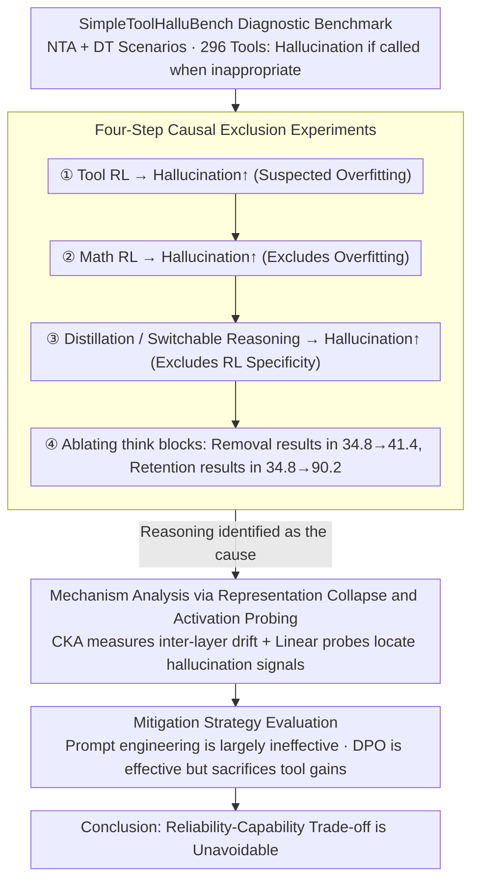

# The Reasoning Trap: How Enhancing LLM Reasoning Amplifies Tool Hallucination

**Conference**: ACL 2026  
**arXiv**: [2510.22977](https://arxiv.org/abs/2510.22977)  
**Code**: [GitHub](https://github.com/albert-y1n/Reasoning_Trap)  
**Area**: Hallucination Detection  
**Keywords**: Tool Hallucination, Reasoning Enhancement, Reinforcement Learning, Reliability-Capability Trade-off, LLM Agents

## TL;DR

This study systematically reveals the "Reasoning Trap" paradox: enhancing LLM reasoning capabilities (whether via RL, distillation, or switchable reasoning modes) systematically amplifies tool hallucinations. This effect is specifically associated with the reasoning process itself rather than RL training procedures. Existing mitigation strategies, such as prompt engineering and DPO, face an unavoidable trade-off between reliability and capability.

## Background & Motivation

**Background**: LLMs are evolving from text generators into "think-before-acting" agents. Through reasoning enhancement (RL, distillation, etc.), their planning and tool-use capabilities are continuously improved, which is a core path toward building reliable AI agents.

**Limitations of Prior Work**: Stronger reasoning models, such as OpenAI o3, have exhibited more severe hallucination tendencies. However, no prior research has systematically examined whether reasoning enhancement itself leads to tool hallucinations—specifically, instances where models fabricate non-existent tools or incorrectly apply irrelevant tools.

**Key Challenge**: Intuitively, stronger reasoning should lead to higher reliability. However, experimental observations suggest the opposite: enhanced reasoning coexists with higher tool hallucination rates. This is not merely an overfitting issue, as RL training even on non-tool-related tasks (e.g., mathematics) also amplifies tool hallucinations.

**Goal**: To answer three core questions: (RQ1) Does reasoning enhancement increase tool hallucinations? (RQ2) What is the underlying mechanism? (RQ3) Can this be effectively mitigated?

**Key Insight**: By constructing a lightweight diagnostic benchmark, SimpleToolHalluBench, the authors use controlled experiments to step-wise exclude alternative explanations, ultimately locating the cause within the reasoning process itself.

**Core Idea**: Reasoning chain training induces a behavioral pattern in models to "confidently fill the gaps." When applied to tool-use scenarios, this pattern naturally manifests as tool hallucinations—the model tends to generate tool calls that appear plausible but are fundamentally groundless.

## Method

### Overall Architecture

The study systematically excludes alternative hypotheses in four steps: (1) Verifying that tool-related RL increases hallucinations; (2) Verifying that non-tool RL (math) similarly increases hallucinations (excluding overfitting); (3) Verifying that distillation and switchable reasoning modes also increase hallucinations (excluding RL specificity); (4) Using ablation studies to separate reasoning steps from RL training itself. After identifying reasoning as the primary cause, mechanism analysis (representation collapse + activation probing) is conducted, followed by an evaluation of mitigation strategies and their associated costs.

### Key Designs

**1. SimpleToolHalluBench Diagnostic Benchmark: Measuring the "ability to abstain"**

Existing benchmarks primarily measure whether a model can correctly call a tool, but they fail to measure whether a model can resist calling a tool when it shouldn't. SimpleToolHalluBench renders this measurable by designing two controlled scenarios: NTA (No Tools Available, where the query needs a tool but none are provided) and DT (Distractor Tools, where only irrelevant tools are provided). With 296 tools and corresponding queries—each only solvable by its specific tool—any tool invocation under NTA/DT settings is strictly a hallucination. This isolates the hallucination rate for precise measurement.

**2. Four-step Causal Exclusion: Tracing tool hallucination to "Reasoning Itself"**

Observing that "stronger reasoning models hallucinate more" only establishes a correlation. The authors build a causal chain. First, tool-related RL increases hallucinations, which could be attributed to overfitting. Second, using pure mathematics for RL training still increases hallucinations, rejecting the overfitting hypothesis. Third, alternate methods like distillation and switchable reasoning also yield increased hallucinations, showing this isn't specific to RL. Fourth, direct ablation of reasoning steps shows that removing the `<think>` block only slightly increases hallucinations ($34.8 \rightarrow 41.4$), whereas keeping it causes a surge ($34.8 \rightarrow 90.2$). This identifies the reasoning process itself as the primary driver.

**3. Mechanism Analysis: Addressing "Why" and "Where"**

The authors analyze the model's internal states. CKA (Centered Kernel Alignment) compares representations before and after RL: while in-domain representations remain stable (CKA $> 0.9$), tool-related representations drift significantly in early and middle layers (CKA $< 0.75$), suggesting that reasoning training reshapes the internal processing of tools. Additionally, linear probes show that correct vs. hallucinated responses are most linearly separable in late-stage residual streams (Separability Score $> 0.14$), while attention and MLP outputs are nearly inseparable. This grounds the behavioral phenomenon in specific layers and components.

**4. Mitigation Strategy Evaluation: The Trade-off between Reliability and Capability**

The authors evaluated two routes: prompt engineering (explicitly instructing "do not use unavailable tools") proved largely ineffective, with the NTA hallucination rate only dropping from $90.2$ to $87.5$. DPO (aligning "honest responses" to preferences) was effective, reducing NTA from $90.2$ to $55.8$, but at the cost of the SynTool reward dropping from $0.45$ to $0.34$. This confirms that current mitigations cannot bypass the reliability-capability trade-off.

## Key Experimental Results

### Main Results

| Model/Configuration | R_NTA(↓) | R_DT(↓) | Description |
|----------|----------|---------|------|
| Qwen2.5-7B-Instruct | 34.8 | 54.7 | Baseline |
| + ReCall RL (Tools) | 90.2 | 100.0 | Tool RL significantly increases |
| + GRPO (Math) | ↑ | ↑ | Non-tool RL also increases |
| R1-Distill-Qwen-7B | 74.3 | 78.7 | Distillation increases |
| Qwen3-8B Think Off | 4.1 | 36.2 | Reasoning disabled |
| Qwen3-8B Think On | 5.4 | 56.8 | Reasoning enabled increases |

### Ablation Study

| Configuration | R_NTA | R_DT | Reward |
|------|-------|------|--------|
| Baseline | 34.8 | 54.7 | 0.22 |
| Direct Tool RL (No Reasoning) | 41.4 | 63.6 | 0.28 |
| Think-then-act RL | 90.2 | 100.0 | 0.45 |
| + Prompt Engineering | 87.5 | 98.9 | 0.44 |
| + DPO | 55.8 | 71.4 | 0.34 |

### Key Findings
- Reasoning enhancement consistently increases tool hallucinations across all tested methods (RL, distillation, switchable modes).
- RL training on pure math tasks also increases tool hallucinations, excluding the overfitting hypothesis.
- Ablation indicates that the reasoning step itself (the `<think>` block), rather than RL training, is the core factor.
- Instruction following remains stable (IFEval: $-2.6\%$) and tool-calling capability even improves (BFCL: $+9.9\%$), yet hallucinations surge—proving tool hallucination is an independent failure mode.
- DPO mitigation is effective but involves an unavoidable trade-off between capability and reliability.

## Highlights & Insights
- **Identifies a profound paradox**: Reasoning enhancement makes models "smarter but less honest," serving as a fundamental warning for current reasoning scaling research.
- **Top-tier experimental design**: The four-step exclusion method systematically establishes causal evidence with rigorous logic.
- **Deep mechanism analysis**: CKA representation analysis and activation probing answer "why" and "where" beyond just "what."
- **Core Insight**: Tool hallucination is neither overfitting nor instruction-following degradation; it is an inherent side effect of reasoning enhancement.

## Limitations & Future Work
- **Focus on single-step tool calling**: Real-world agents involve multi-step chains where hallucination effects might accumulate.
- **Incomplete causality**: Mechanism analysis reveals patterns but does not provide a complete causal explanation.
- **Limited mitigation strategies**: Only prompt engineering and DPO were evaluated; methods like process supervision or Constitutional AI remain unexplored.
- Future work necessitates training objectives that optimize both capability and reliability jointly rather than treating reliability as a post-hoc fix.

## Related Work & Insights
- **vs. ToolBeHonest**: While both focus on tool use evaluation, this work identifies the relationship between reasoning enhancement and hallucination.
- **vs. ReCall**: Explores the "hidden cost" of SOTA agent reasoning RL frameworks.
- **vs. DeepSeek-R1**: While R1 transfers reasoning capabilities via distillation, this study proves that hallucination tendencies are transferred as well.

## Rating
- Novelty: ⭐⭐⭐⭐⭐ First to systematically correlate reasoning enhancement with tool hallucination.
- Experimental Thoroughness: ⭐⭐⭐⭐⭐ Rigorous four-step exclusion, mechanism analysis, and mitigation evaluation.
- Writing Quality: ⭐⭐⭐⭐⭐ Clear logical progression with structured experimental queries.
- Value: ⭐⭐⭐⭐⭐ Significant implications for reasoning scaling and agent safety.

<!-- RELATED:START -->

## Related Papers

- [\[NeurIPS 2025\] Reasoning Models Hallucinate More: Factuality-Aware Reinforcement Learning for Large Reasoning Models](../../NeurIPS2025/hallucination/reasoning_models_hallucinate_more_factuality-aware_reinforcement_learning_for_la.md)
- [\[ICML 2026\] Harnessing Reasoning Trajectories for Hallucination Detection via Answer-agreement Representation Shaping](../../ICML2026/hallucination/harnessing_reasoning_trajectories_for_hallucination_detection_via_answer-agreeme.md)
- [\[CVPR 2026\] Understanding the Role of Hallucination in Reinforcement Post-Training of Multimodal Reasoning Models](../../CVPR2026/hallucination/understanding_the_role_of_hallucination_in_reinforcement_post-training_of_multim.md)
- [\[ACL 2026\] Enhancing Hallucination Detection via Future Context](enhancing_hallucination_detection_via_future_context.md)
- [\[ACL 2026\] 为什么 LLM 在结构化知识上产生幻觉：推理过程的机制分析](why_llms_hallucinate_on_structured_knowledge_a_mechanistic_analysis_of_reasoning.md)

<!-- RELATED:END -->
