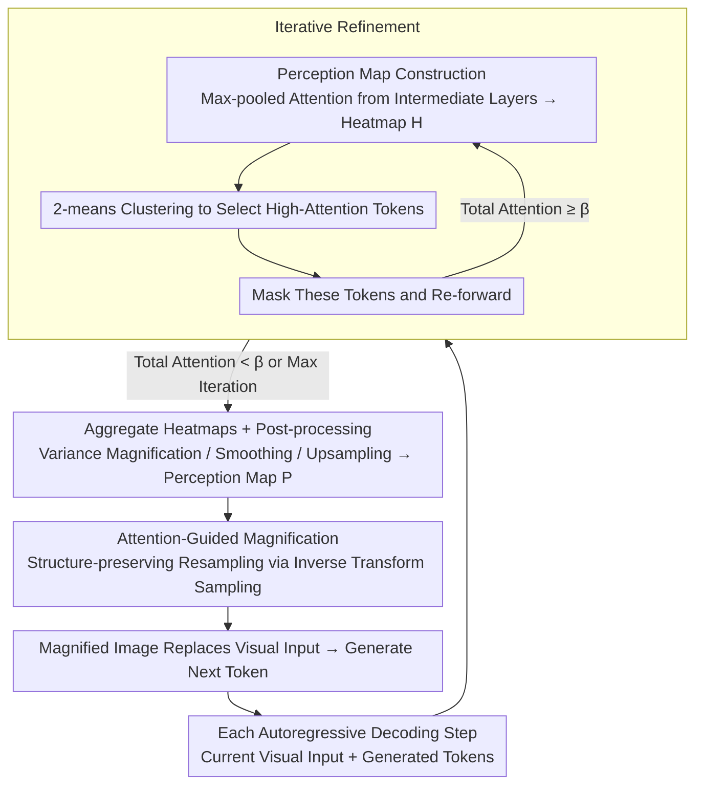

# Through the Magnifying Glass: Adaptive Perception Magnification for Hallucination-Free VLM Decoding

**Conference**: ACL 2026  
**arXiv**: [2503.10183](https://arxiv.org/abs/2503.10183)  
**Code**: [GitHub](https://github.com/ShunqiM/PM)  
**Area**: Hallucination Detection  
**Keywords**: Visual Hallucination Mitigation, Perception Magnification, Attention-Guided Decoding, Iterative Refinement, Vision-Language Models

## TL;DR

This paper proposes Perception Magnifier (PM), a visual decoding method that iteratively identifies key visual regions using multi-layer attention during each autoregressive decoding step and adaptively magnifies them. By enhancing the effective resolution of key regions, it mitigates VLM visual hallucinations while maintaining spatial structural integrity and reasoning capabilities.

## Background & Motivation

**Background**: VLM hallucination mitigation methods are primarily divided into training-time methods (debiasing datasets, increasing visual resolution) and inference-time methods (contrastive decoding, visual token weight boosting). Decoding-side methods have attracted attention due to being training-free, primarily reducing hallucinations by suppressing biased logits or enhancing visual embedding weights.

**Limitations of Prior Work**: (1) Contrastive decoding (VCD, M3ID) reduces hallucinations by suppressing biased outputs, but when the visual information itself is insufficient for differentiation, correct information is lacking in both logit streams, and bias suppression cannot recover missing details; (2) Embedding weighting (PAI, IBD) enhances the influence of visual tokens, but remains ineffective when target regions are too small or too scattered in ViT features; (3) Cropping methods (ViCrop) enhance details by cropping and magnifying key regions but destroy spatial structure (losing context) and introduce confusion through dual-image inputs.

**Key Challenge**: Existing methods either do not enhance visual details (contrastive/weighting) or enhance details but destroy spatial structure (cropping)—a balance between enhancing details and maintaining structure is required.

**Goal**: To adaptively enhance the effective resolution of key visual regions without destroying spatial structure.

**Key Insight**: Model visual enhancement as a "magnifying glass" effect—key regions are magnified (occupying more pixels/patches) while non-key regions are compressed (rather than discarded), keeping the overall image structure intact.

**Core Idea**: Construct a perception map based on attention heatmaps, treat it as a probability mass function, and perform structure-preserving adaptive resampling of the original image through inverse transform sampling—high-attention regions are magnified, and low-attention regions are compressed.

## Method

### Overall Architecture

PM addresses a specific pain point: VLM hallucinations often occur not because the model fails to "look" at the correct place, but because key objects are too small in ViT features, leading to insufficient effective resolution for accurate recognition. Existing solutions either fail to enhance details (contrastive decoding, embedding weighting) or destroy spatial structure while doing so (cropping). PM's solution is to treat visual enhancement as a "magnifying glass"—at each autoregressive decoding step, it first identifies the regions that should be seen most clearly from VLM attention, iteratively expands coverage, organizes the results into a pixel-level perception map, and performs structure-preserving resampling on the original image. Key regions are magnified to occupy more pixels, while non-key regions are compressed rather than discarded, maintaining the overall structure. The magnified image replaces the original visual input to generate the next token.

### Key Designs

**1. Perception Map Construction: Aggregating multi-layer attention into a "where to look" heatmap**

To magnify the correct regions, it is first necessary to know the most relevant visual regions for the current decoding step. PM aggregates self-attention from intermediate to deep layers ($l \geq \mathcal{L}$): for each layer, it takes the maximum across all heads, then sums across layers to obtain a token-level heatmap:

$$\mathcal{H} = \sum_{l=\mathcal{L}}^{N_l} \max_{h \in 1,\dots,N_h} \text{Attn}_{l,h}$$

Intermediate layers are used starting from a specific depth, and max pooling is chosen over mean pooling because intermediate layer attention locates target objects more accurately than final layers, and max pooling preserves sharp signals of visual importance without being diluted by averaging. After obtaining $\mathcal{H}$, post-processing follows: normalization, variance magnification (coefficient $\alpha$) with sigmoid compression, uniform smoothing (kernel size $k$), and finally bilinear upsampling to a pixel-level perception map $\mathcal{P}$. Variance magnification ensures "small but important" regions are not submerged.

**2. Iterative Refinement: Revealing sub-salient regions obscured by information registers layer by layer**

Single attention extraction has a blind spot: deep vision models compress fine-grained features into a few tokens (information registers), causing spatially scattered but semantically related regions to be missed in one go. Iterative refinement mimics the human eye—noticing the most salient region, "masking" it, and then looking for the next. In each round, it extracts the heatmap, uses 2-means clustering to pick high-attention tokens, masks these tokens in the attention mask, and re-forwards the model until total attention falls below threshold $\beta$ or maximum iterations are reached. Finally, it aggregates heatmaps from all rounds. This progressive discovery ensures magnification does not focus solely on the most conspicuous area.

**3. Attention-Based Magnification: Structure-preserving resampling using inverse transform sampling**

With the perception map, PM treats $\mathcal{P}$ as a probability mass function, decomposes it into marginal distributions along the horizontal and vertical axes, and calculates cumulative distributions $\mathcal{F}_x(n)$ and $\mathcal{F}_y(n)$. It then remaps each pixel coordinate using inverse transform sampling:

$$\hat{I}_{i,j} = \text{Interp}(I, \mathcal{F}_x^{-1}(i), \mathcal{F}_y^{-1}(j))$$

The intuition is: high-attention regions have slow CDF growth, meaning more output pixels map to these regions (magnification); low-attention regions have fast CDF growth, meaning fewer pixels are assigned (compression). Unlike cropping, all regions are preserved, and only relative resolution changes, maintaining structural integrity.

### Loss & Training

PM operates entirely at inference time and requires no training. The base model is LLaVA-1.5 7B, with key hyperparameters: starting layer $\mathcal{L}=12$, scaling coefficient $\alpha=10$, smoothing kernel $k=3$, and iteration threshold $\beta=0.3$.

## Key Experimental Results

### Main Results

**MME Perception Hallucination Scores**

| Method | Existence | Count | Position | Color | Total* |
|------|-----------|-------|----------|-------|--------|
| Greedy | 195.00 | 143.33 | 128.33 | 163.33 | 630.00 |
| VCD | 190.00 | 143.33 | 120.00 | 155.00 | 608.33 |
| M3ID | 190.00 | 150.00 | 133.33 | 166.67 | 640.00 |
| IBD | 190.00 | 160.00 | 133.33 | 170.00 | 653.33 |
| ViCrop-R | 190.00 | 163.33 | 105.00 | 175.00 | 633.33 |
| **Ours** | **195.00** | **175.00** | **138.33** | **175.00** | **683.33** |

**POPE Accuracy (%)**

| Method | COCO | AVG |
|------|------|-----|
| Greedy | 85.29 | 84.59 |
| VDD | 86.71 | 86.32 |
| API-C | 87.31 | 86.41 |
| **Ours** | **87.68** | **86.70** |

### Ablation Study

**MME Perception Ablation**

| Configuration | Total |
|------|-------|
| Greedy | 630.00 |
| Ours w/o IR & MLA | 640.00 |
| Ours w/o MLA | 645.00 |
| Ours w/o IR | 665.00 |
| **Ours (Full)** | **683.33** |

**Comparison of Magnification Methods**

| Method | MME Perception Total |
|------|---------------------|
| Blurring | 630.00 |
| Bounding Box | 640.00 |
| Masking | 648.33 |
| ViCrop | 646.67 |
| **Magnification** | **683.33** |

### Key Findings

- Ours leads all baselines significantly on MME Perception with 683.33 (next best IBD 653.33), with the largest gains in Count and Color dimensions.
- ViCrop performs poorly in the Position dimension (105.00 vs Ours 138.33), confirming that disrupting spatial structure through cropping is detrimental to position judgment.
- All contrastive decoding baselines show performance drops on the MME Cognition subset, whereas Ours does not—magnifying visual input does not impair reasoning ability.
- Iterative Refinement and multi-layer aggregation contribute significantly to the total score.
- Qualitative analysis shows Ours can magnify small objects (e.g., chairs) to a recognizable resolution.

## Highlights & Insights

- "Accurate attention does not equal correct recognition"—VLM may attend to the correct region but still misjudge it at low resolution, indicating that resolution enhancement is necessary.
- Structure-preserving magnification vs. cropping: Cropping results in a loss of 33 points in Position, while magnification leads to a gain of 10 points.
- The use of inverse transform sampling elegantly unifies "magnifying key regions" and "preserving global structure."

## Limitations & Future Work

- Magnification leads to local shape distortion, which may be harmful for tasks requiring geometric precision.
- Interrupts the efficient decoding of KV cache—each step requires re-encoding the magnified image.
- Requires additional attention alignment mechanisms for VLMs with complex token-image mapping (non-interleaved architectures).
- Only validated on LLaVA-1.5 7B, not tested on newer VLMs.

## Related Work & Insights

- **vs VCD/M3ID (Contrastive Decoding)**: Suppress biased logits but do not enhance visual details; Ours directly improves visual resolution.
- **vs IBD/PAI (Embedding Weighting)**: Enhance visual token weights but do not change visual content; Ours changes the visual input itself.
- **vs ViCrop (Cropping)**: Cropping loses context and dual inputs introduce confusion; Ours' structure-preserving magnification avoids these issues.
- **vs API (Regional Prompting)**: API emphasizes regions via masking but does not increase effective resolution; Ours actually increases the pixel count of key regions.

## Rating

- Novelty: ⭐⭐⭐⭐ The idea of structure-preserving magnification using inverse transform sampling is novel; iterative refinement is effective but relatively straightforward.
- Experimental Thoroughness: ⭐⭐⭐⭐⭐ 4 benchmarks + 12 baselines + detailed ablation (map construction × magnification method × iterative refinement × multi-layer aggregation) + GPT-4o assisted evaluation.
- Writing Quality: ⭐⭐⭐⭐ Method description is clear and qualitative analysis is intuitive.
- Value: ⭐⭐⭐⭐ The perspective of mitigating hallucinations via "visual resolution enhancement" is insightful, and the structure-preserving design is practical.

<!-- RELATED:START -->

## Related Papers

- [\[ACL 2025\] Mixture of Decoding: An Attention-Inspired Adaptive Decoding Strategy to Mitigate Hallucination in Multimodal LLMs](../../ACL2025/hallucination/mixture_of_decoding_an_attention-inspired_adaptive_decoding_strategy_to_mitigate.md)
- [\[CVPR 2026\] MAD: Modality-Adaptive Decoding for Mitigating Cross-Modal Hallucinations in Multimodal Large Language Models](../../CVPR2026/hallucination/mad_modality-adaptive_decoding_for_mitigating_cross-modal_hallucinations_in_mult.md)
- [\[ICLR 2026\] Enhancing Hallucination Detection through Noise Injection](../../ICLR2026/hallucination/enhancing_hallucination_detection_through_noise_injection.md)
- [\[CVPR 2026\] TriDF: Evaluating Perception, Detection, and Hallucination for Interpretable DeepFake Detection](../../CVPR2026/hallucination/tridf_evaluating_perception_detection_and_hallucination_for_interpretable_deepfa.md)
- [\[ACL 2025\] Activation Steering Decoding: Mitigating Hallucination in Large Vision-Language Models through Bidirectional Hidden State Intervention](../../ACL2025/hallucination/activation_steering_decoding_mitigating_hallucination_in_large_vision-language_m.md)

<!-- RELATED:END -->
