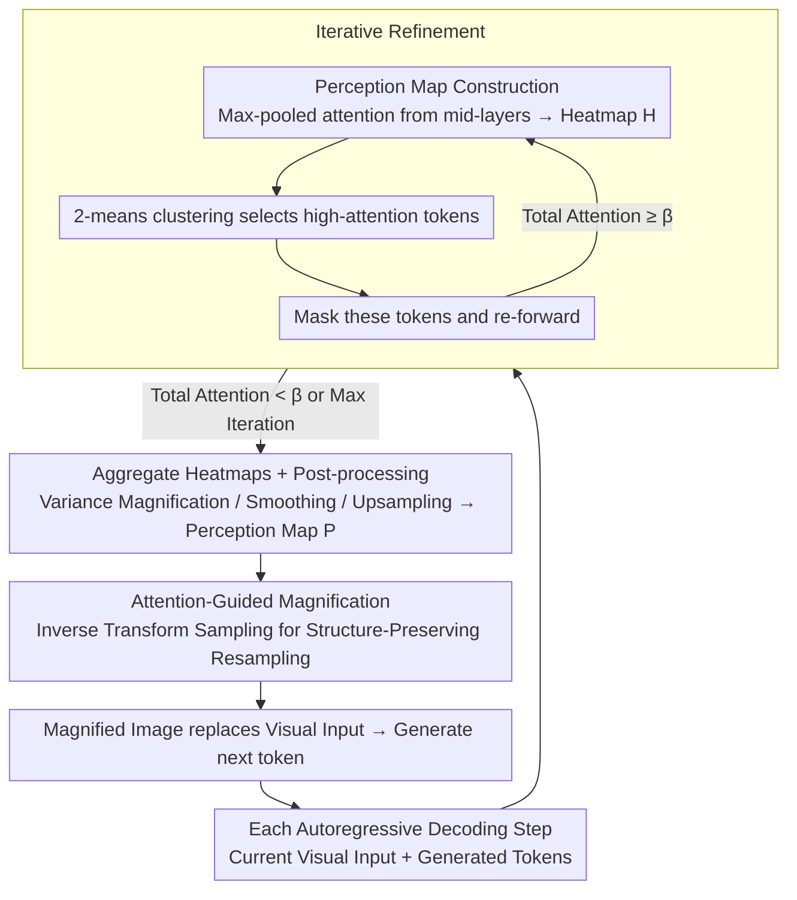

# Through the Magnifying Glass: Adaptive Perception Magnification for Hallucination-Free VLM Decoding

**Conference**: ACL 2026  
**arXiv**: [2503.10183](https://arxiv.org/abs/2503.10183)  
**Code**: [GitHub](https://github.com/ShunqiM/PM)  
**Area**: Hallucination Detection  
**Keywords**: Visual hallucination mitigation, perception magnification, attention-guided decoding, iterative refinement, Vision-Language Models

## TL;DR

Ours proposes Perception Magnifier (PM), a visual decoding method that iteratively identifies and adaptively magnifies key visual regions based on multi-layer attention at each autoregressive decoding step. This approach mitigates VLM hallucinations by increasing the effective resolution of critical areas while maintaining spatial structural integrity and reasoning capabilities.

## Background & Motivation

**Background**: Methods for mitigating VLM hallucinations are primarily divided into training-time methods (e.g., debiased datasets, increasing visual resolution) and inference-time methods (e.g., contrastive decoding, visual token weight boosting). Decoding-side methods have gained attention for being training-free, typically reducing hallucinations by suppressing biased logits or enhancing visual embedding weights.

**Limitations of Prior Work**: (1) Contrastive decoding (VCD, M3ID) reduces hallucinations by suppressing biased outputs, but when the visual information itself is insufficient for distinction, correct information is absent from both sets of logits, and suppressing bias cannot recover missing details; (2) Embedding weighting (PAI, IBD) enhances the influence of visual tokens but remains ineffective when target regions are too small or dispersed within ViT features; (3) Cropping methods (ViCrop) enhance details by cropping and magnifying key regions but destroy spatial structure (losing context) and introduce confusion through dual-image inputs.

**Key Challenge**: Existing methods either fail to enhance visual details (contrastive/weighting) or enhance details at the cost of destroying spatial structure (cropping)—a balance must be found between detail enhancement and structural preservation.

**Goal**: To adaptively enhance the effective resolution of key visual regions without compromising the spatial structure.

**Key Insight**: Model visual enhancement as a "magnifying glass" effect—where key regions are magnified (occupying more pixels/patches) while non-key regions are compressed (rather than discarded), keeping the overall image structure intact.

**Core Idea**: Construct a perception map based on attention heatmaps, treat it as a probability mass function, and perform structure-preserving adaptive resampling of the original image via inverse transform sampling—high-attention areas are magnified, and low-attention areas are compressed.

## Method

### Overall Architecture

The pain point PM addresses is specific: VLM hallucinations often occur not because the model looks at the wrong place, but because key objects are too small in ViT features, lacking sufficient effective resolution to be accurately identified. PM resolves this by implementing a "magnifying glass": at each autoregressive decoding step, it first identifies the most relevant regions from the VLM's attention, iteratively expands the coverage to form a pixel-level perception map, and then performs structure-preserving resampling. Magnified regions occupy more pixels, non-key regions are compressed but retained, and the overall structure remains unchanged. The magnified image replaces the original visual input to generate the next token.

### Key Designs

**1. Perception Map Construction: Aggregating Multi-layer Attention into a "Where to Look" Heatmap**

To magnify the correct regions, the model must locate the most relevant visual areas for the current decoding step. PM aggregates self-attention from middle to deep layers ($l \geq \mathcal{L}$): it takes the maximum across all heads for each layer, then sums across layers to obtain a token-level heatmap:

$$\mathcal{H} = \sum_{l=\mathcal{L}}^{N_l} \max_{h \in 1,\dots,N_h} \text{Attn}_{l,h}$$

Middle layers are used because their attention locates target objects more accurately than final layers, and max-pooling preserves peak signals of visual importance better than mean-pooling. Post-processing is then applied to $\mathcal{H}$: normalization, variance magnification (coefficient $\alpha$) with sigmoid compression, uniform smoothing (kernel size $k$), and finally bilinear upsampling to a pixel-level perception map $\mathcal{P}$. Variance magnification ensures "small but important" areas are not suppressed.

**2. Iterative Refinement: Revealing Sub-salient Regions Hidden by Information Registers**

Single-pass attention extraction has a blind spot: deep vision models compress fine-grained features into a few tokens (information registers), causing spatially dispersed but semantically related regions to be missed. Iterative Refinement mimics human visual processing—noticing the most salient region, "masking" it, then looking for the next. In each round, it extracts the heatmap, selects high-attention tokens using 2-means clustering, masks them in the attention mask, and re-forwards until the total attention falls below threshold $\beta$ or max iterations are reached. Finally, it aggregates all heatmaps.

**3. Attention-Based Magnification: Structure-Preserving Resampling via Inverse Transform Sampling**

With the perception map, PM treats $\mathcal{P}$ as a probability mass function, decomposes it into marginal distributions along horizontal and vertical axes, and calculates cumulative distributions $\mathcal{F}_x(n)$ and $\mathcal{F}_y(n)$. It then remaps pixel coordinates using inverse transform sampling:

$$\hat{I}_{i,j} = \text{Interp}(I, \mathcal{F}_x^{-1}(i), \mathcal{F}_y^{-1}(j))$$

Intuition: Regions with high attention have slower CDF growth, meaning more output pixels map to these areas (magnification); regions with low attention have faster CDF growth and fewer pixels (compression). Unlike cropping, all regions are preserved, maintaining the complete spatial structure and avoiding errors in position and counting.

### Loss & Training

PM operates entirely at inference time and requires no training. The base model is LLaVA-1.5 7B. Key hyperparameters: starting layer $\mathcal{L}=12$, scaling coefficient $\alpha=10$, smoothing kernel $k=3$, and iteration threshold $\beta=0.3$.

## Key Experimental Results

### Main Results

**MME Perception Hallucination Scores**

| Method | Existence | Count | Position | Color | Total* |
|------|-----------|-------|----------|-------|--------|
| Greedy | 195.00 | 143.33 | 128.33 | 163.33 | 630.00 |
| VCD | 190.00 | 143.33 | 120.00 | 155.00 | 608.33 |
| M3ID | 190.00 | 150.00 | 133.33 | 166.67 | 640.00 |
| IBD | 190.00 | 160.00 | 133.33 | 170.00 | 653.33 |
| ViCrop-R | 190.00 | 163.33 | 105.00 | 175.00 | 633.33 |
| **Ours** | **195.00** | **175.00** | **138.33** | **175.00** | **683.33** |

**POPE Accuracy (%)**

| Method | COCO | AVG |
|------|------|-----|
| Greedy | 85.29 | 84.59 |
| VDD | 86.71 | 86.32 |
| API-C | 87.31 | 86.41 |
| **Ours** | **87.68** | **86.70** |

### Ablation Study

**MME Perception Ablation**

| Configuration | Total |
|------|-------|
| Greedy | 630.00 |
| PM w/o IR & MLA | 640.00 |
| PM w/o MLA | 645.00 |
| PM w/o IR | 665.00 |
| PM (Full) | **683.33** |

**Comparison of Magnification Methods**

| Method | MME Perception Total |
|------|---------------------|
| Blurring | 630.00 |
| Bounding Box | 640.00 |
| Masking | 648.33 |
| ViCrop | 646.67 |
| **Magnification** | **683.33** |

### Key Findings

- Purs outperforms all baselines on MME Perception with a score of 683.33 (next best is IBD at 653.33), with the largest gains in Count and Color dimensions.
- ViCrop performs poorly in the Position dimension (105.00 vs Ours 138.33), confirming that destroying spatial structure via cropping is detrimental to spatial judgment.
- Contrastive decoding baselines show performance drops on the MME Cognition subset, whereas Ours does not—magnifying visual input does not impair reasoning capabilities.
- Iterative refinement and multi-layer aggregation contribute significantly; the full PM is 18.33 points higher than the version without refinement.

## Highlights & Insights

- "Accurate attention does not equate to correct recognition"—VLMs may attend to the correct region but still misidentify it at low resolution, making resolution enhancement necessary.
- The design choice of structure-preserving magnification vs. cropping is critical—cropping loses 33 points on Position, while magnification gains 10 points.
- The use of inverse transform sampling elegantly unifies "magnifying key regions" and "preserving global structure."

## Limitations & Future Work

- Magnification causes local shape distortion, which may be harmful to tasks requiring high geometric precision.
- It disrupts efficient decoding via KV cache, as each step requires re-encoding the magnified image.
- It requires additional attention alignment mechanisms for VLMs with complex token-image mappings (non-interleaved architectures).
- Currently only validated on LLaVA-1.5 7B; testing on newer VLMs is needed.

## Related Work & Insights

- **vs VCD/M3ID (Contrastive Decoding)**: Suppresses biased logits but lacks visual detail enhancement; Ours directly increases visual resolution.
- **vs IBD/PAI (Embedding Weighting)**: Enhances visual token weights without changing visual content; Ours modifies the visual input itself.
- **vs ViCrop (Cropping)**: Cropping loses context and dual inputs introduce confusion; Ours’ structure-preserving magnification avoids these issues.
- **vs API (Regional Prompting)**: API emphasizes regions via masking but does not increase effective resolution; Ours actually increases the pixel count of key areas.

## Rating

- Novelty: ⭐⭐⭐⭐ The use of inverse transform sampling for structure-preserving magnification is novel; iterative refinement is effective but straightforward.
- Experimental Thoroughness: ⭐⭐⭐⭐⭐ 4 benchmarks + 12 baselines + detailed ablations + GPT-4o evaluation.
- Writing Quality: ⭐⭐⭐⭐ Clear methodological presentation and intuitive qualitative analysis.
- Value: ⭐⭐⭐⭐ Mitigating hallucinations through "visual resolution enhancement" is an insightful and practical structure-preserving design.

<!-- RELATED:START -->

## Related Papers

- [\[ACL 2025\] Mixture of Decoding: An Attention-Inspired Adaptive Decoding Strategy to Mitigate Hallucination in Multimodal LLMs](../../ACL2025/hallucination/mixture_of_decoding_an_attention-inspired_adaptive_decoding_strategy_to_mitigate.md)
- [\[CVPR 2026\] 3D-VCD: Hallucination Mitigation in 3D-LLM Embodied Agents through Visual Contrastive Decoding](../../CVPR2026/hallucination/3d-vcd_hallucination_mitigation_in_3d-llm_embodied_agents_through_visual_contras.md)
- [\[CVPR 2026\] MAD: Modality-Adaptive Decoding for Mitigating Cross-Modal Hallucinations in Multimodal Large Language Models](../../CVPR2026/hallucination/mad_modality-adaptive_decoding_for_mitigating_cross-modal_hallucinations_in_mult.md)
- [\[CVPR 2026\] TriDF: Evaluating Perception, Detection, and Hallucination for Interpretable DeepFake Detection](../../CVPR2026/hallucination/tridf_evaluating_perception_detection_and_hallucination_for_interpretable_deepfa.md)
- [\[ICLR 2026\] Enhancing Hallucination Detection through Noise Injection](../../ICLR2026/hallucination/enhancing_hallucination_detection_through_noise_injection.md)

<!-- RELATED:END -->
