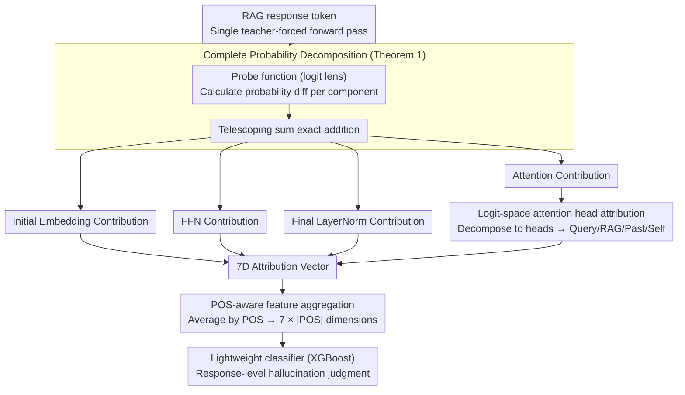

# TPA: Next Token Probability Attribution for Detecting Hallucinations in RAG

**Conference**: ACL 2026  
**arXiv**: [2512.07515](https://arxiv.org/abs/2512.07515)  
**Code**: None  
**Area**: Hallucination Detection  
**Keywords**: RAG Hallucination Detection, Probability Attribution, Residual Flow Decomposition, POS Tagging, Attention Mechanism

## TL;DR

Ours proposes the TPA framework, which mathematically decomposes the generation probability of each LLM token into contributions from seven sources (Query, RAG Context, Past Token, Self Token, FFN, Final LayerNorm, and Initial Embedding). By aggregating these features with Part-of-Speech (POS) tagging, it achieves Prev. SOTA performance in RAG hallucination detection.

## Background & Motivation

**Background**: RAG mitigates LLM hallucinations by retrieving external knowledge, yet models may still overlook or misunderstand retrieved information. Existing detection methods rely either on heuristic proxy signals (e.g., consistency checks, semantic entropy) or focus on binary conflicts between FFNs and RAG context.

**Limitations of Prior Work**: (1) Proxy signal methods measure only the "symptoms" of hallucinations (e.g., output variance, surface confidence) rather than architectural root causes, making them ineffective against confident errors. (2) Prior internal analysis work (e.g., ReDeEP) focuses only on the binary conflict between FFN and RAG, ignoring the impact of other critical components like LayerNorm and user queries.

**Key Challenge**: A high FFN contribution to token probability does not always indicate a hallucination—it is normal for functional words ("the", "of") but highly suspicious for named entities. Existing methods cannot distinguish these grammatical differences.

**Goal**: Establish a complete token probability attribution framework covering all additive Transformer components and incorporate POS information to capture anomalies across grammatical dimensions.

**Key Insight**: Utilize the additive structure of the Transformer residual flow to precisely decompose the final token probability into contribution increments from each component.

**Core Idea**: Token probability = Initial Embedding contribution + Attention contributions per layer + FFN contributions per layer + Final LayerNorm adjustment. Attention contributions are further allocated to four sources (Query/RAG/Past/Self) based on attention weights. Features are aggregated by POS to form detection characteristics.

## Method

### Overall Architecture

TPA consists of three steps: (1) Coarse-grained decomposition—using a probe function (logit lens) to decompose token probability into four categories: Initial Embedding, Attention per layer, FFN per layer, and Final LayerNorm. (2) Fine-grained attribution—allocating Attention contributions to individual heads in the logit space, then attributing them to Query/RAG/Past/Self sources based on attention weights to form a 7D attribution vector. (3) Grammatically-aware feature engineering—aggregating attribution scores by POS tags (e.g., nouns, verbs, numerals) to construct detection features, upon which a lightweight classifier is trained for response-level hallucination judgment.

### Key Designs

**1. Complete Probability Decomposition (Theorem 1): Precise decomposition of token probability into component sums**

Prior internal analysis (e.g., ReDeEP) focused solely on the binary conflict between FFN and RAG context, ignoring LayerNorm and Initial Embedding. TPA defines a probe function $\Phi(\mathbf{h}, y) = [\text{Softmax}(\mathbf{h} \mathbf{W}_U)]_y$, which maps intermediate states directly to target token probabilities. The contribution of each component is defined as the difference in probe probability before and after applying that component: e.g., the contribution of layer $l$ attention is $\Delta P_{att}^{(l)} = \Phi(\mathbf{h}_{mid}^{(l)}, y) - \Phi(\mathbf{h}^{(l-1)}, y)$. 

Since these differences form a telescoping sum that exactly equals the final probability, this is a precise decomposition rather than an approximation, preserving all information. It incorporates previously ignored additive components like the Final LayerNorm and Initial Embedding.

**2. Logit-Space Attention Head Attribution: Bypassing Softmax non-linearity to trace attention sources**

The total attention contribution is further decomposed into individual heads and then traced to four input sources: Query, RAG, Past, and Self. Since Softmax is non-linear, decomposition in probability space is infeasible. TPA operates in the logit space: the logit contribution of each head $\Delta z_{h,y}^{(l)}$ is calculated exactly (projecting head output onto the unembedding vector). Probability contributions are then distributed back to heads using exponential logit proportions. Finally, each head's contribution is allocated to the four sources based on its attention weights. 

The theoretical basis for this approach lies in the first-order Taylor expansion (Proposition 1), which demonstrates that logit space is linear and allows for additive decomposition, unlike the probability space under Softmax.

**3. POS-Aware Feature Aggregation: Distinguishing normal vs. suspicious contributions via syntax**

Identical attribution values carry different meanings across POS tags: functional words naturally depend on FFN/LayerNorm, whereas named entities with high FFN and low RAG contributions are highly suspicious. TPA performs POS tagging on generated responses and averages the 7D attribution vectors for each POS category to create a $7 \times |\text{POS}|$ feature vector. This allows signals such as "low RAG contribution for nouns" or "abnormally high LayerNorm contribution for numerals" to serve as interpretable indicators of hallucination.

This step enables the detector to capture syntactic anomalies: content words should be driven by RAG; if they rely on FFN/LayerNorm, it suggests the model is "inventing" rather than "retrieving."

### Loss & Training

A lightweight classifier (e.g., XGBoost) is trained on the attribution features. The entire attribution calculation can be completed through a single teacher-forced forward pass (non-autoregressive), ensuring high computational efficiency.

## Key Experimental Results

### Main Results

TPA achieves SOTA performance across five LLMs (Llama2-7B/13B, Llama3-8B, Mistral-7B, Qwen3-8B) on multiple RAG hallucination detection benchmarks, outperforming prior methods based on consistency, semantic entropy, and internal probing.

### Ablation Study

| Configuration | Key Metric | Description |
|------|---------|------|
| Full TPA (7 sources + POS) | SOTA | Full attribution + POS aggregation |
| w/o POS Aggregation | Significant Decrease | Validates criticality of POS differentiation |
| Only FFN+RAG (Binary) | Decrease | Validates value of covering all components |
| w/o LayerNorm | Decrease | LayerNorm is a newly discovered signal source |

### Key Findings

- **LayerNorm is an overlooked hallucination signal**: SHAP analysis indicates that excessively high LayerNorm contribution for numerals (NUM) is a strong hallucination indicator—a pattern invisible to traditional FFN vs. RAG frameworks.
- **POS differentiation is essential**: Low RAG and high FFN contributions serve as hallucination signals for nouns, but the same pattern is normal for functional words. Without POS aggregation, the detector cannot distinguish these cases.
- **Cross-architecture generalization**: TPA performs consistently across Llama2/3, Mistral, and Qwen3, suggesting that attribution patterns are universal features of the Transformer architecture.
- **Single forward pass**: Unlike consistency or entropy methods requiring multiple samples, TPA requires only one teacher-forced forward pass, offering high inference efficiency.

## Highlights & Insights

- **Paradigm shift from "Symptom Detection" to "Root Cause Diagnosis"**: TPA moves beyond output-level proxy signals to analyze the direct contribution of each component during generation, providing a more reliable foundation for detection.
- **Mathematical elegance of precise decomposition**: Uses the telescoping sum property of the residual flow to achieve exact (non-approximate) probability decomposition, providing solid theoretical grounding.
- **New discovery regarding LayerNorm**: Reveals the role of the Final LayerNorm in hallucination for the first time, expanding the understanding of Transformer internal mechanisms.

## Limitations & Future Work

- Assumes retrieved RAG context is correct and relevant; it does not handle hallucinations caused by retrieval errors.
- POS taggers may introduce noise on generated text, affecting feature quality.
- Requires training a classifier; it is not a fully unsupervised detection method.
- Fine-grained attribution occurs at the token level but is currently aggregated for response-level detection; token-level hallucination localization is not yet provided.

## Related Work & Insights

- **vs. ReDeEP**: ReDeEP only analyzes binary conflicts between FFN and RAG context. TPA expands analysis to all seven sources, identifying overlooked signals like LayerNorm.
- **vs. Semantic Entropy/Consistency Checks**: These methods measure output-level symptoms, whereas TPA analyzes internal generation mechanisms, making it more robust against "confident errors."

## Rating

- Novelty: ⭐⭐⭐⭐⭐ Precise 7-source probability decomposition + POS aggregation is a novel detection paradigm.
- Experimental Thoroughness: ⭐⭐⭐⭐ Validated across 5 models; SHAP analysis provides interpretability.
- Writing Quality: ⭐⭐⭐⭐⭐ Rigorous mathematical derivation and clear illustrations.
- Value: ⭐⭐⭐⭐⭐ Provides a new analytical framework and SOTA method for RAG hallucination detection.

<!-- RELATED:START -->

## Related Papers

- [\[ICLR 2026\] LUMINA: Detecting Hallucinations in RAG System with Context-Knowledge Signals](../../ICLR2026/hallucination/lumina_detecting_hallucinations_in_rag_system_with_context-knowledge_signals.md)
- [\[ACL 2026\] FinGround: Detecting and Grounding Financial Hallucinations via Atomic Claim Verification](finground_detecting_and_grounding_financial_hallucinations_via_atomic_claim_veri.md)
- [\[ACL 2026\] Stable-RAG: Mitigating Retrieval-Permutation-Induced Hallucinations in Retrieval-Augmented Generation](stable-rag_mitigating_retrieval-permutation-induced_hallucinations_in_retrieval-.md)
- [\[ACL 2026\] Detecting Hallucinations in SpeechLLMs at Inference Time Using Attention Maps](detecting_hallucinations_in_speechllms_at_inference_time_using_attention_maps.md)
- [\[ACL 2026\] Rethinking Evaluation for LLM Hallucination Detection: A Desiderata, A New RAG-based Benchmark, New Insights](rethinking_evaluation_for_llm_hallucination_detection_a_desiderata_a_new_rag-bas.md)

<!-- RELATED:END -->
