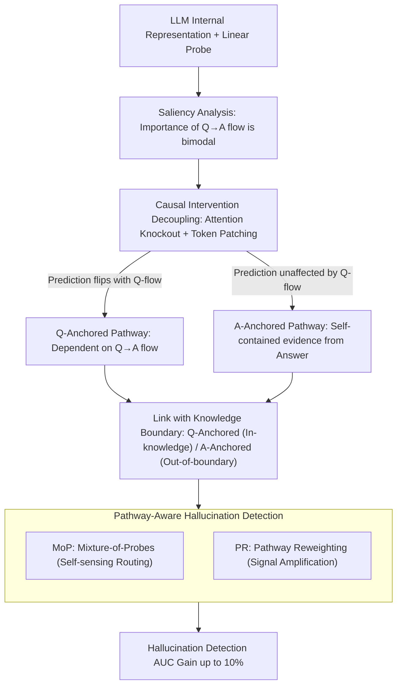

# Two Pathways to Truthfulness: On the Intrinsic Encoding of LLM Hallucinations

**Conference**: ACL 2026  
**arXiv**: [2601.07422](https://arxiv.org/abs/2601.07422)  
**Code**: [https://github.com/RowanWenLuo/llm-truthfulness-pathways](https://github.com/RowanWenLuo/llm-truthfulness-pathways)  
**Area**: Hallucination Detection  
**Keywords**: Hallucination Detection, Truthfulness Encoding, Attention Mechanism, Information Pathway, Knowledge Boundary

## TL;DR

This paper discovers that LLMs encode truthfulness signals through two distinct information pathways: Question-Anchored (dependent on information flow from question to answer) and Answer-Anchored (extracting self-contained evidence from the generated answer itself). These pathways are closely linked to knowledge boundaries. Based on this, the authors propose Mixture-of-Probes and Pathway Reweighting, achieving up to a 10% improvement in AUC for hallucination detection.

## Background & Motivation

**Background**: LLMs frequently produce hallucinations—outputs that are plausible but factually incorrect. Prior work has demonstrated that internal representations of LLMs encode rich truthfulness signals, which can be detected via linear probes. However, the sources and mechanisms of these signals remain unclear.

**Limitations of Prior Work**: Existing internal probing methods treat all samples as homogeneous, using a single probe to detect all hallucinations. However, truthfulness signals in different samples may arise through different mechanisms; using a unified approach leads to suboptimal performance.

**Key Challenge**: Saliency analysis reveals a bimodal distribution in the importance of information flow from the question to the answer—some samples depend heavily on question information, while others barely do. This suggests the existence of two fundamentally different truthfulness encoding mechanisms.

**Goal**: (1) Validate and decouple the two truthfulness pathways; (2) Reveal their emergent properties; (3) Leverage pathway differentiation to improve hallucination detection performance.

**Key Insight**: Decouple and validate the two pathways through two causal intervention experiments: attention knockout and token patching.

**Core Idea**: Truthfulness signals are generated via two independent pathways—Q-Anchored, which relies on the question-to-answer information flow (applicable to facts within the model's knowledge), and A-Anchored, which extracts self-contained evidence from the generated text itself (applicable to long-tail facts outside the knowledge boundary).

## Method

### Overall Architecture

The paper aims to clarify a neglected issue: whether the "truthfulness signals" readable by linear probes within LLMs originate from a single source. It proceeds in three steps: first, saliency analysis reveals that the importance of the "question $\to$ answer" information flow follows a **bimodal distribution** across samples. This leads to the hypothesis of two truthfulness pathways. Second, these pathways are validated and decoupled using causal interventions: attention knockout and token patching. Finally, these mechanism insights are applied to design pathway-aware hallucination detection methods. The entire process is validated across 12 models (base/instruct/reasoning, 1B to 70B) and 4 QA datasets.

### Key Designs

**1. Decoupling Pathways via Causal Intervention: If signals had one source, blocking question flow should affect all samples equally.**

To provide causal evidence, the authors use two complementary interventions. First, **attention knockout**: for a probe trained at layer $k$, all attention weights flowing from specific question tokens to subsequent positions in layers 1 to $k$ are set to zero. This physically blocks the "question $\to$ answer" flow. Samples divide into two groups: those where the prediction probability changes significantly (Q-Anchored) and those that remain unchanged (A-Anchored). Second, **token patching**: replacing question tokens from one sample with those of another to inject hallucination cues. Q-Anchored samples are significantly more sensitive to such injections, aligning with the knockout results. This bimodal split is stable across all models, whereas random token knockout has no effect.

**2. Link between Pathways and Knowledge Boundaries: Pathways switch based on whether the model "knows" the answer.**

The authors characterize the knowledge boundary using three metrics: accuracy, "I don't know" rates, and entity popularity. Q-Anchored samples show significantly higher accuracy and involve more popular entities (within the model's knowledge). A-Anchored samples have lower accuracy and involve long-tail entities (outside the knowledge boundary). The cognitive explanation is that when the model possesses relevant knowledge, it relies on the "question $\to$ answer" flow; when knowledge is insufficient, it extracts cues from the internal statistical patterns of the generated text itself.

**3. Pathway-Aware Hallucination Detection (MoP + PR): Specialized probes for distinct signal sources.**

Existing methods suffer from the compromise of using a single probe for heterogeneous signals. Two improvements are proposed. **Mixture-of-Probes (MoP)**: Trains expert probes for each mechanism and uses the discovery that internal representations contain enough information to distinguish pathways (linear classification accuracy >87%, i.e., "pathway self-sensing") to automatically route samples. **Pathway Reweighting (PR)**: Identifies the pathway first, then selectively amplifies the internal signals and most informative activation dimensions relevant to that pathway. Both methods consistently outperform single-probe baselines.

### Loss & Training

Probes and pathway classifiers are linear classifiers trained using binary cross-entropy on the raw internal representations of the model. The high accuracy of the pathway classifier validates the premise that the model "self-senses" which pathway is being utilized.

## Key Experimental Results

### Main Results

| Method | PopQA AUC | TriviaQA AUC | HotpotQA AUC | NQ AUC |
| :--- | :--- | :--- | :--- | :--- |
| Standard Probing | Baseline | Baseline | Baseline | Baseline |
| MoP (Ours) | +5-10% | +3-8% | +2-5% | +3-7% |
| PR (Ours) | Similar Gain | Similar Gain | Similar Gain | Similar Gain |

### Ablation Study

| Analysis | Result | Description |
| :--- | :--- | :--- |
| Pathway Self-Sensing Acc | 75-93% | Models distinguish pathways from raw representations |
| Q-Anchored Accuracy | Significantly Higher | In-knowledge facts use Q-Anchored |
| Entity Popularity | Q-Anchored >> A-Anchored | Q-Anchored involves high-frequency entities |
| Random Token Knockout | No Significant Impact | Confirms effect is specific to question tokens |

### Key Findings

- **Pathways are robust across models and datasets**: The bimodal pattern appears consistently in all 12 models (1B to 70B, including base, instruct, and reasoning models) and 4 datasets.
- **Knowledge boundaries determine pathway choice**: Models use Q-Anchored (truthfulness via question understanding) when they "know" the answer and A-Anchored (truthfulness via statistical patterns) when they do not.
- **Models possess pathway self-sensing capability**: Internal representations contain sufficient information to distinguish between the two pathways with 75-93% accuracy, forming the basis for MoP.
- **"Self-contained" nature of A-Anchored**: When performing a forward pass on the answer alone (removing the question), A-Anchored predictions remain nearly constant, whereas Q-Anchored predictions change drastically.

## Highlights & Insights

- **Depth of Mechanistic Understanding**: Beyond proving the existence of the pathways, the paper reveals their link to knowledge boundaries, providing a cognitive explanation.
- **Practical Application of Pathway Separation**: The path from discovery to application is clear—MoP and PR directly leverage mechanistic insights to improve detection, rather than being purely analytical.
- **Experimental Scale**: Comprehensive validation across 12 models (including recent ones like Qwen3) and 4 datasets ensures high credibility.

## Limitations & Future Work

- Currently focused on factual QA; pathway patterns in open-ended generation or multi-turn dialogues remain unknown.
- Pathway self-sensing accuracy is not 100%; incorrect routing affects MoP performance.
- The use of training interventions to enhance the reliability of specific pathways has not been explored.
- The definition of specific tokens depends on semantic framework theory; automated extraction may involve noise.

## Related Work & Insights

- **vs. Burns et al. (2023)**: CCS discovered linear truthfulness directions in LLMs but did not distinguish signal sources. This paper reveals the dual-pathway structure of those signals.
- **vs. Orgad et al. (2025)**: They showed that probing is most effective on specific answer tokens. This paper explains why—the Q-Anchored pathway signal is concentrated in the information flow towards those tokens.

## Rating

- Novelty: ⭐⭐⭐⭐⭐ First to reveal the dual-pathway structure of truthfulness encoding in LLMs.
- Experimental Thoroughness: ⭐⭐⭐⭐⭐ Rigorous validation using 12 models and 4 datasets with causal interventions.
- Writing Quality: ⭐⭐⭐⭐⭐ Clear logical flow from hypothesis to validation to application.
- Value: ⭐⭐⭐⭐⭐ Significant contributions to both mechanistic understanding and practical improvement of hallucination detection.

<!-- RELATED:START -->

## Related Papers

- [\[ACL 2026\] 为什么 LLM 在结构化知识上产生幻觉：推理过程的机制分析](why_llms_hallucinate_on_structured_knowledge_a_mechanistic_analysis_of_reasoning.md)
- [\[ICML 2026\] REALISTA: Realistic Latent Adversarial Attacks that Elicit LLM Hallucinations](../../ICML2026/hallucination/realista_realistic_latent_adversarial_attacks_that_elicit_llm_hallucinations.md)
- [\[ACL 2026\] The Reasoning Trap: How Enhancing LLM Reasoning Amplifies Tool Hallucination](the_reasoning_trap_how_enhancing_llm_reasoning_amplifies_tool_hallucination.md)
- [\[CVPR 2026\] One Token, Two Fates: A Unified Framework via Vision Token Manipulation Against MLLMs Hallucination](../../CVPR2026/hallucination/one_token_two_fates_a_unified_framework_via_vision_token_manipulation_against_ml.md)
- [\[ACL 2025\] HALoGEN: Fantastic LLM Hallucinations and Where to Find Them](../../ACL2025/hallucination/halogen_hallucinations.md)

<!-- RELATED:END -->
