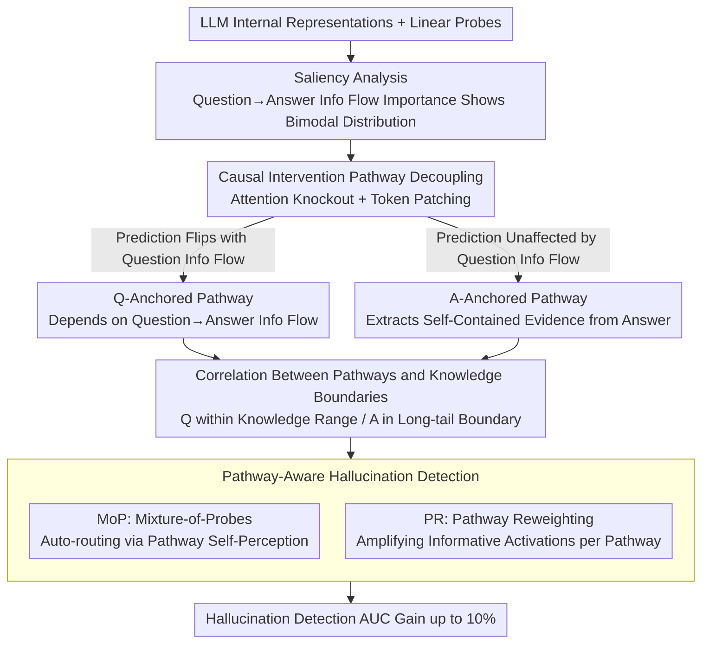

# Two Pathways to Truthfulness: On the Intrinsic Encoding of LLM Hallucinations

**Conference**: ACL 2026  
**arXiv**: [2601.07422](https://arxiv.org/abs/2601.07422)  
**Code**: [https://github.com/RowanWenLuo/llm-truthfulness-pathways](https://github.com/RowanWenLuo/llm-truthfulness-pathways)  
**Area**: Hallucination Detection  
**Keywords**: Hallucination detection, Truthfulness encoding, Attention mechanism, Information pathways, Knowledge boundary

## TL;DR

This paper discovers two distinct information pathways for encoding truthfulness signals within LLMs: Question-Anchored (relying on information flow from the question to the answer) and Answer-Anchored (extracting self-contained evidence from the generated answer itself). These pathways are closely associated with knowledge boundaries. Based on these insights, two pathway-aware hallucination detection methods, Mixture-of-Probes and Pathway Reweighting, are proposed, achieving up to a 10% improvement in AUC.

## Background & Motivation

**Background**: LLMs frequently produce hallucinations—outputs that are plausible but factually incorrect. Prior research has demonstrated that internal representations of LLMs encode rich truthfulness signals, which can be detected using linear probes. However, the sources and operational mechanisms of these signals remain poorly understood.

**Limitations of Prior Work**: Existing internal probing methods treat all samples as homogeneous, employing a single probe to detect all hallucinations. However, truthfulness signals in different samples may arise through different mechanisms; applying a unified approach leads to suboptimal performance.

**Key Challenge**: Saliency analysis indicates that the importance of the information flow from the question to the answer follows a bimodal distribution—some samples depend heavily on question information, while others exhibit almost no dependence. This suggests the existence of two fundamentally different mechanisms for truthfulness encoding.

**Goal**: (1) Validate and decouple the two truthfulness pathways; (2) Reveal their emergent properties; (3) Leverage pathway differentiation to enhance hallucination detection performance.

**Key Insight**: Decouple and validate the two pathways using two types of causal intervention experiments: attention knockout and token patching.

**Core Idea**: Truthfulness signals are generated via two independent pathways: Q-Anchored, which relies on the question-to-answer information flow (applicable to facts within the model's knowledge), and A-Anchored, which extracts self-contained evidence from the generated text itself (applicable to long-tail facts beyond the knowledge boundary).

## Method

### Overall Architecture

The paper investigates whether the "truthfulness signals" extracted via linear probes from LLM internal representations originate from a single source. The research follows three stages: first, saliency analysis is performed, revealing that the importance of the "question $\to$ answer" information flow follows a **bimodal distribution** across samples, leading to the hypothesis of two truthfulness pathways. Second, causal interventions, specifically attention knockout and token patching, are utilized to validate and decouple these two pathways. Finally, these mechanistic insights are implemented in two pathway-aware hallucination detection methods. The framework is validated across 12 models (base/instruct/reasoning, 1B to 70B) and 4 QA datasets.

### Key Designs

**1. Causal Intervention for Pathway Decoupling: If truthfulness signals had only one source, severing the question information flow should affect all samples uniformly.**

To provide causal evidence for the "two pathways" hypothesis, the authors employed two complementary interventions. The first is **Attention Knockout**: for a probe trained at layer $k$, all attention weights flowing from exact question tokens to subsequent positions in layers 1 through $k$ are zeroed out, physically blocking the "question $\to$ answer" information flow. Results showed samples split clearly into two groups: one where prediction probabilities shifted dramatically (Q-Anchored), and another where predictions remained nearly identical (A-Anchored). The second experiment, **Token Patching**, served as a reverse validation: replacing question tokens of one sample with those of another to inject hallucination cues. Q-Anchored samples were significantly more sensitive to these injections, whereas A-Anchored samples were largely unaffected, consistent with the knockout groupings. This bimodal divergence appeared consistently across all models and datasets, while random token knockout had no effect, confirming the coexistence of two distinct encoding mechanisms.

**2. Correlation Between Pathways and Knowledge Boundaries: Pathways are not assigned randomly but switch based on the model's knowledge status.**

The authors used three metrics to characterize knowledge boundaries—accuracy, "I-don't-know" rates, and entity popularity. Profiling the two groups revealed that Q-Anchored samples had significantly higher accuracy and involved more popular entities, placing them within the model's knowledge range. In contrast, A-Anchored samples had lower accuracy and involved long-tail entities, placing them at or beyond the knowledge boundary. This leads to a clear cognitive interpretation: when the model possesses the relevant knowledge, it relies on the "question $\to$ answer" flow to judge truthfulness; when knowledge is insufficient, it extracts cues from the inherent statistical patterns of the generated text itself.

**3. Pathway-Aware Hallucination Detection (MoP + PR): Since signal sources are fundamentally different, a single universal probe is suboptimal.**

Existing methods treat all samples as homogeneous, leading to compromises across both pathways. This paper proposes two improvement strategies. The first is **Mixture-of-Probes (MoP)**: training multiple expert probes specialized in specific truthfulness mechanisms, utilizing the finding that internal representations carry enough information to distinguish between pathways (classification accuracy $> 87\%$, termed "pathway self-perception"). The second is **Pathway Reweighting (PR)**: identifying the pathway for a given sample and selectively enhancing the internal signals or informative activation dimensions associated with that specific pathway. Both methods consistently outperformed single-probe baselines, with AUC gains reaching up to 10%.

### Loss & Training

Both the probes and the pathway classifiers are linear classifiers trained using binary cross-entropy on the model's raw internal representations. The high accuracy of the pathway classifier validates the premise that the model can internally perceive which pathway is active.

## Key Experimental Results

### Main Results

| Method | PopQA AUC | TriviaQA AUC | HotpotQA AUC | NQ AUC |
|--------|------|------|----------|------|
| Standard Probing | Baseline | Baseline | Baseline | Baseline |
| MoP (Ours) | +5-10% | +3-8% | +2-5% | +3-7% |
| PR (Ours) | Similar Gain | Similar Gain | Similar Gain | Similar Gain |

### Ablation Study

| Analysis | Result | Description |
|------|---------|------|
| Pathway Self-Perception Accuracy | 75-93% | Models distinguish two pathways from raw representations |
| Q-Anchored Accuracy | Significantly higher than A | Q-Anchored used for in-knowledge facts |
| Entity Popularity | Q-Anchored >> A-Anchored | Q-Anchored involves high-frequency entities |
| Random Token Knockout | No significant effect | Confirms effects are specific to exact question tokens |

### Key Findings

- **Two pathways exist robustly across models and datasets**: The bimodal pattern appears consistently in all 12 tested models (1B to 70B, including base, instruct, and reasoning models) across 4 datasets.
- **Knowledge boundaries determine pathway selection**: Models use Q-Anchored (truthfulness via question understanding) when they "know" the answer, and A-Anchored (truthfulness via statistical patterns) when they do not.
- **Models possess pathway self-perception**: Internal representations contain sufficient information to distinguish the two pathways with 75-93% accuracy, forming the basis for MoP.
- **Self-contained nature of A-Anchored**: After removing the question and performing a forward pass on the answer alone, predictions for A-Anchored samples remain nearly unchanged, while Q-Anchored samples shift significantly.

## Highlights & Insights

- **Depth of Mechanistic Understanding**: The study does not merely prove the existence of two pathways but links them to knowledge boundaries, providing a cognitive-level explanation.
-  **Practical Application of Pathway Separation**: The transition from discovery to application is clear—MoP and PR directly leverage mechanistic insights to improve detection, rather than being purely analytical.
- **Experimental Scale**: Comprehensive validation across 12 models (including recent Qwen models) and 4 datasets ensures high reliability.

## Limitations & Future Work

- Currently focused on factoid QA; pathway patterns in open-ended generation or multi-turn dialogues remain unknown.
- Pathway self-perception accuracy is not 100%, and misrouting affects MoP performance.
- The study does not explore training-time interventions to enhance the reliability of specific pathways.
- The definition of "exact tokens" relies on semantic framework theory; automated extraction may introduce noise.

## Related Work & Insights

- **vs Burns et al. (2023)**: CCS discovered a linear truthfulness direction in LLMs but did not distinguish between signal sources. This paper reveals the dual-pathway structure of these signals.
- **vs Orgad et al. (2025)**: They demonstrated that probing on exact answer tokens is most effective; this paper further explains why—the Q-Anchored signal is concentrated in the information flow of these specific tokens.

## Rating

- Novelty: ⭐⭐⭐⭐⭐ First to reveal the dual-pathway structure of LLM truthfulness encoding.
- Experimental Thoroughness: ⭐⭐⭐⭐⭐ Rigorous validation via causal interventions across 12 models.
- Writing Quality: ⭐⭐⭐⭐⭐ Clear logical flow from hypothesis to validation to application.
- Value: ⭐⭐⭐⭐⭐ Significant contributions to both mechanistic understanding and practical improvement of hallucination detection.

<!-- RELATED:START -->

## Related Papers

- [\[ACL 2026\] 为什么 LLM 在结构化知识上产生幻觉：推理过程的机制分析](why_llms_hallucinate_on_structured_knowledge_a_mechanistic_analysis_of_reasoning.md)
- [\[ICML 2026\] REALISTA: Realistic Latent Adversarial Attacks that Elicit LLM Hallucinations](../../ICML2026/hallucination/realista_realistic_latent_adversarial_attacks_that_elicit_llm_hallucinations.md)
- [\[ACL 2026\] The Reasoning Trap: How Enhancing LLM Reasoning Amplifies Tool Hallucination](the_reasoning_trap_how_enhancing_llm_reasoning_amplifies_tool_hallucination.md)
- [\[ACL 2025\] HALoGEN: Fantastic LLM Hallucinations and Where to Find Them](../../ACL2025/hallucination/halogen_hallucinations.md)
- [\[ACL 2026\] Logical Consistency as a Bridge: Improving LLM Hallucination Detection via Label Constraint Modeling between Responses and Self-Judgments](logical_consistency_as_a_bridge_improving_llm_hallucination_detection_via_label_.md)

<!-- RELATED:END -->
