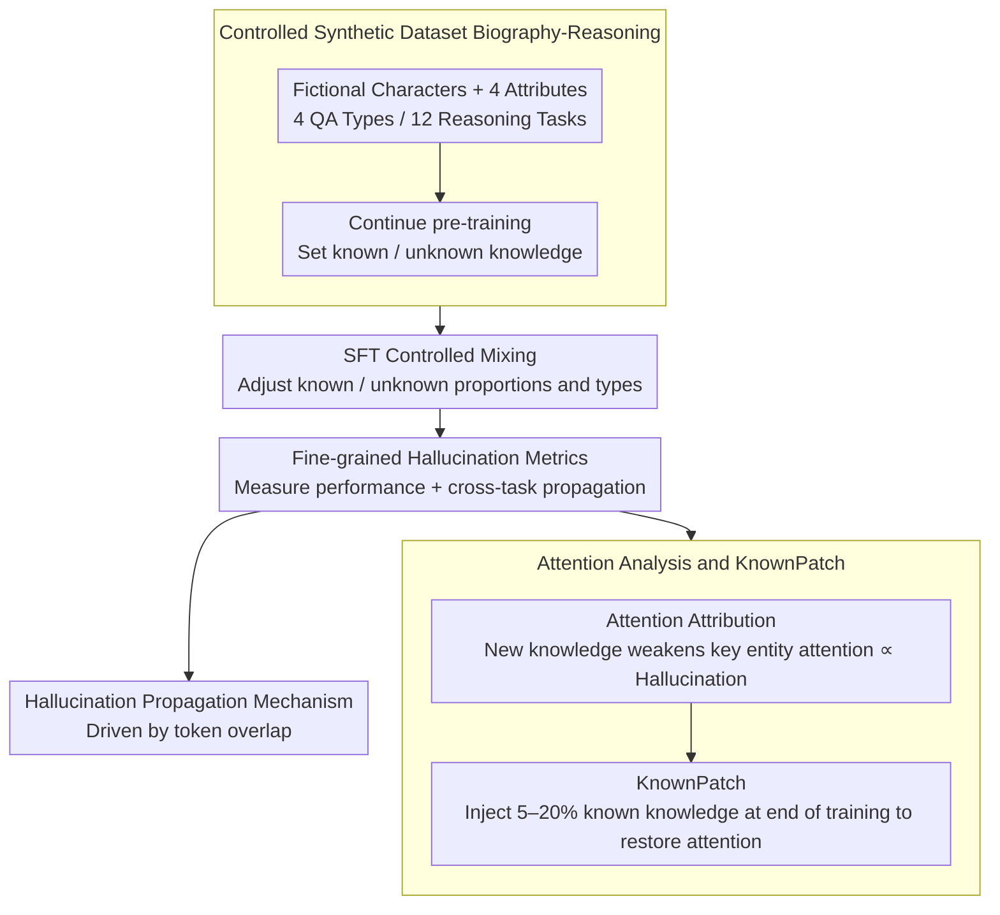

# Understanding New-Knowledge-Induced Factual Hallucinations in LLMs: Analysis and Interpretation

**Conference**: ACL 2026 Findings  
**arXiv**: [2511.02626](https://arxiv.org/abs/2511.02626)  
**Code**: None  
**Area**: Hallucination Detection  
**Keywords**: Factual hallucination, new knowledge learning, attention mechanism, SFT, KnownPatch

## TL;DR

This paper systematically analyzes the factual hallucination phenomenon caused by learning new knowledge during the SFT stage through a controlled synthetic dataset, Biography-Reasoning. It finds that the fundamental mechanism of hallucination is the weakened attention of the model toward key entities. Consequently, the authors propose KnownPatch—injecting a small amount of known knowledge at the end of training to restore attention patterns, effectively mitigating hallucinations.

## Background & Motivation

**Background**: LLMs acquire rich world knowledge during pre-training and learn to follow instructions during the SFT stage. Existing research indicates that introducing new knowledge not covered in pre-training during SFT increases the risk of factual hallucinations—the model erroneously generates newly learned information in irrelevant contexts.

**Limitations of Prior Work**: Previous work mainly focused on closed-QA scenarios with mixed knowledge types, providing insufficient understanding of the specific manifestations and underlying mechanisms of hallucinations. Specifically: (1) The propagation laws of hallucinations across different knowledge types and task types are unclear; (2) The causes at the attention mechanism level have not been revealed; (3) There is a lack of lightweight mitigation methods.

**Key Challenge**: When a certain category of knowledge is entirely composed of new knowledge, it leads to severe hallucinations even if the total amount of new knowledge is small. This differs from the simple understanding that "the higher the proportion of new knowledge, the more severe the hallucination"—the key factor is the degree of unfamiliarity within specific knowledge types rather than the global proportion of new knowledge.

**Goal**: (1) Construct a controlled dataset for fine-grained analysis of hallucination manifestations; (2) Reveal the attention mechanism behind hallucinations; (3) Propose a lightweight mitigation method.

**Key Insight**: Construct a synthetic biography dataset to precisely control the proportion and types of known/unknown knowledge, using attention analysis to track the generation and propagation mechanisms of hallucinations.

**Core Idea**: Learning new knowledge weakens the model's attention to key entities in the question, leading to over-reliance on other tokens in the context, which in turn generates hallucinations. Injecting known knowledge at the end of training can restore these attention patterns.

## Method

### Overall Architecture

The paper revolves around a controlled synthetic dataset, Biography-Reasoning: four attributes, four types of QA, and twelve types of reasoning tasks are assigned to a group of fictional characters. Through continue pre-training, specific knowledge is made "known" to the model while the rest remains "unknown," allowing for precise allocation of known/unknown knowledge types and proportions during SFT. Analysis proceeds across three levels—first using fine-grained metrics to characterize hallucination manifestations and cross-task propagation, then diving into the attention layer to reveal root causes, and finally proposing the lightweight KnownPatch mitigation based on these findings. A core thread runs through the work: learning new knowledge weakens attention to key entities in the question, and restoring this attention mitigates hallucinations.

### Key Designs

**1. Controlled Synthetic Dataset Biography-Reasoning: Cleanly Separating "Known" and "Unknown"**

In real-world corpora, it is impossible to determine which knowledge the model already possesses, making causal analysis of hallucinations difficult. This paper defines four attributes for fictional characters (birth year, death year, profession, university), each corresponding to a knowledge type. Four QA tasks and twelve reasoning tasks (single-step, comparative, novel reasoning) are constructed around them. Through continue pre-training, some knowledge becomes "known" and the rest remains "unknown," followed by mixed training during SFT with different proportions and types. Thus, the boundary of known/unknown is fully controllable, allowing the causes of hallucinations to be cleanly isolated from data distribution confusion.

**2. Attention Analysis and KnownPatch: Attributing Hallucinations to Attention and Fixing In-place**

Focusing on the changes in attention to key entities (name tokens) in the middle-to-late layers (layers 12–24), the authors found a clear law: learning new knowledge significantly reduces attention to key entities, and the magnitude of this decline matches hallucination severity; conversely, learning known knowledge enhances this attention. Since hallucinations stem from disrupted attention patterns, repairing the pattern itself should mitigate hallucinations—this is the logic behind KnownPatch. By injecting a small amount (5–20%) of known knowledge samples at the very last stage of training, the natural "attention enhancement" effect of known knowledge is used to pull back the attention suppressed by new knowledge. It is lightweight as it does not require pre-filtering all new knowledge from the training data.

**3. Hallucination Propagation Mechanism: Token Overlap vs. Semantic Similarity**

To clarify how hallucinations spread from training tasks to unrelated test tasks, the authors constructed two control variants—lexically similar but semantically different, and semantically similar but lexically different. Results show that propagation is primarily driven by lexical similarity (token overlap) rather than semantic similarity. This is mechanically sound: attention weights are normalized across all input tokens; when attention to key entities is weakened, the excess attention flows to surrounding context tokens. Thus, test samples sharing vocabulary with unknown knowledge samples in training are most susceptible. This also explains why reasoning tasks containing unknown knowledge backwardly deteriorate QA tests—the lexical overlap in their contexts is higher.

### Loss & Training

Standard SFT uses cross-entropy loss. KnownPatch injects known knowledge samples into the training data at the final stage of training (sequential placement rather than shuffling), utilizing the training order effect to repair attention. Control experiments also tested adding a KL divergence constraint ($\alpha=25$) to directly maintain consistency in the attention module output.

## Key Experimental Results

### Main Results

| Condition | STQA Accuracy Drop | Wiki Accuracy Drop | Description |
|--------|------|------|------|
| All Known (Baseline) | 0% | 0% | No hallucination |
| One Type All Unknown | >50% | Significant drop | Severe hallucination |
| KeepKnown 50% | Moderate drop | Moderate drop | Retaining known info mitigates hallucination |
| RemoveKnown 5% | Severe drop | Severe drop | Entirely unknown types are extremely harmful |

### Ablation Study

| Configuration | STQA | Wiki | Description |
|------|---------|------|------|
| KnownPatch 5% | Significant recovery | Significant recovery | Effective with only 5% known injection |
| KnownPatch 20% | Near baseline | Slightly above baseline | Near upper bound |
| Shuffled 20% | Moderate recovery | Moderate recovery | Shuffling is less effective than late-stage injection |
| KL Constraint | Partial mitigation | Partial mitigation | Direct attention constraint is effective but has side effects |

### Key Findings

- **Unfamiliarity within specific types is more important than global proportions**: Even if the total volume of new knowledge is small, if a knowledge type is entirely composed of unknown knowledge (RemoveKnown), it leads to extremely severe hallucinations. KeepKnown at 50% is far better than RemoveKnown at 5%.
- **Cross-type propagation of hallucinations**: Learning new knowledge of one type not only causes hallucinations in same-type QA (STQA drop >50%) but also spreads to different QA types (DTQA drop ~5%) and OOD Wiki test sets.
- **Backward propagation from reasoning tasks to QA**: Learning reasoning tasks with unknown knowledge results in more severe hallucinations on the QA test set than on other reasoning test sets because the QA context has higher lexical overlap with reasoning trajectories.
- **Attention highly correlates with hallucination**: Higher proportions of unknown knowledge lead to lower attention on key entities and more severe hallucinations. The correlation curves between the two correspond almost perfectly.
- **Non-replay nature of KnownPatch**: Even if the injected known knowledge does not cover all unknown types, it still mitigates hallucinations for uncovered types, indicating that KnownPatch works by restoring attention patterns rather than through knowledge replay.

## Highlights & Insights

- **"Specific type all unknown" is more dangerous than "high global proportion"**: This finding challenges the simple understanding that "higher proportions of new knowledge are more dangerous" and offers direct guidance for actual SFT data construction—one should ensure that some samples known to the model are retained within every knowledge type.
- **Token overlap drives hallucination propagation**: This explains why seemingly unrelated tasks are affected—as long as they share enough vocabulary tokens with samples containing new knowledge in training.
- **Lightweight nature of KnownPatch**: Injecting only 5% known knowledge at the end of training significantly mitigates hallucinations without the need for expensive classification of known/unknown knowledge across all training data.

## Limitations & Future Work

- Experiments were mainly conducted on Qwen2.5-1.5B, though consistency was verified on Llama3.2-1B, Qwen3-8B, and Qwen2.5-32B in the appendix.
- Use of a synthetic dataset; the complexity and distribution of real-world knowledge may differ from the synthetic setting.
- KnownPatch requires access to known knowledge samples; determining whether knowledge is known in practice remains an open problem.
- Mechanisms for non-factual hallucinations (e.g., logical errors, formatting errors) were not explored.

## Related Work & Insights

- **vs. Gekhman et al. (2024)**: They found that higher proportions of new knowledge lead to more severe hallucinations but used mixed knowledge type settings. This paper reveals a more fine-grained law through controlled knowledge types—unfamiliarity within a type is the key factor.
- **vs. Sun et al. (2025)**: They analyzed new knowledge over-generalization from a token probability perspective; this paper provides a complementary explanation from the perspective of attention mechanisms.

## Rating

- Novelty: ⭐⭐⭐⭐ The controlled experimental design is ingenious; the "intra-type unfamiliarity" finding is original.
- Experimental Thoroughness: ⭐⭐⭐⭐⭐ Extremely thorough with multi-dimensional ablations, multi-model validation, attention analysis, and propagation mechanism analysis.
- Writing Quality: ⭐⭐⭐⭐⭐ The logical chain from phenomenon to mechanism to mitigation is very clear.
- Value: ⭐⭐⭐⭐⭐ Holds important practical significance for understanding and mitigating hallucinations during the SFT stage.

<!-- RELATED:START -->

## Related Papers

- [\[ACL 2026\] Rethinking Evaluation for LLM Hallucination Detection: A Desiderata, A New RAG-based Benchmark, New Insights](rethinking_evaluation_for_llm_hallucination_detection_a_desiderata_a_new_rag-bas.md)
- [\[ACL 2026\] Mechanisms of Prompt-Induced Hallucination in Vision–Language Models](mechanisms_of_prompt-induced_hallucination_in_vision-language_models.md)
- [\[ACL 2026\] Stable-RAG: Mitigating Retrieval-Permutation-Induced Hallucinations in Retrieval-Augmented Generation](stable-rag_mitigating_retrieval-permutation-induced_hallucinations_in_retrieval-.md)
- [\[ACL 2026\] MeasHalu: Mitigation of Scientific Measurement Hallucinations for LLMs](meashalu_mitigation_of_scientific_measurement_hallucinations_for_large_language_.md)
- [\[CVPR 2026\] Understanding and Mitigating Hallucinations in Multimodal Chain-of-Thought Models](../../CVPR2026/hallucination/understanding_and_mitigating_hallucinations_in_multimodal_chain-of-thought_model.md)

<!-- RELATED:END -->
