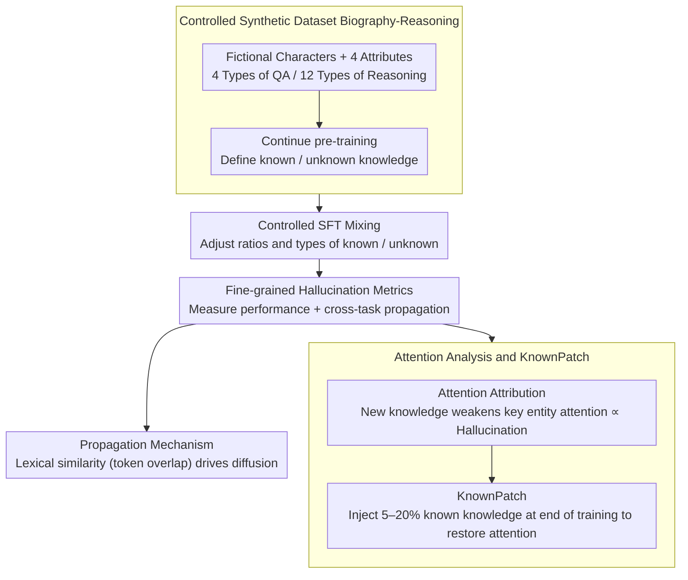

# Understanding New-Knowledge-Induced Factual Hallucinations in LLMs: Analysis and Interpretation

**Conference**: ACL 2026 Findings  
**arXiv**: [2511.02626](https://arxiv.org/abs/2511.02626)  
**Code**: None  
**Area**: Hallucination Detection  
**Keywords**: Factual hallucination, new knowledge acquisition, attention mechanism, SFT, KnownPatch

## TL;DR

This paper systematically analyzes factual hallucinations caused by learning new knowledge during the SFT phase using a controlled synthetic dataset, Biography-Reasoning. It discovers that the fundamental mechanism of hallucination is the weakened attention of the model towards key entities and proposes KnownPatch—injecting a small amount of known knowledge at the end of training to restore attention patterns, effectively mitigating hallucinations.

## Background & Motivation

**Background**: LLMs acquire rich world knowledge during pre-training and learn to follow instructions during SFT. Existing research indicates that introducing new knowledge not covered in pre-training during the SFT phase increases the risk of factual hallucinations—models incorrectly generate newly learned information in irrelevant contexts.

**Limitations of Prior Work**: Previous work primarily focused on closed-QA scenarios with mixed knowledge types, lacking a deep understanding of the specific manifestations and underlying mechanisms of hallucinations. Specifically: (1) the propagation patterns of hallucinations across different knowledge and task types are unclear; (2) the causes at the attention mechanism level have not been revealed; (3) lightweight mitigation methods are lacking.

**Key Challenge**: When a specific type of knowledge consists entirely of new knowledge, severe hallucinations occur even if the total amount of new knowledge is minimal. This differs from the previous simplistic understanding that "higher ratios of new knowledge lead to more severe hallucinations"—the key factor is the unfamiliarity within a specific knowledge type rather than the global ratio of new knowledge.

**Goal**: (1) Construct a controlled dataset for fine-grained analysis of hallucination manifestations; (2) Reveal the attention mechanism underlying hallucinations; (3) Propose a lightweight mitigation method.

**Key Insight**: A synthetic biography dataset is constructed to precisely control the ratio and types of known/unknown knowledge, utilizing attention analysis to track the generation and propagation mechanisms of hallucinations.

**Core Idea**: Learning new knowledge weakens the model's attention to key entities in the question, leading to an over-reliance on other tokens in the context, which in turn generates hallucinations. Injecting known knowledge at the end of training can restore these attention patterns.

## Method

### Overall Architecture

Ours centers on a controlled synthetic dataset, Biography-Reasoning: four attributes, four types of QA, and twelve reasoning tasks are assigned to a set of fictional characters. Through continue pre-training, a portion of the knowledge becomes "known" to the model while the rest remains "unknown," allowing for the precise adjustment of types and ratios of known/unknown knowledge during SFT. The analysis proceeds across three levels: first, using fine-grained metrics to characterize hallucination performance and cross-task propagation; next, delving into the attention layer to reveal the root cause; and finally, proposing the lightweight KnownPatch mitigation method. A core thread links these: learning new knowledge weakens the model's attention to key entities, and restoring this attention mitigates hallucinations.

### Key Designs

**1. Controlled Synthetic Dataset Biography-Reasoning: Clean Separation of "Known" and "Unknown"**

In real-world corpora, it is impossible to determine which knowledge the model already possesses, making causal analysis of hallucinations difficult. Ours defines four attributes for fictional characters (birth year, death year, profession, university), with each attribute corresponding to a knowledge type. Four QA tasks and twelve reasoning tasks (single-step, comparative, and novel reasoning) are constructed around them. Through continue pre-training, some knowledge becomes "known" while the rest remains "unknown," followed by mixed SFT training with varying proportions. Thus, the boundaries of known/unknown are fully controllable, allowing the causes of hallucinations to be isolated from data distribution confounding.

**2. Attention Analysis and KnownPatch: Attributing Hallucinations to Attention and In-place Repair**

Focusing on attention changes toward key entities (name tokens) in the middle-to-late layers (layers 12–24), the authors discovered a clear pattern: learning new knowledge significantly reduces attention to key entities, and the magnitude of this decline matches hallucination severity. Conversely, learning known knowledge strengthens this attention. Since hallucinations stem from disrupted attention patterns, repairing the pattern itself should mitigate them—this is the intuition behind KnownPatch: injecting a small amount (5–20%) of known knowledge samples at the very end of training. Leveraging the natural "attention enhancement" effect of known knowledge pulls the suppressed attention back. It is lightweight as it does not require filtering all new knowledge from the training data.

**3. Propagation Mechanism: Lexical Similarity Rather than Semantic Similarity Drives Diffusion**

To understand how hallucinations spread from training tasks to unrelated test tasks, two variants were constructed: lexically similar but semantically different, and semantically similar but lexically different. Results show propagation is primarily driven by lexical similarity (token overlap). Mechanistically, as attention weights are normalized across all input tokens, weakened attention on key entities causes the excess attention to flow to surrounding context tokens. Test samples sharing tokens with unknown knowledge samples in training are most susceptible. This also explains why reasoning tasks containing unknown knowledge inversely degrade QA tests—there is higher lexical overlap in their contexts.

### Loss & Training

Standard SFT uses cross-entropy loss. KnownPatch injects known knowledge samples at the final stage of training (not shuffled, but placed at the end) to repair attention via the training sequence effect. Baseline experiments also tested adding a KL divergence constraint ($\alpha=25$) to directly maintain consistency in the attention module output.

## Key Experimental Results

### Main Results

| Condition | STQA Acc. Drop | Wiki Acc. Drop | Description |
|-----------|----------------|----------------|-------------|
| All Known (Baseline) | 0% | 0% | No hallucination |
| One Type All Unknown | >50% | Significant drop | Severe hallucination |
| KeepKnown 50% | Moderate drop | Moderate drop | Retaining known mitigates hallucination |
| RemoveKnown 5% | Severe drop | Severe drop | Entirely unknown types are highly harmful |

### Ablation Study

| Configuration | STQA | Wiki | Description |
|---------------|------|------|-------------|
| KnownPatch 5% | Significant recovery | Significant recovery | Effective with only 5% injection |
| KnownPatch 20% | Near baseline | Slightly above baseline | Close to upper bound |
| Shuffled 20% | Moderate recovery | Moderate recovery | Shuffling is less effective than end injection |
| KL Constraint | Partial mitigation | Partial mitigation | Direct attention constraint is effective but has side effects |

### Key Findings

- **Unfamiliarity within a specific type is more important than global ratio**: Even if total new knowledge is low, if a specific knowledge type consists entirely of unknown knowledge (RemoveKnown), it leads to extreme hallucinations. KeepKnown with 50% replacement is far better than RemoveKnown with 5% replacement.
- **Cross-type propagation of hallucinations**: Learning new knowledge for one type causes hallucinations in the same type of QA (STQA drop >50%) and spreads to different types of QA (DTQA drop ~5%) and OOD Wiki test sets.
- **Inverse propagation from reasoning to QA**: Learning reasoning tasks with unknown knowledge results in more severe hallucinations in QA test sets than in other reasoning tasks due to higher lexical overlap.
- **Correlation between attention and hallucination**: Higher ratios of unknown knowledge lead to lower attention on key entities and more severe hallucinations. The correlation curves match almost perfectly.
- **Non-replay nature of KnownPatch**: KnownPatch mitigates hallucinations even for unknown knowledge types not covered by the injected known samples, indicating it works by restoring attention patterns rather than through knowledge replay.

## Highlights & Insights

- **"Specific type entirely unknown" is more dangerous than "high global ratio"**: This finding challenges the simplistic view that more new knowledge equals more hallucinations and provides direct guidance for SFT data construction: ensure every knowledge type retains some samples known to the model.
- **Lexical similarity drives hallucination propagation**: This explains why seemingly unrelated tasks are affected—as long as they share enough tokens with samples containing new knowledge in training.
- **Efficiency of KnownPatch**: Injecting only 5% known knowledge at the end of training significantly mitigates hallucinations without the need for expensive known/unknown classification of all training data.

## Limitations & Future Work

- Experiments were primarily conducted on Qwen2.5-1.5B, though consistency was verified on Llama3.2-1B, Qwen3-8B, and Qwen2.5-32B in the appendix.
- The use of a synthetic dataset means the complexity and distribution of real-world knowledge may differ.
- KnownPatch requires access to known knowledge samples; determining which knowledge is "known" in practice remains an open challenge.
- Mechanisms of non-factual hallucinations (e.g., logic errors, formatting errors) were not explored.

## Related Work & Insights

- **vs Gekhman et al. (2024)**: They found that higher new knowledge ratios lead to more hallucinations but used a mixed knowledge type setting. Ours reveals more fine-grained patterns by controlling knowledge types—unfamiliarity *within* a type is key.
- **vs Sun et al. (2025)**: They analyzed over-generalization of new knowledge via token probabilities; ours provides a complementary explanation via attention mechanisms.

## Rating

- Novelty: ⭐⭐⭐⭐ Sophisticated controlled experiment design; "intra-type unfamiliarity" is a novel discovery.
- Experimental Thoroughness: ⭐⭐⭐⭐⭐ Multi-dimensional ablation, multi-model verification, attention analysis, and propagation analysis make it extremely thorough.
- Writing Quality: ⭐⭐⭐⭐⭐ The logical chain from phenomena to mechanisms to mitigation is very clear.
- Value: ⭐⭐⭐⭐⭐ High practical significance for understanding and mitigating hallucinations during SFT.

<!-- RELATED:START -->

## Related Papers

- [\[ACL 2026\] Rethinking Evaluation for LLM Hallucination Detection: A Desiderata, A New RAG-based Benchmark, New Insights](rethinking_evaluation_for_llm_hallucination_detection_a_desiderata_a_new_rag-bas.md)
- [\[ACL 2026\] Mechanisms of Prompt-Induced Hallucination in Vision–Language Models](mechanisms_of_prompt-induced_hallucination_in_vision-language_models.md)
- [\[ACL 2026\] Stable-RAG: Mitigating Retrieval-Permutation-Induced Hallucinations in Retrieval-Augmented Generation](stable-rag_mitigating_retrieval-permutation-induced_hallucinations_in_retrieval-.md)
- [\[CVPR 2026\] Understanding and Mitigating Hallucinations in Multimodal Chain-of-Thought Models](../../CVPR2026/hallucination/understanding_and_mitigating_hallucinations_in_multimodal_chain-of-thought_model.md)
- [\[ACL 2026\] MeasHalu: Mitigation of Scientific Measurement Hallucinations for LLMs](meashalu_mitigation_of_scientific_measurement_hallucinations_for_large_language_.md)

<!-- RELATED:END -->
