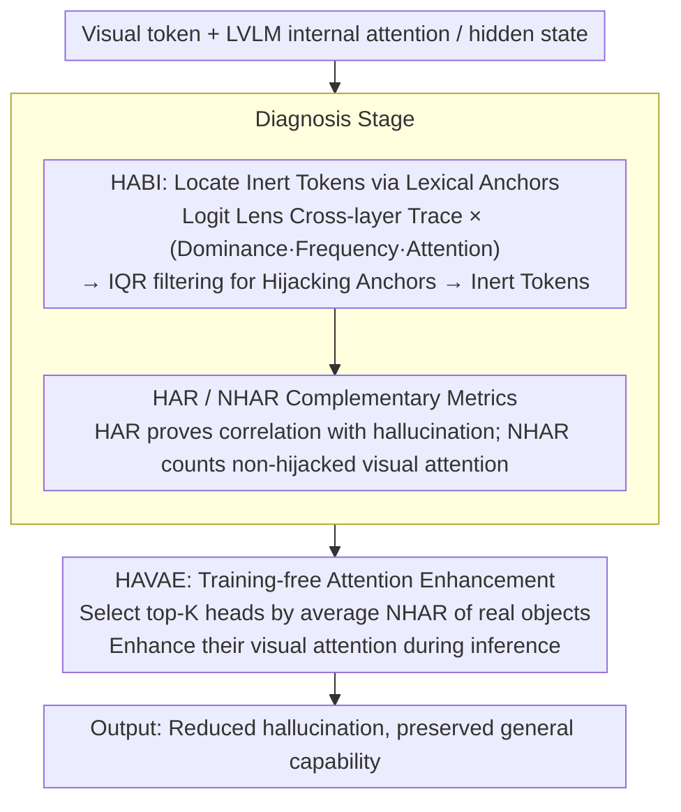

# Vocabulary Hijacking in LVLMs: Unveiling Critical Attention Heads by Excluding Inert Tokens to Mitigate Hallucination

**Conference**: ACL2026  
**arXiv**: [2605.10622](https://arxiv.org/abs/2605.10622)  
**Code**: https://github.com/lab-klc/HAVAE  
**Area**: Hallucination Detection  
**Keywords**: LVLM Hallucination, Attention Head Interpretation, Logit Lens, Vocabulary Hijacking, Training-free Intervention

## TL;DR
This paper discovers that certain ineffective visual tokens in LVLMs stably decode into a set of irrelevant words and hijack attention. It proposes HABI to locate these tokens, NHAR to identify reliable visual heads, and HAVAE to enhance these heads during inference to reduce hallucinations.

## Background & Motivation
**Background**: Mitigation methods for hallucinations in Large Vision-Language Models (LVLMs) often revolve around "making the model look more at the image," such as intervening in visual attention, using contrastive decoding, activation steering, or enhancing the influence of image tokens during generation. Recent analyses suggest that hallucinations are related to insufficient or abnormal attention to visual tokens.

**Limitations of Prior Work**: The issue is not "whether to intervene in attention" but "which attention heads and which visual tokens to intervene upon." Simply enhancing total visual attention easily pushes focus toward backgrounds, redundant patches, or attention sinks. Heuristic head selection often lacks explanations regarding factual grounding.

**Key Challenge**: Visual attention in LVLMs is not naturally equivalent to effective visual evidence. Some tokens receive massive attention but carry almost no target object information, instead steering generation toward fixed, meaningless lexical anchors. Existing methods lack mechanism-level diagnostics and may simultaneously amplify useful and noisy attention.

**Goal**: The authors attempt to answer three questions: what are the internal representation patterns of abnormal visual attention; how do these abnormal tokens relate to hallucinations; and whether truly reliable visual attention heads can be selected and enhanced during inference without training.

**Key Insight**: Using Logit Lens, the authors observe what visual tokens "look like" when their hidden states at different layers are projected into the vocabulary space. They find that the cross-layer traces of certain high-attention visual tokens repeatedly fall on fixed irrelevant words. These are not ordinary background tokens but represent a semantic collapse termed "Vocabulary Hijacking."

**Core Idea**: First identify "Inert Tokens" hijacked by fixed lexical anchors, then exclude these tokens to find critical attention heads oriented toward effective visual content.

## Method

### Overall Architecture
The method consists of "Diagnosis" and "Intervention." In the diagnosis phase, models like LLaVA-1.5, Shikra, MiniGPT-4, and Qwen2-VL are used to generate descriptions for 500 images from the COCO 2014 validation set. Vocabulary Hijacking, Hijacking Anchors, and Inert Tokens are defined by tracing visual tokens through layers.

Two attention metrics are constructed: HAR measures the proportion of attention from critical visual heads falling on Inert Tokens (proving hijacking correlates with hallucination), while NHAR counts attention falling only on non-Inert visual tokens to select reliable factual grounding heads.

In the intervention phase, HAVAE is proposed. It is training-free and model-agnostic, enhancing the visual attention of top-$K$ heads ranked by NHAR during inference.

### Key Designs

**1. HABI: Locating Inert Tokens via Lexical Anchors**
Ordinary attention sink analysis reveals that certain tokens absorb attention but fails to distinguish useful evidence from noise. HABI links abnormal attention to semantic collapse in the vocabulary space. For each visual token $v_i$, a cross-layer sequence (Trace) is generated via Logit Lens. If a Trace is dominated by a fixed Anchor that globally appears frequently in high-attention tokens, it receives a high hijacking score. $S_{hijack}(v_i)$ is calculated by multiplying Dominance (intra-token rigidity), Frequency (systemic appearance), and Attention (influence on generation).

**2. HAR and NHAR: Separating "Harm Proof" from "Head Selection"**
Since high visual attention can be either a good or bad signal, two metrics are needed. HAR calculates the ratio of attention falling on Inert Tokens. Experiments show hallucinated tokens correspond to higher HAR. Conversely, NHAR accumulates only attention falling on non-Inert visual tokens, effectively removing the hijacked portion of the visual attention budget.

**3. HAVAE: Training-free Attention Enhancement**
Directly penalizing or zeroing Inert Tokens can damage generation as they may serve residual routing or placeholder functions. HAVAE chooses positive enhancement: it selects top-$K$ target heads $H_{target}$ based on average NHAR on real object tokens and adds an intra-layer mean attention magnitude term to their visual attention during inference, controlled by intensity $\alpha$.

### Loss & Training
Ours has no training loss, as HAVAE is a training-free inference intervention. Offline steps include statistics for Hijacking Anchors and NHAR rankings; the inference phase only modifies attention weights of selected heads.

## Key Experimental Results

### Main Results
Evaluation covers CHAIR, POPE, POPE-Chat, AMBER, and MME benchmarks using LLaVA-1.5, MiniGPT-4, Shikra, and Qwen2-VL.

| Model | Method | CHAIRs ↓ | CHAIRi ↓ | POPE Acc ↑ | POPE F1 ↑ | POPE-Chat Acc ↑ | POPE-Chat F1 ↑ | Key Finding |
|------|------|----------|----------|------------|-----------|-----------------|----------------|----------|
| LLaVA-1.5-7B | Greedy | 48.2 | 14.2 | 84.8 | 85.5 | 85.5 | 83.4 | Significant hallucination in base model |
| LLaVA-1.5-7B | PAI | 23.8 | 6.2 | 85.9 | 86.0 | 85.5 | 83.4 | Intervention effective but not optimal |
| LLaVA-1.5-7B | HAVAE | 18.2 | 3.8 | 86.2 | 86.3 | 88.0 | 87.0 | CHAIRi reduced by 38.7% vs strongest baseline |
| MiniGPT-4-7B | HAVAE | 21.8 | 6.9 | 76.9 | 77.6 | 80.2 | 80.2 | Gains maintained on smaller models |
| Shikra-7B | HAVAE | 15.8 | 5.0 | 81.6 | 82.1 | 76.7 | 78.6 | CHAIRi reduced by 46.2% vs strongest baseline |
| LLaVA-1.5-13B | HAVAE | 21.8 | 5.0 | 82.5 | 84.7 | 87.9 | 86.6 | Scalable to 13B models |

### Ablation Study
Ablations prove that head selection must exclude Inert Tokens and that positive enhancement is more reliable than direct penalty.

| Configuration | CHAIRs ↓ | CHAIRi ↓ | POPE Acc ↑ | POPE F1 ↑ | MME Per ↑ | MME Cog ↑ | Note |
|------|----------|----------|------------|-----------|-----------|-----------|------|
| Max Attention Selection | 7.8 | 4.4 | 85.9 | 85.6 | 1399.0 | 277.0 | Low hallucination but F1 and MME suffer significantly |
| HAVAE / NHAR Selection | 18.2 | 3.8 | 86.2 | 86.3 | 1483.9 | 327.9 | Better balance between hallucination and capability |
| Sample size 10 | 18.8 | 3.7 | 86.1 | 86.2 | N/A | N/A | Usable estimates with very few samples |
| Penalty coeff $\beta=0.6$ | 19.8 | 4.7 | 86.1 | 86.2 | N/A | N/A | Direct penalty of Inert Tokens worsens CHAIR |

### Key Findings
- Vocabulary Hijacking is not an isolated anomaly. Long-tail distributions of hijacking scores and bimodal hijacking ratios for salient tokens are observed across multiple models.
- Hallucinated tokens exhibit significantly higher HAR, while real object tokens concentrate in high NHAR regions.
- HAVAE does not damage general capability on MME; for LLaVA-1.5-7B, perception improved from 1472.5 to 1483.9.
- Qwen2-VL shows similar gains: CHAIRs dropped from 27.6 to 22.8.

## Highlights & Insights
- The most interesting aspect is tracing hallucination from output errors to fixed anchors in the vocabulary space.
- HABI's design is highly interpretable, filtering accidental noise via Dominance, Frequency, and Attention metrics.
- NHAR serves as a better selection criterion than total visual attention.
- The positive enhancement strategy of HAVAE is robust compared to brute-force suppression.

## Limitations & Future Work
- The method requires access to internal hidden states and attention weights, making it unsuitable for black-box API models.
- The origin of the mechanism is not fully explained; it may stem from shortcuts in early vision-language alignment.
- Validation is limited to models up to 13B; hijacking anchors in larger models or video LVLMs require further investigation.
- HABI relies on COCO-style object annotations; distribution of Inert Tokens may vary in specialized domains like medical imaging.

## Related Work & Insights
- **vs Visual Attention Sink**: While VAS focuses on tokens monopolizing attention, this work identifies that these tokens decode into fixed irrelevant words.
- **vs PAI / Devils**: HAVAE distinguishes itself by excluding Inert Tokens before selecting heads via NHAR, reducing the risk of enhancing noisy pathways.
- **vs VISTA / activation steering**: HAVAE provides more localized intervention and clearer mechanistic explanation by focusing only on specific visual attention heads.

## Rating
- Novelty: ⭐⭐⭐⭐⭐ The characterization of Vocabulary Hijacking is highly novel and translatable to effective intervention.
- Experimental Thoroughness: ⭐⭐⭐⭐☆ Covers multiple models and benchmarks, though larger models and non-COCO domains remain for future work.
- Writing Quality: ⭐⭐⭐⭐☆ Clear chain from diagnosis to intervention.
- Value: ⭐⭐⭐⭐⭐ Inspiring for both hallucination explanation and training-free mitigation.

<!-- RELATED:START -->

## Related Papers

- [\[CVPR 2026\] Mitigating Object Hallucination in LVLMs via Attention Imbalance Rectification](../../CVPR2026/hallucination/mitigating_object_hallucinations_in_lvlms_via_attention_imbalance_rectification.md)
- [\[CVPR 2026\] Same Attention, Different Truths: Put Logit-Lens over Visual Attention to Detect and Mitigate LVLM Object Hallucination](../../CVPR2026/hallucination/same_attention_different_truths_put_logit-lens_over_visual_attention_to_detect_a.md)
- [\[AAAI 2026\] Causally-Grounded Dual-Path Attention Intervention for Object Hallucination Mitigation in LVLMs](../../AAAI2026/hallucination/causally-grounded_dual-path_attention_intervention_for_objec.md)
- [\[ACL 2025\] Mixture of Decoding: An Attention-Inspired Adaptive Decoding Strategy to Mitigate Hallucination in Multimodal LLMs](../../ACL2025/hallucination/mixture_of_decoding_an_attention-inspired_adaptive_decoding_strategy_to_mitigate.md)
- [\[ICML 2026\] Finding the Correct Visual Evidence Without Forgetting: Mitigating Hallucination in LVLMs via Inter-Layer Visual Attention Discrepancy](../../ICML2026/hallucination/finding_the_correct_visual_evidence_without_forgetting_mitigating_hallucination_.md)

<!-- RELATED:END -->
