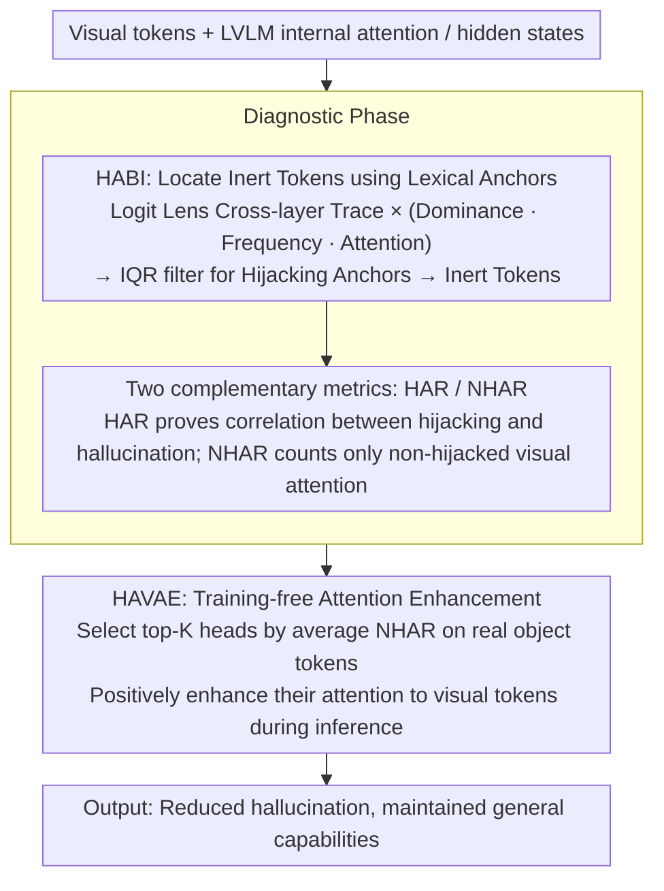

# Vocabulary Hijacking in LVLMs: Unveiling Critical Attention Heads by Excluding Inert Tokens to Mitigate Hallucination

**Conference**: ACL2026  
**arXiv**: [2605.10622](https://arxiv.org/abs/2605.10622)  
**Code**: https://github.com/lab-klc/HAVAE  
**Area**: Hallucination Detection  
**Keywords**: LVLM Hallucination, Attention Head Interpretation, Logit Lens, Vocabulary Hijacking, Training-Free Intervention

## TL;DR
This paper discovers that certain invalid visual tokens in LVLMs consistently decode into a set of irrelevant words and hijack attention. Consequently, it proposes HABI to locate these tokens, NHAR to identify reliable visual heads, and HAVAE to enhance these heads during inference to mitigate hallucinations.

## Background & Motivation
**Background**: Hallucination mitigation methods for large vision-language models (LVLMs) often revolve around "forcing the model to look more at the image," such as intervening in visual attention, using contrastive decoding, performing activation steering, or enhancing the influence of image tokens during generation. Recent analyses have indicated that hallucinations are related to insufficient or abnormal attention to visual tokens.

**Limitations of Prior Work**: The issue is not "whether attention should be intervened upon," but rather "which attention heads and which visual tokens should be the targets." Simply increasing total visual attention can easily push attention toward backgrounds, redundant patches, or attention sinks. Furthermore, using heuristics to select heads makes it difficult to explain why these heads are related to factual grounding.

**Key Challenge**: Visual attention in LVLMs is not naturally equivalent to effective visual evidence. Some tokens receive a large amount of attention but carry almost no information about the target object, instead leading the generation toward fixed, meaningless lexical anchors. Existing methods lack mechanism-level diagnosis and may thus amplify both useful and noisy attention simultaneously.

**Goal**: The authors attempt to answer three questions: what the internal representation patterns of abnormal visual attention are; how these abnormal tokens relate to hallucinations; and whether truly reliable visual attention heads can be selected and enhanced during the inference stage without training.

**Key Insight**: The paper uses Logit Lens to observe what words the hidden states of visual tokens "look like" when projected into the vocabulary space across different layers. The authors find that the cross-layer traces of certain high-attention visual tokens repeatedly fall on fixed, irrelevant words. These are not ordinary background tokens but represent a form of semantic collapse termed "Vocabulary Hijacking."

**Core Idea**: First identify Inert Tokens that are hijacked by fixed lexical anchors, then exclude these tokens to find critical attention heads that truly focus on effective visual content.

## Method

### Overall Architecture
The methodological chain is divided into "Diagnosis" and "Intervention." In the diagnostic stage, using 500 images from the COCO 2014 validation set, descriptions are generated using models such as LLaVA-1.5, Shikra, MiniGPT-4, and Qwen2-VL, with COCO annotations used to distinguish between ground-truth and hallucinated objects. The authors then use Logit Lens to trace which words visual tokens are interpreted as across layers, defining Vocabulary Hijacking, Hijacking Anchors, and Inert Tokens.

Based on this, two attention metrics are constructed. HAR measures how much attention from critical visual heads falls on Inert Tokens, proving that hijacking is positively correlated with hallucination. Conversely, NHAR counts only the attention falling on non-Inert visual tokens to select more reliable factual grounding heads.

In the intervention stage, HAVAE is proposed. It does not update model parameters or introduce extra models; it simply enhances the attention of the top-$K$ heads ranked by NHAR toward visual tokens during inference. The goal is not to blindly increase all visual attention but to strengthen those heads diagnosed as "focusing on non-hijacked visual content."

### Key Designs

**1. HABI: Locating Inert Tokens via Lexical Anchors**

Ordinary attention sink analysis only indicates that "certain visual tokens absorb a lot of attention" without explaining what their internal representations are doing, thus failing to distinguish between useful visual evidence and noise. HABI links abnormal attention to semantic collapse in the vocabulary space: for each visual token $v_i$, Logit Lens projects its hidden states at each layer into the vocabulary, obtaining a cross-layer word sequence (Trace). If a token's Trace is repeatedly dominated by the same fixed Anchor, and this Anchor globally appears frequently in high-attention tokens, it is assigned a high hijacking score. Specifically, Dominance (whether a single token is rigid across layers), Frequency (whether a word appears systematically), and Attention (whether it truly affects generation) are multiplied to obtain $S_{hijack}(v_i)$, followed by using an IQR outlier threshold at the vocabulary level to filter Hijacking Anchors. Multiplying these three dimensions filters out accidental noise and is more specific and interpretable than simply finding background tokens by attention magnitude.

**2. HAR and NHAR: Separating "Proving Hijacking is Harmful" from "Selecting Gold Heads"**

High visual attention itself can be either a good or a bad signal, depending on where it lands; thus, two complementary metrics are needed. HAR calculates the ratio of attention from a specific head falling on Inert Tokens relative to all visual tokens. In experiments, hallucinated tokens often correspond to higher HAR, proving the positive correlation between hijacking and hallucination. NHAR does the opposite, aggregating only the attention falling on non-Inert visual tokens, which is equivalent to removing the hijacked portion of the visual attention budget and retaining the density directed toward effective visual content. The value of NHAR lies in changing the head selection criterion from "observing many images" to "observing many effective image regions," providing an interpretable basis for which heads to enhance during inference.

**3. HAVAE: Training-Free Attention Enhancement**

Directly penalizing or zeroing out Inert Tokens can actually damage generation, as these tokens might serve a residual routing or placeholder function—as seen in the ablation where a negative suppression of $\beta=0.6$ worsened CHAIR scores. HAVAE therefore chooses positive enhancement over negative suppression: it first selects top-$K$ target heads $H_{target}$ based on the average NHAR on ground-truth object tokens. During inference, it adds an intra-layer average attention magnitude term to the attention of these heads toward visual tokens, with the enhancement strength controlled by $\alpha$ (Qwen2-VL uses $K=300$, other models mostly use $K=450$; in long-text scenarios, $\alpha$ is adjusted from the default 0.1 to 0.6 or 0.7). It requires no parameter updates and no additional models, enhancing only the heads diagnosed by NHAR as "focusing on non-hijacked visual content," making it stable and applicable to models with non-trainable weights.

### Loss & Training
This paper does not use a training loss, as HAVAE is a training-free inference intervention. The required offline steps involve using a small number of images to statistically identify Hijacking Anchors, Inert Tokens, and NHAR rankings. During the inference stage, only the attention weights of the selected heads are modified. This design allows for use in scenarios where closed-source weights are non-trainable, though it still requires access to the model's internal attention.

## Key Experimental Results

### Main Results
The main experiments evaluate hallucination and general capabilities on benchmarks including CHAIR, POPE, POPE-Chat, AMBER, and MME, covering LLaVA-1.5 7B/13B, MiniGPT-4 7B, Shikra 7B, and Qwen2-VL 7B.

| Model | Method | CHAIRs ↓ | CHAIRi ↓ | POPE Acc ↑ | POPE F1 ↑ | POPE-Chat Acc ↑ | POPE-Chat F1 ↑ | Key Conclusion |
|------|------|----------|----------|------------|-----------|-----------------|----------------|----------|
| LLaVA-1.5-7B | Greedy | 48.2 | 14.2 | 84.8 | 85.5 | 85.5 | 83.4 | Significant hallucination in original model |
| LLaVA-1.5-7B | PAI | 23.8 | 6.2 | 85.9 | 86.0 | 85.5 | 83.4 | Attention intervention is effective but not optimal |
| LLaVA-1.5-7B | HAVAE | 18.2 | 3.8 | 86.2 | 86.3 | 88.0 | 87.0 | CHAIRi dropped by 38.7% vs strongest reliable baseline |
| MiniGPT-4-7B | HAVAE | 21.8 | 6.9 | 76.9 | 77.6 | 80.2 | 80.2 | Improvements still seen in small models |
| Shikra-7B | HAVAE | 15.8 | 5.0 | 81.6 | 82.1 | 76.7 | 78.6 | CHAIRi dropped by 46.2% vs strongest reliable baseline |
| LLaVA-1.5-13B | HAVAE | 21.8 | 5.0 | 82.5 | 84.7 | 87.9 | 86.6 | Scalable to 13B scale |

### Ablation Study
The ablation study focuses on proving that heads cannot be selected based on total visual attention alone (Inert Tokens must be excluded) and that direct punishment of Inert Tokens is inferior to positive enhancement.

| Config | CHAIRs ↓ | CHAIRi ↓ | POPE Acc ↑ | POPE F1 ↑ | MME Per ↑ | MME Cog ↑ | Description |
|------|----------|----------|------------|-----------|-----------|-----------|------|
| Max Attention Selection | 7.8 | 4.4 | 85.9 | 85.6 | 1399.0 | 277.0 | Low hallucination but F1 and MME suffer, indicating high-attention heads are not necessarily reliable |
| HAVAE / NHAR Selection | 18.2 | 3.8 | 86.2 | 86.3 | 1483.9 | 327.9 | Better balance between hallucination suppression and general capability |
| Sample size 10 | 18.8 | 3.7 | 86.1 | 86.2 | N/A | N/A | Estimates are usable with very few samples |
| Sample size 500 | 18.2 | 3.7 | 86.1 | 86.2 | N/A | N/A | Metrics stable; paper adopts 500 |
| Penalty $\beta=0.0$ | 18.2 | 3.7 | 86.1 | 86.2 | N/A | N/A | Standard HAVAE |
| Penalty $\beta=0.6$ | 19.8 | 4.7 | 86.1 | 86.2 | N/A | N/A | Directly penalizing Inert Tokens worsens CHAIR |

### Key Findings
- Vocabulary Hijacking is not an anomaly isolated to a single model. The authors observed long-tail distributions of hijacking scores and bimodal hijacking ratio distributions for salient tokens in LLaVA-1.5, MiniGPT-4, Shikra, and Qwen2-VL.
- Hallucinated tokens have significantly higher HAR, while ground-truth object tokens are concentrated in high NHAR regions, suggesting that "hijacked visual attention" and "reliable visual grounding" are statistically distinguishable.
- HAVAE does not damage general capabilities on MME: e.g., LLaVA-1.5-7B perception improved from 1472.5 to 1483.9, and cognition from 322.5 to 327.9; Shikra cognition improved from 250.4 to 272.5.
- Similar gains on Qwen2-VL: CHAIRs decreased from 27.6 to 22.8, CHAIRi from 8.8 to 6.2, and MME All improved from 2268.4 to 2290.2.
- Low threshold sensitivity. Perturbing $\tau_r$ and $\tau_s$ within a 0.8 to 1.2x range results in small changes to CHAIR and POPE metrics, showing HABI does not rely on a narrow hyperparameter window.

## Highlights & Insights
- The most interesting aspect of the paper is tracing hallucinations from output errors back to fixed anchors in the vocabulary space. Instead of vaguely stating "attention is wrong," it provides an internal mechanistic chain: visual token traces collapse into Hijacking Anchors, which suck away head attention, causing critical head grounding to decline, and finally leading to the generation of hallucinated objects.
- The design of HABI is highly interpretable. Dominance checks single token rigidity across layers, Frequency checks systematic word appearance, and Attention checks the actual impact on generation; multiplying these filters out accidental noise.
- NHAR is a better criterion for head selection than "total visual attention." This provides an insight for multimodal interpretability: when interpreting attention, one should not only look at image token weights but also judge whether the image tokens themselves possess semantic contribution.
- The positive enhancement strategy of HAVAE is robust. The penalty ablation suggests that abnormal tokens cannot simply be zeroed out; enhancing reliable pathways is more consistent with the deep model's routing structure than brute-force suppression of abnormal pathways.
- This work inspires future mechanistic interpretability: linking Logit Lens, attention flow, and behavioral errors together, rather than just performing static visualization.

## Limitations & Future Work
- The method requires access to internal hidden states, unembedding, and attention weights, making it unsuitable for closed-source LVLMs that can only be called via black-box APIs.
- The origin of the mechanism is not fully explained. The authors speculate that Vocabulary Hijacking might stem from shortcuts in early vision-language alignment, but this has not been verified through training process tracing or controlled pre-training experiments.
- The validated models go up to 13B, with Qwen2-VL at 7B; whether larger scale models, newer architectures, or video LVLMs exhibit the same hijacking anchors requires systematic checking.
- HABI relies on COCO images and object labels to construct ground-truth/hallucinated sets. While AMBER shows some out-of-domain generalization, the distribution of Inert Tokens might differ for medical imaging, remote sensing, or document images.
- HAVAE is an inference-time attention modification. Compatibility with KV cache, high-efficiency inference frameworks, and quantized models still needs engineering verification.

## Related Work & Insights
- **vs Visual Attention Sink**: VAS focuses on empty or background tokens monopolizing attention; this paper further points out that the hidden states of these tokens consistently decode into fixed irrelevant words, providing a finer vocabulary-space mechanism for Vocabulary Hijacking.
- **vs PAI / Devils**: These methods are also training-free attention interventions but usually rely on coarser visual attention heuristics. The difference in HAVAE is first excluding Inert Tokens and then selecting critical heads by NHAR, reducing the risk of enhancing noisy pathways.
- **vs VISTA / activation steering**: VISTA influences generation via activation directions, reducing hallucinations but potentially affecting general capabilities. HAVAE only enhances visual attention in selected specific heads, making the intervention more localized and the mechanism clearer.
- **vs Logit Lens analysis work**: Previously, Logit Lens was used to observe how representations evolve from vision to semantics; this paper uses it to locate abnormal traces and further converts the analysis results into a functional inference intervention.

## Rating
- Novelty: ⭐⭐⭐⭐⭐ The characterization of Vocabulary Hijacking and Hijacking Anchors is very novel and translates into effective intervention.
- Experimental Thoroughness: ⭐⭐⭐⭐☆ Covers multiple models, benchmarks, and ablations, but there is room for expansion to larger models and non-COCO domains.
- Writing Quality: ⭐⭐⭐⭐☆ The chain from diagnosis to intervention is clear, with sufficient supporting tables.
- Value: ⭐⭐⭐⭐⭐ Highly insightful for both LVLM hallucination explanation and training-free fixes, particularly suitable for reuse in future interpretability research.

<!-- RELATED:START -->

## Related Papers

- [\[CVPR 2026\] Same Attention, Different Truths: Put Logit-Lens over Visual Attention to Detect and Mitigate LVLM Object Hallucination](../../CVPR2026/hallucination/same_attention_different_truths_put_logit-lens_over_visual_attention_to_detect_a.md)
- [\[AAAI 2026\] Causally-Grounded Dual-Path Attention Intervention for Object Hallucination Mitigation in LVLMs](../../AAAI2026/hallucination/causally-grounded_dual-path_attention_intervention_for_objec.md)
- [\[ACL 2025\] Mixture of Decoding: An Attention-Inspired Adaptive Decoding Strategy to Mitigate Hallucination in Multimodal LLMs](../../ACL2025/hallucination/mixture_of_decoding_an_attention-inspired_adaptive_decoding_strategy_to_mitigate.md)
- [\[ICML 2026\] Finding the Correct Visual Evidence Without Forgetting: Mitigating Hallucination in LVLMs via Inter-Layer Visual Attention Discrepancy](../../ICML2026/hallucination/finding_the_correct_visual_evidence_without_forgetting_mitigating_hallucination_.md)
- [\[ACL 2026\] Aligning with Your Own Voice: Self-Corrected Preference Learning for Hallucination Mitigation in LVLMs](aligning_with_your_own_voice_self-corrected_preference_learning_for_hallucinatio.md)

<!-- RELATED:END -->
