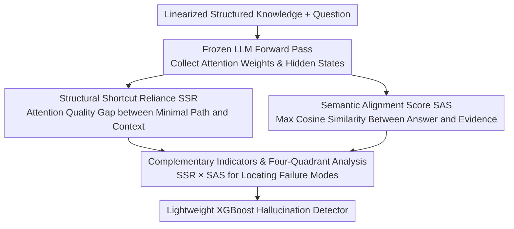

# Why LLMs Hallucinate on Structured Knowledge: A Mechanistic Analysis of the Reasoning Process

**Conference**: ACL 2026  
**arXiv**: [2605.26362](https://arxiv.org/abs/2605.26362)  
**Code**: https://github.com/ShanghaoLi0913/struhall-mechanism  
**Area**: Hallucination Detection  
**Keywords**: Hallucination Detection, Structured Knowledge, Attention Mechanism, Feed-Forward Networks, Knowledge Reasoning

## TL;DR

This paper reveals the internal failure mechanisms of LLMs when processing linearized structured knowledge through two mechanistic indicators: Structural Shortcut Reliance (SSR) and Semantic Alignment Score (SAS). Based on these signals, a lightweight hallucination detector is constructed.

## Background & Motivation

**Background**: Modern RAG frameworks and LLM reasoning systems commonly use linearization strategies to process structured knowledge. Knowledge graphs are converted into triple sequences, and tables are flattened into natural language text, as the Transformer architecture is inherently based on sequential token representation operations.

**Limitations of Prior Work**: A critical issue is that LLMs frequently produce hallucinated answers even when provided with sufficient and accurate structured knowledge in the context. Existing literature focuses mostly on external interventions (retrieval augmentation, prompt engineering) but lacks a deep understanding of the underlying mechanism—why do models ignore explicitly provided structured knowledge?

**Key Challenge**: The linearization process breaks the explicit relational constraints of structured data, leading to the model's inability to correctly utilize this knowledge internally. The inductive bias of Transformers tends to model sequential structures in natural language but adapts poorly to artificially flattened knowledge structures. When the context contains both key evidence and distracting information, models are prone to bias towards fast "shortcuts" rather than complete reasoning.

**Goal**: To decouple the model's utilization of external evidence from internal parametric memory using mechanistic interpretability methods, discovering the systematic internal dynamics of hallucination generation.

**Key Insight**: The authors examine two core functional modules of the Transformer—self-attention heads (selectively attending to input subsets) and feed-forward networks (storing and integrating knowledge). The hypothesis is that hallucinations stem from a systematic imbalance between attention allocation and semantic evidence integration.

**Core Idea**: Introduce two diagnostic indicators to quantify this imbalance, thereby transforming a black-box phenomenon into interpretable mechanistic signals.

## Method

### Overall Architecture

To answer "why LLMs hallucinate despite correct structured knowledge," the study performs a single forward pass with frozen model parameters, collecting attention weights and hidden layer representations. For each generated answer, two diagnostic indicators are calculated: Structural Shortcut Reliance (SSR) from the perspective of attention routing, and Semantic Alignment Score (SAS) from the perspective of representation grounding. These signals are mapped to hallucination labels via statistical tests and four-quadrant analysis, and finally fed into a lightweight XGBoost classifier to serve as a hallucination detector.

### Key Designs

**1. Structural Shortcut Reliance (SSR): Quantifying if Attention Focuses Only on the Shortest Path**

After linearization flattens a knowledge graph into a token sequence, models may take "shortcuts"—attending only to the minimal path connecting the question to the answer while ignoring surrounding evidence providing relational constraints. SSR captures this "shortcut learning": input tokens are divided into Core Structural Prompts $SS$ (minimal path set) and Contextual Prompts $\bar{S}$ (remaining knowledge). For each answer position $i$, the sum of attention from that position to all $SS$ positions is calculated as $\alpha_{l,h,i,S} = \sum_{j \in S}\alpha_{l,h,i,j}$. The mean difference between $SS$ and $\bar{S}$ attention quality across all layers $L$, heads $H$, and answer positions $A$ is computed:

$$\text{SSR}=\frac{1}{L \cdot H \cdot |A|}\sum_{l=1}^{L}\sum_{h=1}^{H}\sum_{i \in A}(\alpha_{l,h,i,S}-\alpha_{l,h,i,\bar{S}})$$

SSR ranges in $[-1,1]$; higher positive values indicate attention is more concentrated on shortcuts, potentially bypassing necessary factual verification.

**2. Semantic Alignment Score (SAS): Measuring if Internal Representations are "Grounded" in Knowledge**

Attention only reflects information flow and does not guarantee that the feed-forward network integrates evidence into the representation. SAS directly examines the representation layer: 1-hop neighboring triples are extracted from the core prompt $SS$ to form the Supporting Context Set (SCS). For each generated answer token, the second-to-last hidden representation $\mathbf{h}_t$ is compared with the encoding $\mathbf{g}_i$ of each knowledge unit $U_i$ in the SCS using maximum cosine similarity:

$$\text{SAS}(y_t)=\max_{U_i \in \mathcal{E}}\cos(\mathbf{h}_t, \mathbf{g}_i)$$

Sentence-level SAS is the average over all answer tokens. Values near 1 indicate the representation is well-grounded in knowledge, while values near -1 suggest the representation has drifted back to parametric priors learned during training. When linearization weakens the semantic scaffolding, feed-forward layers are easily dominated by parametric memory, which is the root cause of knowledge-driven hallucinations.

**3. Complementary Indicators and Four-Quadrant Analysis: Decoupling Failures into Two Independent Dimensions**

SSR and SAS characterize "selective failure of attention allocation" and "semantic drift of the representation layer" respectively, with a Pearson correlation of only -0.26, indicating complementary signals. Dividing the output space into four quadrants based on these indicators reveals distinct failure modes: Q2 (low SSR + high SAS, broad attention and strong alignment) has the lowest hallucination rate (5%); Q3 (low SSR + low SAS, scattered attention and no semantic fusion) is the most dangerous (22.2%); Q4 (high SSR + low SAS) shows moderate risk (10.9%), suggesting that concentrated attention alone is insufficient to induce severe hallucinations without representation drift. Because these two dimensions are independent, joint monitoring is required to fully diagnose failures that either indicator alone would miss.

## Key Experimental Results

### Main Results

| Metric | Hallucinated Output | Truthful Output | t-statistic | p-value |
|------|--------|--------|------|-----|
| SSR | 0.745 | 0.683 | -3.31 | <0.001 |
| SAS | 0.343 | 0.412 | 10.96 | <1e-26 |

**Key Finding**: Hallucinated and truthful outputs exhibit statistically significant distribution differences in SSR and SAS, confirming both as reliable discriminative signals but in opposite directions, reflecting the collaborative failure of attention and representation.

### Four Quadrants and Cross-Dataset Generalization

| Quadrant | Configuration | Hallucination Rate (1-hop) | Hallucination Rate (2-hop) | Hallucination Rate (Table) |
|------|------|-------------|-------------|-----------|
| Q1 | High SSR, High SAS | 9.5% | 36.4% | 84.1% |
| Q2 | Low SSR, High SAS | 5.0% | 14.8% | 80.9% |
| Q3 | Low SSR, Low SAS | 22.2% | 18.4% | 87.5% |
| Q4 | High SSR, Low SAS | 10.9% | 54.4% | 85.9% |

**Key Finding**: While absolute hallucination rates vary with task complexity, the relative importance of SAS remains stable—the high SAS quadrant (Q2) consistently performs best. This suggests semantic alignment is a more universal predictor of hallucination, while SSR more reflects task-specific failure modes.

### Hallucination Detection Performance Comparison

On MetaQA-1hop, the detector based on SSR+SAS compared with existing baselines:

- **Confidence-based methods** (Perplexity, token confidence): High recall but low precision, tending to over-predict hallucinations.
- **Semantic similarity-based methods** (BERTScore, embedding distance, NLI): Moderate performance, unable to distinguish effectively.
- **Ours (SSR + SAS)**: AUC=0.834, F1=0.539 on LLaMA2-7B; AUC=0.853, F1=0.461 on Qwen2.5-7B.

Advantages: No model fine-tuning required, calculated within a single forward pass, and logically interpretable (failure causes correspond to specific mechanisms).

## Highlights & Insights

- **Leap from Observation to Mechanism**: Whereas traditional work describes the phenomenon that "LLMs hallucinate," this paper delves internally to reveal two parallel failure trajectories: excessive attention concentration and representation drift.
- **Discovery of Complementary Indicators**: SSR and SAS are weakly correlated and capture different failure modes. This suggests that when designing multi-angle diagnostic tools, independence between signals should be prioritized over simple stacking.
- **Closed Loop from Theory to Application**: Mechanistic findings are directly transformed into a deployable detector without re-training, which is high-value for resource-constrained scenarios.
- **Cross-Format Generalization**: The same framework generalizes from graphs to tables without modification, indicating it diagnoses universal failure modes of Transformers processing *any* linearized structured knowledge.
- **"Minimal Path Insufficiency" Insight**: Q4 results show that even with focused attention, hallucinations occur, confirming that finding the shortest reasoning path is insufficient—the model must truly understand and fuse this path at the representation layer.

## Limitations & Future Work

- **Model Type Limitations**: Analysis is restricted to decoder-only models; encoder-decoder or specialized graph encoders might exhibit different characteristics.
- **Linearization Paradigm Constraints**: The study assumes knowledge must be converted to sequential token sequences. These mechanisms might not apply if graph structural representations are maintained directly inside the model.
- **Lack of Causal Evidence**: Current analysis is correlational; intervention experiments are needed to verify if SSR/SAS are the actual causes of hallucination.
- **Incomplete Scale Coverage**: Experiments are limited to 7B models; whether the behavior remains consistent in models above 70B requires verification.
- **Improvement Directions**: Targeted improvement strategies could explore explicitly penalizing high SSR/low SAS configurations during training or dynamically adjusting attention bias during inference to achieve more uniform distribution.

## Related Work & Insights

- **vs. Traditional Hallucination Detection (Perplexity, Self-consistency)**: Traditional methods rely on model output statistics; this paper starts from internal mechanisms to locate root problems.
- **vs. Other Interpretability Work**: Previous research often focuses on single components (e.g., attention visualization). This paper emphasizes *interaction failures* of multiple components—simultaneously monitoring attention and representation is required for a complete diagnosis.
- **Insights from KGQA**: The knowledge graph community has long known that "the shortest path may not uniquely determine an answer," but the LLM community lacks this awareness. This paper bridges that gap.
- **Inspiration**: The framework can migrate to other tasks involving structured knowledge (e.g., table reasoning, code understanding) by simply redefining the extraction rules for core structural prompts.

## Rating

- **Novelty**: ⭐⭐⭐⭐⭐ The dual-indicator complementary diagnosis of internal hallucination mechanisms is an original perspective; joint analysis from independent attention and representation dimensions is pioneering.
- **Experimental Thoroughness**: ⭐⭐⭐⭐ Validated across 1-hop/2-hop/4-hop and graph/table settings with detailed ablation studies, though lacking causal intervention experiments (only correlational).
- **Writing Quality**: ⭐⭐⭐⭐⭐ Logical flow from phenomenon to mechanism to application forms a complete narrative. Formulas are accurate, and charts have high information density.
- **Value**: ⭐⭐⭐⭐⭐ Provides both theoretical insight (understanding hallucination mechanisms) and practical tools (deployable detectors), offering guidance for future hallucination mitigation and LLM reliability work.

<!-- RELATED:START -->

## Related Papers

- [\[ACL 2026\] Understanding New-Knowledge-Induced Factual Hallucinations in LLMs: Analysis and Interpretation](understanding_new-knowledge-induced_factual_hallucinations_in_llms_analysis_and_.md)
- [\[ICLR 2026\] Mechanistic Detection and Mitigation of Hallucination in Large Reasoning Models](../../ICLR2026/hallucination/mechanistic_detection_and_mitigation_of_hallucination_in_large_reasoning_models.md)
- [\[ACL 2026\] The Reasoning Trap: How Enhancing LLM Reasoning Amplifies Tool Hallucination](the_reasoning_trap_how_enhancing_llm_reasoning_amplifies_tool_hallucination.md)
- [\[ICLR 2026\] Critical Confabulations: Can LLMs Hallucinate for Social Good?](../../ICLR2026/hallucination/critical_confabulation_can_llms_hallucinate_for_social_good.md)
- [\[NeurIPS 2025\] Reasoning Models Hallucinate More: Factuality-Aware Reinforcement Learning for Large Reasoning Models](../../NeurIPS2025/hallucination/reasoning_models_hallucinate_more_factuality-aware_reinforcement_learning_for_la.md)

<!-- RELATED:END -->
