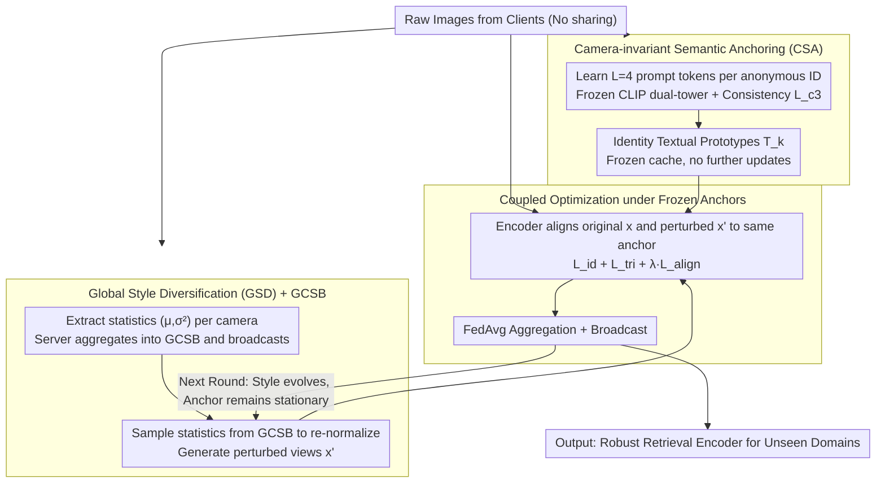

# CO-EVO: Co-evolving Semantic Anchoring and Style Diversification for Federated DG-ReID

**Conference**: ACL 2026  
**arXiv**: [2604.26363](https://arxiv.org/abs/2604.26363)  
**Code**: https://github.com/NanYiyuzurn/ACL-LGPS-2026  
**Area**: Federated Learning / Domain Generalization / Person ReID  
**Keywords**: Federated Domain Generalization, Person Re-identification, CLIP Semantic Anchoring, Style Diversification, Camera Invariance

## TL;DR
Addressing the "Semantic-Style Conflict" in Federated Domain Generalized Person Re-identification (FedDG-ReID), CO-EVO proposes CSA (Camera-invariant Semantic Anchoring) to learn frozen identity-level textual prototypes as "gravitational centers" and GSD (Global Style Diversification) to synthesize realistic cross-domain perturbations using a lightweight GCSB (Global Camera Style Bank). The coupled optimization of these modules achieves an average improvement of 14 points in ViT mAP (34.1→48.1) over SOTA on Market-1501/MSMT17/CUHK03 leave-one-out benchmarks.

## Background & Motivation

**Background**: Person ReID faces severe cross-camera domain shifts in real-world deployments. DG-ReID attempts to generalize from multi-source training to unseen target domains. Privacy requirements drive the FedDG-ReID paradigm, where multiple clients hold source domain data, do not share raw images, and federatively train a retrieval model capable of generalizing to unseen target domains. SOTA methods like DACS and SSCU use Style Transformation Models (STM) for local diversification.

**Limitations of Prior Work**: (1) **Shortcut Learning**: Local optimization lacks global semantic references, and models take shortcuts by utilizing background textures and camera color imprints to distinguish identities, leading to stable local performance but complete failure across the federation. (2) **VLM Deployment Challenges**: VLMs like CLIP have strong semantic priors, but ReID labels are anonymous IDs without natural language names, and transmitting LLMs in a federated setting incurs massive communication costs. (3) **Issues with Style Perturbation**: STM requires training auxiliary generative networks, which are computationally expensive, unstable in federated settings, and often produce images with repetitive artifacts and overexposure.

**Key Challenge**: **Semantic-Style Conflict**—pure visual supervision falls into domain-specific shortcuts, while excessively strong style augmentation can destroy identity-sensitive cues without grounding anchors. Existing methods either have grounding without diversification or diversification without grounding, failing to balance both.

**Goal**: In a strict federated setting (no sharing of raw data, controllable communication overhead), **simultaneously achieve** (a) stable global semantic references (preventing shortcut learning) and (b) high-quality cross-domain style diversification (providing exploration of visual boundaries), allowing the two to be coupled to cyclically reinforce each other.

**Key Insight**: The authors introduce "language-guided semantic supervision" to FedDG-ReID for the first time, using CLIP to learn learnable prompt tokens for each identity as textual anchors. Simultaneously, they utilize statistics (channel mean/var) to share camera styles without transmitting raw data, avoiding the training burden of STM.

**Core Idea**: The identity textual prototypes learned by CSA serve as "gravitational centers" $T_k$ and are frozen in a cache. GSD uses channel statistics re-normalization to transform images into diverse style views $x'$. This forces the encoder to map both the original view $x$ and the perturbed view $x'$ to the same anchor $t_{y_i}$. While styles vary, anchors remain fixed, forcing representations to focus on identity anatomical features.

## Method

### Overall Architecture
CO-EVO is a two-stage federated framework designed to enable the global image encoder to learn cross-domain robust representations where "style varies but identity remains invariant," without sharing raw images and while maintaining controllable communication overhead. Phase I involves learning a set of learnable prompt tokens locally at each client for each identity, freezing the CLIP dual-tower to obtain clean identity textual prototypes which are then stored in a frozen cache. Simultaneously, channel statistics for each camera are uploaded to the server to be aggregated into a Global Camera Style Bank (GCSB). In the subsequent federated loop, clients use GSD to sample statistics from the GCSB to re-normalize images and generate perturbed views, forcing the encoder to align both original and perturbed views to the same frozen anchor. After local training, FedAvg is used for aggregation and broadcasting. The core of the process is the coupled cycle of "dynamically evolving style inputs" and "stationary semantic anchors," outputting a retrieval encoder that can be directly deployed to unseen target domains.

### Key Designs

**1. Camera-invariant Semantic Anchoring (CSA): Learning a Clean Textual Center of Gravity for Anonymous IDs**

Identity in ReID consists of anonymous numbers without natural language names. Pure visual supervision allows models to take shortcuts—distinguishing identities via background textures or camera color imprints—which is locally stable but fails globally. CSA introduces $L$ learnable tokens for each identity $y$, inserted into the template "a photo of a [$X_1^y$]...[$X_L^y$] person." It freezes CLIP and optimizes only the tokens using bidirectional contrastive loss to align vision and text: $L_{i2t}(i) = -\log\frac{\exp(s(v_i, t_{y_i})/\tau)}{\sum_a \exp(s(v_i, t_a)/\tau)}$ and the symmetric $L_{t2i}(y)$. A key innovation is adding cross-camera consistency regularization $L_{c3} = \sum_y \sum_{i,j \in P(y), c_i \ne c_j} \|s(v_i, t_y) - s(v_j, t_y)\|^2$, serving as a hard constraint that "the similarity between the same identity under different cameras and the text should be consistent." This forces tokens to encode identity-invariant features rather than camera imprints. The total loss is $L_{CSA} = L_{i2t} + L_{t2i} + \lambda_{c3} L_{c3}$ ($\lambda_{c3}=0.1$). Prototypes $T_k$ are stored in a frozen cache after Phase I and are not updated during the federated loop. Ablations show that dynamically updating prototypes drops mAP by 3.3% because they become re-contaminated by local camera noise; only frozen anchors can serve as stable "gravitational centers." Prompt length $L=4$ is optimal; $L=1$ is too vague, while $L\ge 8$ over-parameterizes and introduces camera noise.

**2. Global Style Diversification (GSD) + Global Camera Style Bank (GCSB): Sharing Realistic Cross-domain Styles via Channel Statistics**

STM-based methods (DACS/SSCU) rely on training auxiliary generative networks for style perturbation, which is unstable and produces artifacts. GSD uses pure statistical re-normalization: channel first/second-order statistics primarily capture illumination, color tone, and texture while preserving semantic structure. At the end of Phase I, each client $k$ extracts $(\mu_{k,c}, \sigma^2_{k,c}) = \mathrm{Stat}(\{x_i^k | c_i^k = c\})$ for each camera $c$ and uploads them. The server aggregates these into the GCSB $\mathcal{B} = \cup_k \cup_c \{(\mu_{k,c}, \sigma^2_{k,c})\}$ and broadcasts it. During local training, $(\mu_s, \sigma_s^2)$ is sampled from $\mathcal{B}$ to re-normalize the image: $\hat{x} = \frac{x - \mu(x)}{\sqrt{\sigma^2(x) + \epsilon}}$, then $x' = \hat{x} \odot \sqrt{\sigma_s^2} + \mu_s$. The resulting perturbed views are based on real camera distributions rather than arbitrary noise. The "Global" aspect is critical—styles from a single client have already been seen during local training, so cross-client sharing is necessary to form an unseen domain proxy (GSD-Global 42.4% vs GSD-Local 40.2% mAP on Market). Sharing only ~$2C$ dimensional statistics involves near-zero communication cost and protects privacy. GCSB construction takes only 4s/client with zero trainable parameters and accounts for <0.1% of training time, showing robustness even with 30% camera ID noise or pseudo-groups.

**3. Coupled Optimization under Frozen Anchors: Binding Static Semantics and Dynamic Styles at Every Step**

CSA provides grounding and GSD provides diversification, but they must be coupled during training to enforce invariance. Each mini-batch contains the original view $x$ and a perturbed view $x' \sim GSD(\mathcal{B})$. Classification loss $L_{id}$ and triplet loss $L_{tri}$ are calculated for both, along with the crucial semantic alignment loss $L_{align}(i; \tilde{x}) = -\log\frac{\exp(s(v_i(\tilde{x}), t_{y_i})/\tau)}{\sum_{y\in Y_k} \exp(s(v_i(\tilde{x}), t_y)/\tau)}$. Both $x$ and $x'$ are aligned to the same frozen anchor $t_{y_i}$, forcing the encoder to map any style input back to that identity's anchor. The total objective is $L_{loc} = \sum_{\tilde{x}\in\{x,x'\}}(L_{id} + L_{tri} + \lambda L_{align})$. After local training for $E=1$ epoch, the server performs FedAvg. The authors define this mechanism, where "input distributions evolve via GSD while encoder parameters evolve under fixed anchor gravity," as co-evolution. Effetively, it reduces same-identity average cosine distance from 0.68 (SSCU) to 0.35 (−48.5%) and increases different-identity distance from 0.42 to 0.78 (+85.7%), fully restoring decision boundaries. Ablations show CSA alone gives +13.3 and GSD alone gives +14.4, but combined they yield +17.0 mAP, demonstrating non-additive complementarity.

### Loss & Training
Phase I: $L_{CSA} = L_{i2t} + L_{t2i} + \lambda_{c3} L_{c3}$ (120 rounds, $\lambda_{c3}=0.1, L=4, \tau=0.07$, CLIP ViT-B/16 frozen, only tokens learned). Phase II/III: $L_{loc} = \sum_{\tilde{x}}(L_{id} + L_{tri} + \lambda L_{align})$ (60 rounds, $E=1$, batch 64, SGD lr=1e-3, FedAvg aggregation).

## Key Experimental Results

### Main Results — Leave-One-Domain-Out (mAP / Rank-1 %, with CUHK02/CUHK03/MSMT17/Market as source or target)

| Method | MS+C2+C3→M | M+C2+C3→MS | MS+C2+M→C3 | Average mAP/R1 |
|--------|------------|------------|------------|-----------------|
| FedPav | 25.4 / 49.4 | 5.2 / 15.5 | 22.5 / 24.3 | 17.7 / 29.7 |
| MixStyle | 31.2 / 53.5 | 5.5 / 16.0 | 28.6 / 31.5 | 21.8 / 33.6 |
| SNR | 32.7 / 59.4 | 5.1 / 15.3 | 28.5 / 30.0 | 22.1 / 34.9 |
| DACS (RN50) | 36.3 / 61.2 | 10.4 / 27.5 | 30.7 / 34.1 | 25.8 / 40.9 |
| SSCU (RN50) | 39.5 / 66.4 | 11.9 / 32.3 | 32.8 / 34.1 | 28.1 / 44.3 |
| **CO-EVO (RN50)** | **42.4** / **71.2** | **12.9** / **33.7** | **34.9** / **37.1** | **30.1** / **47.3** |
| DACS (ViT) | 45.4 / 70.7 | 20.3 / 44.2 | 36.6 / 42.1 | 34.1 / 52.3 |
| **CO-EVO (ViT)** | **60.7** / **80.2** | **32.2** / **60.3** | **51.3** / **52.7** | **48.1** / **64.4** |

Average mAP on ViT backbone increases by **+14.0** (34.1→48.1) and R1 by **+12.1** (52.3→64.4) compared to DACS-ViT, proving gains increase with stronger backbones.

### Ablation Study

| Config | MS+C2+C3→M mAP/R1 | M+C2+C3→MS mAP/R1 | MS+C2+M→C3 mAP/R1 | Description |
|------|-------------------|-------------------|-------------------|------|
| Baseline (no CSA, no GSD) | 25.4 / 49.4 | 5.2 / 15.5 | 22.5 / 24.3 | FedPav |
| + CSA only | 38.7 / 66.7 | 9.1 / 30.7 | 33.8 / 35.2 | +13.3 mAP avg |
| + GSD only | 39.8 / 67.6 | 10.8 / 30.3 | 34.1 / 35.9 | +14.4 mAP avg |
| **+ CSA + GSD (full)** | **42.4** / **71.2** | **12.9** / **33.7** | **37.1** / **38.9** | **+17.0 mAP avg, Non-additive synergy** |
| CSA Dynamic (vs Static) | 39.1 / 67.8 | 10.4 / 30.1 | 34.2 / 35.6 | Dynamic prototypes -3.3 mAP |
| GSD Local-only (vs Global) | 40.2 / 68.5 | 10.5 / 31.4 | 35.1 / 36.3 | No shared style -2.2 mAP |
| Random Stat noise | 39.1 / 67.2 | 9.7 / 30.9 | 34.5 / 35.6 | Arbitrary noise provides almost no gain |

### Metadata Robustness + Hyperparameter Sensitivity

| Setting | MS+C2+C3→M | M+C2+C3→MS | MS+C2+M→C3 | Description |
|------|------------|------------|------------|------|
| Clean (full metadata) | 42.4 / 71.2 | 12.9 / 33.7 | 37.1 / 38.9 | Baseline |
| 30% Camera ID Noise | 40.4 / 68.7 | 11.7 / 32.4 | 34.6 / 36.2 | mild drop |
| K-means Pseudo-Groups (no metadata) | 41.1 / 69.8 | 12.2 / 33.1 | 35.8 / 37.5 | Still outperforms SSCU clean |
| **$L=4$ (best)** | 42.4 / 71.2 | 12.9 / 33.7 | 37.1 / 38.9 | Optimal token length |
| $L=1$ | 40.8 / 69.4 | 10.3 / 29.5 | 35.5 / 36.8 | Insufficient representation |
| $L=16$ | 41.5 / 70.2 | 11.5 / 31.6 | 36.2 / 37.7 | Over-parameterized overfit |
| **$\lambda_{c3}=0.1$ (best)** | 42.4 / 71.2 | 12.9 / 33.7 | 37.1 / 38.9 | Optimal consistency weight |
| $\lambda_{c3}=0$ | 41.2 / 69.8 | 11.5 / 31.8 | 35.8 / 37.5 | No cross-camera consistency |

### Key Findings
- **Strong Non-additive Synergy between CSA and GSD**: CSA alone adds +13.3 mAP and GSD alone adds +14.4 mAP, while combined they add +17.0 mAP—proving they solve different problems (grounding vs. diversification) and both are needed to resolve semantic-style conflict.
- **Static Anchoring > Dynamic Anchoring**: Frozen prototypes outperform dynamic updates by +3.3 mAP, validating the "frozen center" philosophy—anchors lose effectiveness if contaminated by local training.
- **Global GCSB > Local Stylization > Random Noise**: Shared statistics are the essence of GSD; local styles are already seen, and random noise is unrealistic. Only cross-client real statistics form an unseen domain proxy.
- **Robustness**: 30% camera ID noise results in only -2 mAP; K-means pseudo-groups still exceed the clean baseline of SSCU—FedDG is insensitive to metadata in real deployment.
- **Decision Boundary Recovery**: CSA reduces same-identity cosine distance from 0.68→0.35 (-48.5%) and increases different-identity distance from 0.42→0.78 (+85.7%), turning chaotic clusters into compact, separable ones in t-SNE.
- **Greater Gains on ViT**: CO-EVO leads DACS by an additional 14 mAP on stronger backbones, indicating the method's ceiling is high.

## Highlights & Insights
- **Semantic-Style Conflict Definition + Evolution Solution**: Formally identifies the tension between domain-invariant features and style augmentation in FedDG, solving it with a "frozen anchor + dynamic style" coupling—a paradigm generalizable to domain-generalized detection and cross-modal retrieval.
- **CLIP Prompt-based Anchoring for Label-free Domains**: Solves the ReID pain point of anonymous labels by using learnable prompts + cross-camera consistency to turn IDs into clean textual anchors, applicable to face recognition and product retrieval.
- **GCSB via Channel Statistics**: Uses ~$2C$ dimensional vectors instead of images or generative models to share domain knowledge, protecting privacy with zero communication cost—an elegant engineering example for federated design.
- **Frozen Anchor Philosophy**: Demonstrates that maintaining frozen anchors is more stable than dynamic updates in federated settings, providing a new perspective for prototype-based federated representation learning.

## Limitations & Future Work
- **Ours**: (1) CSA anchors derive only from source identities, limiting effectiveness on extreme occlusion or out-of-distribution samples; (2) Channel statistics only capture photometric changes, failing to model geometric or background structure variations; (3) Heavy reliance on camera IDs or metadata for grouping; (4) Shared statistics lack formal privacy guarantees such as Differential Privacy (DP).
- **Additional Limitations**: (1) Although framed for ACL 2026, it is strictly a CV task, potentially affecting reviewer fit; (2) Only evaluated on 4 ReID benchmarks, not on large-scale surveillance data; (3) Communication cost for ViT-B/16 remains high in federated settings; (4) Inference-phase computation/memory overhead is not reported.
- **Improvements**: (1) Introduce spatial-aware augmentation (geometric perturbation, occlusion synthesis); (2) Integrate DP or secure aggregation; (3) Use federated knowledge distillation to compress ViT backbones; (4) Extend to cross-modal (sketch-ReID, text-ReID) federated settings.

## Related Work & Insights
- **vs MixStyle / CrossStyle**: They perform single-machine style perturbation; CO-EVO lifts style templates to a federated global bank and adds semantic anchors.
- **vs DACS / SSCU (FedDG-ReID SOTA)**: They use STMs to train generators; Ours replaces them with lightweight statistics—faster, more stable, and compatible with CSA for grounding.
- **vs CLIP-ReID / TF-CLIP**: They use CLIP prompts for identity-aware representations without federated or cross-camera considerations; Ours is the first to introduce CLIP to FedDG-ReID with cross-camera consistency loss.
- **vs DiPrompT (General FedDG)**: DiPrompT uses disentangled prompt tuning but lacks a style component; our coupled mechanism is more suitable for ID-strict, style-varying tasks like ReID.
- **vs MetaReg / SNR**: Traditional DG-ReID methods ignore federated settings and cannot handle client heterogeneity; Ours is specifically designed for federation.

## Rating
- Novelty: ⭐⭐⭐⭐ "Semantic-Style Conflict" diagnosis + frozen anchor/dynamic style paradigm; first to introduce language-guided supervision in FedDG-ReID.
- Experimental Thoroughness: ⭐⭐⭐⭐⭐ 3 protocols + 2 backbones + 5 baselines across 4 datasets + extensive ablation + metadata robustness + hyperparameter grid + t-SNE analysis.
- Writing Quality: ⭐⭐⭐⭐ Clear concepts (Gravitational center, co-evolution), intuitive pipeline diagrams, complete pseudocode; ACL submission for a pure CV task is slightly misaligned.
- Value: ⭐⭐⭐⭐ Significant SOTA improvement (+14 mAP on ViT). GCSB and frozen anchor designs are highly generalizable to other FedDG tasks.

<!-- RELATED:START -->

## Related Papers

- [\[ICCV 2025\] SemTalk: Holistic Co-speech Motion Generation with Frame-level Semantic Emphasis](../../ICCV2025/human_understanding/semtalk_holistic_co-speech_motion_generation_with_frame-level_semantic_emphasis.md)
- [\[ICCV 2025\] SemGes: Semantics-aware Co-Speech Gesture Generation using Semantic Coherence and Relevance Learning](../../ICCV2025/human_understanding/semges_semantics-aware_co-speech_gesture_generation_using_semantic_coherence_and.md)
- [\[CVPR 2026\] LiveGesture: Streamable Co-Speech Gesture Generation Model](../../CVPR2026/human_understanding/livegesture_streamable_co-speech_gesture_generation_model.md)
- [\[CVPR 2026\] Talking Together: Synthesizing Co-Located 3D Conversations from Audio](../../CVPR2026/human_understanding/talking_together_synthesizing_co-located_3d_conversations_from_audio.md)
- [\[AAAI 2026\] Streaming Generation of Co-Speech Gestures via Accelerated Rolling Diffusion](../../AAAI2026/human_understanding/streaming_generation_of_co-speech_gestures_via_accelerated_rolling_diffusion.md)

<!-- RELATED:END -->
