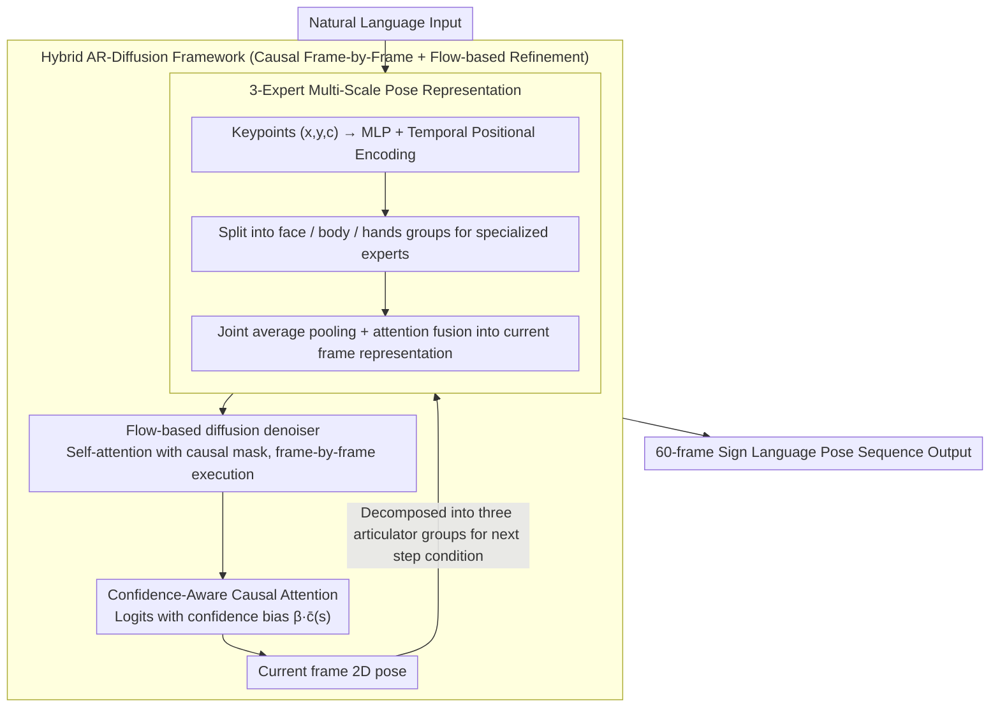

# Hybrid Autoregressive-Diffusion Model for Real-Time Sign Language Production

**Conference**: ACL2026  
**arXiv**: [2507.09105](https://arxiv.org/abs/2507.09105)  
**Code**: Not found in cache  
**Area**: Human Understanding / Sign Language Production / Motion Generation  
**Keywords**: Sign Language Production, autoregressive diffusion, HybridSign, confidence-aware attention, low latency  

## TL;DR
This paper proposes HybridSign, which combines autoregressive frame-by-frame generation with flow-based diffusion refinement. By incorporating a three-expert multi-scale pose representation and confidence-aware causal attention, it achieves a superior trade-off between sign language generation quality and latency on PHOENIX14T and How2Sign.

## Background & Motivation
**Background**: Sign Language Production (SLP) involves generating continuous sign language poses from linguistic input, requiring simultaneous modeling of the body, hands, face, and temporal dynamics. Traditional autoregressive models excel at preserving temporal causality, while diffusion models are proficient in generating high-quality poses.

**Limitations of Prior Work**: Autoregressive methods offer fast inference but depend on previous predictions at each step, making them prone to exposure bias and error accumulation. Diffusion methods improve quality through iterative denoising but suffer from slow sampling, making it difficult for interactive sign language systems to wait for the full sequence to be generated before display.

**Key Challenge**: Practical applications require low latency to output the first frame quickly and continue generation, while simultaneously retaining the local pose quality of diffusion models. Neither pure autoregressive nor pure diffusion methods can satisfy the requirements for quality, temporal consistency, and response speed at the same time.

**Goal**: To build a low-latency SLP model that significantly reduces the time-to-first-frame under a 60-frame protocol while maintaining or improving quality metrics such as BLEU/ROUGE, WER, DTW, and FID.

**Key Insight**: Instead of using the diffusion model as a global offline generator, the authors integrate flow-based diffusion into an autoregressive causal framework, allowing each frame to be generated and refined continuously.

**Core Idea**: The autoregressive path is responsible for causal frame generation, while flow-based diffusion handles quality refinement. Furthermore, three experts for face/body/hands and confidence-aware attention address the issues of fine-grained articulators and noisy 2D poses in sign language.

## Method
The HybridSign mechanism can be summarized as "frame-by-frame causal generation + local diffusion refinement + multi-scale pose experts." It emphasizes low latency: "real-time" in this paper refers to rapidly outputting the first frame and continuing generation, rather than instantaneous completion of the entire video synthesis.

### Overall Architecture

The input is a natural language sentence, and the output is a 2D sign language pose sequence of approximately 60 frames. The model first generates face, body, and hand articulators through the Multi-Scale Pose Representation module, which are then fused into a complete pose frame. The generated frames are decomposed back into the three articulator groups to serve as autoregressive conditions for the next time step.

Within each time step, the three experts can run in parallel; causal dependencies are maintained between time steps. The authors adopt a self-forcing strategy: during both training and inference, the model uses its own previous frame prediction as the next input rather than feeding ground truth during training, thereby alleviating training/inference distribution mismatch.

### Key Designs

**1. Hybrid Autoregressive-Diffusion Framework: Rapid first-frame output with frame-by-frame quality refinement**

While pure diffusion provides high quality but slow first-frame latency, and pure autoregressive is fast but drops in quality, HybridSign integrates both into a single causal path. Specifically, it applies a causal mask to the self-attention of the diffusion denoiser, ensuring that position $i$ can only attend to current or historical tokens $j \le i$. Consequently, the denoising process itself becomes causal and can proceed frame-by-frame. Simultaneously, flow-based diffusion learns the continuous transformation from noise to target poses, replacing multi-step sampling like traditional DDPM and reducing the refinement cost per frame.

In this way, the autoregressive path handles outputting frames sequentially to ensure low first-frame latency and temporal continuity, while diffusion performs quality refinement within each frame—neither waiting for the entire sequence to denoise like pure diffusion nor sacrificing local pose quality like pure autoregressive methods.

**2. 3-Expert Multi-Scale Pose Representation: Scale-based modeling for face/body/hands fused into full-body pose**

Sign language is not a uniform whole-body movement; non-manual signals from the face, body posture, and hand trajectories each have their own scales. Forcing them into a single network can cause mutual interference. The model first processes the $(x,y,c)$ of each keypoint through an MLP and temporal positional encoding, then splits them into face, body, and hands groups for specialized experts. The output of each expert is processed via joint average pooling, followed by an attention-based fusion to synthesize the fused representation of the current frame.

The choice of "three" experts instead of four (separating left and right hands) is because the hands are a strongly coupled sub-system in sign language—relative distance, symmetry/asymmetry, and synchronization are crucial. Separating them into independent experts would place the entire burden of reconstructing these relationships onto the fusion stage; the ablation study confirmed that 4 experts are significantly inferior to 3.

**3. Confidence-Aware Causal Attention: Explicitly sensing keypoint reliability**

Input 2D poses provided by upstream pose estimators inevitably contain occlusions and low-confidence points. If erroneous keypoints are trusted, they propagate and deviate further in subsequent frames. This design adds a confidence bias directly to the causal attention logits, effectively modifying the attention score to be the original score plus $\beta \cdot \bar{c}(s)$, where $\bar{c}(s)$ is the mean confidence of keypoints in the $s$-th frame and $\beta$ is a learnable scalar.

Thus, high-confidence frames naturally receive higher attention weights, while the influence of low-confidence noisy frames is suppressed. The cost is negligible—since confidence scores are already provided by the upstream estimator—yet it significantly inhibits the cross-frame propagation of erroneous keypoints. In the ablation study, this improved the DTW from 5.50 to 3.89 compared to standard causal attention.

### Loss & Training

The training objective consists of three parts. The Joint loss uses L1 to constrain predicted joint positions; the Bone loss constrains bone orientation and kinematic consistency; and the Soft-DTW loss aligns predicted and ground truth sequences to mitigate long-term error accumulation. The total loss $L_{total}$ uses inverse EMA dynamic weighting: an exponential moving average is maintained for each loss, and weights are proportional to the reciprocal of the average plus a small constant.

Experiments were conducted on PHOENIX14T and How2Sign. PHOENIX14T contains 8,257 sentence-level samples and 2,887 German words; How2Sign includes over 80 hours of American Sign Language multimodal data. Evaluation used a pre-trained SLT model to back-translate generated poses to text, calculating BLEU, ROUGE, and WER, with DTW/FID used to measure motion quality and temporal alignment.

## Key Experimental Results

### Main Results

| Method | PHOENIX14T TEST B1 | B4 | ROUGE | WER | DTW | FID |
|------|--------------------|----|-------|-----|-----|-----|
| PT | 13.35 | 4.31 | 13.17 | 96.50 | NR | NR |
| G2P-DDM | 16.11 | 7.50 | NR | 77.26 | NR | NR |
| GCDM | 22.03 | 7.91 | 23.20 | 81.94 | 11.10 | 49.22 |
| GEN-OBT | 23.08 | 8.01 | 23.49 | 81.78 | NR | NR |
| Sign-IDD | 24.80 | 9.08 | 26.58 | 76.66 | 6.20 | 47.19 |
| HybridSign | 25.77 | 10.03 | 27.97 | 75.02 | 4.96 | 45.50 |
| Ground Truth | 29.76 | 11.93 | 28.98 | 71.94 | 0.00 | 0.00 |

| Method | How2Sign TEST B1 | B4 | ROUGE | WER | DTW | FID |
|------|-------------------|----|-------|-----|-----|-----|
| PT | 14.05 | 4.12 | 8.42 | 96.47 | 10.18 | 54.57 |
| G2P-DDM | 19.48 | 5.12 | 12.21 | 89.58 | 7.97 | 49.83 |
| GCDM | 25.91 | 5.57 | 15.21 | 91.43 | 6.13 | 45.71 |
| GEN-OBT | 27.82 | 5.92 | 15.88 | 90.63 | 6.87 | 47.28 |
| Sign-IDD | 28.90 | 6.06 | 16.21 | 89.98 | 4.86 | 39.02 |
| HybridSign | 30.12 | 6.48 | 18.02 | 88.30 | 3.89 | 37.10 |
| Ground Truth | 34.01 | 8.03 | 21.87 | 81.94 | 0.00 | 0.00 |

HybridSign provides the strongest overall quality-efficiency trade-off on both datasets. On the How2Sign test split, HybridSign achieved B1/B4 of 30.12/6.48, a DTW of 3.89, and an FID of 37.10.

### Ablation Study

| Method | Latency (s) | Throughput (FPS) | Description |
|------|-------------|------------------|------|
| GCDM | 52.18 | 1.15 | Diffusion baseline, slow first frame |
| Sign-IDD | 40.31 | 1.49 | Diffusion baseline |
| G2P-DDM | 25.78 | 2.33 | Diffusion baseline |
| HybridSign | 5.90 | 10.17 | Lowest first-frame latency, highest throughput |

| Mode | B1 | B4 | DTW | Latency | Throughput | Conclusion |
|------|----|----|-----|---------|------------|------|
| Diffusion Mode | 30.25 | 6.55 | 8.06 | 32.89 | 1.83 | High quality but slow, poor DTW |
| Autoregressive Mode | 26.15 | 5.40 | 4.49 | 5.53 | 10.85 | Fast but quality drop |
| Hybrid Mode | 30.12 | 6.48 | 3.89 | 5.90 | 10.17 | Balanced quality, alignment, and low latency |

| Module / Expert Setup | B1 | B4 | DTW | Latency | Throughput | Description |
|------|----|----|-----|---------|------------|------|
| RNN backbone | 23.47 | 5.02 | 6.89 | 4.72 | 9.71 | Fast but low quality |
| Causal Attention | 25.08 | 5.83 | 5.50 | 5.48 | 10.95 | Better than RNN |
| Confidence-Aware Causal Attention | 30.12 | 6.48 | 3.89 | 5.90 | 10.17 | Best quality |
| 1 expert whole pose | 22.33 | 5.14 | 7.02 | 7.69 | 7.80 | Lacks local specialization |
| 4 experts face/body/lh/rh | 29.17 | 6.03 | 5.72 | 7.73 | 7.76 | Hand split weakens coupling |
| 3 experts face/body/hands | 30.12 | 6.48 | 3.89 | 5.90 | 10.17 | Best trade-off |

### Key Findings

- **Latency advantage**: HybridSign's low latency is significant: under a 60-frame protocol, the time-to-first-frame is 5.90s, whereas GCDM is 52.18s and Sign-IDD is 40.31s.
- **Soft-DTW impact**: Soft-DTW is critical for temporal alignment. The authors noted it reduces the DTW score by approximately 20%, stabilizing long-sequence autoregressive generation.
- **Expert configuration**: Three experts are superior to four, indicating that finer granularity is not always better. Hands are strongly coupled in sign language; a unified hands expert better models relative distance, symmetry/asymmetry, and synchronization.

## Highlights & Insights
- **Realistic low latency definition**: The paper emphasizes time-to-first-frame rather than just reporting the total offline generation time. For real-world interactive sign language systems, starting the output is more important than completing the whole video at once.
- **Paradigm synergy**: The hybrid paradigm captures the complementarity of AR and diffusion: AR handles causal continuity, while flow-based diffusion provides quality refinement, avoiding the extremes of slow diffusion or AR error accumulation.
- **Strategic Expert Design**: The 3-expert design shows insight beyond "smaller is better." Hands are not independent components; a 4-expert split shifts too much reconciliation work to the fusion stage.
- **Practical Confidence Trick**: Confidence-aware attention is an effective heuristic. By injecting the upstream estimator's confidence into causal attention, robustness is improved at zero additional annotation cost.

## Limitations & Future Work

- **Data dependency**: The authors acknowledge that sign language datasets remain limited in scale and diversity, potentially hindering generalization to low-resource signs, different signer styles, or new grammatical structures.
- **2D pose ambiguity**: Current methods use 2D poses for consistency across PHOENIX14T and How2Sign. This loses depth information, making it difficult to handle hand-face interactions, occlusions, or identical 2D projections of different 3D poses.
- **Fine-grained non-manual signals**: While the model decomposes face/body/hands, the authors note that subtle finger movements, eye gaze, and mouthings are not yet fully modeled.
- **Edge optimization**: While the 5.90s latency is significantly lower than diffusion baselines, further compression and acceleration are required for resource-constrained devices or true real-time video avatar systems.

## Related Work & Insights
- **vs. Autoregressive SLP**: Unlike Saunders et al., which can generate frame-by-frame but is prone to error accumulation, HybridSign uses self-forcing and Soft-DTW to mitigate train/test distribution shift and long-sequence drift.
- **vs. Diffusion SLP**: While diffusion methods like GCDM and Sign-IDD offer superior quality but are slow, HybridSign retains diffusion refinement while using a causal structure to lower first-frame latency.
- **vs. Multi-stage Text2Sign pipeline**: Early pipelines like text-to-gloss-to-pose-to-video are susceptible to error propagation between stages. This work optimizes quality and latency directly around the pose sequence generation.
- **Inspiration for Motion Generation**: The multi-scale expert $+$ confidence-aware attention approach is also suitable for whole-body human motion, gesture generation, and dance synthesis, particularly where upstream pose estimators provide confidence scores.

## Rating
- Novelty: ⭐⭐⭐⭐ The hybrid AR-diffusion for low-latency SLP is well-targeted; the 3-expert and confidence attention designs are solid.
- Experimental Thoroughness: ⭐⭐⭐⭐⭐ Covers two datasets, quality metrics, latency/throughput, and three categories of ablation, providing comprehensive evidence.
- Writing Quality: ⭐⭐⭐⭐ Methodological flow is clear, and the definition of low latency is well-explained. 
- Value: ⭐⭐⭐⭐⭐ High practical value for interactive sign language and human motion generation, particularly in emphasizing time-to-first-frame as a deployment metric.

<!-- RELATED:START -->

## Related Papers

- [\[CVPR 2026\] Focal–General Diffusion Model with Semantic Consistent Guidance for Sign Language Production](../../CVPR2026/human_understanding/focal-general_diffusion_model_with_semantic_consistent_guidance_for_sign_languag.md)
- [\[CVPR 2026\] SignPR: A Progressive Vector-Quantized Diffusion Framework for Sign Language Production](../../CVPR2026/human_understanding/signpr_a_progressive_vector-quantized_diffusion_framework_for_sign_language_prod.md)
- [\[ICML 2026\] DiscoForcing: A Unified Framework for Real-Time Audio-Driven Character Control with Diffusion Forcing](../../ICML2026/human_understanding/discoforcing_a_unified_framework_for_real-time_audio-driven_character_control_wi.md)
- [\[CVPR 2026\] Avatar Forcing: Real-Time Interactive Head Avatar Generation for Natural Conversation](../../CVPR2026/human_understanding/avatar_forcing_real-time_interactive_head_avatar_generation_for_natural_conversa.md)
- [\[CVPR 2026\] BoostSLT: Boosting Sign Language Translation via a Plug-and-Play Diffusion-Based Semantic Enhancer](../../CVPR2026/human_understanding/boostslt_boosting_sign_language_translation_via_a_plug-and-play_diffusion-based_.md)

<!-- RELATED:END -->
