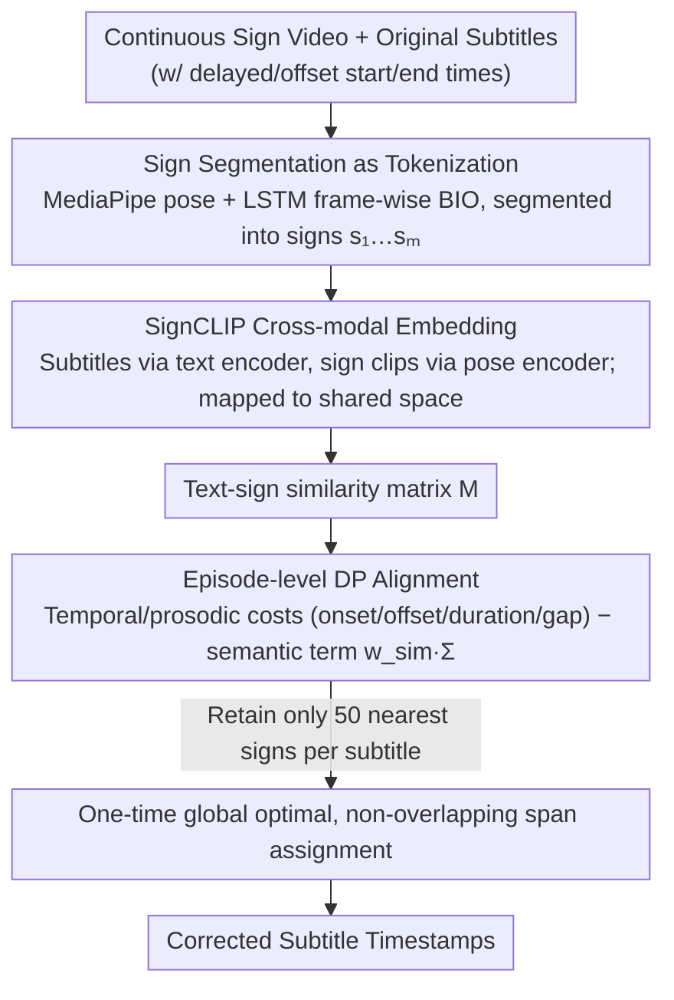

# Segment, Embed, and Align: A Universal Recipe for Aligning Subtitles to Signing

**Conference**: ACL2026  
**arXiv**: [2512.08094](https://arxiv.org/abs/2512.08094)  
**Code**: https://github.com/J22Melody/SEA  
**Area**: Human Understanding / Sign Language Processing / Video-Text Alignment  
**Keywords**: Sign language subtitle alignment, SignCLIP, Dynamic Programming, Cross-lingual Transfer, subtitle alignment

## TL;DR
SEA decomposes the alignment of continuous sign language video subtitles into three steps: sign segmentation, text-sign embedding, and episode-level dynamic programming. It achieves SOTA F1@0.50 across four datasets—BOBSL, How2Sign, WMT-SLT SRF, and SwissSLi—while efficiently processing long-form videos on CPU.

## Background & Motivation
**Background**: Both sign language translation and corpus construction rely on high-quality text-sign parallel data. Many broadcast or online sign language videos contain spoken-language subtitles; however, these are typically aligned to the original audio. Due to non-fixed delays in sign language interpretation, subtitle timestamps often mismatch the actual signing.

**Limitations of Prior Work**: Manual alignment is prohibitively expensive. In the BOBSL context, a skilled sign language expert requires approximately 10 to 15 hours to align 1 hour of continuous video; WMT-SLT 22 reported manual costs of around $40 per hour. Existing methods like SAT/SAT+ rely on manually aligned data and end-to-end training, lacking flexibility when generalizing to other languages, data sources, or low-resource scenarios.

**Key Challenge**: High-quality alignment requires understanding both the temporal boundaries and semantic content of signing. However, retraining an end-to-end aligner for every sign language or dataset is costly, lacks sufficient supervision, and possesses weak generalization. A more universal approach should reuse existing segmentation/embedding models and treat alignment as a lightweight global optimization problem.

**Goal**: This work aims to build a cross-lingual, cross-source subtitle-to-sign alignment framework that requires almost no direct in-domain alignment supervision to automatically correct subtitle timestamps and generate superior parallel sign-text data.

**Key Insight**: SEA treats the problem as an NLP-style pipeline: first, continuous signing is partitioned into sign units similar to tokenization; then, sign clips and subtitle text are projected into the same latent space; finally, dynamic programming is used to perform global alignment across the entire video episode.

**Core Idea**: Use replaceable pre-trained segmentation and SignCLIP embedding modules to provide boundary and semantic signals, then employ a CPU-friendly DP objective function to unify temporal, prosodic, and semantic similarity.

## Method
SEA is a modular pipeline rather than an end-to-end trained subtitle aligner. It first identifies which video frames constitute signing and their segment boundaries, encodes each sign segment and subtitle unit into vectors to construct a similarity matrix, and finally assigns each subtitle to a continuous span of sign segments by rewriting the timestamps.

### Overall Architecture
The input consists of a continuous sign language episode and a sequence of original subtitles, each with start/end times. The output is a set of corrected subtitle timestamps. The first step, segmentation, uses a pre-trained sign segmentation model to produce signs $s_1,\ldots,s_m$; the second step, embedding, uses SignCLIP to map sign clips and subtitles into a shared space; the third step, alignment, selects a continuous sign span $s_l,\ldots,s_r$ for each subtitle $t_i$, updating the subtitle time to the boundaries of the span.

### Key Designs

**1. Sign Segmentation as Tokenization: Segmenting continuous signing into alignable units**

The first step of alignment is determining where cuts can be made. SEA leverages an automatic sign segmentation model by Moryossef et al., which uses MediaPipe Holistic poses with a lightweight LSTM to output frame-wise BIO predictions. While trained on only ~73 hours of DGS data, the model generalizes directly to BSL, ASL, and DSGS without retraining, a key factor in SEA's "universal recipe."

Notably, linguistically perfect sign boundaries are not required. Experiments indicate that slightly over-segmented sub-sign units are sufficient—they provide viable cut points and pause information for the DP, which does not necessitate that a boundary corresponds exactly to a complete linguistic gesture.

**2. SignCLIP Cross-modal Embedding: Bringing subtitles and sign segments into a shared semantic space**

Temporal and pause data alone indicate potential cut points but cannot determine which signing corresponds to a specific subtitle; semantic signals must be provided by cross-modal embeddings. SEA defaults to SignCLIP-multilingual: subtitles pass through a BERT-like text encoder, while MediaPipe pose sequences for sign clips pass through a pose encoder, both mapping to a shared latent space. To distinguish languages, ISO 639-3 codes are embedded in text prompts, e.g., `<en> <bfi>` for BSL/English, `<en> <ase>` for ASL/English, and `<de> <sgg>` for DSGS/German.

As this is a modular component, the authors also fine-tune language-specific versions: SignCLIP-BSL, SignCLIP-ASL, and SignCLIP-Suisse. Improvements from language-specific versions are significant—for instance, ISLR on BSL jumps from 0.5 to 43.0, and the BOBSL alignment score rises from 66.70 to 72.78, demonstrating that stronger semantic signals lead to more accurate alignment.

**3. Episode-level Dynamic Programming Alignment: Global non-overlapping alignment for entire episodes**

The final step integrates cut points and semantics into a global optimization. For subtitle $t_i$ and candidate sign span $s_l,\ldots,s_r$, the cost comprises temporal/prosodic terms (onset distance, offset distance, duration difference, and inter-sign gap). SEA adds a semantic term $-w_{sim}\Sigma(i;l,r)$, where $\Sigma(i;l,r)=\sum_{j=l}^{r}M_{ij}$ and $M_{ij}$ is the text-sign similarity—higher similarity reduces the cost. To ensure locality and speed, only the 50 closest signs in time are retained for each row before solving the global optimum via DP.

Unlike SAT methods that predict within local 20-second windows and resolve overlap conflicts post-hoc with DTW, episode-level DP satisfies non-overlapping constraints as a global requirement. This avoids conflicts requiring secondary repair and, due to its efficiency on CPU, is better suited for long-form video episodes.

### Loss & Training
The core alignment in SEA does not involve gradient-based training; instead, it optimizes a weighted cost function using dynamic programming. Trainable parameters come from external pre-training or optional fine-tuning: segmentation uses the E4s-1 checkpoint; for BSL, segmentation is fine-tuned on 3.3 hours of BSL Corpus data with negative sampling; the embedding module can undergo language-specific SignCLIP fine-tuning using BOBSL sign spottings (~3.5M examples), ASL isolated sign datasets (~200K examples), or Signsuisse (16,213 lexical items).

## Key Experimental Results

### Main Results
The primary metric is F1@0.50, where a predicted subtitle span is correct if its IoU with the ground truth is at least 0.50. The four datasets cover BSL/English, ASL/English, and DSGS/German.

| Method | BOBSL Test | How2Sign Test | WMT-SLT SRF Test | SwissSLi Test |
|------|------------|---------------|------------------|---------------|
| Original alignment | 14.11 | 33.06 | 46.85 | 60.48 |
| Original+ fixed offset | 44.61 | 36.21 | 74.83 | N/A |
| SAT | 54.57 | N/A | 75.32 | N/A |
| SAT+ | 63.81 | N/A | N/A | N/A |
| Segment and Align | 49.58 | 36.17 | 76.83 | 84.19 |
| SEA + SignCLIP-multilingual | 50.68 | 37.51 | 76.43 | 85.57 |
| SEA + finetuned SignCLIP | 54.50 | 39.57 | 77.69 | 85.22 |
| SEA + SignCLIP-BSL + SAT+ subtitles | 65.81 | N/A | N/A | N/A |

### Ablation Study
Ablations show that segmentation "boundary detection scores" do not equate to alignment quality; however, the cross-modal retrieval capability of the embedding correlates strongly with final alignment scores.

| Configuration | Key Metric | Description |
|------|----------|------|
| moryossef segmentation | BSLCP F1 31.13, BOBSL Align 66.24 | Average segmentation metrics, but most useful for alignment |
| Renz segmentation a | BSLCP F1 47.71, BOBSL Align 57.98 | Better segmentation but worse alignment, likely due to false positives |
| finetuned + negative sampling | BSLCP F1 52.09, BOBSL Align 63.61 | SOTA segmentation but still lower alignment performance than the original |
| SignCLIP-multilingual on BSL | ISLR 0.5, BOBSL Align 66.70 | Weak semantic signal but still functional |
| SignCLIP-BSL | ISLR 43.0, BOBSL Align 72.78 | Language-specific fine-tuning provides a clear Gain |
| CSLR2 pseudo glosses | BOBSL Align 68.80 | Hard gloss matching is inferior to soft embeddings |
| CSLR2 human glosses oracle | BOBSL Align 78.75 | Upper bound shows room for stronger semantic representations |
| SignCLIP-ASL | ISLR 84.3, How2Sign Val Align 38.32 | ASL fine-tuning also improves alignment |

### Key Findings
- SEA achieves SOTA on all test sets: 65.81 on BOBSL (initialized via SAT+), 39.57 on How2Sign, 77.69 on WMT-SLT SRF, and a high of 85.57 on SwissSLi.
- Using only segmentation and temporal/prosodic costs significantly improves explanatory datasets; for instance, WMT-SLT SRF improves from 74.83 (Original+) to 76.83 (Segment and Align).
- Adding embeddings further improves results on most datasets, especially studio signing scenarios like How2Sign, where pauses are fewer and semantic signals are more critical.
- Dataset bias remains significant. A fixed 1-second offset after DP is consistently beneficial across evaluation datasets, as annotators tend to maintain subtitle duration briefly after signing ceases.

## Highlights & Insights
- SEA’s strength lies in its modularity. Segmentation or embedding modules can be swapped for different languages without retraining the alignment DP.
- The paper distinguishes between segmentation quality and downstream alignment utility. A linguistically correct sign boundary is not necessarily optimal for subtitle alignment; the task objective defines the quality of intermediate representations.
- Soft similarity matrices are more robust than hard gloss matching. Translation between sign and spoken language involves paraphrasing, omissions, and explanatory translations, making hard vocabulary matching too brittle.
- Global DP is a simple yet effective choice. It unifies time, duration, gap, and semantics into one objective while avoiding the need to resolve conflicts post-hoc in local window methods.

## Limitations & Future Work
- Embedding and alignment could be iteratively optimized, but joint improvement or closed-loop self-training was not explored.
- The method remains sensitive to dataset-specific bias and subtitle quality. Errors from the original subtitle timing or irrelevant signing/subtitles may be inherited.
- Future work is needed to allow the algorithm to discard irrelevant signing/subtitles and merge segments when boundaries are ambiguous, which would benefit paragraph-level downstream tasks.
- Human-in-the-loop post-editing and evaluation were not investigated; semi-automatic workflows may be more reliable for actual corpus construction.

## Related Work & Insights
- **vs SAT / SAT+**: SAT-based methods rely on manually aligned data and end-to-end training, performing strongly on BOBSL. SEA is more modular, usable across languages and low-resource datasets, and can refine SAT+ outputs.
- **vs General video-text alignment**: Approaches like HowTo100M / MIL-NCE handle general video narration. SEA is specifically designed for sign language pauses, translation delays, and sign-text semantic discrepancies.
- **vs Gloss-based matching**: Gloss matching is interpretable but rigid. SEA’s SignCLIP soft similarity better handles non-word-for-word correspondences between subtitles and signing.
- **Insights**: The "segment, embed, global align" structure could be applied to other weakly aligned multimodal corpora, such as lecture subtitles and chalkboard writing, or medical videos and captions.

## Rating
- Novelty: ⭐⭐⭐⭐☆ Components are relatively simple, but the combination into a cross-lingual recipe is highly practical.
- Experimental Thoroughness: ⭐⭐⭐⭐⭐ Covers 4 datasets, 3 sign languages, main results, qualitative findings, and thorough ablations.
- Writing Quality: ⭐⭐⭐⭐☆ Problem motivation and pipeline are clear with sufficient tabular data, though some table layouts are dense.
- Value: ⭐⭐⭐⭐⭐ High value for large-scale sign language corpus cleaning, subtitle post-editing, and translation data construction.

<!-- RELATED:START -->

## Related Papers

- [\[AAAI 2026\] Facial-R1: Aligning Reasoning and Recognition for Facial Emotion Analysis](../../AAAI2026/human_understanding/facial-r1_aligning_reasoning_and_recognition_for_facial_emotion_analysis.md)
- [\[CVPR 2026\] TriLite: Efficient WSOL with Universal Visual Features and Tri-Region Disentanglement](../../CVPR2026/human_understanding/trilite_efficient_weakly_supervised_object_localization_with_universal_visual_fe.md)
- [\[CVPR 2026\] Natural Human Motion Recovery by Aligning High-Order Temporal Dynamics from Monocular Videos](../../CVPR2026/human_understanding/natural_human_motion_recovery_by_aligning_high-order_temporal_dynamics_from_mono.md)
- [\[CVPR 2026\] UniDex: A Robot Foundation Suite for Universal Dexterous Hand Control from Egocentric Human Videos](../../CVPR2026/human_understanding/unidex_a_robot_foundation_suite_for_universal_dexterous_hand_control_from_egocen.md)
- [\[CVPR 2026\] OpenFS: Multi-Hand-Capable Fingerspelling Recognition with Implicit Signing-Hand Detection and Frame-Wise Letter-Conditioned Synthesis](../../CVPR2026/human_understanding/openfs_multi-hand-capable_fingerspelling_recognition_with_implicit_signing-hand_.md)

<!-- RELATED:END -->
