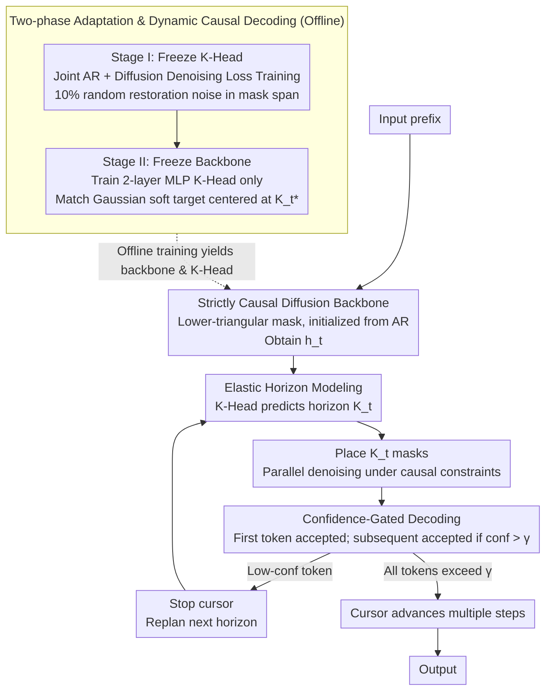

# From AR to Diffusion: Efficiently Adapting Large Language Models with Strictly Causal and Elastic Horizons

**Conference**: ACL2026  
**arXiv**: [2605.27387](https://arxiv.org/abs/2605.27387)  
**Code**: https://huggingface.co/MYTH-Lab/FLUID  
**Area**: LLM Generation / Diffusion Language Models / Inference Acceleration  
**Keywords**: Diffusion Language Models, Autoregressive Adaptation, Causal Attention, Dynamic Step Size, Parallel Generation  

## TL;DR
This paper proposes FLUID, which efficiently adapts pre-trained autoregressive (AR) LLMs into diffusion-based parallel generation models using strictly causal attention and entropy-aware Elastic Horizons. With only 2.7B adaptation tokens, it achieves reasoning and code generation performance close to strong AR models and superior to existing diffusion baselines.

## Background & Motivation
**Background**: Mainstream LLMs are based on autoregressive (AR) next-token prediction. While logically stable and mature in training, they generate only one token per step, leading to inference latency that grows linearly with sequence length. Discrete diffusion language models attempt parallel generation via iterative denoising to break this serial decoding bottleneck.

**Limitations of Prior Work**: Standard diffusion language models typically employ bidirectional attention to utilize global noisy contexts. However, this contradicts the causal priors of pre-trained AR backbones like GPT or LLaMA. Consequently, high-quality diffusion LMs often require massive pre-training from scratch. Existing block diffusion methods use fixed blocks as a compromise, but these cannot adapt to the varying local entropy of natural language.

**Key Challenge**: The advantage of AR models stems from strict causal dependencies, while diffusion models excel at parallel denoising. Applying bidirectional diffusion destroys AR priors, while using fixed blocks leads to over-aggression in high-entropy reasoning segments and over-conservatism in low-entropy template segments.

**Goal**: The authors aim to reuse existing AR checkpoints and adapt them into parallel-generative diffusion models at low cost, while maintaining causal consistency, reasoning capabilities, and code structural integrity.

**Key Insight**: The paper decomposes the issue into two mismatches: a structural mismatch between bidirectional diffusion and AR causal priors, and a dynamic mismatch between fixed generation windows and local information density. FLUID addresses these via Strictly Causal Alignment and Elastic Horizons, respectively.

**Core Idea**: Restrict diffusion denoising within strictly causal attention and allow the model to predict the "horizon" that can be safely denoised in parallel based on hidden states, rather than using a fixed block size.

## Method
FLUID stands for Flexible Unidirectional Inference Diffusion. Instead of training from scratch, it performs parameter-efficient adaptation on existing AR backbones (e.g., openPangu-Embedded-7B). It maintains the AR structure's ability to only see history while introducing a variable-length mask span after the current position for parallel diffusion recovery.

### Overall Architecture
Given a prefix, FLUID uses a causal Transformer to obtain current hidden states, followed by a K-Head that predicts a horizon $K_t$. The model places masks at the next $K_t$ positions and performs parallel denoising under strict causal constraints. Upon prediction, the first token is always accepted, while subsequent tokens are accepted only if their confidence exceeds a threshold $\gamma$. If a low-confidence token is encountered, the cursor stops and replans. This allows FLUID to jump multiple steps in low-entropy segments and regress to fine-grained generation in high-entropy reasoning segments.

### Key Designs

**1. Strictly Causal Diffusion Backbone: Constraining diffusion to causal attention for smooth AR initialization**

Standard diffusion LMs use bidirectional attention to see the global noisy context, which conflicts with the causal priors of GPT/LLaMA. FLUID injects a lower-triangular attention mask into the Transformer, where position $i$ can only access tokens $j \le i$. Future positions are set to $-\infty$. When recovering token $x_i$, the model relies only on the noisy history $\mathbf{x}_{t,<i}$ without peeking at the noisy future. This preserves the AR reasoning chain and allows direct initialization from GPT-style checkpoints without retraining.

**2. Elastic Horizon Modeling: Predicting the safe parallel distance instead of fixed blocks**

Natural language has uneven information density. Models can be bold in boilerplates or simple arithmetic but should shorten steps in complex math reasoning. FLUID adds a lightweight K-Head that maps hidden state $h_t$ to a categorical distribution over $k \in \{1, \ldots, K_{max}\}$. The supervision signal, oracle horizon $K_t^*$, is determined by the future loss sequence and a competence boundary $\tau$. The model is deemed capable of safe parallel recovery within the maximum span where the average loss remains below $\tau$. Consequently, the model automatically adopts different strides for GSM8K versus MMLU.

**3. Two-stage Adaptation & Dynamic Causal Decoding: Decoupling generation capability from horizon planning**

To avoid instability, FLUID splits training into two steps. Stage I freezes the K-Head and trains the backbone with a joint AR and diffusion loss, injecting 10% stochastic restoration noise into the mask span to improve robustness against imperfect intermediate states. Stage II freezes the backbone and trains the K-Head (a 2-layer MLP) to match a Gaussian soft target centered at $K_t^*$. During inference, a confidence gate ensures that while the K-Head provides a plan, tokens are accepted only if they pass threshold $\gamma$, preventing error propagation.

### Mechanism

**Loss & Training**

Stage I targets a hybrid of AR and diffusion: $\mathcal{L}_{Stage1} = \mathcal{L}_{AR} + \mathcal{L}_{Diff}$. $\mathcal{L}_{AR}$ maintains the next-token language prior for the prefix, while $\mathcal{L}_{Diff}$ recovers the mask span under causal constraints. During training, $K$ is sampled from $U[1, K_{max}]$ with 10% noise injection.

Stage II targets horizon distribution matching: $\mathcal{L}_{Stage2} = D_{KL}(\mathcal{Q} \| P_\phi(\cdot|h_t))$, where $\mathcal{Q}$ is a Gaussian soft target centered at $K_t^*$. In experiments, $K_{max}=16$, $\tau=2.8$. Stage I runs for 32,000 iterations and Stage II for 2,000 steps. The backbone uses Rank-16 LoRA with a learning rate of $2\times10^{-4}$ and batch size of 80.

## Key Experimental Results

### Main Results

| Model / Method | Type | Adaptation Tokens | MMLU | IFEval | GSM8K | MATH500 | HumanEval | MBPP |
|----------------|------|-------------------|------|--------|-------|---------|-----------|------|
| FLUID-7B | Diff | 2.7B | 67.8 | 57.7 | 91.9 | 61.8 | 60.4 | 53.6 |
| Qwen-2.5-7B | AR | - | - | - | 91.6 | - | - | - |
| Dream-7B | Diff | - | - | - | 81.0 | - | - | - |
| LLaDA-8B | Diff | - | - | - | 78.6 | - | - | - |

### Ablation Study

| Configuration | Causal | Elastic | GSM8K | MATH500 | HumanEval | Description |
|---------------|--------|---------|-------|---------|-----------|-------------|
| Baseline | ✗ | ✗ | 82.0 | 51.2 | 42.2 | Bidirectional fixed block baseline |
| Baseline + Elastic | ✗ | ✓ | 82.5 | 53.6 | 42.8 | Dynamic horizon with acausal interference |
| Baseline + Causal | ✓ | ✗ | 90.6 | 59.2 | 54.9 | Causal chain maintained; fixed blocks truncate structure |
| FLUID | ✓ | ✓ | 91.9 | 61.8 | 60.4 | Synergy of causal and dynamic horizons |

### Key Findings
- FLUID reaches 91.9 on GSM8K, outperforming Dream-7B by 10.9 points and LLaDA-8B by 13.3 points, nearing Qwen-2.5-7B (91.6).
- Elastic Horizon is crucial for code tasks; fixed $K=16$ causes semantic fracture. FLUID is 5.5 points higher than the causal-only fixed block version on HumanEval.
- A 10% random restoration noise ratio performs best.
- Competence boundary $\tau=2.8$ balances aggression and safety.
- Inference efficiency: FLUID achieves approx. $2\times$ speedup over standard diffusion baselines. Stride on GSM8K reaches 13.1, while MMLU averages 6.5.
- Training cost is roughly 320 GPU-hours, significantly lower than diffusion pre-training.

## Highlights & Insights
- The authors redefine "causal diffusion": parallel recovery of a future span while maintaining historical visibility only.
- Elastic Horizon transforms parallel decoding from an engineering hyperparameter into a model-predicted variable, explaining why different tasks require different strides.
- The confidence gate ensures the horizon is not a "hard commitment," mitigating the risk of noise contamination.
- The low adaptation cost (2.7B tokens) proves AR-to-diffusion is a viable practical path.

## Limitations & Future Work
- Performance is capped by the source AR backbone; diffusion adaptation does not automatically fix inherent backbone hallucinations.
- Validations are currently limited to general, math, and code tasks; specialized fields like medicine or law remain unexplored.
- The applicability to MoE architectures or multi-modal LLMs is yet to be confirmed.
- Future work could integrate Elastic Horizon with KV caching, speculative decoding, or online adaptive thresholds.

## Related Work & Insights
- **vs LLaDA / Dream**: These models show parallel potential but rely on bidirectional attention and heavy pre-training. FLUID emphasizes reusing AR checkpoints.
- **vs Block Diffusion**: Fixed blocks fail to adapt to local entropy; FLUID uses the K-Head for dynamic decision-making.
- **vs Fast-DLLM**: Training-free acceleration is an inference trick; FLUID systematically improves reasoning and code quality via structural constraints.

## Rating
- Novelty: ⭐⭐⭐⭐⭐ The combination of strictly causal diffusion and Elastic Horizon addresses the core contradiction of AR-to-diffusion adaptation.
- Experimental Thoroughness: ⭐⭐⭐⭐☆ Extensive benchmarks and ablations, though larger-scale models need further testing.
- Writing Quality: ⭐⭐⭐⭐☆ Clear articulation of structural mismatches and entropy dilemmas.
- Value: ⭐⭐⭐⭐⭐ Highly insightful for low-latency LLM generation.

<!-- RELATED:START -->
<!-- RELATED:END -->

## Related Papers

- [\[ACL 2026\] Multimodal Large Language Models for Multi-Subject In-Context Image Generation](multimodal_large_language_models_for_multi-subject_in-context_image_generation.md)
- [\[NeurIPS 2025\] Non-Markovian Discrete Diffusion with Causal Language Models](../../NeurIPS2025/image_generation/non-markovian_discrete_diffusion_with_causal_language_models.md)
- [\[ICML 2026\] Esoteric Language Models: A Family of Any-Order Diffusion LLMs](../../ICML2026/image_generation/esoteric_language_models_a_family_of_any-order_diffusion_llms.md)
- [\[NeurIPS 2025\] Scaling Diffusion Transformers Efficiently via μP](../../NeurIPS2025/image_generation/scaling_diffusion_transformers_efficiently_via_μp.md)
- [\[AAAI 2026\] Unleashing the Potential of Large Language Models for Text-to-Image Generation through Autoregressive Representation Alignment](../../AAAI2026/image_generation/unleashing_the_potential_of_large_language_models_for_text-to-image_generation_t.md)

<!-- RELATED:END -->
