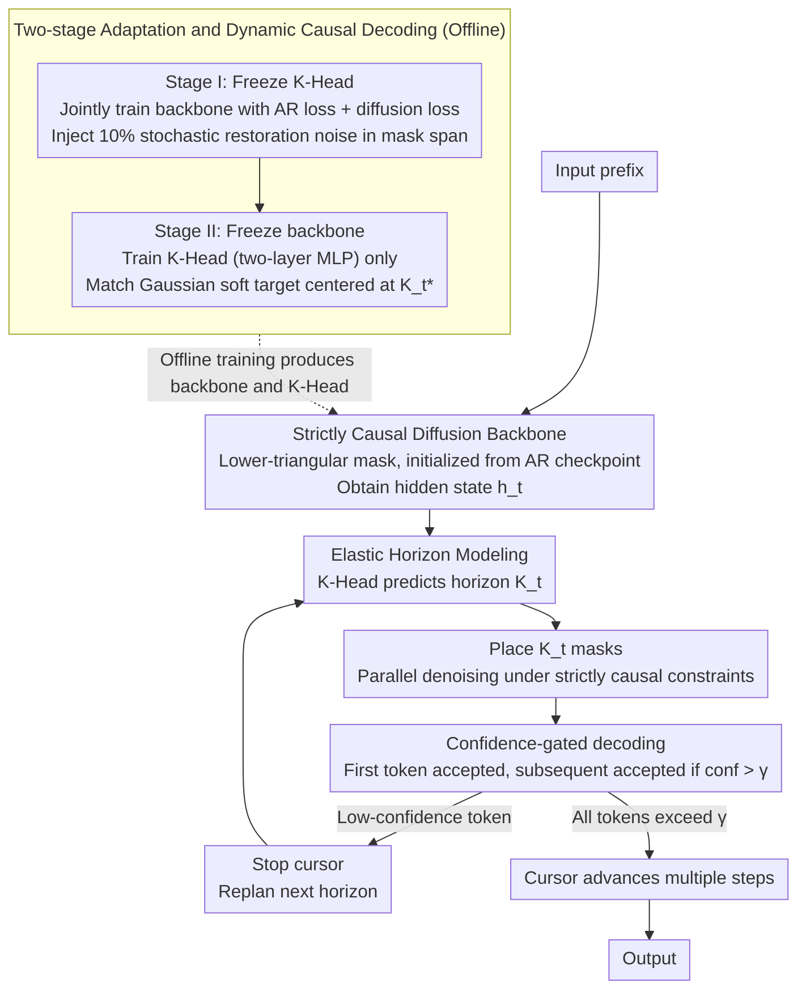

# From AR to Diffusion: Efficiently Adapting Large Language Models with Strictly Causal and Elastic Horizons

**Conference**: ACL2026  
**arXiv**: [2605.27387](https://arxiv.org/abs/2605.27387)  
**Code**: https://huggingface.co/MYTH-Lab/FLUID  
**Area**: LLM Generation / Diffusion Language Models / Inference Acceleration  
**Keywords**: Diffusion Language Models, Autoregressive Adaptation, Causal Attention, Dynamic Stride, Parallel Generation  

## TL;DR
This paper proposes FLUID, which efficiently adapts pre-trained autoregressive (AR) LLMs into diffusion-based parallel generation models using strictly causal attention and entropy-aware Elastic Horizons. With only 2.7B adaptation tokens, it achieves inference and code generation performance close to strong AR models and superior to existing diffusion baselines.

## Background & Motivation
**Background**: Mainstream LLMs are based on autoregressive (AR) next-token prediction, where each step generates only the next token. This approach is logically stable and mature in training, but the inference and deployment latency grows linearly with sequence length. Discrete diffusion language models attempt to break the serial decoding bottleneck by generating multiple tokens in parallel via iterative denoising.

**Limitations of Prior Work**: Standard diffusion language models often employ bidirectional attention to utilize global noisy context, which mismatches the causal prior of pre-trained AR backbones like GPT or LLaMA. Consequently, developing high-quality diffusion LMs often requires large-scale pre-training from scratch, which is highly expensive. Existing block diffusion methods use fixed chunks as a compromise, but fixed blocks cannot adapt to the varying local entropy in natural language.

**Key Challenge**: The strength of AR models lies in strictly causal dependencies, while the strength of diffusion models lies in parallel denoising. Applying bidirectional diffusion directly destroys the AR prior, while using fixed blocks leads to over-aggressiveness in high-entropy reasoning segments and over-conservatism in low-entropy template segments.

**Goal**: The authors aim to reuse existing AR checkpoints and adapt them into parallel-generative diffusion models at low cost, while maintaining causal consistency, reasoning capability, and structural integrity in code.

**Key Insight**: The paper decomposes the problem into two mismatches: a structural mismatch stemming from the conflict between bidirectional diffusion and AR causal priors, and a dynamic mismatch stemming from the conflict between fixed generation windows and local information density. FLUID addresses these through Strictly Causal Alignment and Elastic Horizon modeling.

**Core Idea**: Denoising is restricted to strictly causal attention, and the model predicts the safe parallel denoising horizon based on hidden states instead of using a fixed block size.

## Method
FLUID stands for Flexible Unidirectional Inference Diffusion. Rather than training a diffusion LM from scratch, it performs parameter-efficient adaptation on existing AR backbones like openPangu-Embedded-7B. Overall, it preserves the AR structure where only history is visible, while introducing a variable-length mask span at the current position to allow the model to recover these tokens in parallel via diffusion.

### Overall Architecture
Given a prefix, FLUID first uses a causal Transformer to obtain current hidden states, followed by a K-Head that predicts a horizon $K_t$. The model then places masks at the next $K_t$ positions and performs parallel denoising under strictly causal constraints. After prediction, the immediate next token is always accepted, while subsequent tokens are accepted sequentially only if their confidence exceeds a threshold $\gamma$; once a low-confidence token is encountered, the cursor stops and replans. This allows FLUID to take multiple steps in low-entropy segments and automatically revert to finer-grained generation in high-entropy reasoning segments.

### Key Designs

**1. Strictly Causal Diffusion Backbone: Constraining diffusion to strictly causal attention for smooth initialization from AR checkpoints**

Standard diffusion LMs use bidirectional attention to see the global noisy context, which conflicts with the causal priors of GPT/LLaMA. FLUID injects a lower-triangular attention mask into the Transformer, where position $i$ can only access tokens at $j \le i$. When recovering token $x_i$, the model relies only on the noisy history $\mathbf{x}_{t,<i}$ and cannot peek at future noisy tokens. This preserves the AR deductive chain and allows direct initialization from GPT-style checkpoints without extensive retraining.

**2. Elastic Horizon Modeling: Predicting safe parallel limits instead of using fixed block sizes**

Information density in natural language is non-uniform: models can safely take many steps in boilerplate code or simple arithmetic but should shorten the stride in complex mathematical reasoning. FLUID adds a lightweight K-Head that maps the final hidden state $h_t$ to a categorical distribution over $k \in \{1, \ldots, K_{max}\}$. Its supervision signal, the oracle horizon $K_t^*$, is determined by the future loss sequence and a competence boundary $\tau$—the maximum span where the average loss remains below $\tau$. Consequently, the same model automatically adopts different strides for GSM8K and MMLU.

**3. Two-stage Adaptation and Dynamic Causal Decoding: Calibrating "what to generate" before learning "how far to generate"**

Simultaneously training the backbone and horizon planner can be unstable. FLUID splits this into two steps. Stage I freezes the K-Head and jointly trains the backbone with AR and diffusion denoising losses, injecting 10% stochastic restoration noise in the mask span to improve robustness against imperfect intermediate states. Stage II freezes the backbone and trains only the two-layer MLP K-Head to match a Gaussian soft target centered at $K_t^*$. Inference incorporates a confidence-gated mechanism: the K-Head provides a plan, but tokens are accepted only if they individually exceed the threshold $\gamma$, decoupling planning from execution.

### Key Experimental Results

#### Main Results
| Model / Method | Type | Adaptation tokens | MMLU | IFEval | GSM8K | MATH500 | HumanEval | MBPP |
|----------------|------|-------------------|------|--------|-------|---------|-----------|------|
| FLUID-7B | Diff | 2.7B | 67.8 | 57.7 | 91.9 | 61.8 | 60.4 | 53.6 |
| Qwen-2.5-7B | AR | - | - | - | 91.6 | - | - | - |
| Dream-7B | Diff | - | - | - | 81.0 | - | - | - |
| LLaDA-8B | Diff | - | - | - | 78.6 | - | - | - |

#### Ablation Study
| Configuration | Causal | Elastic | GSM8K | MATH500 | HumanEval | Note |
|---------------|--------|---------|-------|---------|-----------|------|
| Baseline | ✗ | ✗ | 82.0 | 51.2 | 42.2 | Bidirectional fixed-block baseline |
| Baseline + Elastic | ✗ | ✓ | 82.5 | 53.6 | 42.8 | Dynamic horizon with acausal future interference |
| Baseline + Causal | ✓ | ✗ | 90.6 | 59.2 | 54.9 | Causal reasoning chain preserved, but fixed blocks truncate structure |
| FLUID | ✓ | ✓ | 91.9 | 61.8 | 60.4 | Strictly causal and dynamic horizons are complementary |

### Key Findings
- FLUID achieves 91.9 on GSM8K, outperforming Dream-7B by 10.9 points and LLaDA-8B by 13.3 points, approaching Qwen-2.5-7B (91.6).
- Elastic Horizon is critical for coding tasks; using a fixed $K=16$ causes semantic fractures. FLUID improves HumanEval by 5.5 points over causal-only fixed-block versions.
- A stochastic restoration noise ratio of 10% is optimal for robustness compared to 0% or 15%.
- In terms of efficiency, FLUID achieves a $2\times$ speedup relative to standard diffusion baselines. In GSM8K, the average stride reaches 13.1.
- Training cost is approximately 320 GPU-hours, which is significantly lower than training diffusion LMs from scratch.

## Highlights & Insights
- The paper redefines causal diffusion by allowing parallel recovery of a future span while ensuring each position only attends to its history, avoiding the assumption that diffusion must be bidirectional.
- Elastic Horizon transforms parallel decoding from a fixed engineering hyperparameter into a model prediction problem, explaining why different strides are needed for different tasks (e.g., GSM8K vs. MMLU).
- Confidence gating ensures that horizon predictions are not hard commitments, reducing the risk of error propagation from poor planning.
- The use of 2.7B tokens and 320 GPU-hours suggests that AR-to-diffusion adaptation is a practical pathway for low-latency generation.

## Limitations & Future Work
- The performance upper bound is limited by the source AR backbone; diffusion adaptation does not automatically fix hallucinations or reasoning flaws inherent in the base model.
- Experiments are primarily focused on general LLM tasks, math, and code; specialized domains like medicine or law have not been fully validated.
- Whether this adapts equally well to MoE architectures, multimodal LLMs, or extremely long contexts remains to be explored.
- Future work could investigate fine-grained uncertainty estimation and online adaptive thresholds.

## Related Work & Insights
- **vs LLaDA / Dream**: These models show the potential of parallel text generation but rely on bidirectional attention and massive pre-training. FLUID reuses AR checkpoints and employs causal mechanisms.
- **vs Block Diffusion / semi-AR**: Fixed-block methods compromise between quality and speed but cannot adapt to local entropy. FLUID uses the K-Head for dynamic decision-making.
- **vs Fast-DLLM**: While training-free acceleration acts as an inference trick, FLUID modifies the adaptation objective and structural constraints for systematic improvements in reasoning and code quality.

## Rating
- Novelty: ⭐⭐⭐⭐⭐ The combination of strictly causal diffusion and Elastic Horizon addresses the core conflicts in AR-to-diffusion adaptation.
- Experimental Thoroughness: ⭐⭐⭐⭐☆ Covers general, math, and code tasks with extensive ablations, though specialized domains and larger scales are pending.
- Writing Quality: ⭐⭐⭐⭐☆ The structural mismatch and entropy-horizon dilemma are explained clearly.
- Value: ⭐⭐⭐⭐⭐ Highly insightful for low-cost parallel LLM generation and converting AR checkpoints into low-latency generators.

<!-- RELATED:START -->

## Related Papers

- [\[ACL 2026\] Multimodal Large Language Models for Multi-Subject In-Context Image Generation](multimodal_large_language_models_for_multi-subject_in-context_image_generation.md)
- [\[NeurIPS 2025\] Non-Markovian Discrete Diffusion with Causal Language Models](../../NeurIPS2025/image_generation/non-markovian_discrete_diffusion_with_causal_language_models.md)
- [\[ICML 2026\] Esoteric Language Models: A Family of Any-Order Diffusion LLMs](../../ICML2026/image_generation/esoteric_language_models_a_family_of_any-order_diffusion_llms.md)
- [\[NeurIPS 2025\] Scaling Diffusion Transformers Efficiently via μP](../../NeurIPS2025/image_generation/scaling_diffusion_transformers_efficiently_via_μp.md)
- [\[CVPR 2026\] Causal Motion Diffusion Models for Autoregressive Motion Generation](../../CVPR2026/image_generation/causal_motion_diffusion_models_for_autoregressive_motion_generation.md)

<!-- RELATED:END -->
