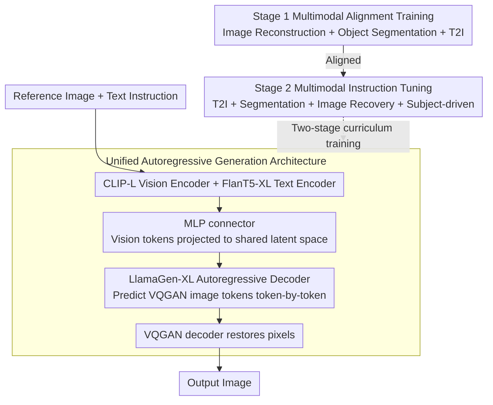

# MENTOR: Efficient Autoregressive Image Generation with Balanced Multimodal Control

**Conference**: ACL2026 Findings  
**arXiv**: [2507.09574](https://arxiv.org/abs/2507.09574)  
**Code**: Project Page https://haozhezhao.github.io/MENTOR.page (GitHub link not provided in cache)  
**Area**: Multimodal Conditional Image Generation / Autoregressive Generation  
**Keywords**: Autoregressive Image Generation, Multimodal Control, Two-Stage Training, DreamBench++, Generation Efficiency

## TL;DR
MENTOR utilizes a unified autoregressive decoder and two-stage multimodal training to align reference images and text instructions into a single generation prefix. With only 3M training data and a training budget of approximately 1.5 days on 8 A100 GPUs, it achieves an effective balance between concept preservation and prompt following.

## Background & Motivation
**Background**: Text-to-image models have achieved high-quality generation, but real-world applications often require fine-grained control via "text + reference image + multi-image context," such as preserving subject identity, changing scenes based on text, or performing image restoration and segmentation.

**Limitations of Prior Work**: Many multimodal generation systems are based on diffusion models with additional alignment modules like adapters, regression heads, or specialized embeddings. While they can utilize image conditions, they often suffer from modality imbalance: the model either over-copies the reference image while ignoring the text, or follows the text at the cost of subject details. Furthermore, training data, model scale, and computational costs remain high.

**Key Challenge**: Complex multimodal control requires the model to simultaneously preserve pixel-level visual details and semantic text instructions. However, there is an inherent gap between visual and linguistic representations. If the model focuses solely on reconstruction, it may copy the input; if it focuses only on text-to-image, it lacks identity constraints from the reference image.

**Goal**: The authors aim to build a resource-friendly autoregressive multimodal generation framework to verify that a smaller model with limited training data can achieve a stable balance between concept preservation and text following without relying on complex diffusion control modules.

**Key Insight**: The paper discretizes images into VQGAN tokens and allows a transformer decoder to generate images token-by-token like a language model. A multimodal encoder projects visual and text inputs into a unified latent prefix, and task mixtures are used during training to explicitly shape alignment and modality balance.

**Core Idea**: Replace heavy diffusion control pipelines with "unified autoregressive token generation + Stage 1 alignment + Stage 2 instruction balancing" to learn controllable multimodal image generation in low-resource settings.

## Method
The MENTOR methodology can be understood as an image token language model conditioned on multimodal inputs. Given a reference image and text instructions, CLIP and FlanT5 encoders extract visual and linguistic features. A lightweight MLP connector projects the visual tokens into the shared space used by the language/generative model. Subsequently, an autoregressive decoder initialized from LlamaGen predicts VQGAN image tokens step-by-step based on these prefix tokens, which are finally restored into an image by a VQGAN decoder.

### Overall Architecture
Input can be an image, text, or a combination. The multimodal encoder produces a condition sequence $H=(h_1, \dots, h_M)$, and the autoregressive decoder learns $p(y_i|y_{<i}, H)$ under teacher forcing, where $y$ is the sequence of discrete image tokens. Training is divided into two stages: the first emphasizes pixel and semantic alignment, while the second uses multi-task instruction tuning to balance the reference image and text instructions.

### Key Designs

**1. Unified Autoregressive Generation Architecture: Compressing Multimodal Conditions and Image Outputs into One Next-Token Objective**

The stochastic sampling and cross-attention control of diffusion models are not direct enough; the correspondence between conditions and outputs is scattered across multiple modules. MENTOR adopts a token-based approach: CLIP-Large-Patch14 and FlanT5-XL extract features, and a lightweight MLP connector projects visual tokens into a shared latent space consumed by the decoder. The decoder, inheriting from LlamaGen-XL, generates image tokens according to the VQGAN vocabulary like writing a sentence. This encapsulates the condition-output mapping within a single next-token objective, facilitating low-cost training and providing an interface for future token-level RL.

**2. Stage 1 Multimodal Alignment Training: Forcing the Model to Understand Image Details Rather than Copying**

Simply performing image reconstruction easily degrades into copy-pasting, where the model might not understand the object semantics. Therefore, the first stage mixes three tasks: image reconstruction for pixel fidelity, object segmentation to force the model to focus on spatial structures and semantic objects, and text-to-image to maintain basic generation capabilities. Segmentation is key here—it requires the model to bind "observed visual details" with "text-specified objects," suppressing the tendency to merely copy the reference image.

**3. Stage 2 Multimodal Instruction Tuning: Finding Balance Between Concept Preservation and Text Following**

While Stage 1 establishes alignment, real-world multimodal control requires the model to simultaneously preserve subject identity and execute text instructions. Stage 2 retains T2I and segmentation while adding image recovery and subject-driven generation. Image recovery requires the model to restore the original image from perturbations like rotation, scaling, stitching, and random backgrounds, acting as a regularization term that demands both image observation and text comprehension. Subject-driven tasks directly address practical needs—preserving identity while changing the scene according to text. Together, these tasks push the model from being a high-level replicator toward true controllable generation.

### Loss & Training
The training objective is the cross-entropy loss of image tokens: maximizing the conditional probability of each output token under teacher forcing. The authors also utilize classifier-free guidance: during training, condition $H$ is replaced with an unconditional embedding with probability $p$; during inference, the guidance strength is adjusted via $\ell_g=\ell_u+(\ell_c-\ell_u)\times\lambda$.

In terms of implementation, Stage 1 freezes the multimodal encoder and trains the projector and generator for 1 epoch with a global batch size of 128 and a learning rate of $5\times10^{-4}$. Stage 2 fine-tunes the entire model (except the vision encoder) for 2 epochs with a learning rate of $1\times10^{-4}$. Training uses 8 80GB A100s, totaling about 1.5 days, with Stage 1 using 2.48M data (14 hours) and Stage 2 using 1.3M data (20 hours).

## Key Experimental Results

### Main Results

| Method | Training Data | Model Size | DreamBench++ CP | DreamBench++ PF | CP·PF | CP/PF |
|------|------|------|------|------|------|------|
| Lumina-mGPT | 10M | 7.00B | 0.91 | 0.25 | 0.23 | 3.63 |
| DreamEngine | 21M | 10.50B | 0.68 | 0.37 | 0.26 | 1.84 |
| IP-A ViT-G | 10M | 2.50B | 0.59 | 0.64 | 0.38 | 0.92 |
| Mentor | 3M | 2.31B | 0.56 | 0.84 | 0.47 | 0.66 |
| DreamBooth-L | - | 2.60B | 0.60 | 0.87 | 0.52 | 0.69 |

### Ablation Study

| Configuration | CP | PF | CP·PF | Description |
|------|------|------|------|------|
| w/o Obj. Seg. in Stage 1 | 0.252 | 0.479 | 0.121 | Reconstruction degrades to copying without spatial semantic constraints |
| w/o Stage 1 Alignment | 0.179 | 0.673 | 0.120 | Concept preservation collapses severely |
| w/o Image Recovery | 0.661 | 0.284 | 0.188 | Over-reliance on vision, poor text following |
| w/o Object Segmentation | 0.412 | 0.918 | 0.378 | High prompt following, but visual fidelity drops |
| w/o Multimodal T2I Task | 0.407 | 0.910 | 0.370 | Insufficient visual preservation |
| Mentor | 0.555 | 0.839 | 0.466 | Best balance |

### Key Findings
- MENTOR’s strength lies in its balanced CP·PF score rather than the highest single CP or PF. Lumina-mGPT has a high CP of 0.91 but a PF of only 0.25, indicating it mainly copies the reference.
- Training efficiency is notable: Mentor uses only 3M data and approx. 1.5 days on 8 A100s. In contrast, Kosmos-G reportedly requires 256 GPUs for 3 days.
- In image reconstruction, Mentor achieves distances of 0.1008/0.0867 on COCO/JourneyDB, outperforming DreamEngine (0.2065/0.2052) and EMU2-Gen (0.3828/0.2869).
- Multi-image training and GRPO provide further gains: CP·PF reaches 0.486 with multi-image and 0.527 with GRPO.

## Highlights & Insights
- The paper clearly decomposes "multimodal control" into two stages: first ensuring the model understands image details, then teaching it not to be dominated by either the image or the text. This training logic is more interpretable than simple data scaling.
- The use of CP·PF and CP/PF metrics is well-aligned with the problem. Many generative models seem strong in concept preservation, but high CP/PF ratios reveal their tendency to ignore text instructions.
- The autoregressive framework is naturally suited for reinforcement learning. The paper uses GRPO to prove that token-level RL can directly improve multimodal generation behavior, a path not easily taken by diffusion-based methods.
- The combination of "segmentation + reconstruction" has high transfer value. For video, 3D, or robotic vision generation, similar structured auxiliary tasks could prevent models from learning shallow copying.

## Limitations & Future Work
- The authors acknowledge that the goal is not to set an absolute record in image quality but to verify the multimodal balance mechanism under low resources. Current quality is constrained by backbones like LlamaGen/VQGAN.
- Regarding text-to-image, the model still struggles with spatial reasoning, object counting, fine-grained human rendering, and stylization.
- Evaluation of safety, fairness, and potential misuse is incomplete, particularly regarding risks in people, identity, and copyrighted content.
- Achieving strong competitiveness on specific tasks may still require more powerful encoders/generators and specialized data; the current framework serves as an effective starting point rather than a replacement for large-scale commercial models.

## Related Work & Insights
- **vs IP-Adapter / BLIP-Diffusion**: These methods usually add image condition modules to diffusion models. Mentor treats visual conditions directly as AR prefixes, unifying training and inference.
- **vs Kosmos-G / Emu2**: Those focus on large-scale multimodal models and diffusion or unified generation. Mentor emphasizes modality balance and controllable generation under low resources.
- **vs Lumina-mGPT / Unified-IO2**: These AR models have strong concept preservation but suffer from vision dominance. Mentor explicitly reduces CP/PF imbalance through its two-stage task combination.
- **Insight**: When performing controllable generation, one should not only focus on "how much it looks like the reference" but treat prompt following as an equally core metric; otherwise, the model may just be a sophisticated replicator.

## Rating
- Novelty: ⭐⭐⭐⭐☆ Autoregressive multimodal generation is not a new paradigm, but the two-stage task design and low-resource balance objective are highly distinctive.
- Experimental Thoroughness: ⭐⭐⭐⭐☆ Main experiments, ablations, reconstruction, multi-image, GRPO, and human evaluations are covered, though absolute quality on complex public tasks could be further explored.
- Writing Quality: ⭐⭐⭐⭐☆ The methodology is clear, tables support the conclusions well, and training details in the appendix are thorough.
- Value: ⭐⭐⭐⭐☆ Highly valuable for resource-constrained teams building multimodal generation systems, providing a practical evaluation paradigm for analyzing modality imbalance.

<!-- RELATED:START -->

## Related Papers

- [\[CVPR 2026\] DPAR: Dynamic Patchification for Efficient Autoregressive Visual Generation](../../CVPR2026/image_generation/dpar_dynamic_patchification_for_efficient_autoregressive_visual_generation.md)
- [\[ICLR 2026\] Locality-aware Parallel Decoding for Efficient Autoregressive Image Generation](../../ICLR2026/image_generation/locality-aware_parallel_decoding_for_efficient_autoregressive_image_generation.md)
- [\[CVPR 2026\] ConsistCompose: Unified Multimodal Layout Control for Image Composition](../../CVPR2026/image_generation/consistcompose_multimodal_layout_control.md)
- [\[CVPR 2026\] Proxy-Tuning: Tailoring Multimodal Autoregressive Models for Subject-Driven Image Generation](../../CVPR2026/image_generation/proxy-tuning_tailoring_multimodal_autoregressive_models_for_subject-driven_image.md)
- [\[ICLR 2026\] Autoregressive Image Generation with Randomized Parallel Decoding](../../ICLR2026/image_generation/autoregressive_image_generation_with_randomized_parallel_decoding.md)

<!-- RELATED:END -->
