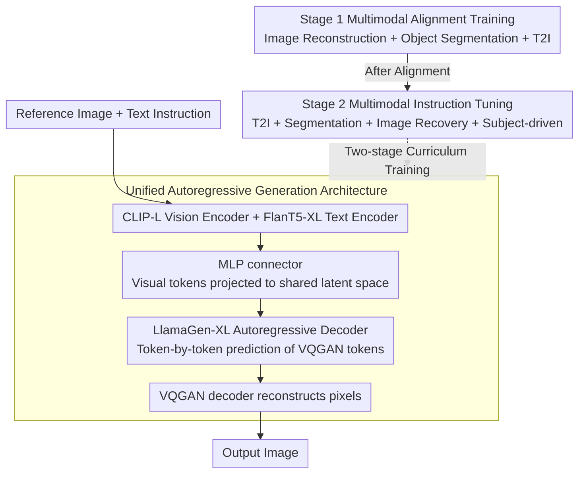

# MENTOR: Efficient Autoregressive Image Generation with Balanced Multimodal Control

**Conference**: ACL2026 Findings  
**arXiv**: [2507.09574](https://arxiv.org/abs/2507.09574)  
**Code**: Project Page https://haozhezhao.github.io/MENTOR.page (GitHub link not provided in cache)  
**Area**: Multimodal Conditional Image Generation / Autoregressive Generation  
**Keywords**: Autoregressive Image Generation, Multimodal Control, Two-stage Training, DreamBench++, Generation Efficiency

## TL;DR
MENTOR utilizes a unified autoregressive decoder and two-stage multimodal training to align reference images and text instructions into the same generation prefix. With only 3M training data and a budget of approximately 1.5 days on 8 A100 GPUs, it achieves a superior balance between concept preservation and prompt following.

## Background & Motivation
**Background**: Text-to-image models can generate high-quality images, but real-world applications often require fine-grained control via "text + reference image + multi-image context," such as preserving subject identity, changing scenes via text, image restoration, or segmentation.

**Limitations of Prior Work**: Many multimodal generation systems are based on diffusion models with additional alignment modules like adapters, regression heads, or specialized embeddings. While they can utilize image conditions, modal imbalance often occurs: the model either over-copies the reference image while ignoring the text, or follows the text but loses subject details. Furthermore, training data, model scale, and computational costs remain high.

**Key Challenge**: Complex multimodal control requires the model to simultaneously maintain pixel-level visual details and semantic-level text instructions, but there is an inherent gap between visual and linguistic representations. Reconstruction-only objectives lead to identity copying, while text-to-image objectives lack identity constraints from reference images.

**Goal**: The authors aim to construct a resource-friendly autoregressive multimodal generation framework to verify that stable balance between concept preservation and text following can be achieved even with smaller models and limited training data, without relying on complex diffusion control modules.

**Key Insight**: The paper discretizes images into VQGAN tokens and allows a transformer decoder to generate images token-by-token like a language model. A multimodal encoder projects visual and text inputs into the same latent prefix, and task mixing is used during training to explicitly shape alignment and modal balance.

**Core Idea**: Replace heavy diffusion control pipelines with "unified autoregressive token generation + Stage 1 alignment + Stage 2 instruction balancing" to learn controllable multimodal image generation in low-resource settings.

## Method
The MENTOR methodology treats multimodal conditional image generation as a language model for image tokens. Given a reference image and text instructions, CLIP and FlanT5 encoders extract visual and linguistic features. A lightweight MLP connector projects visual tokens into a shared space used by the generative model. Subsequently, a LlamaGen-initialized autoregressive decoder predicts VQGAN image tokens step-by-step based on these prefix tokens, which are finally reconstructed into pixels by the VQGAN decoder.

### Overall Architecture
Inputs can be images, text, or their combinations. The multimodal encoder produces a condition sequence $H=(h_1,\dots,h_M)$, and the autoregressive decoder learns $p(y_i|y_{<i},H)$ under teacher forcing, where $y$ is the discrete sequence of image tokens. Training is divided into two stages: the first stage emphasizes pixel and semantic alignment, while the second stage employs multi-task instruction tuning to balance the model between reference images and text instructions.

### Key Designs

**1. Unified Autoregressive Generation Architecture: Compressing Multimodal Conditions and Image Outputs into a Next-token Objective**
Stochastic sampling and cross-attention control in diffusion models are less direct, with correspondences between conditions and outputs scattered across modules. MENTOR adopts a token-based approach: CLIP-Large-Patch14 and FlanT5-XL extract features, and a lightweight MLP connector projects visual tokens into a shared latent space for the decoder. The decoder, inherited from LlamaGen-XL, generates image tokens like writing a sentence, which are then restored by the VQGAN decoder. This ensures that condition-output mapping is contained within a single next-token objective, facilitating low-cost training and providing an interface for future token-level RL.

**2. Stage 1 Multimodal Alignment Training: Forcing the Model to Understand Image Details Rather than Copying**
Pure image reconstruction easily degrades into copy-pasting, where the model fails to understand object semantics. Thus, the first stage mixes three tasks: image reconstruction for pixel fidelity, object segmentation to force attention on spatial structures and semantic objects, and text-to-image (T2I) to maintain basic generation capabilities. Segmentation is crucial here—it requires the model to bind "observed visual details" with "text-specified objects," suppressing the tendency to merely copy the reference image.

**3. Stage 2 Multimodal Instruction Tuning: Finding Balance Between Concept Preservation and Text Following**
While Stage 1 establishes alignment, real multimodal control requires preserving subject identity while executing text instructions. Stage 2 retains T2I and segmentation, adding image recovery and subject-driven generation. Image recovery requires the model to restore the original image from perturbations (rotation, scaling, stitching, random backgrounds), acting as a regularizer that requires both visual and textual processing. The subject-driven task directly addresses real-world needs—preserving identity while changing the scene via text. Together, these tasks push the model from a "high-level copier" to a truly controllable generator.

### Loss & Training
The training objective is the cross-entropy loss of image tokens: maximizing the conditional probability of each output token under teacher forcing. The authors also use classifier-free guidance: during training, the condition $H$ is replaced with an unconditional embedding with probability $p$. During inference, the condition strength is adjusted using $\ell_g=\ell_u+(\ell_c-\ell_u)\times\lambda$.

In implementation, Stage 1 freezes the multimodal encoder and trains the projector and generator for 1 epoch with a global batch size of 128 and a learning rate of $5\times10^{-4}$. Stage 2 fine-tunes the entire model (except the vision encoder) for 2 epochs with a learning rate of $1\times10^{-4}$. Training utilized 8 80GB A100 GPUs, taking approximately 1.5 days total (Stage 1: ~2.48M data, 14 hours; Stage 2: ~1.3M data, 20 hours).

## Key Experimental Results

### Main Results

| Method | Training Data | Model Scale | DreamBench++ CP | DreamBench++ PF | CP·PF | CP/PF |
|------|------|------|------|------|------|------|
| Lumina-mGPT | 10M | 7.00B | 0.91 | 0.25 | 0.23 | 3.63 |
| DreamEngine | 21M | 10.50B | 0.68 | 0.37 | 0.26 | 1.84 |
| IP-A ViT-G | 10M | 2.50B | 0.59 | 0.64 | 0.38 | 0.92 |
| **Ours** (Mentor) | 3M | 2.31B | 0.56 | 0.84 | 0.47 | 0.66 |
| DreamBooth-L | - | 2.60B | 0.60 | 0.87 | 0.52 | 0.69 |

### Ablation Study

| Configuration | CP | PF | CP·PF | Description |
|------|------|------|------|------|
| w/o Obj. Seg. in Stage 1 | 0.252 | 0.479 | 0.121 | Reconstruction degrades to copying; lacks semantic spatial constraints |
| w/o Stage 1 Alignment | 0.179 | 0.673 | 0.120 | Concept preservation collapses severely |
| w/o Image Recovery | 0.661 | 0.284 | 0.188 | Over-reliance on vision; prompt following worsens |
| w/o Object Segmentation | 0.412 | 0.918 | 0.378 | High prompt following, but visual fidelity drops |
| w/o Multimodal T2I Task | 0.407 | 0.910 | 0.370 | Insufficient visual preservation |
| **Ours** (Mentor) | 0.555 | 0.839 | 0.466 | Best balance |

### Key Findings
- MENTOR's strength lies not in achieving the highest single CP or PF score, but in achieving a more balanced CP·PF metric. Lumina-mGPT's CP is high at 0.91, but its PF is only 0.25, suggesting it primarily copies the reference image.
- Training efficiency is prominent: Mentor uses only 3M data and 8 A100s for 1.5 days; comparisons note that Kosmos-G required 256 GPUs for 3 days.
- In image reconstruction, Mentor achieves distances of 0.1008 / 0.0867 on COCO / JourneyDB, outperforming DreamEngine (0.2065 / 0.2052) and EMU2-Gen (0.3828 / 0.2869).
- Multi-image training and GRPO can further improve performance: CP·PF increases to 0.486 with multi-image data and to 0.527 with GRPO.

## Highlights & Insights
- The paper decomposes "multimodal control" into two clear stages: making the model truly understand image details, then teaching it not to be hijacked by either the image or the text. This training logic is more interpretable than simply stacking data.
- The use of CP·PF and CP/PF metrics is highly appropriate for the problem. Many models appear strong when looking only at concept preservation, but a high CP/PF ratio exposes their tendency to ignore text instructions.
- The autoregressive framework is naturally suited for reinforcement learning. The paper proves via GRPO that token-level RL can directly improve multimodal generation behavior, a path not easily replicated by diffusion-based control methods.
- The combination of "segmentation + reconstruction" has high transfer value. Similar structured auxiliary tasks could prevent shallow copying in video generation, 3D generation, or robotic vision tasks.

## Limitations & Future Work
- The authors explicitly state that the goal is not to set an absolute image quality SOTA but to validate multimodal balance mechanisms under low-resource settings. Current quality is limited by backbones like LlamaGen and VQGAN.
- Regarding text-to-image generation, the model still faces challenges in spatial reasoning, object counting, fine-grained human rendering, and stylization.
- Evaluation of safety, fairness, and potential misuse is incomplete, particularly regarding risks in generating people, identities, and copyrighted content.
- achieving strong competitiveness on specific tasks may still require stronger encoders/generators and specialized data; the "universal framework" serves as an effective starting point rather than a replacement for large-scale commercial models.

## Related Work & Insights
- **vs IP-Adapter / BLIP-Diffusion**: These methods usually add image condition modules to diffusion models. Mentor transforms visual conditions into AR prefixes, making training and inference more unified.
- **vs Kosmos-G / Emu2**: These emphasize large-scale multimodal models and unified generative capabilities. Mentor focuses on modal balance and controllable generation under low resources.
- **vs Lumina-mGPT / Unified-IO2**: These AR models have strong concept preservation but gravitate toward visual dominance. Mentor explicitly reduces CP/PF imbalance through two-stage task combinations.
- **Insight**: When pursuing controllable generation, "reference image similarity" should not be the sole focus; prompt following must be treated as a co-equal core metric, otherwise models risk becoming advanced copiers.

## Rating
- Novelty: ⭐⭐⭐⭐☆ Autoregressive multimodal generation is not a brand-new paradigm, but the two-stage task design and low-resource balancing goals are highly distinctive.
- Experimental Thoroughness: ⭐⭐⭐⭐☆ Covers main experiments, ablation, reconstruction, multi-image, GRPO, and human evaluation, though absolute image quality on complex public tasks can be further explored.
- Writing Quality: ⭐⭐⭐⭐☆ Methodological threads are clear, tables support the conclusions, and appendix training details are sufficient.
- Value: ⭐⭐⭐⭐☆ Highly valuable for resource-constrained teams building multimodal systems; provides a practical evaluation paradigm for analyzing modal imbalance.

<!-- RELATED:START -->

## Related Papers

- [\[CVPR 2026\] DPAR: Dynamic Patchification for Efficient Autoregressive Visual Generation](../../CVPR2026/image_generation/dpar_dynamic_patchification_for_efficient_autoregressive_visual_generation.md)
- [\[ICLR 2026\] Locality-aware Parallel Decoding for Efficient Autoregressive Image Generation](../../ICLR2026/image_generation/locality-aware_parallel_decoding_for_efficient_autoregressive_image_generation.md)
- [\[CVPR 2026\] ConsistCompose: Unified Multimodal Layout Control for Image Composition](../../CVPR2026/image_generation/consistcompose_multimodal_layout_control.md)
- [\[CVPR 2026\] Proxy-Tuning: Tailoring Multimodal Autoregressive Models for Subject-Driven Image Generation](../../CVPR2026/image_generation/proxy-tuning_tailoring_multimodal_autoregressive_models_for_subject-driven_image.md)
- [\[ICLR 2026\] Autoregressive Image Generation with Randomized Parallel Decoding](../../ICLR2026/image_generation/autoregressive_image_generation_with_randomized_parallel_decoding.md)

<!-- RELATED:END -->
