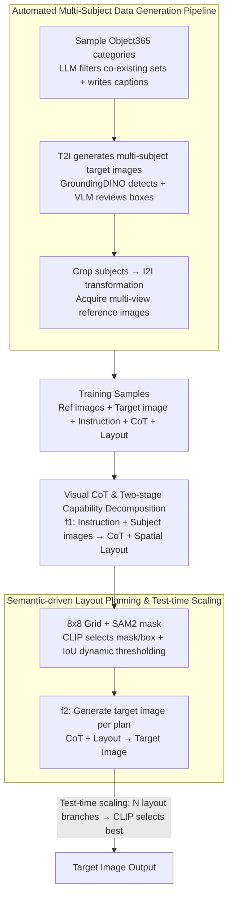

# Multimodal Large Language Models for Multi-Subject In-Context Image Generation

**Conference**: ACL2026  
**arXiv**: [2604.07422](https://arxiv.org/abs/2604.07422)  
**Code**: Not disclosed  
**Area**: Multimodal VLM / Personalized Image Generation  
**Keywords**: Multi-subject generation, Visual Chain-of-Thought, Spatial layout planning, Subject consistency, Test-time scaling

## TL;DR
This paper proposes MUSIC, which introduces the visual reasoning capabilities of Multimodal Large Language Models (MLLMs) into multi-subject in-context image generation. Through automated training data synthesis, visual CoT, and semantic-driven spatial layout planning, it significantly mitigates issues of subject omission, identity confusion, and semantic drift when generating multiple reference subjects simultaneously.

## Background & Motivation
**Background**: Text-to-image models can generate stable scenes based on natural language, and personalized image generation further allows users to provide one or more reference subjects for the model to place into new contexts. Early methods often relied on per-subject optimization, while subsequent approaches like IP-Adapter, BLIP-Diffusion, ELITE, MS-Diffusion, and UNO moved towards zero-shot or multi-subject generation, aiming to maintain reference subject identities while satisfying text instructions.

**Limitations of Prior Work**: The problem becomes exponentially harder as the number of reference subjects increases. The model must not only remember the visual identity of each subject but also understand their semantic relationships, spatial positions, and scene roles. Simply feeding multiple reference images as conditions into a diffusion model often leads to missing subjects, feature bleeding between subjects, ignored text instructions, or local appearance preservation at the cost of overall semantic correctness.

**Key Challenge**: The difficulty of multi-subject generation is not just "more conditions" but the existence of compositional reasoning between them. Diffusion-based subject-to-image methods are typically better at injecting visual features into the generation process but struggle with explicit planning of "where each subject should be, who they interact with, and which features belong to whom." While MLLMs excel at contextual reasoning across images and text, leveraging them for image generation requires structured training signals and executable intermediate plans.

**Goal**: The authors aim to solve three sub-problems: First, how to construct large-scale multi-subject training data without manual labeling; second, how to enable the model to understand relationships between multiple subjects before generation rather than directly blending conditions; and third, how to map semantic relationships into 2D spatial layouts in complex scenes to reduce identity entanglement and subject loss.

**Key Insight**: A key observation is that multi-subject in-context generation resembles a process of "reading images, then imagining the scene, then drawing." Since MLLMs possess visual understanding and linguistic reasoning, multi-subject generation can be decomposed into explicit visual reasoning and spatial planning, using these intermediate results as conditions for image generation.

**Core Idea**: Use an MLLM to first generate a visual CoT and a semantic spatial layout plan, then generate the target image according to the plan, replacing black-box multi-subject condition fusion with explainable intermediate reasoning.

## Method
The overall strategy of MUSIC can be summarized in two layers: first, automatically generating training data, and then training a multimodal generative model capable of "observing reference subjects, writing a plan, and generating the image." Instead of merely adding an adapter to existing subject-driven models, it explicitly models multi-subject generation as a visual reasoning task.

### Overall Architecture
The input consists of a user instruction and several reference subject images; the output is a target image containing these subjects that satisfies the text requirements. To train this process, the authors first use foundation models to synthesize data: an LLM selects semantically related object categories from Object365 and writes scene captions; a T2I model generates target images containing multiple subjects; an open-vocabulary detector identifies subject boxes; a VLM verifies detection results; an I2I model transforms cropped subjects into new reference images; and SAM2 and CLIP help generate spatial layout descriptions.

During training, each sample includes a set of reference images, a target image, instructions, visual CoT, and a semantic spatial layout plan. MUSIC is based on SEED-X and fine-tuned with LoRA. The model first learns to predict CoT and layout from "instructions + subject images," then learns to generate the target image from "CoT + layout." During inference, the model follows this workflow: generating one or more candidate plans, then producing the image; if test-time scaling is enabled, multiple layout branches are generated, and CLIP selects the result that best matches the text.

### Key Designs

**1. Automated Multi-Subject Data Generation Pipeline: Synthesizing training samples with reference subjects, target images, instructions, reasoning, and layouts without manual labeling.**

The biggest hurdle for multi-subject personalization is the lack of large-scale datasets. Manually labeling identities, relationships, and layouts for multiple subjects is extremely costly. The authors grow data using a chain of foundation models: they sample categories from Object365, use an LLM to filter semantically compatible combinations and write captions; a T2I model like FLUX generates the target image; GroundingDINO detects subject boxes; a VLM verifies them; and subjects are cropped and fed into an I2I model (like UNO-FLUX) for viewpoint or appearance transformation.

A crucial detail: reference images are not cropped directly from the target image. If they were, the model might simply learn to "copy-paste" reference blocks. After I2I transformation, the subject in the reference image and the target image differ in perspective and pose, forcing the model to learn identity preservation—the core of in-context generation.

**2. Visual CoT and Two-stage Capability Decomposition: Thinking through "who is who and where they go" before drawing.**

Failure in multi-subject generation often stems from identity confusion or subject omission. MUSIC splits generation into two steps: first, learning the mapping $f_1(T_{instr}, \{I_{subj_i}\}) \rightarrow (\hat{C}_{CoT}, \hat{L}_{spatial})$, where the model predicts a visual CoT (explaining subject roles, relationships, and spatial arrangements) and a spatial layout; second, learning $f_2(C_{CoT}, L_{spatial}) \rightarrow \hat{I}_{tgt}$, generating the image from the plan. During training, CoT is generated by a VLM based on grounded target images. The total loss combines reasoning cross-entropy and image representation loss: $L = w_1 L_1 + w_2 L_2$.

This decomposition externalizes implicit compositional relationships into readable text, allowing the MLLM's linguistic reasoning to participate rather than treating image features as low-level conditions for the diffusion model.

**3. Semantic-driven Spatial Layout Planning and Test-time Scaling: Mapping relationships to specific grids and searching through multiple candidate plans.**

Pure text CoT is abstract. MUSIC divides the target image into an $8 \times 8$ grid and uses SAM2 to generate masks from detection boxes. CLIP compares whether the mask or bounding box better matches the category text: if $Sim_{mask} > Sim_{unmask}$, the mask is used. Subject regions are then assigned to grid patches using a dynamic threshold $\tau = \lambda \cdot \frac{1}{K}\sum_{i=1}^{K} IoU(b_i, p_i)$, resulting in a spatial prompt for the generation module.

During inference, this simplifies into test-time scaling: MUSIC generates $N$ candidate CoT/layout branches, produces an image for each, and selects the one with the highest CLIP text similarity. This mirrors "majority voting" in LLM reasoning, where multiple spatial plans are searched for the optimal result.

### Loss & Training
The implementation uses Qwen-3 as the LLM, Qwen-2.5-VL as the VLM, FLUX-1.0-DEV for T2I, and UNO-FLUX-1.0-DEV for I2I. GroundingDINO handles detection, SAM2 handles segmentation, and CLIP ViT-L/14 judges mask quality and selects candidates.

The training dataset includes 10,000 automated samples with up to 12 subjects. MUSIC is initialized from SEED-X and fine-tuned with LoRA (rank 64, $\alpha=64$) for 10 epochs at a learning rate of $1\times10^{-4}$ on 8 A100 GPUs. Loss weights are fixed at $w_1=0.5, w_2=0.5$.

A notable training trick is "subject number decrement augmentation": subjects are sorted by bounding box size and progressively removed until two remain, while updating subject IDs in instructions. This provides training diversity from single complex samples, exposing the model to both simple and crowded scenes.

## Key Experimental Results

### Main Results
The paper evaluates MUSIC on two benchmarks: MSIC (a new multi-subject benchmark covering 1 to 12 subjects) and DreamBench (for single-subject personalization). Metrics include DINO, CLIP-I (subject consistency), and CLIP-T (text alignment).

| Dataset | Metric | Ours (Best) | Prev. SOTA | Gain |
|--------|------|--------------|--------------|------|
| MSIC | DINO | MUSIC*: 0.631 | UNO: 0.541 | +0.090 |
| MSIC | CLIP-I | MUSIC*: 0.822 | UNO: 0.721 | +0.101 |
| MSIC | CLIP-T | MUSIC*: 0.330 | OmniGen: 0.300 | +0.030 |
| DreamBench | DINO | MUSIC*: 0.768 | UNO: 0.760 | +0.008 |
| DreamBench | CLIP-I | MUSIC*: 0.840 | UNO: 0.835 | +0.005 |
| DreamBench | CLIP-T | MUSIC*: 0.321 | RealCustom++: 0.318 | +0.003 |

MSIC highlights the value of MUSIC. Even without test-time scaling, MUSIC achieves DINO 0.622, CLIP-I 0.812, and CLIP-T 0.322. With MUSIC*, it reaches 0.631, 0.822, and 0.330. Compared to UNO, the substantial improvements in subject consistency and fidelity demonstrate that explicit reasoning and layout planning mitigate degradation as subject count increases.

### Ablation Study
The paper focuses on the gains from test-time scaling and the overall benefits compared to the strongest baselines.

| Configuration | Key Metrics | Note |
|------|---------|------|
| UNO on MSIC | DINO 0.541 / CLIP-I 0.721 / CLIP-T 0.296 | Strongest baseline, lacks explicit reasoning chain |
| MUSIC on MSIC | DINO 0.622 / CLIP-I 0.812 / CLIP-T 0.322 | Full model with auto-data, Visual CoT, and layout |
| MUSIC* on MSIC | DINO 0.631 / CLIP-I 0.822 / CLIP-T 0.330 | Layout sampling + CLIP selection gain |
| MUSIC on DreamBench | DINO 0.761 / CLIP-I 0.837 / CLIP-T 0.317 | Multi-subject training does not harm single-subject performance |

### Key Findings
- In multi-subject scenarios, MUSIC's advantage is primarily in CLIP-I and DINO, showing it excels at maintaining visual identity for multiple reference subjects.
- Test-time scaling yields stable gains (approx. +0.01 per metric), consistent with its role as a plan search rather than model retraining.
- MUSIC* achieves the highest scores on single-subject DreamBench, proving that complex multi-subject data and reasoning-based training do not bias the model against simple scenes.

## Highlights & Insights
- Framing multi-subject generation as a reasoning problem rather than a condition injection problem is the core insight.
- The automated data pipeline is highly practical, creating a closed loop that bypasses expensive manual labeling while ensuring data contains necessary transformations.
- Semantic-driven $8 \times 8$ layouts are a transferable design, potentially useful for multi-object editing or robotics vision tasks.
- MUSIC*'s test-time scaling applies CoT sampling to image generation, showing that "plan search" can benefit visual synthesis.

## Limitations & Future Work
- Lacks modular ablation. Performance without Visual CoT or without spatial layouts specifically is not quantified.
- Synthesized data may inherit biases from the foundation models used (e.g., T2I or VLM errors).
- The $8 \times 8$ grid is suitable for coarse planning but may struggle with fine-grained interactions or complex occlusions.
- Test-time scaling relies on CLIP, which might miss fine-grained identity errors that a more specialized verifier could catch.

## Related Work & Insights
- **vs DreamBooth / Textual Inversion**: These require per-subject optimization; MUSIC is zero-shot and handles composition better.
- **vs IP-Adapter / BLIP-Diffusion**: MUSIC adds explicit reasoning and layout planning over simple condition injection.
- **vs UNO**: UNO is a strong visual ICL baseline, but MUSIC provides more consistency by externalizing the planning phase.
- **Inspiration**: Multimodal generation can be decomposed into "understand, plan, execute, and verify," a paradigm applicable to video and 3D generation.

## Rating
- Novelty: ⭐⭐⭐⭐⭐ 
- Experimental Thoroughness: ⭐⭐⭐⭐☆ 
- Writing Quality: ⭐⭐⭐⭐☆ 
- Value: ⭐⭐⭐⭐⭐ 

<!-- RELATED:START -->

## Related Papers

- [\[CVPR 2026\] MICON-Bench: Benchmarking and Enhancing Multi-Image Context Image Generation in Unified Multimodal Models](../../CVPR2026/image_generation/micon-bench_benchmarking_and_enhancing_multi-image_context_image_generation_in_u.md)
- [\[ICLR 2026\] MMaDA-Parallel: Multimodal Large Diffusion Language Models for Thinking-Aware Editing and Generation](../../ICLR2026/image_generation/mmada-parallel_multimodal_large_diffusion_language_models_for_thinking-aware_edi.md)
- [\[CVPR 2026\] PSR: Scaling Multi-Subject Personalized Image Generation with Pairwise Subject-Consistency Rewards](../../CVPR2026/image_generation/psr_scaling_multi-subject_personalized_image_generation_with_pairwise_subject-co.md)
- [\[ACL 2026\] From AR to Diffusion: Efficiently Adapting Large Language Models with Strictly Causal and Elastic Horizons](from_ar_to_diffusion_efficiently_adapting_large_language_models_with_strictly_ca.md)
- [\[CVPR 2026\] Proxy-Tuning: Tailoring Multimodal Autoregressive Models for Subject-Driven Image Generation](../../CVPR2026/image_generation/proxy-tuning_tailoring_multimodal_autoregressive_models_for_subject-driven_image.md)

<!-- RELATED:END -->
