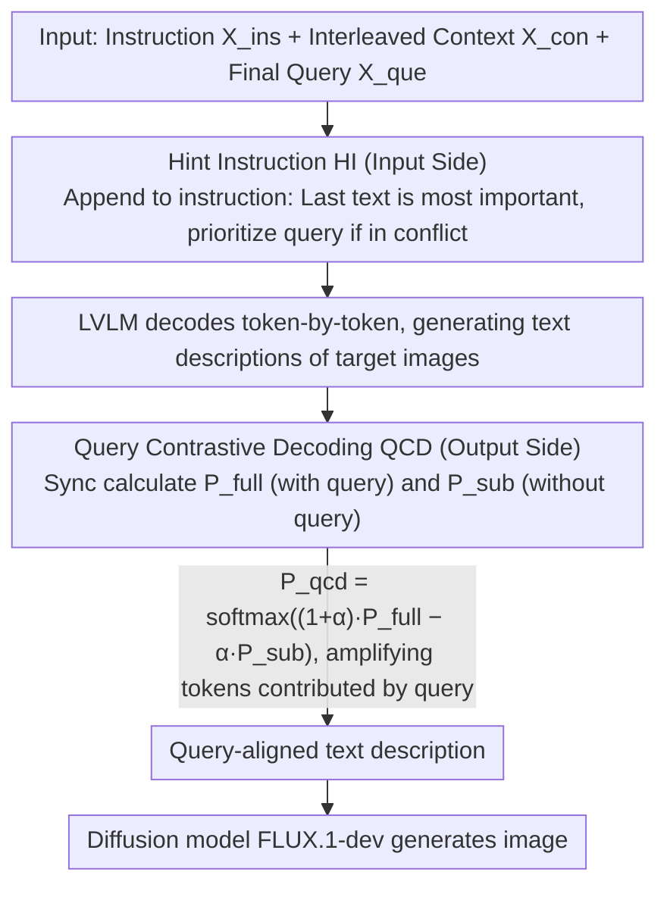

# Think Bright, Diffuse Nice: Enhancing T2I-ICL via Inductive-Bias Hint Instruction and Query Contrastive Decoding

**Conference**: ACL 2026  
**arXiv**: [2601.06169](https://arxiv.org/abs/2601.06169)  
**Code**: https://github.com/Calendula597/TBDN  
**Area**: Image Generation / Multi-modal Reasoning / Text-to-Image In-Context Learning  
**Keywords**: T2I-ICL, Inductive Bias Hinting, Query Contrastive Decoding, Diffusion Models, In-Context Learning  

## TL;DR
This paper proposes the training-free TBDN framework, which uses Hint Instruction to focus Large Vision-Language Models (LVLMs) on the final query and Query Contrastive Decoding to suppress prior-dominated hallucinations. By delivering more accurate text descriptions to a diffusion model, it significantly improves text-to-image in-context learning performance on CoBSAT and T2I Fast Mini-ImageNet.

## Background & Motivation
**Background**: Text-to-Image In-Context Learning (T2I-ICL) attempts to have models infer latent mapping rules from several interleaved text-image examples and generate target images based on a new query. Compared to single-prompt generation, this more closely resembles how humans express complex concepts through examples.

**Limitations of Prior Work**: While unified MLLMs can handle interleaved multi-modal inputs, they often fail to infer the actual rules in T2I-ICL. Another category, the LVLM+diffusion pipeline, offers higher generation quality but lacks systematic design, often requiring extra training or alignment modules.

**Key Challenge**: The difficulty of T2I-ICL is not merely generating aesthetic images, but "reasoning out the relationship between examples and the query before converting that relationship into a visual prompt." Existing methods either mechanically repeat the context when they fail to understand the query, or generate images that are common-sense but violate input rules when relying on pre-trained priors.

**Goal**: The authors aim to enhance the ability of LVLMs to follow context mapping rules and final queries by utilizing two lightweight mechanisms—prompting and decoding—without training additional aligners or fine-tuning MLLMs.

**Key Insight**: The paper decomposes failure modes into two mutually reinforcing bottlenecks: Compliance Failure and Prior-dominated Hallucination. The former causes the model to ignore the query and copy the context; the latter causes the model to be led astray by priors such as "apples are usually red/green" or "hats are usually on heads."

**Core Idea**: Plant an inductive bias of "the final text is most important" at the input side using Hint Instruction, and amplify the distribution difference brought by the query at the output side using Query Contrastive Decoding, thereby breaking the error cycle from both ends.

## Method
The philosophy of TBDN is "Think Bright, Diffuse Nice": first let the LVLM clarify the semantic relationship between the context and the query, then let the diffusion model handle high-fidelity generation. It does not change the base model parameters but adds two closed-loop constraints to the text-output-driven pipeline.

### Overall Architecture
The input consists of task instructions $X_{ins}$, interleaved text-image context $X_{con}$, and a final query $X_{que}$. TBDN first concatenates these into a unified multi-modal sequence and appends Hint Instruction to the end of the instruction. The LVLM generates a text description of the target image based on the enhanced input. During token generation, QCD simultaneously calculates the full input distribution $P_{full}$ and the distribution without the query $P_{sub}$, penalizing tokens driven solely by context or priors through contrast. Finally, the text description is sent to a diffusion model like FLUX.1-dev for image generation.

The paper emphasizes that the two modules are complementary. HI addresses the issue where the model fails to treat the query as a key clue (input-side inductive bias), while QCD addresses the issue where the model perceives the query but is still biased by priors (output-side posterior constraint).

### Key Designs

**1. Bottleneck Diagnosis and Task-driven Metrics: Decomposing "low quality" into localizable errors.**

Rather than vaguely stating that T2I-ICL "generation quality is poor," the authors decompose failures into two categories: Compliance Failure (ignoring the query and copying objects/attributes from the context) and Prior-dominated Hallucination (outputting common-sense content that violates example rules, e.g., drawing a red apple when the example specifies "blue apple"). They define error counts on CoBSAT to track these specific failures.

**2. Hint Instruction (HI): Correcting context parroting at the input side.**

In T2I-ICL, the input is often long, and the final query is at the very end, causing LVLMs to be distracted by earlier examples. HI appends a lightweight prompt to the original instructions: "The last piece of text contains the most important clues for the next image; mainly understand and follow the meaning of the final text." This injects a task prior of "whom to trust" at a minimal cost (~82 tokens).

**3. Query Contrastive Decoding (QCD): Amplifying query contribution at the distribution level.**

To suppress prior-dominated hallucinations that prompts alone cannot fix, QCD operates during decoding. For each step, it calculates:
$$P_{full}=p_{\theta}(y_t\mid X_{ins},X_{con},X_{que},y_{<t})$$
$$P_{sub}=p_{\theta}(y_t\mid X_{ins},X_{con},y_{<t})$$
The final distribution is sampled via:
$$P_{qcd}=\mathrm{softmax}\big((1+\alpha)\cdot P_{full}-\alpha\cdot P_{sub}\big)$$
This amplifies tokens whose probability increases due to the query while suppressing those that appear purely due to context or priors.

### Loss & Training
TBDN is a training-free inference framework. In implementation, the LVLM sampling temperature is set to 0.7, top-p to 0.9, FLUX inference steps to 28, and the default $\alpha=0.5$. Peak VRAM is reported to be below 60GB.

## Key Experimental Results

### Main Results
CoBSAT is the core evaluation for T2I-ICL, covering object and attribute reasoning. Key results for 2-shot and 4-shot average accuracy are shown below:

| Backbone / Method | CoBSAT 2-shot Avg. Acc. ↑ | Gain | CoBSAT 4-shot Avg. Acc. ↑ | Gain |
|-----------------|---------------------------|----------|---------------------------|----------|
| ThinkDiff | 0.417 | - | 0.463 | - |
| Base (Qwen2-VL) | 0.537 | - | 0.614 | - |
| TBDN (Qwen2-VL) | 0.693 | +29.1% | 0.767 | +24.9% |
| Base (Qwen2.5-VL) | 0.312 | - | 0.395 | - |
| TBDN (Qwen2.5-VL) | 0.563 | +80.1% | 0.672 | +70.1% |
| Base (InternVL3) | 0.586 | - | 0.713 | - |
| TBDN (InternVL3) | 0.683 | +16.4% | 0.769 | +7.8% |

On T2I Fast Mini-ImageNet, TBDN significantly improved performance and reduced fluctuation across random seeds. On Dreambench++, TBDN showed strong prompt following, though concept preservation was limited by the fixed visual generator.

### Ablation Study
Ablation results show that HI and QCD serve different roles. For Qwen2-VL and Qwen2.5-VL, HI provides stable gains, while QCD often provides larger gains; the combination performs best.

| Backbone | Shot | Base | + HI | + QCD | TBDN (+HI+QCD) |
|----------|------|------|------|-------|----------------|
| Qwen2-VL | 2 | 0.537 | 0.601 | 0.638 | 0.693 |
| Qwen2-VL | 4 | 0.614 | 0.673 | 0.745 | 0.767 |
| Qwen2.5-VL | 2 | 0.312 | 0.357 | 0.554 | 0.563 |
| Qwen2.5-VL | 4 | 0.394 | 0.484 | 0.634 | 0.672 |

### Key Findings
- The base pipeline already outperforms several unified MLLMs, validating the "LVLM for reasoning, diffusion for generation" paradigm.
- QCD's contribution is generally larger than HI's, especially on weaker backbones like Qwen2.5-VL (2-shot jump from 0.312 to 0.554).
- HI is highly efficient; it achieves better results than CoT-Ins while using significantly fewer instruction tokens.
- $\alpha=0.5$ is generally the optimal balance for contrast modularity.

## Highlights & Insights
- Instead of rushing to train a new model, the paper starts with a mechanism-based error analysis, making T2I-ICL failures diagnosable.
- HI is a simple yet effective inductive bias. It defines "whom to trust" during information conflicts, which is more structurally aligned with T2I-ICL than generic CoT.
- The QCD approach is transferable: whenever a critical condition exists, one can compare distributions with and without that condition to amplify specific tokens.
- The framework is highly training-free and compatible with various LVLM and diffusion model combinations.

## Limitations & Future Work
- TBDN relies on text descriptions generated by LVLMs, which may lead to a "semantic gap" where a correct text description does not guarantee fine-grained visual detail in the final image.
- Concept preservation on Dreambench++ is inferior to fine-tuned methods, suggesting that reasoning alone cannot maintain a reference identity/style perfectly.
- QCD increases computational overhead due to the additional distribution calculation for the sub-query input.

## Related Work & Insights
- **vs CoBSAT prompt engineering**: TBDN converges prompt design into a minimal "query-first" inductive bias, which is more token-efficient.
- **vs ThinkDiff**: TBDN avoids training an aligner by using text prompts and QCD constraints.
- **vs ImageGen-CoT**: TBDN provides a lightweight inference strategy suitable for deployments where task-specific data or parameter updates are unavailable.

## Rating
- Novelty: ⭐⭐⭐⭐☆
- Experimental Thoroughness: ⭐⭐⭐⭐⭐
- Writing Quality: ⭐⭐⭐⭐☆
- Value: ⭐⭐⭐⭐☆

<!-- RELATED:START -->

## Related Papers

- [\[CVPR 2026\] Bias at the End of the Score: Demographic Biases in Reward Models for T2I](../../CVPR2026/image_generation/bias_reward_models_t2i.md)
- [\[ICML 2026\] MIRO: 多奖励条件预训练同时提升 T2I 质量与效率](../../ICML2026/image_generation/miro_multi-reward_conditioned_pretraining_improves_t2i_quality_and_efficiency.md)
- [\[CVPR 2026\] Elucidating the SNR-t Bias of Diffusion Probabilistic Models](../../CVPR2026/image_generation/dcw_snr_t_bias_diffusion.md)
- [\[ICLR 2026\] Diverse Text-to-Image Generation via Contrastive Noise Optimization](../../ICLR2026/image_generation/diverse_text-to-image_generation_via_contrastive_noise_optimization.md)
- [\[AAAI 2026\] How Bias Binds: Measuring Hidden Associations for Bias Control in Text-to-Image Compositions](../../AAAI2026/image_generation/how_bias_binds_measuring_hidden_associations_for_bias_control_in_text-to-image_c.md)

<!-- RELATED:END -->
