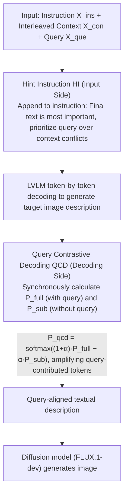

# Think Bright, Diffuse Nice: Enhancing T2I-ICL via Inductive-Bias Hint Instruction and Query Contrastive Decoding

**Conference**: ACL 2026  
**arXiv**: [2601.06169](https://arxiv.org/abs/2601.06169)  
**Code**: https://github.com/Calendula597/TBDN  
**Area**: Image Generation / Multimodal Reasoning / Text-to-Image In-Context Learning  
**Keywords**: T2I-ICL, Prompt Inductive Bias, Query Contrastive Decoding, Diffusion Models, In-Context Learning  

## TL;DR
This paper proposes TBDN, a training-free framework that utilizes Hint Instruction to focus LVLMs on the final query and Query Contrastive Decoding to suppress prior-dominated hallucinations. By delivering more accurate textual descriptions to diffusion models, it significantly improves text-to-image in-context learning performance on CoBSAT and T2I Fast Mini-ImageNet.

## Background & Motivation
**Background**: Text-to-Image In-Context Learning (T2I-ICL) aims to enable models to infer implicit mapping rules from a few interleaved text-image examples and generate target images based on a new query. Compared to single-prompt generation, this more closely resembles how humans express complex concepts through examples.

**Limitations of Prior Work**: While unified MLLMs can process interleaved multimodal inputs, they often fail to infer the actual rules in T2I-ICL. Another category, the LVLM+diffusion pipeline, achieves higher generation quality but lacks systematic design, often requiring additional training or alignment modules.

**Key Challenge**: The difficulty of T2I-ICL is not merely generating aesthetic images, but "first reasoning out the relationship between examples and the query, then translating that relationship into a visualizable prompt." Existing methods often mechanically repeat the context when they fail to understand the query, or generate common-sense images that violate input rules when relying on pre-trained priors.

**Goal**: The authors aim to enhance the ability of LVLMs to follow in-context mapping rules and final queries using two lightweight mechanisms—prompting and decoding—without training additional aligners or fine-tuning the MLLM.

**Key Insight**: The paper decomposes failure modes into two mutually reinforcing bottlenecks: Compliance Failure and Prior-dominated Hallucination. The former causes the model to ignore the query and copy the context; the latter leads the model toward pre-trained priors (e.g., "apples are usually red/green," "hats are usually on heads") even when they violate input rules.

**Core Idea**: Insert inductive bias into the input via Hint Instruction (HI) to emphasize the importance of the final text, and use Query Contrastive Decoding (QCD) at the output to amplify the distributional differences introduced by the query, breaking the error cycle from both ends.

## Method
The philosophy of TBDN is "Think Bright, Diffuse Nice": first let the LVLM clarify the semantic relationship between context and query, then let the diffusion model handle high-fidelity generation. It does not change the base model parameters but adds two closed-loop constraints to the text-driven pipeline.

### Overall Architecture
The input consists of task instructions $X_{ins}$, interleaved text-image context $X_{con}$, and the final query $X_{que}$. TBDN concatenates these into a unified multimodal sequence and appends a Hint Instruction to the end. The LVLM generates a textual description of the target image based on the enhanced input. During token-by-token generation, QCD simultaneously calculates the full input distribution $P_{full}$ and the sub-distribution $P_{sub}$ (with the query removed), suppressing tokens driven purely by context or priors through contrast. Finally, the description is fed into a diffusion model like FLUX.1-dev for image generation.

The paper emphasizes the complementarity of the two modules. HI serves as an input-side inductive bias to solve the issue of "the model not treating the query as a key clue," while QCD acts as a posterior constraint at the decoding stage to address "the model seeing the query but still being biased by priors."

### Key Designs

**1. Bottleneck Diagnosis and Task-oriented Metrics: Decomposing "poor generation" into localized errors**

Instead of broadly stating that T2I-ICL "generation quality is low," the authors decompose failures into two categories to enable targeted module design. Compliance Failure refers to the model copying objects or attributes from the context instead of inferring the target from the query. Prior-dominated Hallucination refers to the model outputting content that fits common sense but violates example rules (e.g., drawing a red apple when examples specify "blue apple"). They define an error count on CoBSAT to track samples where "predicted attributes are correct but the object is from context" or "predicted object is correct but details are from context." HI addresses the first type, while QCD addresses the second.

**2. Hint Instruction (HI): Correcting context parroting via input-side inductive bias**

In T2I-ICL, inputs are often long, and the query is at the end, leading LVLMs to be distracted by previous examples. HI appends a lightweight prompt after the original TD-Ins: "The last piece of text contains the most important clues for the next image; primarily understand and follow the final text's meaning." This follows two principles: the query provides critical guidance, and query semantics take precedence when they conflict with the context. HI achieves significant gains with only ~82 tokens, serving as a task-specific prior rather than a heavy CoT.

**3. Query Contrastive Decoding (QCD): Suppressing priors by amplifying query contribution in the decoding distribution**

Prompting alone often fails to overcome prior hallucinations. QCD intervenes during decoding: for each step, it calculates $P_{full}=p_{\theta}(y_t\mid X_{ins},X_{con},X_{que},y_{<t})$ and $P_{sub}=p_{\theta}(y_t\mid X_{ins},X_{con},y_{<t})$, then samples from:

$$P_{qcd}=\mathrm{softmax}\big((1+\alpha)\cdot P_{full}-\alpha\cdot P_{sub}\big)$$

Tokens primarily supported by the query will have their probability amplified, while tokens appearing in both distributions (driven by context or common-sense priors) are suppressed. This effectively reinforces query-aligned knowledge.

### Loss & Training
TBDN is a training-free inference framework with no training loss. In implementation, the LVLM sampling temperature is 0.7, top-p is 0.9, FLUX inference steps are 28, and the default $\alpha=0.5$ for QCD. Peak VRAM is reported under 60GB, supported by two consumer GPUs or one A100.

## Key Experimental Results

### Main Results
CoBSAT is the core T2I-ICL benchmark, including object and attribute reasoning tasks. Key results for 2-shot and 4-shot average accuracy are shown below, highlighting the gains from Base to TBDN.

| Backbone / Method | CoBSAT 2-shot Avg. Acc. ↑ | Gain | CoBSAT 4-shot Avg. Acc. ↑ | Gain |
|-------------------|---------------------------|------|---------------------------|------|
| ThinkDiff | 0.417 | - | 0.463 | - |
| Base (Qwen2-VL) | 0.537 | - | 0.614 | - |
| TBDN (Qwen2-VL) | 0.693 | +29.1% | 0.767 | +24.9% |
| Base (Qwen2.5-VL) | 0.312 | - | 0.395 | - |
| TBDN (Qwen2.5-VL) | 0.563 | +80.1% | 0.672 | +70.1% |
| Base (InternVL3) | 0.586 | - | 0.713 | - |
| TBDN (InternVL3) | 0.683 | +16.4% | 0.769 | +7.8% |

On T2I Fast Mini-ImageNet, TBDN shows significant improvement and reduces variance across random seeds. Dreambench++ results indicate strong prompt-following, though concept preservation is limited by the fixed visual generator compared to fine-tuned MLLMs.

### Ablation Study
Ablation results show that HI and QCD serve different functions. HI provides stable gains, while QCD often provides larger improvements. The combination yields the best performance.

| Backbone | Shot | Base | + HI | + QCD | TBDN (+HI+QCD) | Key Finding |
|----------|------|------|------|-------|----------------|-------------|
| Qwen2-VL | 2 | 0.537 | 0.601 | 0.638 | 0.693 | Maximum gain when combined |
| Qwen2-VL | 4 | 0.614 | 0.673 | 0.745 | 0.767 | QCD is the primary driver |
| Qwen2.5-VL | 2 | 0.312 | 0.357 | 0.554 | 0.563 | Weaker backbones rely more on QCD |
| InternVL3 | 2 | 0.586 | 0.545 | 0.654 | 0.683 | HI/QCD complementarity demonstrated |

### Key Findings
- The "LVLM for reasoning, Diffusion for generation" pipeline is highly competitive, outperforming many unified MLLMs.
- QCD contribution is generally larger than HI, especially in setups with weak base performance.
- HI is highly efficient; it achieves better results than CoT-Ins (thousands of tokens) with only ~82 tokens.
- The contrastive strength $\alpha$ is best at moderate values (0.5 - 0.75).

## Highlights & Insights
- The paper prioritizes failure mechanism analysis over model training. Identifying Compliance Failure and Prior-dominated Hallucination makes T2I-ICL failures diagnostic.
- HI is a simple yet effective task-specific inductive bias. It tells the model "who to trust" during information conflicts.
- QCD's logic is transferable to other multimodal tasks: one can amplify condition-triggered tokens by comparing "conditioned" vs. "unconditioned" distributions.
- TBDN provides a training-free template that can be quickly applied to different LVLM+diffusion combinations.

## Limitations & Future Work
- The indirect link (LVLM description → Diffusion) may lead to semantic gaps where descriptions are correct but fine-grained visual details are lost.
- Concept preservation on Dreambench++ is inferior to fine-tuned methods when maintaining specific identities/styles is required.
- Effectiveness on end-to-end MLLM image generators (instead of pipelines) remains unexplored.
- QCD increases inference cost due to the additional "sub-distribution" calculation.

## Related Work & Insights
- **vs CoBSAT prompt engineering**: TBDN converges prompt design to a lightweight "final query priority" bias rather than general instructions.
- **vs ThinkDiff**: TBDN achieves similar goals without the need to train specialized aligners.
- **vs ImageGen-CoT / IGC fine-tuning**: TBDN offers a training-free inference strategy suitable for deployment where task data or parameter tuning is unavailable.

## Rating
- Novelty: ⭐⭐⭐⭐☆ Simple yet effective task-aware bias and contrastive decoding.
- Experimental Thoroughness: ⭐⭐⭐⭐⭐ Comprehensive cross-benchmark and cross-backbone evaluation.
- Writing Quality: ⭐⭐⭐⭐☆ Clear motivation based on diagnostic failure modes.
- Value: ⭐⭐⭐⭐☆ Highly practical for training-free T2I-ICL deployment.

<!-- RELATED:START -->

## Related Papers

- [\[CVPR 2026\] Elucidating the SNR-t Bias of Diffusion Probabilistic Models](../../CVPR2026/image_generation/dcw_snr_t_bias_diffusion.md)
- [\[AAAI 2026\] How Bias Binds: Measuring Hidden Associations for Bias Control in Text-to-Image Compositions](../../AAAI2026/image_generation/how_bias_binds_measuring_hidden_associations_for_bias_control_in_text-to-image_c.md)
- [\[CVPR 2025\] Bias for Action: Video Implicit Neural Representations with Bias Modulation](../../CVPR2025/image_generation/bias_for_action_video_implicit_neural_representations_with_bias_modulation.md)
- [\[ICLR 2026\] Diverse Text-to-Image Generation via Contrastive Noise Optimization](../../ICLR2026/image_generation/diverse_text-to-image_generation_via_contrastive_noise_optimization.md)
- [\[CVPR 2026\] MixFlow Training: Alleviating Exposure Bias with Slowed Interpolation Mixture](../../CVPR2026/image_generation/mixflow_training_alleviating_exposure_bias_with_slowed_interpolation_mixture.md)

<!-- RELATED:END -->
## Related Papers

- [\[ICML 2026\] MIRO: 多奖励条件预训练同时提升 T2I 质量与效率](../../ICML2026/image_generation/miro_multi-reward_conditioned_pretraining_improves_t2i_quality_and_efficiency.md)
- [\[CVPR 2026\] Elucidating the SNR-t Bias of Diffusion Probabilistic Models](../../CVPR2026/image_generation/dcw_snr_t_bias_diffusion.md)
- [\[AAAI 2026\] How Bias Binds: Measuring Hidden Associations for Bias Control in Text-to-Image Compositions](../../AAAI2026/image_generation/how_bias_binds_measuring_hidden_associations_for_bias_control_in_text-to-image_c.md)
- [\[ICLR 2026\] Diverse Text-to-Image Generation via Contrastive Noise Optimization](../../ICLR2026/image_generation/diverse_text-to-image_generation_via_contrastive_noise_optimization.md)
- [\[CVPR 2026\] MixFlow Training: Alleviating Exposure Bias with Slowed Interpolation Mixture](../../CVPR2026/image_generation/mixflow_training_alleviating_exposure_bias_with_slowed_interpolation_mixture.md)

<!-- RELATED:END -->
