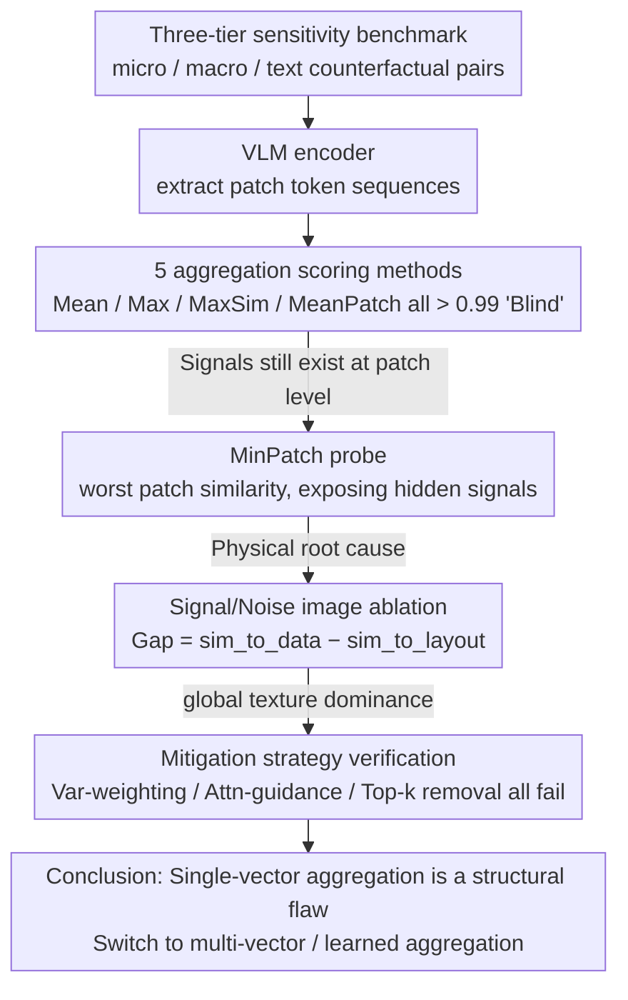

# A Picture is Worth a Thousand Words? An Empirical Study of Aggregation Strategies for Visual Financial Document Retrieval

**Conference**: ACL 2026 Findings  
**arXiv**: [2605.14581](https://arxiv.org/abs/2605.14581)  
**Code**: The paper does not provide a public link in the abstract  
**Area**: Information Retrieval / Visual Document Retrieval / VLM Diagnostics  
**Keywords**: visual RAG, single-vector aggregation, ColPali, MinPatch diagnostics, financial documents

## TL;DR
Through a carefully designed financial document diagnostic benchmark (single-digit perturbation + text masking), this study empirically proves that "aggregating VLM patch tokens into a single vector" causes vast semantic differences (e.g., $1.2M vs $7.2M) to collapse into nearly identical vectors with cosine similarity $> 0.99$. The root cause is "global texture dominance," which various mitigation strategies and retrieval-tuned embeddings fail to resolve.

## Background & Motivation
**Background**: The mainstream approach for financial RAG is "OCR/PDF parse → linear text," but document layouts are flattened and row-column alignment is lost, leading to decreased retrieval accuracy. A new generation of visual RAG models (ColPali, VisRAG, DSE) treats pages as images and uses VLM visual encoder patch tokens for retrieval.

**Limitations of Prior Work**: **Multi-vector** schemes like ColPali require storing hundreds of patch tokens, leading to exploding storage costs. **Single-vector** schemes like DSE aggregate patch tokens into one vector, which is cost-effective but may lose critical numeric or textual information. The problem is: whether information is lost, what is lost, and why—clean diagnostic evidence has long been missing.

**Key Challenge**: Financial documents differ fundamentally from natural images—key semantics are encoded in sparse numbers or entities (a single digit change alters the meaning of the entire text). However, in visual signals, these numbers occupy only a few pixels, while background layouts (table lines, logos, headers) dominate. Aggregation operations tend to bias toward visual saliency, smoothing out sparse numeric signals.

**Goal**: (1) Quantify the severity of information loss in single-vector aggregation for financial documents; (2) Identify the failure mechanism; (3) Verify if simple mitigation strategies are effective.

**Key Insight**: Convert the retrieval problem into a "sensitivity analysis"—construct counterfactual document pairs (original vs. modified single field) to see if the encoder can distinguish them. If indistinguishable, it implies the encoder is "blind." Furthermore, use a MinPatch probe (patch-level worst similarity) to detect "at which layer the signal is smoothed out."

**Core Idea**: First use MinPatch to prove that signals exist at the encoder patch level, then prove that aggregation removes these signals. Use Signal/Noise image ablation to identify "global texture dominance" as the root cause.

## Method

### Overall Architecture
This is a diagnostic empirical study that develops a benchmark and scoring probes rather than a new model. The diagnostic chain approaches the problem layer by layer: first, counterfactual document pairs are constructed, and various VLM encoders extract patch sequences. Five scoring mechanisms test the similarity between original and counterfactual versions. When aggregation is found to be "blind," the MinPatch probe proves signals still exist at the patch level. Finally, Signal/Noise image ablation physically measures the root cause as visual signal differences and verifies whether simple mitigation strategies suffice. Input consists of controlled perturbed document pairs, and the output is evidence pinpointing where and why failure occurs.

### Key Designs

**1. Three-tier sensitivity benchmark: Measuring aggregation discriminative power via controlled perturbations**

Key semantics in financial documents are concentrated in sparse numbers/entities. A single digit change can subvert the meaning of the entire document, a fine-grained difference that natural image benchmarks do not cover. This design constructs three types of counterfactual pairs: micro-semantic (minor changes like 5.21 $\rightarrow$ 5.29), macro-semantic (major changes like 5.21 $\rightarrow$ 9.99), and text sensitivity (Zeiler-Fergus semantic masking, comparing "Revenue increased by \$1.4 billion" with the same position covered by a background-colored [MASK]). Each category includes 100 pairs across two datasets (FinQA, TAT-DQA), totaling 600 diagnostic samples designed to isolate aggregation's discriminative ability by limiting perturbations to the semantic level rather than visual saliency.

**2. MinPatch Probe: Separating encoder responsibility from aggregation responsibility**

When aggregation fails, it is difficult to determine whether the encoder missed the difference or if the aggregation smoothed it out. MinPatch takes the minimum cosine similarity of spatially aligned patch pairs $S_\text{min} = \min_i \cos(v_i^A, v_i^B)$, specifically excavating the maximum local difference noticed by the encoder. While not a practical retrieval metric, it serves as a "worst-case patch" diagnostic probe. If MinPatch drops significantly (e.g., to 0.51 for macro or 0.09 for text) while Mean/Max Pooling remain $> 0.99$, it proves the encoder sees the difference at the patch level, and the failure lies entirely with the aggregation layer.

**3. Signal/Noise Image Ablation: Physicalizing the root cause as global texture dominance**

To prove "aggregation looks at background rather than data," measurable visual evidence is required. This design creates two control images: Signal (keeping only tables, solid background) and Noise (erasing tables, keeping templates). It then calculates $\text{Gap} = \text{sim\_to\_data} - \text{sim\_to\_layout}$. Results show Qwen2.5-VL-7B has a Gap of $-0.22$ on FinQA, meaning the aggregated vector is more similar to the "layout-only" image than the "data-only" image. This confirms "global texture dominance," where aggregation prioritizes background textures (lines, logos) and drowns out sparse numeric pixels.

### Loss & Training
No training was performed; all experiments are inference-based diagnostic probes. All similarities are calculated using cosine similarity. The datasets used are FinQA (manual screenshots) and TAT-DQA (multi-page financial reports extracted from PDFs).

## Key Experimental Results

### Main Results: Single-Vector Aggregation vs. MinPatch Diagnostics (Similarity on FinQA, closer to 1.0 is more "blind")

| Test | Mean Pool | Max Pool | MaxSim | MeanPatch | **MinPatch** |
|------|-----------|----------|--------|-----------|---------------|
| Micro-semantic (5.21 $\rightarrow$ 5.29) | $> 0.99$ | $> 0.99$ | $> 0.99$ | $> 0.99$ | **0.71** |
| Macro-semantic (5.21 $\rightarrow$ 9.99) | $> 0.99$ | $> 0.99$ | $> 0.99$ | $> 0.99$ | **0.51** |
| Text sensitivity ([MASK] replacement) | $> 0.99$ | $> 0.99$ | $> 0.99$ | $> 0.99$ | **0.09** (Qwen2.5-32B) / **Neg** (LLaVA) |

Key Evidence: After aggregation, all five mechanisms become "blind" ($> 0.99$), while **MinPatch exposes the hidden signal**, proving signals exist at the patch level but are erased by aggregation.

### Retrieval-tuned embedding models also fail

| Sensitivity | Qwen3-VL-Embedding-8B | GME-Qwen2-VL-7B-Instruct |
|-------------|------------------------|---------------------------|
| Micro-Semantic (FinQA) | 0.9992 | 0.9970 |
| Macro-Semantic (FinQA) | 0.9976 | 0.9906 |
| Text Sensitivity (FinQA) | 0.9799 | 0.9363 |

Even embedding models specifically trained for retrieval are helpless, proving the failure is an **inherent architectural flaw of single-vector representation**, not a training objective issue.

### Ablation Study on Mitigation Strategies (Macro-Semantic on FinQA, closer to 1.0 is a failure)

| Encoder | VarWgt | AttnGd | TopK-R | Conclusion |
|---------|--------|--------|--------|------------|
| Qwen2.5-VL-7B | 0.9997 | 0.9998 | 0.9998 | All Failed |
| Qwen2.5-VL-32B | 0.9997 | 0.9998 | 0.9998 | All Failed |
| LLaVA-v1.5 | 1.0000 | 0.9999 | 0.9999 | All Failed |

Variance-weighting, attention-guidance, and top-k patch removal all fail, indicating the problem is **fundamental**.

### Key Findings
- **Encoder is good, aggregation is bad**: The gap between MinPatch (0.51) and Mean Pool (0.99) is the most powerful evidence, pinpointing the failure to the aggregation layer.
- **Global texture dominance** explains the mechanism: Aggregation absorbs background textures, drowning out sparse numeric pixel signals.
- **Simple fixes are ineffective**: This suggests any framework relying on simple aggregation is untenable for high-precision visual retrieval; architects must switch to multi-vector or learned aggregation.
- **DeepSeek-DeepEncoder performs worse**: It is the least sensitive on MinPatch because OCR-optimized encoders tend to learn "pixel-level invariance," which inadvertently weakens sensitivity to single-digit changes.

## Highlights & Insights
- **Standard-setting for diagnostic papers**: Instead of proposing a new method, it provides conclusive negative evidence against a widely used architecture.
- **Domain-specific failure mode**: Information insensitivity on natural image benchmarks masks the failure in digit-dense fields like finance and law.
- **"Retrieval-tuned $\neq$ retrieval-safe"**: The assumption that a fine-tuned embedding solves the problem is debunked.
- **Architecture over optimization**: The findings strongly suggest a shift toward multi-vector retrieval or learned aggregation (like Perceiver Resampler) for visual document processing.

## Limitations & Future Work
- The dataset is limited to FinQA and TAT-DQA and does not cover invoices, medical records, or handwritten notes.
- The study focuses on similarity diagnostics rather than full retrieval metrics (Recall@k).
- Learned aggregation schemes (e.g., dedicated pooling tokens) were not fully explored.
- The conclusions are domain-specific; global texture dominance may not exist in natural scenes.

## Related Work & Insights
- **Compared to ColPali**: ColPali avoids aggregation failure by retaining all tokens but suffers from storage costs. Ours supports ColPali's direction as correct for accuracy.
- **Compared to DSE**: DSE-style single-vector schemes are "blind" in these scenarios.
- **Compared to DeepSeek-OCR**: While patch tokens retain fine-grained text, aggregation renders them unusable for retrieval.
- **Compared to Zeiler-Fergus**: The authors cleverly adapt occlusion techniques using background-colored masks to ensure perturbations are semantic rather than visually salient.

## Rating
- Novelty: ⭐⭐⭐⭐ (Successful synthesis of diagnostic probes and methodology).
- Experimental Thoroughness: ⭐⭐⭐⭐ (Broad coverage of encoders and mitigation strategies).
- Writing Quality: ⭐⭐⭐⭐⭐ (Excellent logical flow and compelling evidence).
- Value: ⭐⭐⭐⭐⭐ (Critical warning for visual RAG deployment in high-precision industries).

<!-- RELATED:START -->

## Related Papers

- [\[ACL 2026\] When Retrieval is Ineffective in Biomedical RAG: A Large-Scale Empirical Study](when_retrieval_doesnt_help_a_large-scale_study_of_biomedical_rag.md)
- [\[ICLR 2026\] Seeing Through Words: Controlling Visual Retrieval Quality with Language Models](../../ICLR2026/information_retrieval/seeing_through_words_controlling_visual_retrieval_quality_with_language_models.md)
- [\[ACL 2026\] Navigating Large-Scale Document Collections: MuDABench for Multi-Document Analytical QA](navigating_large-scale_document_collections_mudabench_for_multi-document_analyti.md)
- [\[ACL 2026\] Is Agentic RAG Worth It? An Experimental Comparison of RAG Approaches](is_agentic_rag_worth_it_an_experimental_comparison_of_rag_approaches.md)
- [\[ACL 2026\] How Large Language Models Balance Internal Knowledge with User and Document Assertions](how_large_language_models_balance_internal_knowledge_with_user_and_document_asse.md)

<!-- RELATED:END -->
