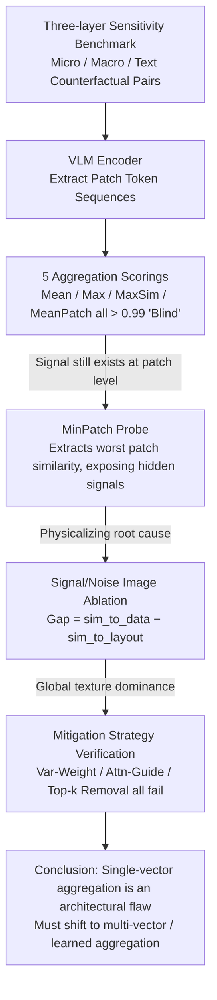

# A Picture is Worth a Thousand Words? An Empirical Study of Aggregation Strategies for Visual Financial Document Retrieval

**Conference**: ACL 2026 Findings  
**arXiv**: [2605.14581](https://arxiv.org/abs/2605.14581)  
**Code**: No public link provided in the abstract  
**Area**: Information Retrieval / Visual Document Retrieval / VLM Diagnostics  
**Keywords**: visual RAG, single-vector aggregation, ColPali, MinPatch diagnostics, financial documents

## TL;DR
Through a carefully designed financial document diagnostic benchmark (single-digit perturbation + text masking), this study empirically proves that "aggregating VLM patch tokens into a single vector" collapses massive semantic differences (e.g., $1.2M vs $7.2M) into nearly identical vectors with cosine similarity > 0.99. The root cause is "global texture dominance," which cannot be salvaged by various mitigation strategies or retrieval-tuned embeddings.

## Background & Motivation
**Background**: The mainstream RAG approach in the financial domain is "OCR/PDF parse → linear text," but flattening tables leads to lost row-column alignment and decreased retrieval precision. A new generation of visual RAG (ColPali, VisRAG, DSE) treats pages as images and uses VLM visual encoder patch tokens for retrieval.

**Limitations of Prior Work**: **Multi-vector** schemes like ColPali require storing hundreds of patch tokens, leading to exploding storage costs. **Single-vector** schemes like DSE aggregate patch tokens into one vector, which is cheaper but may lose critical numeric/textual information. The problem is: what exactly is lost, why is it lost, and how severe is the loss? Clean diagnostic evidence has long been missing.

**Key Challenge**: Financial documents are fundamentally different from natural images—critical semantics are encoded in sparse numbers/entities (changing a single digit changes the meaning of the entire text). However, visually, these numbers are just a few pixels; the background layout (table lines, logos, headers) dominates. Aggregation operations tend to bias toward the background based on visual saliency, smoothing out sparse numeric signals.

**Goal**: (1) Quantify the severity of information loss in single-vector aggregation for financial documents; (2) Identify the failure mechanism; (3) Verify if simple mitigation strategies are effective.

**Key Insight**: Convert the retrieval problem into "sensitivity analysis"—construct counterfactual document pairs (original vs. single-field change) to see if the encoder can distinguish them. If it can distinguish them at the patch level but not after aggregation, use a MinPatch probe (worst-case patch similarity) to see at which stage the signal is smoothed out.

**Core Idea**: "First use MinPatch to prove the encoder has signals at the patch level, then prove aggregation smooths them out," and locate "global texture dominance" as the root cause through Signal/Noise image ablation.

## Method

### Overall Architecture
This paper is a diagnostic empirical study. Instead of proposing a new model, it builds a benchmark and scoring probes to reveal the failure modes and root causes of "aggregating VLM patch tokens into a single vector" in financial document retrieval. The diagnostic chain approaches the problem layer by layer: first constructing counterfactual document pairs, extracting patch sequences using various VLM encoders, and then measuring the similarity between the original and counterfactual using 5 scoring mechanisms to see if the aggregation remains discriminative. Upon finding that aggregation "goes blind," the MinPatch probe is used to prove that signals still exist at the patch level. Finally, Signal/Noise image ablation physicalizes the root cause as measurable visual signal differences and verifies whether simple mitigation strategies suffice. The input consists of document pairs with controlled perturbations, and the output is a set of evidence pinning down exactly where and why the failure occurs.

### Key Designs

**1. Three-layer Sensitivity Benchmark: Measuring Aggregation's Discriminative Power via Controlled Perturbations**

Critical semantics in financial documents are concentrated in sparse numbers/entities—changing a single digit subverts the meaning of the whole text. Everyday natural image benchmarks do not cover such fine-grained differences, which is exactly the blind spot where single-vector aggregation fails. This design constructs three types of counterfactual pairs: micro-semantic (small changes to numbers: 5.21→5.29, 19.65%→19.54%), macro-semantic (large changes: 5.21→9.99, 11.9→88.8), and text sensitivity (using Zeiler-Fergus semantic occlusion, comparing "Revenue increased by $1.4 billion" with the same position covered by a [MASK] of the same color as the background). Each category includes 100 pairs across 2 datasets (FinQA, TAT-DQA), totaling 600 diagnostic samples, specifically restricting perturbations to the semantic layer rather than visual saliency to clearly isolate the aggregation's discriminative ability.

**2. MinPatch Probe: Isolating Encoder Responsibility from Aggregation Responsibility**

When aggregation fails, it is hard to tell if the encoder didn't see the difference or if the aggregation smoothed it out. MinPatch takes the minimum cosine similarity of spatially aligned patch pairs $S_\text{min} = \min_i \cos(v_i^A, v_i^B)$ to specifically unearth the maximum local difference noticed by the encoder. It is not a practical retrieval metric but a "worst-case patch" diagnostic probe. The logic is: if MinPatch drops significantly (e.g., to 0.51 for macro or 0.09 for text) while Mean/Max Pooling remains > 0.99, it proves the encoder already saw the difference at the patch level, and the responsibility lies entirely with the aggregation layer. This is more effective than average-based metrics like MaxSim at forcing out hidden signals submerged by aggregation.

**3. Signal/Noise Image Ablation: Physicalizing the Root Cause as Global Texture Dominance**

Proving that "aggregation looks at the background instead of the data" shouldn't rely solely on semantic interpretation; it needs measurable visual evidence. This design creates two control images: "Signal" (retain only the table, solid background) and "Noise" (erase the table, retain the template). It then calculates cos(reference, Signal) and cos(reference, Noise), defining $\text{Gap} = \text{sim\_to\_data} - \text{sim\_to\_layout}$. Results showed Qwen2.5-VL-7B had a Gap of -0.22 on FinQA, and Phi-3.5 had -0.27, meaning the aggregated vector was more similar to the "layout-only" image than the "data-only" image. This confirms that aggregation prioritized background textures (table lines, logos), drowning out sparse numeric pixel signals—a phenomenon termed "global texture dominance."

### Loss & Training
No training involved; all experiments are inference-based diagnostic probes. All similarities are calculated using cosine. The two datasets are FinQA (manual screenshots) and TAT-DQA (multi-page financial reports extracted directly from PDFs).

## Key Experimental Results

### Main Results: Single-vector Aggregation vs. MinPatch Diagnostics (Similarity on FinQA; closer to 1.0 indicates "Blindness")

| Test | Mean Pool | Max Pool | MaxSim | MeanPatch | **MinPatch** |
|------|-----------|----------|--------|-----------|---------------|
| Micro-semantic (5.21→5.29) | > 0.99 | > 0.99 | > 0.99 | > 0.99 | **0.71** |
| Macro-semantic (5.21→9.99) | > 0.99 | > 0.99 | > 0.99 | > 0.99 | **0.51** |
| Text sensitivity ([MASK] subst.) | > 0.99 | > 0.99 | > 0.99 | > 0.99 | **0.09** (Qwen2.5-32B) / **Negative** (LLaVA) |

Key Evidence: All 5 aggregation mechanisms were "blind" (> 0.99), **while only MinPatch exposed the hidden signal**, proving that the signal was present at the patch level but destroyed by aggregation.

### Retrieval-tuned embedding models also fail

| Sensitivity | Qwen3-VL-Embedding-8B | GME-Qwen2-VL-7B-Instruct |
|-------------|------------------------|---------------------------|
| Micro-Semantic (FinQA) | 0.9992 | 0.9970 |
| Macro-Semantic (FinQA) | 0.9976 | 0.9906 |
| Text Sensitivity (FinQA) | 0.9799 | 0.9363 |
| Macro-Semantic (TAT-DQA) | 0.9997 | 0.9906 |

Even embedding models specifically trained for retrieval are helpless, proving the failure is **not a training objective issue but an inherent problem of the single-vector representation architecture**.

### Ablation Study of Mitigation Strategies (Macro-Semantic on FinQA; closer to 1.0 indicates failure)

| Encoder | VarWgt | AttnGd | TopK-R | Conclusion |
|---------|--------|--------|--------|------|
| Qwen2.5-VL-7B | 0.9997 | 0.9998 | 0.9998 | All Ineffective |
| Qwen2.5-VL-32B | 0.9997 | 0.9998 | 0.9998 | All Ineffective |
| LLaVA-v1.5 | 1.0000 | 0.9999 | 0.9999 | All Ineffective |
| DeepEncoder | 0.9994 | 0.9995 | 0.9994 | All Ineffective |

Variance weighting, attention guidance, and Top-k patch removal all failed to save the results, indicating the problem is **fundamental**.

### Key Findings
- **Encoder is good, aggregation is bad**: The gap between MinPatch (0.51) and Mean Pool (0.99) is the paper's strongest evidence, precisely attributing the diagnostic failure to the aggregation layer.
- **Global texture dominance** is the mechanistic explanation: Aggregation prioritizes background textures (table lines, logos), drowning out sparse numeric signals. The Signal/Noise Gap directly quantifies this.
- **Simple fixes are useless**: Variance weighting, attention guidance, and Top-k removal all failed, suggesting that any framework relying on simple aggregation is untenable and requires an architectural shift (multi-vector or learned aggregation).
- **DeepSeek-DeepEncoder is actually worse**: It performed best (least sensitive) on MinPatch because OCR-optimized encoders tend to learn "pixel-level invariance," which inadvertently weakens sensitivity to single-digit changes—indicating a conflict between OCR training objectives and financial retrieval goals.
- **TAT-DQA is harder than FinQA**: Multi-page layouts and denser tables shrunk the Gap to < 0.05, meaning even the layout is becoming difficult to distinguish.

## Highlights & Insights
- **Paradigm for Diagnostic Papers**: Instead of proposing a new method, it uses controlled experiments to provide conclusive negative evidence against a widely used architecture (single-vector visual retrieval). The MinPatch + Signal/Noise probe designs are clean and powerful, and the methodology is generalizable to performance degradation analysis in other modalities.
- **"Single Digit Change = Massive Semantic Difference" is an overlooked domain attribute**: Insensitivity to retrieval on natural image benchmarks masks true failure modes in numeric-intensive fields like finance, law, and medicine.
- **"Retrieval-tuned ≠ Retrieval-safe"**: The assumption that switching to a fine-tuned embedding solves the problem was debunked—rebutting "default industry assumptions" is a high-value negative result.
- **Pointing Toward Architectural Change**: The authors explicitly recommend shifting future work toward multi-vector retrieval or learned aggregation.

## Limitations & Future Work
- Datasets are limited to FinQA and TAT-DQA; they do not cover more financial document types like invoices or handwritten notes.
- Lacks a full retrieval evaluation (Recall@k, nDCG); it only performs similarity-pair-level diagnostics. Real-world ranking impact needs to be supplemented.
- Only simple mitigation strategies were tested; the limits of learned aggregation (e.g., perceiver resampler, learned pooling tokens) were not explored.
- Conclusions might not be cross-domain: As the authors admit (Appendix E), natural images do not exhibit global texture dominance, so the diagnostic conclusions are highly domain-specific.

## Related Work & Insights
- **vs. ColPali (multi-vector late interaction)**: ColPali retains all patch tokens to avoid aggregation failure but at a high storage/latency cost. This paper argues that the ColPali route is the correct direction for financial document retrieval.
- **vs. DSE (single-vector dense embedding)**: DSE is the primary target of this study—cheap but "blind." This paper serves as a warning for DSE-like schemes in financial scenarios.
- **vs. DeepSeek-OCR**: DeepSeek-OCR proves patch tokens can retain fine-grained text, but this paper points out "retention ≠ usability after aggregation."
- **vs. Lost in Embeddings (Li et al. 2025)**: Also studies VLM information loss but focuses on general images; this paper focuses on financial documents and finds sharper domain-specific failure modes.
- **vs. Zeiler-Fergus Semantic Occlusion**: This paper draws on the occlusion idea for counterfactuals, innovatively using "same-color-as-background masks" instead of black patches to ensure perturbations occur only at the semantic level.

## Rating
- Novelty: ⭐⭐⭐⭐ No new model, but the methodological combination of MinPatch probes + Signal/Noise ablation + cross-architecture sanity checks is new and clear.
- Experimental Thoroughness: ⭐⭐⭐⭐ 5 encoders + 2 retrieval-tuned models + 3 sensitivity types + 3 mitigation strategies + 2 datasets + sanity checks.
- Writing Quality: ⭐⭐⭐⭐⭐ The diagnostic logic is incremental and rigorous (aggregation failed → patch has signal → root cause is global texture → mitigation failed → architecture must change).
- Value: ⭐⭐⭐⭐⭐ Direct cautionary value for deploying visual RAG in high-precision fields; the negative results are clean and powerful.

<!-- RELATED:START -->

1. **ColPali: Efficient Document Retrieval with Vision Language Models**, arXiv 2024.
2. **DeepSeek-V3: Technical Report**, arXiv 2024.
3. **VisRAG: Vision-based Retrieval-Augmented Generation**, arXiv 2024.

<!-- RELATED:END -->

## Related Papers

- [\[ACL 2025\] Towards Storage-Efficient Visual Document Retrieval: An Empirical Study on Reducing Patch-Level Embeddings](../../ACL2025/information_retrieval/towards_storage-efficient_visual_document_retrieval_an_empirical_study_on_reduci.md)
- [\[ACL 2026\] Prune-then-Merge: Towards Efficient Multi-Vector Visual Document Retrieval](sculpting_the_vector_space_towards_efficient_multi-vector_visual_document_retrie.md)
- [\[ACL 2026\] Navigating Large-Scale Document Collections: MuDABench for Multi-Document Analytical QA](navigating_large-scale_document_collections_mudabench_for_multi-document_analyti.md)
- [\[ACL 2026\] How Large Language Models Balance Internal Knowledge with User and Document Assertions](how_large_language_models_balance_internal_knowledge_with_user_and_document_asse.md)
- [\[ACL 2026\] Is Agentic RAG Worth It? An Experimental Comparison of RAG Approaches](is_agentic_rag_worth_it_an_experimental_comparison_of_rag_approaches.md)

<!-- RELATED:END -->
