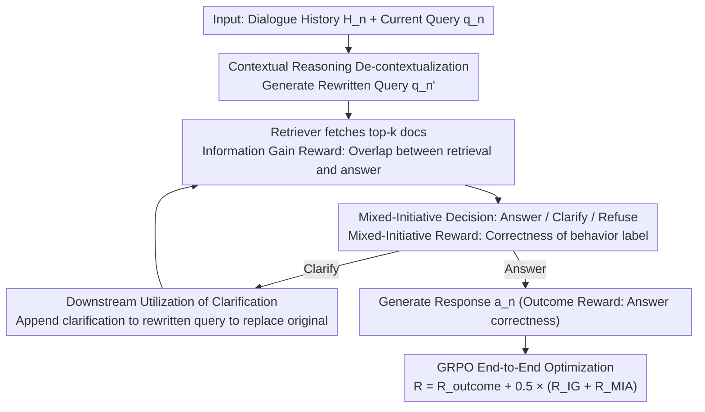

# Agentic Conversational Search with Contextualized Reasoning via Reinforcement Learning

**Conference**: ACL 2026 Findings  
**arXiv**: [2601.13115](https://arxiv.org/abs/2601.13115)  
**Code**: None  
**Area**: Conversational Search / LLM Agent  
**Keywords**: Conversational search, Reinforcement Learning, Contextual reasoning, Mixed-initiative behavior, Information gain reward

## TL;DR

ConvAgent is proposed to train conversational search agents to alternate between search and reasoning in multi-turn interactions by decomposing RL rewards into three complementary components: outcome reward, information gain reward, and mixed-initiative behavior reward.

## Background & Motivation

**Background**: LLMs are becoming the primary interface for human-computer interaction. However, in multi-turn conversational search, user intent evolves with the dialogue, requiring dynamic coordination of retrieval and generation.

**Limitations of Prior Work**: (1) Traditional methods adopt static "rewrite → retrieve → generate" pipelines where modules are optimized independently, preventing joint optimization; (2) Emerging deep search agents (e.g., Search-R1), while capable of joint optimization, target single-turn scenarios and lack multi-turn capabilities; (3) Existing methods ignore mixed-initiative behaviors (e.g., asking clarifying questions at appropriate times).

**Key Challenge**: Multi-turn conversational search simultaneously requires contextual understanding (de-contextualization), search optimization (retrieval quality), and behavioral decision-making (when to answer/clarify/refuse). Existing methods cannot optimize these three dimensions simultaneously.

**Goal**: Optimize multiple aspects simultaneously through contextualized reasoning within a single agent framework.

**Key Insight**: Decompose the total reward into three complementary components and train the agent to execute search and reasoning alternately across multiple turns using the GRPO algorithm.

**Core Idea**: Intermediate process rewards (information gain + mixed-initiative behavior) compensate for the lack of sparse supervision from outcome rewards alone, allowing the model to learn more strategic search and interaction behaviors.

## Method

### Overall Architecture

ConvAgent models multi-turn conversational search as a single-agent alternating "search-reasoning" process: at turn $n$, the model receives the dialogue history $\mathcal{H}_n$ and the current query $q_n$, first performs contextual reasoning for de-contextualization, then generates search queries, calls the retriever, analyzes returned documents, and decides whether to answer, clarify, or refuse in this turn before producing a response. The entire trajectory is optimized end-to-end using GRPO, while the total reward is split into outcome reward, information gain reward, and mixed-initiative behavior reward to provide intermediate signals that supplement the sparse supervision of the final answer.

### Key Designs

**1. Information Gain Reward: Using retrieval-answer overlap as a proxy for query quality**

Relying solely on final answer correctness results in sparse gradient feedback, making it difficult for the model to learn "how to rewrite to retrieve the correct evidence." The information gain reward directly measures the information overlap between the current top-$k$ retrieved documents and the ground-truth answer: $\mathcal{R}_{IG} = \mathcal{S}_{Info}(\{P_n\}_1^k, a_n^*)$. F1-score is used for long answers, and substring matching accuracy for short ones. This provides immediate feedback on retrieval quality each turn, allowing the model to learn better query rewriting strategies even without human-annotated queries.

**2. Mixed-Initiative Action Reward: Learning to answer, clarify, or refuse at the right time**

Not every turn in a conversation warrants a direct answer—ambiguous queries should trigger clarifications, and insufficient evidence should lead to refusal. This design models behavior decision-making as a classification task, detecting whether the generated sequence contains the correct behavior tag (e.g., `<clarify>`, `<noanswer>`). A reward of $+1$ is given for correctness and $-0.5$ for errors. This explicitly incorporates strategic behavior regarding "when to ask and when to answer" into the optimization objective, making the agent's interaction more aligned with real user experiences.

**3. Downstream Utilization of Clarification Results: Turning "asking" into "asking usefully"**

If clarification is only evaluated based on "whether a question was asked," its intrinsic value cannot be measured. Here, the model-generated clarification question $q_n^c$ is concatenated as an expansion to the rewritten query $q_n'$ for retrieval and replaces the original query for final answer generation. This ensures clarification actually impacts downstream retrieval and generation quality, closing the loop from an isolated action to a practical contribution to the task.

### Loss & Training

The total reward is $\mathcal{R}(\tau) = \mathcal{R}_{outcome} + 0.5 \times (\mathcal{R}_{IG} + \mathcal{R}_{MIA})$, which integrates two intermediate process rewards into the outcome reward with weighting. Optimization uses GRPO (Group Relative Policy Optimization), which requires no additional explicit reward or value models; the paper also experimented with PPO as an alternative and found GRPO to be more stable and concise.

## Key Experimental Results

### Main Results

| Method | TopiOCQA F1 | INSCIT F1 | QReCC F1 | CORAL F1 |
|------|------------|-----------|----------|----------|
| SFT-3b | 18.2 | 23.7 | 17.0 | 15.2 |
| Search-R1-3b | 26.1 | 5.8 | 5.9 | 3.9 |
| ConvAgent-3b | 25.2 | 23.5 | 24.1 | 22.4 |
| SFT-7b | 23.6 | 24.5 | 19.1 | 18.8 |
| Search-R1-7b | 37.0 | 9.1 | 8.6 | 3.8 |
| ConvAgent-7b | - | - | - | - |

### Ablation Study

| Configuration | Key Metric | Description |
|------|---------|------|
| Remove IG Reward | F1 Decrease | Search optimization signals are critical for retrieval quality |
| Remove MIA Reward | Mixed-Initiative Degradation | Behavioral adaptation is critical for dialogue quality |
| PPO vs GRPO | GRPO more stable | GRPO is simpler without additional reward models |

### Key Findings
- Search-R1 performs inconsistently in conversational settings—strong on TopiOCQA but crashes on others, indicating single-turn agents do not adapt well to multi-turn contexts.
- ConvAgent demonstrates balanced performance across 4 datasets, proving the importance of intermediate rewards.
- The Information Gain reward effectively improves query rewriting quality even without ground-truth rewritten queries for supervision.

## Highlights & Insights
- The reward decomposition strategy elegantly solves the sparse reward problem in RL training without requiring manual intermediate step supervision.
- The design of the Information Gain reward is clever, using retrieval-answer overlap as a proxy for query quality.
- The introduction of mixed-initiative behavior brings the conversational agent closer to a real user experience—knowing when to ask and when to answer.

## Limitations & Future Work
- Currently only verified on 3B and 7B models; performance on larger models remains to be tested.
- Mixed-initiative behavior only includes three types, whereas real-world dialogue behaviors are richer.
- The quality of the user simulator may affect training outcomes.
- Future work could extend to multimodal conversational search and more complex interaction patterns.

## Related Work & Insights
- **vs Search-R1**: Extends single-turn deep search to multi-turn dialogue, addressing multi-turn challenges through history-conditioned queries and intermediate rewards.
- **vs ChatR1**: ChatR1 relies on ground-truth rewritten queries as training signals, whereas ConvAgent’s IG reward does not.
- **vs Traditional Conversational Search**: Unifies separated rewrite/retrieve/generate modules into a single agent with end-to-end RL optimization.

## Rating
- Novelty: ⭐⭐⭐⭐ Combination of reward decomposition and mixed-initiative behavior is a new contribution.
- Experimental Thoroughness: ⭐⭐⭐⭐ 4 datasets, multiple baseline comparisons, and ablation analysis.
- Writing Quality: ⭐⭐⭐⭐ Clear problem definition and systematic method description.
- Value: ⭐⭐⭐⭐ Provides practical guidance for developing conversational AI assistants.

<!-- RELATED:START -->

## Related Papers

- [\[ACL 2026\] ChatR1: Reinforcement Learning for Conversational Reasoning and Retrieval Augmented Question Answering](chatr1_reinforcement_learning_for_conversational_reasoning_and_retrieval_augment.md)
- [\[ACL 2026\] Learning to Extract Rational Evidence via Reinforcement Learning for Retrieval-Augmented Generation](learning_to_extract_rational_evidence_via_reinforcement_learning_for_retrieval-a.md)
- [\[ACL 2026\] Language-Coupled Reinforcement Learning for Multilingual Retrieval-Augmented Generation](language-coupled_reinforcement_learning_for_multilingual_retrieval-augmented_gen.md)
- [\[ICML 2026\] Graph-R1: Towards Agentic GraphRAG Framework via End-to-end Reinforcement Learning](../../ICML2026/information_retrieval/graph-r1_towards_agentic_graphrag_framework_via_end-to-end_reinforcement_learnin.md)
- [\[ACL 2026\] Multi-Faceted Self-Consistent Preference Alignment for Query Rewriting in Conversational Search](multi-faceted_self-consistent_preference_alignment_for_query_rewriting_in_conver.md)

<!-- RELATED:END -->
