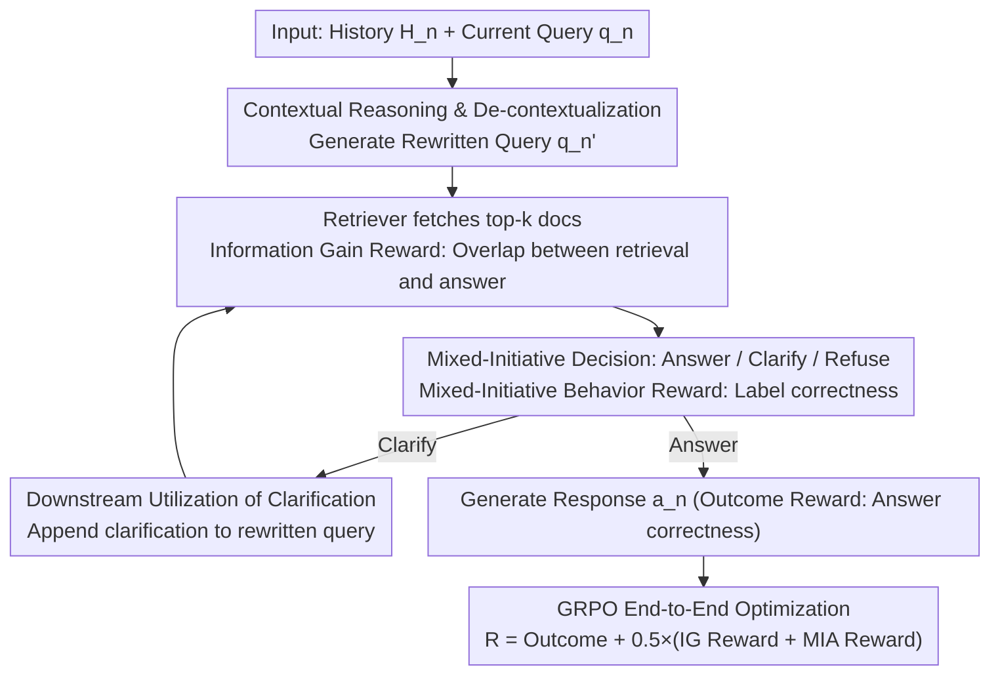

# Agentic Conversational Search with Contextualized Reasoning via Reinforcement Learning

**Conference**: ACL 2026 Findings  
**arXiv**: [2601.13115](https://arxiv.org/abs/2601.13115)  
**Code**: None  
**Area**: Conversational Search / LLM Agent  
**Keywords**: Conversational Search, Reinforcement Learning, Contextualized Reasoning, Mixed-Initiative Behavior, Information Gain Reward

## TL;DR

ConvAgent is proposed to train conversational search agents to alternate between search and reasoning across multi-turn interactions by decomposing RL training rewards into three complementary components: outcome reward, information gain reward, and mixed-initiative behavior reward.

## Background & Motivation

**Background**: LLMs are becoming the primary interface for human-computer interaction. However, in multi-turn conversational search, user intents evolve as the conversation progresses, necessitating the dynamic coordination of retrieval and generation.

**Limitations of Prior Work**: (1) Traditional methods utilize a static "rewrite → retrieve → generate" pipeline where modules are optimized independently, preventing joint optimization; (2) Emerging deep search agents (e.g., Search-R1) allow joint optimization of retrieval and generation but are designed for single-turn scenarios and lack multi-turn capabilities; (3) Existing methods overlook mixed-initiative behaviors, such as asking clarifying questions at appropriate moments.

**Key Challenge**: Multi-turn conversational search requires simultaneous contextual understanding (de-contextualization), search optimization (retrieval quality), and behavioral decision-making (when to answer, clarify, or refuse). Existing methods fail to optimize these three dimensions concurrently.

**Goal**: Optimize multiple aspects through contextualized reasoning within a single agent framework.

**Key Insight**: Decompose the total reward into three complementary components and train the agent using the GRPO algorithm to alternate between search and reasoning across multiple turns.

**Core Idea**: Intermediate process rewards (Information Gain + Mixed-Initiative Behavior) compensate for the sparse supervision of outcome rewards alone, enabling the model to learn strategic search and interaction behaviors.

## Method

### Overall Architecture

ConvAgent models multi-turn conversational search as a single-agent process of alternating "search-reasoning": In the $n$-th turn, receiving history $\mathcal{H}_n$ and current query $q_n$, the model first performs contextual reasoning for de-contextualization, then generates retrieval queries, calls the retriever, analyzes returned documents, and decides whether to answer, clarify, or refuse for the current turn to produce a response. The entire trajectory is optimized end-to-end via GRPO, with the total reward decomposed into outcome reward, information gain reward, and mixed-initiative behavior reward to provide process signals.

### Key Designs

**1. Information Gain Reward: Using Retrieval-Answer Overlap as a Proxy for Query Quality**

Relying solely on outcome rewards leads to sparse supervision, making it difficult for models to learn "how to rewrite queries to find correct evidence." The Information Gain reward directly measures the information overlap between the top-$k$ retrieved documents and the ground-truth answer: $\mathcal{R}_{IG} = \mathcal{S}_{Info}(\{P_n\}_1^k, a_n^*)$. F1-score is used for long answers and substring matching for short answers. This provides immediate feedback on retrieval quality, allowing the model to learn better rewriting strategies without human-annotated queries.

**2. Mixed-Initiative Behavior Reward: Learning When to Answer, Clarify, or Refuse**

In a conversation, not every turn warrants a direct answer—ambiguous queries should trigger clarification, and insufficient evidence should lead to refusal. This design models behavioral decisions as a classification task, detecting if the generated sequence contains correct behavioral tags (e.g., `<clarify>`, `<noanswer>`). A correct prediction yields $+1$, while an incorrect one yields $-0.5$. This explicitly integrates strategic interaction into the optimization target.

**3. Downstream Utilization Mechanism for Clarification: Advancing from "Asking" to "Utility"**

If clarification is only evaluated by "whether it was asked," its actual value cannot be measured. Here, the generated clarification question $q_n^c$ is concatenated as an expansion to the rewritten query $q_n'$ for retrieval and also replaces the original query during final answer generation. This closes the loop, ensuring clarification contributes tangibly to downstream retrieval and generation quality.

### Loss & Training

The total reward is defined as $\mathcal{R}(\tau) = \mathcal{R}_{outcome} + 0.5 \times (\mathcal{R}_{IG} + \mathcal{R}_{MIA})$, incorporating weighted intermediate rewards alongside the outcome reward. Optimization is performed using GRPO (Group Relative Policy Optimization), which eliminates the need for additional explicit reward and value models. Experiments also showed GRPO to be more stable and concise than PPO.

## Key Experimental Results

### Main Results

| Method | TopiOCQA F1 | INSCIT F1 | QReCC F1 | CORAL F1 |
|------|------------|-----------|----------|----------|
| SFT-3b | 18.2 | 23.7 | 17.0 | 15.2 |
| Search-R1-3b | 26.1 | 5.8 | 5.9 | 3.9 |
| ConvAgent-3b (Ours) | 25.2 | 23.5 | 24.1 | 22.4 |
| SFT-7b | 23.6 | 24.5 | 19.1 | 18.8 |
| Search-R1-7b | 37.0 | 9.1 | 8.6 | 3.8 |
| ConvAgent-7b (Ours) | - | - | - | - |

### Ablation Study

| Configuration | Key Metric | Description |
|------|---------|------|
| Remove IG Reward | F1 Decrease | Search optimization signals are critical for retrieval quality |
| Remove MIA Reward | MIA Degradation | Behavioral adaptation is critical for conversation quality |
| PPO vs GRPO | GRPO more stable | GRPO is simpler without an extra reward model |

### Key Findings
- Search-R1 exhibits unstable performance in dialogue—while strong on TopiOCQA, it collapses on three other datasets, showing that single-turn agents struggle with multi-turn requirements.
- ConvAgent maintains balanced performance across 4 datasets, validating the importance of intermediate rewards.
- Information Gain reward effectively improves query rewriting quality, even without ground-truth query supervision.

## Highlights & Insights
- The reward decomposition strategy elegantly addresses sparse reward challenges in RL without requiring human-annotated intermediate step supervision.
- The Information Gain reward is a clever design, using retrieval-answer overlap as a proxy for search quality.
- The introduction of mixed-initiative behavior brings conversational agents closer to real-world user experiences by knowing when to ask vs. when to answer.

## Limitations & Future Work
- Current validation is limited to 3B and 7B models; performance on larger models remains to be tested.
- Mixed-initiative behavior is restricted to three types, whereas real-world dialogue is more complex.
- The quality of user simulation may impact training outcomes.
- Future work may extend to multimodal conversational search and more intricate interaction patterns.

## Related Work & Insights
- **vs Search-R1**: Extends single-turn deep search to multi-turn dialogue by addressing multi-turn challenges through history-conditioned queries and intermediate rewards.
- **vs ChatR1**: While ChatR1 relies on ground-truth rewritten queries as training signals, ConvAgent’s IG reward does not.
- **vs Traditional Conversational Search**: Unifies separate rewriting/retrieval/generation modules into a single agent optimized via end-to-end RL.

## Rating
- Novelty: ⭐⭐⭐⭐ Combination of reward decomposition and mixed-initiative behavior is a new contribution.
- Experimental Thoroughness: ⭐⭐⭐⭐ 4 datasets, multiple baselines, and ablation analysis.
- Writing Quality: ⭐⭐⭐⭐ Clear problem definition and systematic method description.
- Value: ⭐⭐⭐⭐ Provides practical guidance for developing conversational AI assistants.

<!-- RELATED:START -->

## Related Papers

- [\[ACL 2026\] ChatR1: Reinforcement Learning for Conversational Reasoning and Retrieval Augmented Question Answering](chatr1_reinforcement_learning_for_conversational_reasoning_and_retrieval_augment.md)
- [\[ACL 2026\] Learning to Extract Rational Evidence via Reinforcement Learning for Retrieval-Augmented Generation](learning_to_extract_rational_evidence_via_reinforcement_learning_for_retrieval-a.md)
- [\[ACL 2026\] Multi-Faceted Self-Consistent Preference Alignment for Query Rewriting in Conversational Search](multi-faceted_self-consistent_preference_alignment_for_query_rewriting_in_conver.md)
- [\[ACL 2026\] Language-Coupled Reinforcement Learning for Multilingual Retrieval-Augmented Generation](language-coupled_reinforcement_learning_for_multilingual_retrieval-augmented_gen.md)
- [\[ICML 2026\] Graph-R1: Towards Agentic GraphRAG Framework via End-to-end Reinforcement Learning](../../ICML2026/information_retrieval/graph-r1_towards_agentic_graphrag_framework_via_end-to-end_reinforcement_learnin.md)

<!-- RELATED:END -->
