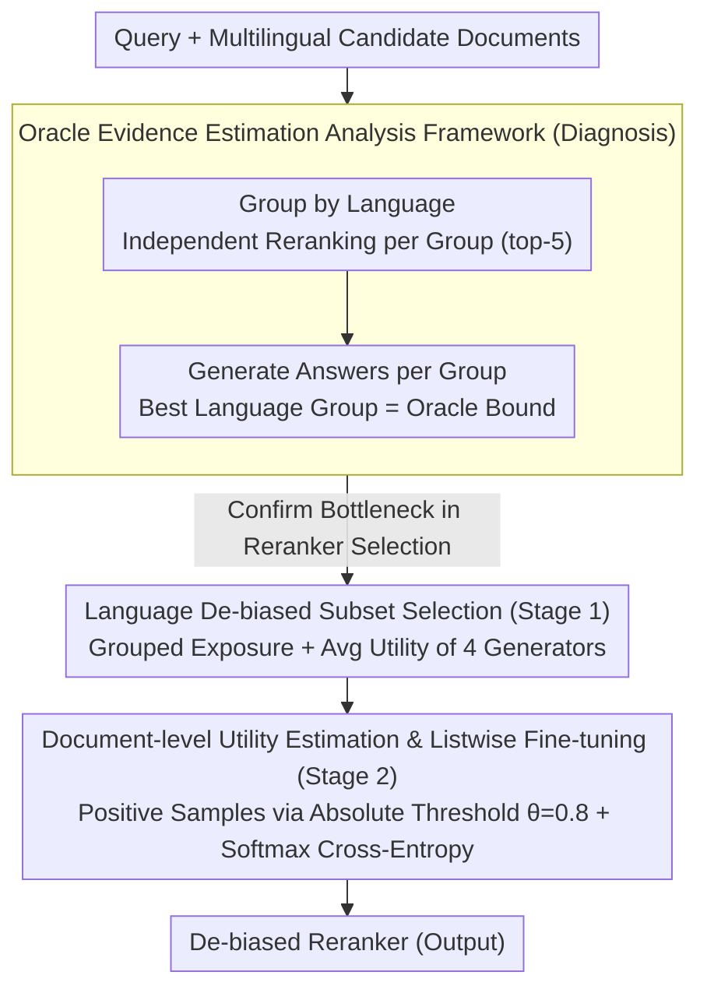

# All Languages Matter: Understanding and Mitigating Language Bias in Multilingual RAG

**Conference**: ACL 2026  
**arXiv**: [2604.20199](https://arxiv.org/abs/2604.20199)  
**Code**: None  
**Area**: Information Retrieval / Multilingual NLP  
**Keywords**: Multilingual RAG, Reranking Bias, Language Fairness, Evidence Selection, Cross-lingual Retrieval

## TL;DR
The study systematically reveals that multilingual RAG systems exhibit severe language bias (preference for English and query languages) during the reranking stage. It proposes the LAURA framework, which aligns the reranker via supervised signals driven by downstream generation quality, effectively mitigating bias and improving generation performance.

## Background & Motivation

**Background**: Multilingual RAG (mRAG) enhances the global knowledge coverage of LLMs through cross-lingual evidence. In real-world scenarios, much knowledge is only recorded in specific languages (e.g., regional policies, cultural backgrounds). Thus, an ideal mRAG system should select documents with the highest informational value across languages.

**Limitations of Prior Work**: Current mRAG systems show a distinct language preference bias during the reranking phase. Taking the BGE reranker as an example, across 13 languages, over 70% of the top-5 documents originate from English or the query language. This implies that even if high-quality evidence in other languages exists in the candidate pool, it is systematically ranked lower.

**Key Challenge**: The root of the problem is not a lack of relevant information in the candidate pool—Oracle experiments demonstrate that selecting the correct documents from already retrieved candidates can improve performance by 12.9-20 percentage points. The real bottleneck is the reranker's language preference, which prevents it from identifying critical evidence in non-English/non-query languages. Furthermore, the Pearson correlation coefficient between reranking scores and downstream generation quality is less than 0.2.

**Goal**: (1) Quantify and diagnose language bias in mRAG; (2) Design a method to align reranker document selection with downstream generation quality rather than relying solely on semantic relevance signals.

**Key Insight**: An Oracle evidence estimation method is proposed—reranking and generating answers independently by language groups, using the performance of the best language group as the upper bound to precisely quantify the performance loss caused by bias.

**Core Idea**: Use answer utility instead of semantic relevance as the training signal for the reranker to eliminate the influence of language priors.

## Method

### Overall Architecture
The strategy of LAURA is to diagnose first, then align: first, quantify the severity of the reranker's language bias using Oracle evidence estimation; then, switch the reranker's training signal from "semantic relevance" to "downstream answer utility." This is implemented as a two-stage data construction pipeline followed by listwise fine-tuning—Stage 1 performs de-biased sampling by language grouping to ensure equal exposure for all language candidates; Stage 2 estimates the generation utility for each retained document and filters truly useful positive samples using an absolute threshold; finally, the reranker is fine-tuned using a softmax cross-entropy loss to learn to assign high scores to documents that "help generate correct answers" rather than being driven by English/query language priors.

### Key Designs

**1. Oracle Evidence Estimation Analysis Framework: Separating "Inconsistent Information" from "Selection Error"**

To treat the bias, one must first confirm its source. This framework groups candidate documents by language for each query, reranks them independently within each group to take the top-5, and generates answers. The best-performing language group serves as the Oracle upper bound. Comparing the Oracle distribution with the actual distribution reveals that Oracle evidence is actually scattered across multiple languages rather than clustered in the query language—simply picking the right documents from already retrieved candidates yields a 12.9~20 percentage point improvement. This proves the bottleneck is not a lack of information in the pool, but the reranker's insufficient cross-lingual capability.

**2. Language De-biased Subset Selection (Stage 1): Preventing Dominance of High-Resource Languages**

If document utility were estimated directly on the global top-$k$, existing language bias would be further amplified. Stage 1 first groups retrieved documents by language and uses the reranker to select the top-5 per group, ensuring equal exposure for each language subset. Then, four generators (Qwen, Llama, DeepSeek, etc.) independently evaluate each document's contribution to generation, using the average as the utility score. Multi-model averaging reduces individual model bias and avoids manual labeling costs while maintaining cross-lingual balance in the positive sample set.

**3. Document-level Utility Estimation and Listwise Fine-tuning (Stage 2): Using Absolute Thresholds to Cut Off Implicit Language Bias**

Stage 2 evaluates the generation utility for each document retained from Stage 1. An absolute threshold of $\theta=0.8$ is set to filter positive samples—only documents that truly help the model answer correctly are kept. The reranker is then fine-tuned via listwise softmax cross-entropy loss to encourage high scores for positive samples. An absolute threshold is chosen over relative ranking because the latter could reintroduce language distribution differences, whereas an absolute threshold anchors selection purely on answer quality, cutting off the feedback of language priors.

### Loss & Training
Listwise fine-tuning utilizes the softmax cross-entropy loss $\mathcal{L} = -s(q, d_{pos}) + \log \sum_{d \in \mathcal{D}_q} \exp(s(q,d))$, pushing the positive sample score higher relative to all candidates. For negative samples, the BGE reranker utilizes 1 negative sample per query, while the Qwen reranker uses 7. Optimization uses AdamW with a learning rate of $6 \times 10^{-6}$ for 5 epochs.

## Key Experimental Results

### Main Results

| Reranker | Setup | Avg 3-gram Recall (Llama) | Avg 3-gram Recall (Qwen) |
|---------|------|--------------------------|--------------------------|
| BGE | Original | 48.9 | 46.7 |
| BGE | + LAURA | **49.9** | **47.7** |
| Qwen3 | Original | 47.1 | 44.9 |
| Qwen3 | + LAURA | **49.2** | **46.7** |
| - | Oracle Bound | 63.6 | 61.3 |

### Ablation Study

| Setup | Llama 3-gram | Pearson Correlation | Description |
|------|-------------|-------------|------|
| BGE Original | 48.9 | 0.198 | Baseline |
| Self-Training | 48.9 | 0.188 | Pseudo-labels reinforce existing bias |
| mMARCO FT | 48.7 | 0.132 | Generic data fails to solve distribution mismatch |
| LAURA | 49.9 | 0.236 | Utility-driven method is effective |

### Key Findings
- A significant gap of ~15 percentage points exists between Oracle and actual performance, indicating that sufficient evidence exists in the candidate pool but is ignored by the reranker.
- After LAURA training, the Pearson correlation coefficient for the Qwen reranker increased from 0.127 to 0.264 (+108%), showing significantly enhanced alignment between reranking scores and generation quality.
- The language distribution of the reranker's output after training is closer to the Oracle distribution, with JS divergence dropping from 0.203 to 0.090 (BGE).
- The proportion of English and query language documents decreased, giving other languages fairer ranking opportunities.

## Highlights & Insights
- The Oracle evidence estimation framework is an elegant diagnostic tool that clearly separates "lack of information" from "selection errors." This analysis method is transferable to any scenario involving multi-source information selection.
- Using multi-model average generation quality as the document utility signal reduces model bias and avoids manual labeling costs.
- The low correlation (<0.2) between reranking scores and generation quality is a critical finding, indicating that "semantic relevance" and "answer utility" in current rerankers are distinct concepts.

## Limitations & Future Work
- The Oracle bound is still an estimation rather than a true upper bound, potentially underestimating or overestimating achievable performance.
- Validation was only conducted on the MKQA dataset, with limited language and domain coverage.
- LAURA requires multiple generation models to estimate utility, leading to high data construction costs.
- Future work could explore lightweight utility estimation methods or direct online optimization of rerankers using RL.

## Related Work & Insights
- **vs. Traditional Multilingual Retrieval**: Traditional methods focus on retrieval recall; this paper reveals that reranking is the true bottleneck.
- **vs. mMARCO Fine-tuning**: General ranking data cannot resolve the specific language bias issues in mRAG.
- **vs. Translation-based mRAG**: Translation strategies evade the problem of multilingual evidence selection; this paper directly optimizes the selection mechanism.

## Rating
- Novelty: ⭐⭐⭐⭐ The Oracle analysis framework and utility-driven alignment are meaningful new contributions.
- Experimental Thoroughness: ⭐⭐⭐⭐ 13 languages, multiple rerankers, multiple generators, and thorough ablation.
- Writing Quality: ⭐⭐⭐⭐⭐ Problem analysis is progressive with clear diagnostic-treatment logic.
- Value: ⭐⭐⭐⭐ Highlights the overlooked reranking bias problem in mRAG.

<!-- RELATED:START -->

## Related Papers

- [\[ACL 2025\] Investigating Language Preference of Multilingual RAG Systems](../../ACL2025/information_retrieval/investigating_language_preference_of_multilingual_rag_systems.md)
- [\[ACL 2026\] Enhancing Multilingual RAG Systems with Debiased Language Preference-Guided Query Fusion](enhancing_multilingual_rag_systems_with_debiased_language_preference-guided_quer.md)
- [\[ICLR 2026\] MILCO: Learned Sparse Retrieval Across Languages via a Multilingual Connector](../../ICLR2026/information_retrieval/milco_learned_sparse_retrieval_across_languages_via_a_multilingual_connector.md)
- [\[ICML 2026\] Linguistic Nepotism: Trading-off Quality for Language Preference in Multilingual RAG](../../ICML2026/information_retrieval/linguistic_nepotism_trading-off_quality_for_language_preference_in_multilingual_.md)
- [\[ACL 2026\] Language-Coupled Reinforcement Learning for Multilingual Retrieval-Augmented Generation](language-coupled_reinforcement_learning_for_multilingual_retrieval-augmented_gen.md)

<!-- RELATED:END -->
