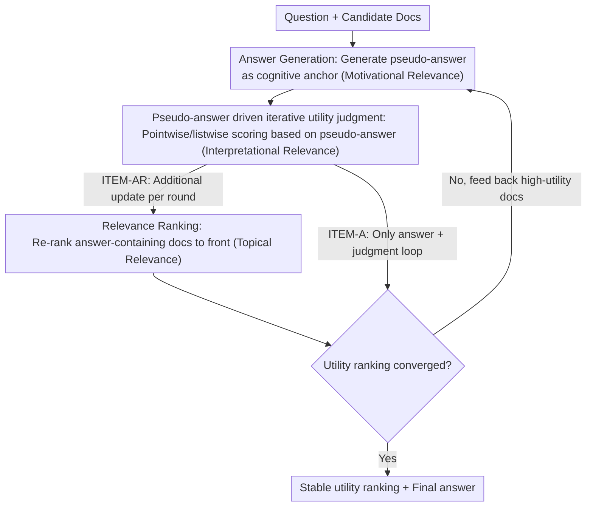

# An Iterative Utility Judgment Framework Inspired by Philosophical Relevance via LLMs

**Conference**: ACL 2026 Findings  
**arXiv**: [2406.11290](https://arxiv.org/abs/2406.11290)  
**Code**: [GitHub](https://github.com/Trustworthy-Information-Access/ITEM)  
**Area**: Information Retrieval / RAG  
**Keywords**: Utility judgment, philosophical relevance theory, iterative framework, RAG optimization, LLM reasoning

## TL;DR

Inspired by Schutz's philosophical theory of relevance, this paper proposes the ITEM iterative utility judgment framework. By enabling dynamic interaction and mutual enhancement among three RAG components (relevance ranking, utility judgment, and answer generation), it outperforms baselines in retrieval, utility judgment, and QA tasks.

## Background & Motivation

**Background**: In RAG scenarios, the input bandwidth of LLMs is limited, necessitating the prioritization of high-utility (rather than just high-relevance) retrieval results. Relevance measures "whether it is about the topic," while utility measures "whether it helps answer the question."

**Limitations of Prior Work**: (1) Existing RAG methods primarily optimize topical relevance, ignoring the higher standard of utility; (2) Although Zhang et al. proposed LLM utility judgment, it was only a preliminary exploration; (3) The three RAG components (retrieval, judgment, and generation) are typically optimized independently, lacking joint enhancement.

**Key Challenge**: Topically relevant documents are not necessarily useful—a document discussing the same topic but lacking a specific answer is relevant but useless. Existing methods struggle to distinguish between the two.

**Goal**: To enhance the utility judgment capability of LLMs through the iterative interaction of the three RAG components.

**Key Insight**: RAG is mapped to Schutz's philosophical "relevance system"—topical relevance, interpretational relevance (utility), and motivational relevance (answer) correspond to three cognitive levels that can mutually reinforce each other.

**Core Idea**: The three components of RAG reflect three cognitive levels of LLMs in question answering (aboutness → value → answer), which are enhanced through iteration.

## Method

### Overall Architecture

ITEM integrates retrieval, utility judgment, and answer generation—tasks that were previously independent in RAG—into an iterative closed loop. The input consists of a question and a set of candidate documents. In each round, the LLM first generates a pseudo-answer as a cognitive anchor, then uses this pseudo-answer to re-judge document utility (updating relevance ranking if necessary), and subsequently regenerates the pseudo-answer using the updated utility judgments. This process repeats until convergence, outputting stable utility rankings and the final answer. The framework has two variants: ITEM-A iterates only between "answer generation + utility judgment," while ITEM-AR additionally incorporates relevance ranking into each round to allow signal flow across all three components.

### Key Designs

**1. Pseudo-answer driven iterative utility judgment: Using the previous round's answer as an anchor to approach true utility**

The difficulty of single-pass utility judgment lies in the LLM being forced to score documents before fully understanding what the question truly requires, making it susceptible to surface-level topical relevance. ITEM's approach is to first let the LLM generate a pseudo-answer based on existing documents, explicitly stating "what kind of content this question likely needs." This serves as a reference for utility judgment (pointwise scoring or listwise re-ranking). Finally, high-utility documents are used to regenerate the pseudo-answer. As the pseudo-answer becomes more accurate round-by-round, the utility judgment improves accordingly—essentially allowing the model to accumulate understanding of the question and documents over multiple rounds rather than in a single step.

**2. Mapping Schutz's Relevance System to RAG: Why iterative components mutually enhance each other**

The effectiveness of iteration is supported by Schutz's philosophical theory of relevance. Schutz divides human cognition into three levels of relevance: topical relevance (focusing attention on a specific object), interpretational relevance (understanding the value of that object), and motivational relevance (acting based on that understanding). These layers correspond precisely to RAG's relevance ranking, utility judgment, and answer generation, respectively. The theory predicts that these layers reinforce each other—deeper understanding leads to more precise focus, which leads to better action. This provides the theoretical basis for ITEM's cyclic feedback: answers assist judgment, judgment assists ranking, and ranking feeds back better answers.

**3. Strategy differentiation between ITEM-A and ITEM-AR: Selecting components and rounds based on task complexity**

Not all tasks require all three components. ITEM-A only iterates between answer and judgment; it has fewer components but allows for deep exploration over more rounds. ITEM-AR includes relevance ranking in each round, providing richer information per round but with higher overhead. It was found that they have different applications: difficult tasks with complex candidate lists and non-factual queries (such as WebAP, GTI-NQ) require more components and iterations (ITEM-AR) to suppress noise. In contrast, simple factoid QA tasks perform best with the lightweight loop of ITEM-A using more rounds. This differentiation turns the decision of "how many resources to invest in iteration" into a tunable parameter based on the task.

### A Complete Example

For a factoid question: Initial retrieval provides 5 topically relevant documents, but only 2 contain actual answer clues. In Round 1, the LLM generates a rough pseudo-answer based on all 5 documents. In Round 2, it uses this pseudo-answer to re-judge utility, down-weighting the 3 "relevant but answer-less" documents, and then generates a more accurate pseudo-answer using the remaining high-utility documents. If using ITEM-AR, the answer-containing documents are also moved to the front of the ranking. After several rounds, the utility ranking stabilizes and the pseudo-answer converges, yielding the final output. The entire process requires no training and relies on prompt design to switch between "generation / judgment / ranking" tasks in each round.

### Loss & Training

ITEM is based entirely on the in-context learning of LLMs and does not introduce any training. The task to be performed in each round (answer generation, utility judgment, or relevance ranking) is controlled entirely by prompts.

## Key Experimental Results

### Main Results

| Task | Dataset | ITEM Gain | Description |
|------|--------|---------|------|
| Retrieval Ranking | TREC DL | Outperforms baseline | Utility judgment conversely improves ranking |
| Utility Judgment | GTI-NQ | Outperforms baseline | Iteration significantly improves judgment quality |
| QA | NQ | Outperforms baseline | High-utility documents lead to better answers |
| Non-factoid Retrieval | WebAP | Outperforms baseline | Larger gains in difficult tasks |

### Ablation Study

| Configuration | Key Metric | Description |
|------|---------|------|
| 1-round vs. Multi-round | Multi-round is better | Iteration is indeed effective |
| ITEM-A vs. ITEM-AR | Task-dependent | Difficult tasks require ITEM-AR |
| vs. Long Reasoning Mode | Comparable performance, much lower cost | Iteration is more efficient than one-time long reasoning |

### Key Findings
- In difficult tasks (e.g., WebAP non-factoid retrieval) and complex candidate lists (e.g., GTI-NQ), using more components and more iterations is most effective.
- ITEM achieves performance comparable to long reasoning modes but with significantly lower computational costs.
- In simple factoid QA tasks, using fewer components with more iterations is actually optimal.

## Highlights & Insights
- Creative mapping from philosophical theory to engineering methods—Schutz's relevance system provides a new perspective for RAG optimization.
- Discovered the relationship between task complexity and optimal iteration strategies.
- Improves RAG quality without the need for training, offering strong practical utility.

## Limitations & Future Work
- Iteration increases inference costs (multiple LLM calls), and latency may be unacceptable for some applications.
- The quality of the pseudo-answer may limit the upper bound of iteration gains.
- The framework was only tested on English datasets.
- Future work could integrate fine-tuned retrievers to further enhance performance.

## Related Work & Insights
- **vs. Single-pass Utility Judgment**: The iterative framework significantly improves judgment quality through cognitive accumulation over multiple rounds.
- **vs. Multi-round Retrieval RAG**: Does not change the retrieval itself but iterates to improve utility judgment on already retrieved results.
- **vs. Long Reasoning/CoT**: Achieves comparable effects at a lower cost.

## Rating
- Novelty: ⭐⭐⭐⭐ Innovative perspective mapping philosophical theory to RAG.
- Experimental Thoroughness: ⭐⭐⭐⭐ Evaluation across 4 datasets and multiple tasks.
- Writing Quality: ⭐⭐⭐⭐ Clear theoretical framework and well-organized experiments.
- Value: ⭐⭐⭐⭐ Practical steering for RAG optimization.

<!-- RELATED:START -->

## Related Papers

- [\[ACL 2025\] SGIC: A Self-Guided Iterative Calibration Framework for RAG](../../ACL2025/information_retrieval/sgic_a_self-guided_iterative_calibration_framework_for_rag.md)
- [\[ACL 2026\] Bayesian Active Learning with Gaussian Processes Guided by LLM Relevance Scoring](bayesian_active_learning_with_gaussian_processes_guided_by_llm_relevance_scoring.md)
- [\[NeurIPS 2025\] SymRTLO: Enhancing RTL Code Optimization with LLMs and Neuron-Inspired Symbolic Reasoning](../../NeurIPS2025/information_retrieval/symrtlo_enhancing_rtl_code_optimization_with_llms_and_neuron-inspired_symbolic_r.md)
- [\[ACL 2026\] Utility-Oriented Visual Evidence Selection for Multimodal Retrieval-Augmented Generation](utility-oriented_visual_evidence_selection_for_multimodal_retrieval-augmented_ge.md)
- [\[ACL 2026\] From Relevance to Authority: Authority-aware Generative Retrieval in Web Search Engines](from_relevance_to_authority_authority-aware_generative_retrieval_in_web_search_e.md)

<!-- RELATED:END -->
