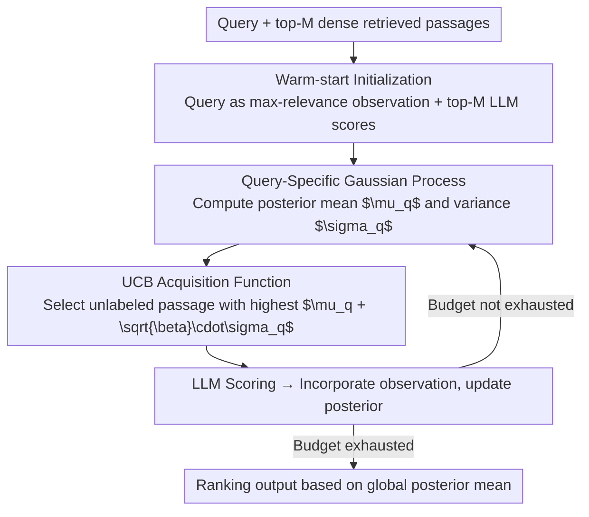

# Bayesian Active Learning with Gaussian Processes Guided by LLM Relevance Scoring

**Conference**: ACL 2026 Findings  
**arXiv**: [2604.17906](https://arxiv.org/abs/2604.17906)  
**Code**: [GitHub](https://github.com/junieberry/BAGEL)  
**Area**: Information Retrieval  
**Keywords**: Passage Retrieval, Gaussian Process, Active Learning, LLM Reranking, Bayesian Optimization

## TL;DR

BAGEL is proposed as a Bayesian active learning framework based on Gaussian Processes (GP). By using an exploration-exploitation balance strategy to propagate sparse LLM relevance signals across the global embedding space under a limited LLM budget, it achieves passage retrieval that significantly outperforms traditional LLM reranking methods.

## Background & Motivation

**Background**: LLMs possess exceptional zero-shot relevance modeling capabilities, but high computational costs turn passage retrieval into a budget-constrained global optimization problem. The dominant approach utilizes the LLM reranking paradigm: first retrieving top-K candidates via a dense retriever, then reranking them with an LLM.

**Limitations of Prior Work**: (1) Relevant passages are often distributed across multiple distinct clusters in the semantic space, yet dense retrievers only retrieve neighborhoods near the query embedding, failing to discover distant relevant clusters; (2) Existing methods cannot propagate relevance signals from scored passages to unseen ones, ignoring the semantic structure of the embedding space.

**Key Challenge**: The need to explore the entire embedding space within a finite LLM inference budget, whereas traditional methods passively rely on first-stage retrievers and lack global exploration capabilities.

**Goal**: To leverage the kernel function relevance propagation and uncertainty estimation of GPs to actively navigate the embedding space for discovering multimodal relevance distributions.

**Key Insight**: Modeling passage retrieval as a Bayesian optimization problem where the GP provides predicted means and uncertainties, while acquisition functions balance exploration and exploitation.

**Core Idea**: GPs are naturally suited for this task—kernel functions propagate relevance signals, and posterior variance guides active learning to explore uncertain regions.

## Method

### Overall Architecture

BAGEL reformulates "budget-constrained passage retrieval" as a Bayesian optimization problem: learning a query-specific relevance function over the embedding space to identify relevant passages globally with minimal LLM scoring. The workflow consists of two phases: a warm-start phase, where the query itself is treated as the highest relevance observation and combined with LLM scores of top-M dense retrieval passages to form an initial observation set; and an active learning phase, which iteratively selects the most informative unlabeled passage via an acquisition function for LLM scoring, updates the GP posterior, and finally ranks all passages in the corpus using the converged posterior mean once the budget is exhausted. This mechanism allows sparse LLM signals to propagate along the semantic structure of the embedding space, discovering distant relevant clusters that dense retrievers cannot reach.

### Key Designs

**1. Query-Specific GP: Modeling Relevance as a Propagatable, Continuous Function with Uncertainty**

The weakness of dense retrievers lies trailing within the query neighborhood; they fail to capture all relevant passages when scattered across multiple clusters, and signals from scored passages do not spill over to unseen ones. BAGEL addresses this using a GP: taking passage embeddings $\mathbf{x}_p$ as input and LLM relevance scores as output. The GP provides predicted posterior means $\mu_q(\mathbf{x}_{p_*})$ (relevance estimation) and variances $\sigma_q^2(\mathbf{x}_{p_*})$ (uncertainty). Stationary kernels like RBF naturally assume that passages close in the embedding space have similar relevance, allowing signals from a few scored points to smooth across the neighborhood via the kernel, effectively "illuminating" an area with a single LLM call.

**2. UCB Acquisition Guided Active Exploration: Spending Budget Efficiently via Uncertainty**

With mean and variance, the next selection becomes an exploration-exploitation tradeoff. Pure exploitation (querying currently predicted most relevant points) risks getting trapped in local optima near the query and missing distant clusters; pure exploration (querying the most uncertain points) wastes the LLM budget. BAGEL employs the UCB acquisition function $a^{\text{UCB}}(\mathbf{x}) = \mu_q(\mathbf{x}) + \sqrt{\beta}\,\sigma_q(\mathbf{x})$ to combine both, selecting the highest-scoring unlabeled passage at each step, where $\beta$ modulates the preference for exploration. Ablations show that the uncertainty term in the acquisition function is critical—the $\sigma_q$ term drives the model to probe high-uncertainty regions far from the query, capturing distant relevant clusters in multimodal distributions.

**3. Warm-start Initialization: Solving Cold Start with the Query Itself**

Without observations, the GP posterior equals the prior, leaving the acquisition function with no direction—the cold-start dilemma. BAGEL's strategy is to treat the query embedding $\mathbf{x}_q$ directly as a "virtual passage" observation with maximum relevance, paired with LLM scores from top-M dense retrieval passages to form the initial observation set $\mathcal{D}_q^{(0)}$. Since the query is inherently the most relevant item to itself, this strong positive signal provides a reliable anchor for the GP, giving the active learning process direction from the start.

### A Full Example

Given a query and a large passage corpus with an LLM budget of 50: first, the query embedding is used as the max-relevance observation, supplemented by LLM scores for top-M dense passages to initialize the GP. Then, a loop begins: the GP calculates $\mu_q$ and $\sigma_q$ for every unlabeled passage; UCB selects an item with either high predicted relevance or high uncertainty for LLM scoring; the new score is incorporated into the observations, and the posterior is refreshed. This repeats for 50 iterations; meanwhile, the GP kernel continuously extrapolates these scores to neighboring passages, gradually illuminating scattered relevant clusters. Once the budget is spent, all passages in the corpus are ranked and output using the final posterior mean—as anytime prediction is supported, a ranking can be generated at any intermediate iteration.

### Loss & Training

Training-free. GP hyperparameters (kernel lengthscale $\ell$, noise $\alpha$) are set in a standard manner. LLM scoring supports both Expected Relevance (ER) and Peak Relevance (PR). Since the GP can rank all passages after any iteration, the framework naturally supports anytime prediction and adapts to varying budget constraints.

## Key Experimental Results

### Main Results (LLM Budget = 50/Query)

| Dataset | Metric | BM25 | Dense Retr. | LLM Point. | BAGEL (Qwen3) | BAGEL (GPT-4o) |
|--------|------|------|-------------|-----------|---------------|----------------|
| Covid | N@50 | 42.8 | 48.7 | 52.9 | **61.4** | **62.1** |
| Robust04 | N@50 | 34.9 | 33.2 | 38.2 | **44.4** | **48.7** |
| TravelDest | N@10 | 21.1 | 22.3 | 45.8 | 49.8 | **57.0** |
| NFCorpus | N@50 | 27.7 | 29.0 | 32.7 | 32.8 | **35.9** |

### Ablation Study

| Configuration | Finding |
|------|------|
| RBF vs Linear vs Matérn Kernels | RBF and Matérn perform best; Linear is inferior |
| UCB vs EI vs PI Acquisition | Uncertainty-aware acquisition (UCB) is critical |
| With vs Without Warm-start | Warm-start significantly improves early-stage performance |

### Key Findings

- BAGEL outperforms LLM reranking baselines across all four datasets given the same LLM budget.
- On the TravelDest dataset, NDCG@50 improved from 29.3 to 41.6 (+42%).
- Stationary kernels (RBF, Matérn) effectively capture multimodal relevance structures.
- Uncertainty-guided exploration is essential for discovering relevant clusters far from the query.

## Highlights & Insights

- Elegantly reformulates passage retrieval as a Bayesian optimization problem, a scenario where GP is naturally suitable.
- Addresses two major limitations of existing methods: the inability to propagate relevance signals and the failure to explore distant clusters.
- Supports anytime prediction, adapting to different budget constraints.
- The warm-start design using the query as a maximum relevance observation is simple and effective.

## Limitations & Future Work

- The $O(n^3)$ computational complexity of GP limits large-scale observation sets.
- The assumption that semantically close passages in the embedding space have similar relevance may not always hold.
- Evaluated only on English retrieval.
- Future work could explore sparse GPs or neural kernels to enhance scalability.

## Related Work & Insights

- LLM Reranking (Zhuang et al., 2024; Sun et al., 2023): Dominant but limited by the first-stage candidate set.
- Bayesian Optimization/GP: Innovative application of classical methods in a new scenario (retrieval).
- Active Learning for Document Labeling: Usually applied to classification rather than ranking.
- The application of GPs in Information Retrieval is a direction worth further exploration.

## Rating

- Novelty: ⭐⭐⭐⭐⭐ Unique perspective using GP + Active Learning for passage retrieval.
- Experimental Thoroughness: ⭐⭐⭐⭐ Four datasets, two LLMs, kernel and acquisition function ablations.
- Writing Quality: ⭐⭐⭐⭐ Intuitive illustrations, clear explanation of the link between GP and retrieval.
- Value: ⭐⭐⭐⭐ Significant improvement in retrieval performance under budget-constrained scenarios.

<!-- RELATED:START -->

## Related Papers

- [\[ACL 2026\] An Iterative Utility Judgment Framework Inspired by Philosophical Relevance via LLMs](an_iterative_utility_judgment_framework_inspired_by_philosophical_relevance_via_.md)
- [\[ICLR 2026\] Supervised Fine-Tuning or Contrastive Learning? Towards Better Multimodal LLM Reranking](../../ICLR2026/information_retrieval/supervised_fine-tuning_or_contrastive_learning_towards_better_multimodal_llm_rer.md)
- [\[ACL 2026\] End-to-End Optimization of LLM-Driven Multi-Agent Search Systems via Heterogeneous-Group-Based Reinforcement Learning](end-to-end_optimization_of_llm-driven_multi-agent_search_systems_via_heterogeneo.md)
- [\[ACL 2026\] Learning to Extract Rational Evidence via Reinforcement Learning for Retrieval-Augmented Generation](learning_to_extract_rational_evidence_via_reinforcement_learning_for_retrieval-a.md)
- [\[ACL 2026\] From Relevance to Authority: Authority-aware Generative Retrieval in Web Search Engines](from_relevance_to_authority_authority-aware_generative_retrieval_in_web_search_e.md)

<!-- RELATED:END -->
