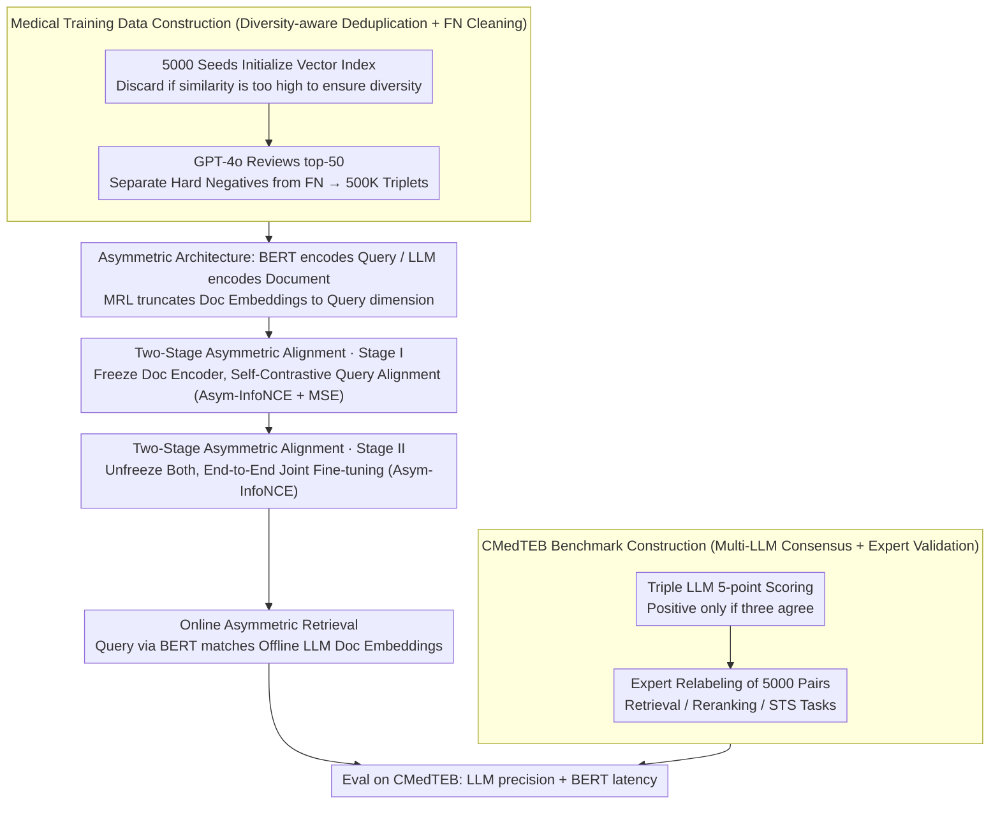

# Benchmarking and Enabling Efficient Chinese Medical Retrieval via Asymmetric Encoders

**Conference**: ACL 2026  
**arXiv**: [2604.10937](https://arxiv.org/abs/2604.10937)  
**Code**: [GitHub](https://github.com/PhilipGAQ/CARE)  
**Area**: Medical Images  
**Keywords**: Medical text retrieval, asymmetric encoders, Chinese medical benchmark, embedding models, RAG

## TL;DR
This paper proposes CMedTEB (Chinese Medical Text Embedding Benchmark) and CARE (an asymmetric retrieval framework). The former builds a high-quality Chinese medical retrieval/reranking/STS benchmark through multi-LLM voting and expert validation. The latter utilizes an asymmetric architecture with a lightweight BERT for query encoding and a large LLM for document encoding, achieving LLM-level retrieval precision with BERT-level online latency through a two-stage progressive alignment strategy.

## Background & Motivation

**Background**: Text embedding models served as infrastructure for NLP and are particularly crucial in RAG systems. Recently, LLM-based embedding models (e.g., Qwen3-Embedding, NV-Embed) have demonstrated superior performance on general benchmarks, but the domain of Chinese medical text embedding has received insufficient attention.

**Limitations of Prior Work**: (1) **Poor benchmark quality**: Existing Chinese medical retrieval benchmarks (CmedqaRetrieval, MedicalRetrieval) suffer from severe false negative issues—the "thematic density" in the medical domain leads to many semantically relevant but unlabeled documents being mislabeled as irrelevant (averaging 9–19 false negatives per query); (2) **Efficiency-accuracy trade-off**: LLM-based embedding models offer high precision but high latency, making them unsuitable for latency-sensitive scenarios like real-time medical Q&A; BERT-style models offer low latency but insufficient precision.

**Key Challenge**: High precision requires large models, while real-time scenarios require low latency—representing a seemingly irreconcilable trade-off between accuracy and efficiency.

**Goal**: (1) Construct a high-quality Chinese medical embedding benchmark; (2) Design a retrieval framework that breaks the accuracy-latency trade-off.

**Key Insight**: In retrieval, query encoding is performed online (requiring low latency), while document encoding can be pre-computed offline (allowing for large models). By exploiting this inherent asymmetry, models of different sizes can be used to encode queries and documents separately.

**Core Idea**: Use lightweight BERT for online query encoding and a large LLM for offline document encoding. The semantic gap between heterogeneous encoders is bridged via two-stage progressive alignment (first freezing the document encoder to align the query encoder, followed by joint fine-tuning).

## Method

### Overall Architecture
This paper delivers both a benchmark and a framework. The CMedTEB benchmark utilizes a multi-LLM consensus annotation pipeline to organize raw medical Q&A corpora into three types of evaluation sets (retrieval, reranking, and STS) with reliable positive and negative labels. The CARE framework explicitly exploits the "online query, offline document" asymmetry inherent in retrieval—queries are handled by a lightweight BERT (0.3B) for real-time encoding, while documents are processed by a large LLM for offline pre-computation of embeddings. Representation gaps between the two heterogeneous encoders are bridged using two-stage progressive alignment. High-quality medical training data is prepared before training CARE: 500K triplets are generated via diversity-aware deduplication and false negative cleaning. Since the query encoder (BERT) and document encoder (LLM) have inconsistent native dimensions, the document encoder employs MRL (Matryoshka Representation Learning) to truncate embeddings to a dimension aligned with the query encoder before entering the two-stage alignment. From input query to result return, the online side only requires a single BERT forward pass, as LLM embeddings for documents are indexed beforehand, achieving LLM-level precision and BERT-level latency.

### Key Designs

**1. CMedTEB Benchmark Construction: Multi-LLM Consensus + Expert Validation**

"Thematic density" in the medical domain causes many semantically relevant but unlabeled documents to be misjudged as irrelevant—existing benchmarks hide an average of 9–19 false negatives per query, and single-model annotation (e.g., CMIRB using only ChatGPT) cannot effectively suppress noise. This paper employs three LLMs (DeepSeek-V3, Doubao-1.5-Pro, GPT-4o) to provide 5-point scores for each query-document pair. Samples are retained as positive only when all three agree, using majority consensus to offset single-model bias. To verify the reliability of this automated annotation, experts independently relabeled 5,000 pairs, achieving a 93.3% consistency rate with the pipeline and a Fleiss' Kappa of 0.731 (indicating "substantial agreement"), thereby establishing gold standards for retrieval, reranking, and STS tasks on a verifiable basis.

**2. Medical Training Data Construction: Diversity-aware Deduplication + False Negative Cleaning**

Standard hard negative mining can backfire in the medical field, as "negatives" mined are often unlabeled positives. This paper first initializes a vector index with 5,000 seed samples; new candidates are discarded if their similarity to existing samples is too high, ensuring thematic diversity in the training set. Subsequently, GPT-4o is used to review the top-50 retrieval results to separate true hard negatives from inadvertently included false negatives. This two-step filtering produces 500K high-quality triplets that cover a wide range of medical sub-themes without feeding positive instances as negatives to the model, directly addressing the chronic false negative issue in medical corpora.

**3. Two-Stage Asymmetric Alignment: Establishing Spatial Mapping then Optimizing Retrieval Boundaries**

Directly training two heterogeneous encoders of vastly different sizes can lead to unstable convergence, so the process is split into two progressive steps. Stage I freezes the large document encoder and aligns only the query encoder using a "self-contrastive" strategy—the same text segment's embeddings from both encoders serve as positive pairs. The loss consists of Asym-InfoNCE (soft rank alignment) and MSE (hard structural alignment); the former aligns relative ranking while the latter constrains absolute structure. This step uses unlabeled data to map the query space onto the document space. Stage II unfreezes both encoders and performs end-to-end joint fine-tuning with Asym-InfoNCE on actual query-document pairs to refine the retrieval decision boundaries. Establishing a foundation via unsupervised learning before tuning performance with supervision is key to the stability and effectiveness of this heterogeneous alignment.

## Key Experimental Results

### Main Results (CMedTEB Comprehensive Scores)

| Model | Parameters (Q/D) | Retrieval nDCG@10 | Rerank MAP@10 | STS Pearson | Avg |
|------|----------|-------------------|---------------|-------------|-----|
| bge-large-zh-v1.5 | 326M/326M | 50.32 | 67.55 | 78.95 | 73.04 |
| Conan-v1 | 326M/326M | 52.75 | 69.31 | 81.49 | 76.44 |
| gte-Qwen2-1.5B | 1.78B/1.78B | 55.39 | 72.35 | 85.50 | 77.61 |
| **CARE-0.3B-4B** | **305M/4.02B** | **55.91** | **72.84** | **88.53** | **78.13** |
| **CARE-0.3B-8B** | **305M/8.19B** | **56.75** | **73.67** | 87.07 | **78.94** |

### Ablation Study (Asymmetric vs. Symmetric vs. Other Efficient Methods)

| Method | Type | Retrieval | Rerank | Avg |
|------|------|-----------|--------|-----|
| KALE | Asymmetric | 42.67 | 67.42 | 55.05 |
| ScalingNote | Asymmetric | 34.81 | 64.17 | 49.49 |
| **CARE-0.3B-4B** | **Asymmetric** | **55.91** | **72.84** | **64.38** |
| Med-Emb-8B (Symmetric) | Symmetric | 56.42 | 74.84 | 65.63 |

### Key Findings
- **CARE breaks the accuracy-latency trade-off**: CARE-0.3B-8B lags behind the fully symmetric 8B model by only 0.6% in accuracy while utilizing 27x fewer parameters during online inference.
- **CMedTEB is significantly harder than existing benchmarks**: General models average 85.15 on CMedQA but only 57.85 on the new CMedTEB tasks.
- **Two-stage training significantly outperforms other asymmetric methods**: CARE outperforms KALE by 9.33pp and ScalingNote by 14.89pp.
- **Performance scales with document encoder size without increasing online costs**: Moving from 4B to 8B improves the average score by 0.81.
- **Severe false negative issues in existing benchmarks**: False negatives identified by LLMs were confirmed by human verification at a rate of 92%.

## Highlights & Insights
- **The core insight is that asymmetric architectures exploit the inherent asymmetry of retrieval tasks**—the fact that queries are online and documents are offline is cleverly utilized. This approach can be transferred to any query-document matching scenario.
- **Self-contrastive alignment** (where representations of the same text across two encoders act as positive pairs) is an elegant unsupervised solution that establishes cross-model spatial mapping without requiring additional labels.
- **The methodology for CMedTEB construction** (multi-LLM consensus + expert validation + false negative analysis) provides a reusable paradigm for building domain-specific benchmarks.

## Limitations & Future Work
- Document encoders require offline pre-computation, making them less suitable for scenarios with frequent document updates (e.g., real-time news retrieval).
- MRL (Matryoshka Representation Learning) in Stage I truncates high-dimensional LLM embeddings to 768 dimensions, potentially losing information.
- CMedTEB only covers Chinese; cross-lingual medical retrieval has not been considered.
- The method is only validated in the medical domain; its generalizability to other specialized fields like law or finance remains to be confirmed.
- Online distillation or progressive knowledge transfer could be explored to further reduce the size of the query encoder.

## Related Work & Insights
- **vs. KALE/ScalingNote**: These methods also employ asymmetric retrieval but use simpler alignment strategies (layer pruning or direct training). The two-stage progressive alignment in this paper is significantly more effective.
- **vs. Symmetric LLM Embeddings**: Models like Qwen3-Embedding lead in precision but have 10x+ higher latency; CARE nearly matches their precision while maintaining BERT-level latency.
- **vs. CMIRB Benchmark**: CMIRB uses a single LLM for annotation and only covers retrieval; CMedTEB's multi-LLM consensus and three-task coverage are more comprehensive.

## Rating
- Novelty: ⭐⭐⭐⭐ The asymmetric architecture is not new, but the two-stage self-contrastive alignment strategy is novel.
- Experimental Thoroughness: ⭐⭐⭐⭐⭐ Comprehensive analysis across benchmarks, models, ablations, and efficiency, with expert validation for benchmark construction.
- Writing Quality: ⭐⭐⭐⭐ Clear structure; figures and tables effectively convey core information.
- Value: ⭐⭐⭐⭐⭐ Full open-sourcing of the benchmark, model, code, and data provides a direct boost to Chinese medical NLP.

<!-- RELATED:START -->

## Related Papers

- [\[ACL 2026\] ChunQiuTR: Time-Keyed Temporal Retrieval in Classical Chinese Annals](chunqiutr_time-keyed_temporal_retrieval_in_classical_chinese_annals.md)
- [\[ICLR 2026\] Efficient Discriminative Joint Encoders for Large Scale Vision-Language Re-ranking](../../ICLR2026/information_retrieval/efficient_discriminative_joint_encoders_for_large_scale_vision-language_rerankin.md)
- [\[ACL 2026\] AuthorityBench: Benchmarking LLM Authority Perception for Reliable Retrieval-Augmented Generation](authoritybench_benchmarking_llm_authority_perception_for_reliable_retrieval-augm.md)
- [\[AAAI 2026\] ComLQ: Benchmarking Complex Logical Queries in Information Retrieval](../../AAAI2026/information_retrieval/comlq_benchmarking_complex_logical_queries_in_information_retrieval.md)
- [\[ACL 2026\] Prune-then-Merge: Towards Efficient Multi-Vector Visual Document Retrieval](sculpting_the_vector_space_towards_efficient_multi-vector_visual_document_retrie.md)

<!-- RELATED:END -->
