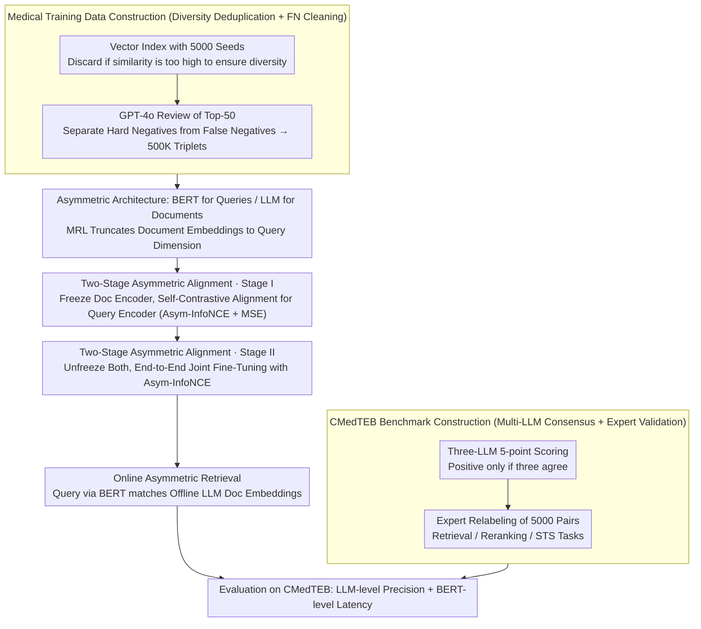

# Benchmarking and Enabling Efficient Chinese Medical Retrieval via Asymmetric Encoders

**Conference**: ACL 2026  
**arXiv**: [2604.10937](https://arxiv.org/abs/2604.10937)  
**Code**: [GitHub](https://github.com/PhilipGAQ/CARE)  
**Area**: Medical Imaging  
**Keywords**: Medical Text Retrieval, Asymmetric Encoders, Chinese Medical Benchmark, Embedding Model, RAG

## TL;DR
This paper proposes CMedTEB (Chinese Medical Text Embedding Benchmark) and CARE (Asymmetric Retrieval Framework). The former establishes a high-quality Chinese medical retrieval/reranking/STS benchmark through multi-LLM voting and expert validation. The latter utilizes an asymmetric architecture with a lightweight BERT for query encoding and a large LLM for document encoding, achieving LLM-level retrieval precision with BERT-level online latency through a two-stage progressive alignment strategy.

## Background & Motivation

**Background**: Text embedding models are fundamental infrastructure for NLP and are particularly critical in RAG systems. Recently, LLM-based embedding models (e.g., Qwen3-Embedding, NV-Embed) have demonstrated superior performance on general benchmarks, but the field of Chinese medical text embedding remains under-explored.

**Limitations of Prior Work**: (1) **Poor benchmark quality**: Existing Chinese medical retrieval benchmarks (CmedqaRetrieval, MedicalRetrieval) suffer from severe false negative issues—the "thematic density" in the medical domain leads to many semantically relevant documents being mislabeled as irrelevant due to lack of annotation (averaging 9-19 false negatives per query). (2) **Efficiency-precision contradiction**: LLM-based embedding models offer high precision but suffer from high latency, making them unsuitable for latency-sensitive scenarios like real-time medical Q&A. Conversely, BERT-style models offer low latency but insufficient precision.

**Key Challenge**: High precision requires large models, while real-time scenarios demand low latency—presenting a seemingly irreconcilable trade-off between precision and efficiency.

**Goal**: (1) Construct a high-quality Chinese medical embedding benchmark; (2) Design a retrieval framework that breaks the precision-latency trade-off.

**Key Insight**: In retrieval, query encoding is online (requiring low latency), whereas document encoding can be pre-computed offline (allowing for large models). By exploiting this inherent asymmetry, different model sizes can be used to encode queries and documents separately.

**Core Idea**: Use a lightweight BERT to encode online queries and an LLM to encode offline documents. A two-stage progressive alignment strategy is employed to bridge the semantic gap between these heterogeneous encoders—first freezing the document encoder to align the query encoder, followed by joint fine-tuning.

## Method

### Overall Architecture
This work delivers both a benchmark and a framework. The CMedTEB benchmark utilizes a multi-LLM consensus annotation pipeline to organize raw medical Q&A corpora into retrieval, reranking, and STS evaluation sets with reliable positive and negative labels. The CARE framework explicitly exploits the inherent "online query, offline document" asymmetry: queries are handled by a lightweight BERT (0.3B) for real-time encoding, while documents are handled by a large LLM for offline pre-computation of embeddings. A two-stage progressive alignment bridges the representation gap between these two heterogeneous encoders. Prior to training CARE, high-quality medical training data is constructed, yielding 500K triplets through diversity-aware deduplication and false negative cleaning. Since the document encoder (LLM) and query encoder (BERT) have different native dimensions, the document encoder first uses MRL (Matryoshka Representation Learning) to truncate embeddings to match the query encoder's dimension before entering the two-stage alignment. From query input to result retrieval, the online side only requires a single BERT forward pass, while the LLM embeddings for documents are indexed offline, thus achieving LLM-level precision with BERT-level latency.

### Key Designs

**1. CMedTEB Benchmark Construction: Multi-LLM Consensus + Expert Validation**

The "thematic density" in the medical domain causes many semantically related but unannotated documents to be misjudged as irrelevant. Existing benchmarks contain an average of 9–19 false negatives per query, which single-model annotation (e.g., CMIRB using only ChatGPT) fails to suppress. This work employs three LLMs (DeepSeek-V3, Doubao-1.5-Pro, GPT-4o) to provide 5-point scores for each query-document pair, retaining only those where all three agree as positive samples to negate single-model bias. To verify the reliability of this automated pipeline, experts independently relabeled 5000 pairs, achieving an agreement rate of 93.3% with the pipeline (Fleiss' Kappa = 0.731, indicating "substantial agreement"). This establishes a verifiable gold standard for retrieval, reranking, and STS tasks.

**2. Medical Training Data Construction: Diversity-aware Deduplication + False Negative Cleaning**

Standard hard negative mining can be counterproductive in the medical domain, as mined "negatives" are often unannotated positives. This paper initializes a vector index with 5000 seed samples and discards new candidates if their similarity is too high, ensuring thematic diversity in the training set. Subsequently, GPT-4o reviews the top-50 retrieval results to distinguish true hard negatives from false negatives. This dual-filtering process produces 500K high-quality triplets that cover a wide range of medical sub-topics without feeding positive samples as negatives to the model, directly addressing the false negative issue in medical corpora.

**3. Two-stage Asymmetric Alignment: Establishing Spatial Mapping then Optimizing Retrieval Boundaries**

Direct joint training of two heterogeneous encoders of vastly different sizes can lead to unstable convergence. Thus, the process is split into two progressive steps. Stage I freezes the large document encoder and aligns only the query encoder using a "self-contrastive" strategy—where the embeddings of the same text from both encoders serve as positive pairs. The loss consists of Asym-InfoNCE (for soft ranking alignment) and MSE (for hard structural alignment). The former aligns relative ranking, while the latter constrains absolute structure; this step maps the query space to the document space using unlabeled data. Stage II unfreezes both encoders for end-to-end joint fine-tuning using real query-document pairs and Asym-InfoNCE to refine the retrieval decision boundaries. Establishing an unsupervised foundation before supervised performance tuning is the key to the stability and effectiveness of this heterogeneous alignment.

## Key Experimental Results

### Main Results (CMedTEB Comprehensive Scores)

| Model | Params (Q/D) | Retrieval nDCG@10 | Rerank MAP@10 | STS Pearson | Avg |
|------|----------|-------------------|---------------|-------------|-----|
| bge-large-zh-v1.5 | 326M/326M | 50.32 | 67.55 | 78.95 | 73.04 |
| Conan-v1 | 326M/326M | 52.75 | 69.31 | 81.49 | 76.44 |
| gte-Qwen2-1.5B | 1.78B/1.78B | 55.39 | 72.35 | 85.50 | 77.61 |
| **CARE-0.3B-4B** | **305M/4.02B** | **55.91** | **72.84** | **88.53** | **78.13** |
| **CARE-0.3B-8B** | **305M/8.19B** | **56.75** | **73.67** | 87.07 | **78.94** |

### Ablation Study (Asymmetric vs. Symmetric vs. Other Efficient Methods)

| Method | Type | Retrieval | Rerank | Avg |
|------|------|-----------|--------|-----|
| KALE | Asymmetric | 42.67 | 67.42 | 55.05 |
| ScalingNote | Asymmetric | 34.81 | 64.17 | 49.49 |
| **CARE-0.3B-4B** | **Asymmetric** | **55.91** | **72.84** | **64.38** |
| Med-Emb-8B (Symmetric) | Symmetric | 56.42 | 74.84 | 65.63 |

### Key Findings
- **CARE breaks the precision-latency trade-off**: CARE-0.3B-8B lags behind the fully symmetric 8B model by only 0.6% in accuracy, while having 27x fewer online inference parameters.
- **CMedTEB is significantly harder than existing benchmarks**: General models average 85.15 on CMedQA but only 57.85 on the new CMedTEB tasks.
- **Two-stage training significantly outperforms other asymmetric methods**: CARE outperforms KALE by 9.33pp and ScalingNote by 14.89pp.
- **Performance improves as the document encoder scales**: Scaling from 4B to 8B increases the average score by 0.81 without increasing online costs.
- **Severe false negative issues in existing benchmarks**: LLM-labeled false negatives were confirmed by expert verification at a rate of 92%.

## Highlights & Insights
- **Asymmetric architecture leverages the natural asymmetry of retrieval tasks**: The core insight is utilizing the fact that queries are online while documents are offline. This approach can be migrated to any query-document matching scenario.
- **Self-contrastive alignment**: Defining representations of the same text across two encoders as positive pairs is an elegant unsupervised solution to establish cross-model spatial mapping without additional annotations.
- **CMedTEB construction methodology**: The combination of multi-LLM consensus, expert validation, and false negative analysis provides a reusable paradigm for building domain-specific benchmarks.

## Limitations & Future Work
- Document encoders require offline pre-computation, making the framework less suitable for scenarios with frequent document updates (e.g., real-time news retrieval).
- The use of MRL (Matryoshka Representation Learning) to truncate high-dimensional LLM embeddings to 768 dimensions may result in information loss.
- CMedTEB currently only covers Chinese; cross-lingual medical retrieval is not considered.
- The framework is verified only in the medical domain; its generalizability to other specialized fields like law or finance remains to be confirmed.
- Future work could explore online distillation or progressive knowledge transfer to further shrink the query encoder.

## Related Work & Insights
- **vs. KALE/ScalingNote**: While these methods also employ asymmetric retrieval, their alignment strategies (layer pruning or direct training) are simpler. This paper's two-stage progressive alignment is significantly more effective.
- **vs. Symmetric LLM Embeddings**: Models like Qwen3-Embedding lead in precision but have 10x+ higher latency; CARE nearly matches their precision while maintaining BERT-level latency.
- **vs. CMIRB Benchmark**: CMIRB relies on a single LLM for annotation and only covers retrieval. CMedTEB is more comprehensive with multi-LLM consensus and triple-task coverage.

## Rating
- Novelty: ⭐⭐⭐⭐ The asymmetric architecture is not new, but the two-stage self-contrastive alignment strategy is novel.
- Experimental Thoroughness: ⭐⭐⭐⭐⭐ Comprehensive analysis involving benchmarks, models, ablations, and efficiency; benchmark construction is robustly validated by experts.
- Writing Quality: ⭐⭐⭐⭐ Clear structure; tables and figures effectively communicate core information.
- Value: ⭐⭐⭐⭐⭐ Full open-source release of benchmark, model, code, and data provides a direct boost to Chinese medical NLP.

<!-- RELATED:START -->

## Related Papers

- [\[ACL 2026\] ChunQiuTR: Time-Keyed Temporal Retrieval in Classical Chinese Annals](chunqiutr_time-keyed_temporal_retrieval_in_classical_chinese_annals.md)
- [\[ACL 2026\] AuthorityBench: Benchmarking LLM Authority Perception for Reliable Retrieval-Augmented Generation](authoritybench_benchmarking_llm_authority_perception_for_reliable_retrieval-augm.md)
- [\[AAAI 2026\] ComLQ: Benchmarking Complex Logical Queries in Information Retrieval](../../AAAI2026/information_retrieval/comlq_benchmarking_complex_logical_queries_in_information_retrieval.md)
- [\[ICLR 2026\] Beyond RAG vs. Long-Context: Learning Distraction-Aware Retrieval for Efficient Knowledge Grounding](../../ICLR2026/information_retrieval/beyond_rag_vs_long-context_learning_distraction-aware_retrieval_for_efficient_kn.md)
- [\[ICML 2026\] LazyAttention: Efficient Retrieval-Augmented Generation with Deferred Positional Encoding](../../ICML2026/information_retrieval/lazyattention_efficient_retrieval-augmented_generation_with_deferred_positional_.md)

<!-- RELATED:END -->
