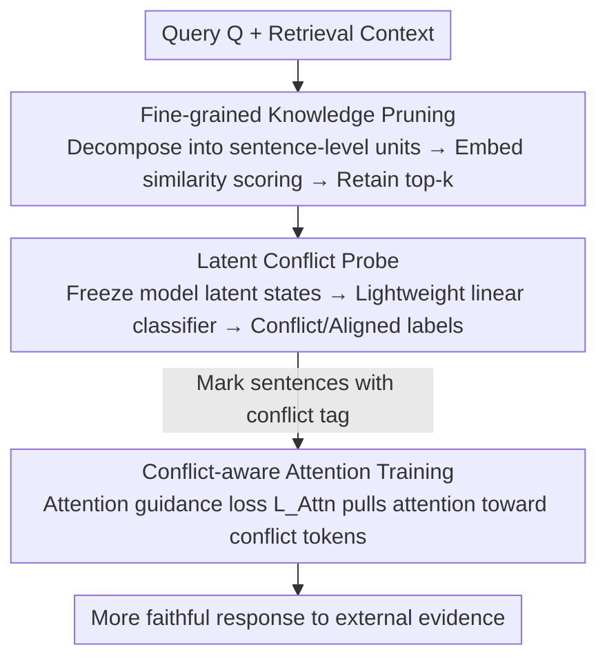

# Beyond Black-Box Interventions: Latent Probing for Faithful Retrieval-Augmented Generation

**Conference**: ACL 2026 Findings  
**arXiv**: [2510.12460](https://arxiv.org/abs/2510.12460)  
**Code**: [GitHub](https://github.com/XMUDeepLIT/ProbeRAG)  
**Area**: Information Retrieval / RAG  
**Keywords**: RAG Faithfulness, Knowledge Conflict, Latent Probing, Attention Guidance, Contextual Pruning

## TL;DR

The authors propose ProbeRAG, a three-stage framework (fine-grained knowledge pruning → latent conflict probing → conflict-aware attention) that addresses RAG faithfulness from the internal mechanisms by discovering the linear separability of conflicting/aligned knowledge in the LLM latent space.

## Background & Motivation

**Background**: RAG systems enhance LLMs with external knowledge to effectively mitigate hallucination issues. In practice, however, RAG often faces challenges regarding contextual faithfulness: generated content may be inconsistent with the retrieved context or fail to utilize external evidence properly.

**Limitations of Prior Work**: Existing methods treat LLMs as a black box and improve faithfulness through external interventions: (1) Prompting methods are sensitive to specific prompts and suffer from poor generalization; (2) Decoding calibration methods are fragile under noisy contexts; (3) DPO preference optimization requires substantial high-quality preference data. These methods cannot diagnose "when" and "why" conflicts occur.

**Key Challenge**: External interventions are correlational rather than causal—they can statistically associate inputs with faithful outputs but cannot diagnose why a model fails in specific conflict instances.

**Goal**: To move beyond black-box interventions and analyze/resolve knowledge conflict issues through internal latent space analysis.

**Key Insight**: Analyzing the LLM latent space reveals that conflicting and aligned knowledge are linearly separable in latent states, while contextual noise systematically increases the entropy of these latent states.

**Core Idea**: Train a lightweight probe to detect conflict features in the latent space, then employ an attention guidance loss to force the model to focus more on conflicting knowledge.

## Method

### Overall Architecture

ProbeRAG does not treat the LLM as a black box for external intervention. Instead, based on the observation that "conflicting knowledge is linearly separable in the latent space," it addresses RAG faithfulness through the model's internal mechanisms. Given a query and retrieved context, the framework processes through three sequential stages: context is first decomposed into fine-grained knowledge sentences and irrelevant items are filtered for denoising; a lightweight probe then detects which sentences conflict with parametric knowledge via latent states; finally, conflicting sentences are tagged with `<conflict>`, and the model is trained to shift attention toward them in the attention layers, ultimately producing responses that are more faithful to external evidence.

### Key Designs

**1. Fine-grained Knowledge Pruning: Denoising to preserve the separability of conflict features**

Preliminary research found that contextual noise systematically elevates latent state entropy and blurs the boundary between conflicting and aligned knowledge; therefore, denoising is the necessary first step. The authors use an LLM to decompose context into sentence-level independent knowledge units $\{K_1, K_2, ..., K_n\}$, then score each unit against the query using embedding similarity $f(Q, K_i) = \langle q, k_i \rangle$, retaining only the top-k. Pruning reduces the burden on the subsequent probe and suppresses residual noise, allowing the linear boundary in the latent space to clarify—as confirmed by ablation experiments where probe accuracy dropped significantly without pruning.

**2. Latent Conflict Probe: Using a linear classifier to read out conflict signals**

t-SNE visualization and JSD analysis show that conflicting and aligned knowledge are linearly separable in LLM latent states. This property can be inversely exploited. In this work, a lightweight classifier $\mathcal{P}(\mathcal{M}(K_i)) \in \{0, 1\}$ is trained on the MQuAKE knowledge editing dataset. It takes the latent states of the frozen model for knowledge unit $K_i$ as input and outputs binary conflict/aligned labels. The probe itself is extremely lightweight (a simple classifier) yet accurately locates statements in the context that "clash with model memory." Despite being trained only on MQuAKE, it generalizes well to RAG domain data.

**3. Conflict-aware Attention Training: Explicitly pulling attention toward conflicting knowledge**

Models naturally tend to rely on parametric memory and ignore external context; detection alone is insufficient, as the model must be forced to actually attend to conflicting knowledge during generation. Therefore, an attention guidance loss $\mathcal{L}_{\text{Attn}} = \frac{1}{|P|}\sum_{(i,j) \in P}(1 - \alpha_{ij})$ is introduced. This loss penalizes low attention weights $\alpha_{ij}$ for each Position pair $P$ representing "subsequent token → conflict token," forcing the model to allocate more focus to conflict tokens. It is optimized jointly with cross-entropy as $\mathcal{L} = (1-\lambda)\mathcal{L}_{CE} + \lambda\mathcal{L}_{Attn}$, where $\lambda$ regulates the trade-offs between "answering correctly" and "attending accurately," directly correcting the model's over-reliance on parametric knowledge at the attention layer level.

### Loss & Training

The joint goal consists of cross-entropy plus attention guidance loss, balanced by $\lambda$. The probe is trained on the MQuAKE dataset while maintaining generalization to RAG domains. Conflicting knowledge in the sequence is wrapped with special `<conflict>` / `</conflict>` tokens to allow the attention guidance loss to target specific locations.

## Key Experimental Results

### Main Results

| Model | Method | FaithEval F1 | ConFiQA F1 | SQuAD F1 |
|------|------|-------------|-----------|----------|
| LLaMA-3.1-8B | No-Context | 27.7 | 5.0-6.1 | 8.9 |
| LLaMA-3.1-8B | Baseline RAG | ~59% | - | - |
| LLaMA-3.1-8B | ProbeRAG | **Significant Gain** | **Significant Gain** | **Significant Gain** |

### Key Findings

| Analysis | Discovery |
|------|------|
| Latent state JSD increases with depth | Deeper layers capture more abstract conflict features; JSD is more significant in larger models |
| Impact of noise | Contextual noise systematically blurs the conflict/aligned boundary |
| Probe generalization | Trained on MQuAKE, generalizes well to RAG datasets |
| Attention vs ICL | Attention guidance significantly outperforms pure in-context learning |

- Conflicting and aligned knowledge are linearly separable in the latent space (verified across all model sizes).
- Conflict features primarily appear in the middle to late layers, consistent with Transformer hierarchical representation hypotheses.
- Fine-grained knowledge pruning is critical—without it, the probe's accuracy significantly decreases.
- Attention guidance is more effective than external interventions like DPO and has lower data requirements.

## Highlights & Insights

- The shift from black-box intervention to internal mechanism analysis represents a significant paradigm shift.
- The discovery of "conflict features" provides theoretical value, explaining why LLMs favor parametric knowledge.
- The logic of the three-stage framework (denoise → detect → guide) is exceptionally clear.
- Probes are lightweight (simple classifiers) and easy to deploy.

## Limitations & Future Work

- Knowledge decomposition depends on external LLMs (GPT-4o), which increases costs.
- The probe requires labeled conflict/aligned data for training.
- Attention guidance training requires model fine-tuning.
- Future work could explore training-free, inference-time conflict mitigation solutions.

## Related Work & Insights

- Linear Representation Hypothesis (Park et al., 2023): Reflects the linear separability of semantic concepts in latent space.
- Knowledge Editing (MQuAKE, Zhong et al., 2023): Provides conflict/aligned knowledge pairs.
- RAG faithfulness methods: Self-RAG, CRAG, etc.
- Latent probing is a powerful tool for understanding and intervening in LLM behavior.

## Rating

- Novelty: ⭐⭐⭐⭐⭐ Addresses RAG faithfulness from a latent space perspective and discovers conflict features.
- Experimental Thoroughness: ⭐⭐⭐⭐ Extensive multi-model and multi-dataset evaluation with sufficient preliminary research and ablation.
- Writing Quality: ⭐⭐⭐⭐⭐ Extremely clear logical chain from findings to proposed method.
- Value: ⭐⭐⭐⭐⭐ Provides Mechanistic understanding and solutions for the RAG faithfulness problem.

<!-- RELATED:START -->

<!-- RELATED:END -->

## Related Papers

- [\[ACL 2026\] CiteGuard: Faithful Citation Attribution for LLMs via Retrieval-Augmented Validation](citeguard_faithful_citation_attribution_for_llms_via_retrieval-augmented_validat.md)
- [\[ACL 2025\] FaithfulRAG: Fact-Level Conflict Modeling for Context-Faithful Retrieval-Augmented Generation](../../ACL2025/information_retrieval/faithfulrag_fact_level_conflict.md)
- [\[ACL 2026\] Language-Coupled Reinforcement Learning for Multilingual Retrieval-Augmented Generation](language-coupled_reinforcement_learning_for_multilingual_retrieval-augmented_gen.md)
- [\[ACL 2026\] Feedback Adaptation for Retrieval-Augmented Generation](feedback_adaptation_for_retrieval-augmented_generation.md)
- [\[ACL 2026\] MASS-RAG: Multi-Agent Synthesis Retrieval-Augmented Generation](mass-rag_multi-agent_synthesis_retrieval-augmented_generation.md)

<!-- RELATED:END -->
