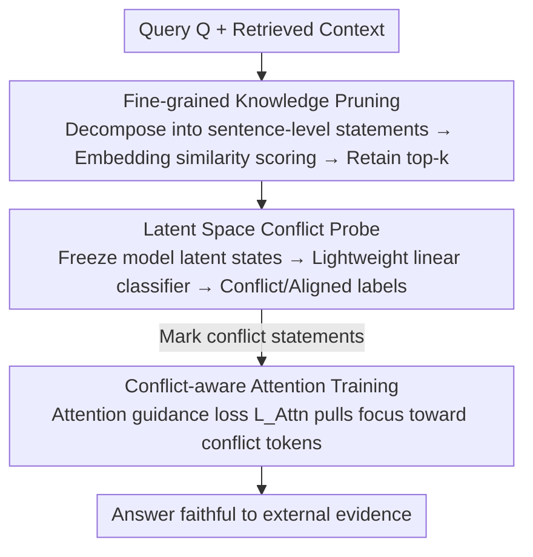

# Beyond Black-Box Interventions: Latent Probing for Faithful Retrieval-Augmented Generation

**Conference**: ACL 2026 Findings  
**arXiv**: [2510.12460](https://arxiv.org/abs/2510.12460)  
**Code**: [GitHub](https://github.com/XMUDeepLIT/ProbeRAG)  
**Area**: Information Retrieval / RAG  
**Keywords**: RAG Faithfulness, Knowledge Conflict, Latent Space Probing, Attention Guidance, Context Pruning

## TL;DR

ProbeRAG is proposed to address RAG faithfulness through the model's internal mechanisms by discovering the linear separability of conflicting/aligned knowledge in the LLM's latent space. It employs a three-stage framework: fine-grained knowledge pruning, latent space conflict probing, and conflict-aware attention.

## Background & Motivation

**Background**: RAG systems enhance LLMs with external knowledge to mitigate Hallucinations. However, in practice, RAG faces challenges regarding contextual faithfulness: generated content may be inconsistent with the retrieved context or fail to utilize external evidence.

**Limitations of Prior Work**: Existing methods treat the LLM as a black box and improve faithfulness via external interventions: (1) Prompting methods are sensitive to prompts and generalize poorly; (2) Decoding calibration methods are fragile under noisy contexts; (3) DPO preference optimization requires large amounts of high-quality preference data. These methods cannot diagnose "when" and "why" conflicts occur.

**Key Challenge**: External interventions are correlational rather than causal—they can statistically associate inputs with faithful outputs but cannot diagnose why a model fails in specific conflict instances.

**Goal**: To move beyond black-box interventions by analyzing and resolving knowledge conflict issues via the model's internal latent space.

**Key Insight**: Analysis of the LLM latent space reveals that conflicting and aligned knowledge are linearly separable in latent states, while contextual noise systematically increases latent state entropy.

**Core Idea**: Train lightweight probes to detect conflict features in the latent space, then use an attention guidance loss to direct the model's focus toward conflicting knowledge.

## Method

### Overall Architecture

Rather than treating the LLM as a black box, ProbeRAG addresses RAG faithfulness via internal mechanisms based on the observation that "conflicting knowledge is linearly separable in the latent space." Given a query and retrieved context, the framework processes them in three serial stages: the context is decomposed into fine-grained knowledge statements and irrelevant items are filtered to reduce noise; a lightweight probe is then used to detect which statements conflict with the model's parametric knowledge in the latent states; finally, conflicting statements are marked with `<conflict>` tags, and the model is trained to shift its attention toward them during generation to produce answers faithful to external evidence.

### Key Designs

**1. Fine-grained Knowledge Pruning: Denosing to preserve separability of conflict features**

Preliminary research found that contextual noise systematically elevates latent state entropy, blurring the boundary between conflicting and aligned knowledge. Thus, noise reduction is the first step. Ours uses an LLM to decompose the context into independent sentence-level knowledge statements $\{K_1, K_2, ..., K_n\}$, then scores each statement against the query using embedding similarity $f(Q, K_i) = \langle q, k_i \rangle$, retaining only the top-$k$. Pruning reduces the burden on the subsequent probe and suppresses residual noise, clarifying the linear boundary—ablation studies confirm that probing accuracy drops significantly without pruning.

**2. Latent Space Conflict Probe: Reading conflict signals using a linear classifier**

t-SNE visualization and JSD analysis show that conflicting and aligned knowledge are linearly separable in the LLM's latent states. This property is exploited by training a lightweight classifier $\mathcal{P}(\mathcal{M}(K_i)) \in \{0, 1\}$ on the MQuAKE knowledge editing dataset. The input is the latent state of knowledge statement $K_i$ from the frozen model, and the output is a binary conflict/aligned label. The probe is extremely lightweight yet precisely locates statements that "clash with the model's memory," generalizing well to RAG domain data despite being trained only on MQuAKE.

**3. Conflict-aware Attention Training: Explicitly pulling attention toward conflicting knowledge**

Models naturally tend to rely on parametric memory and ignore external context; detection alone is insufficient. An attention guidance loss $\mathcal{L}_{\text{Attn}} = \frac{1}{|P|}\sum_{(i,j) \in P}(1 - \alpha_{ij})$ is introduced to punish low attention weights $\alpha_{ij}$ for every "following token $\rightarrow$ conflict knowledge token" pair $P$, forcing the model to allocate more attention to conflict tokens. It is optimized jointly with cross-entropy as $\mathcal{L} = (1-\lambda)\mathcal{L}_{CE} + \lambda\mathcal{L}_{Attn}$, where $\lambda$ balances "correctness" and "attention accuracy," correcting the model's over-reliance on parametric knowledge.

### Loss & Training

The joint objective combines cross-entropy and attention guidance loss, with $\lambda$ controlling the trade-off. The probe is trained on the MQuAKE dataset but maintains generalization to RAG domains. Conflicting knowledge is wrapped with `<conflict>` / `</conflict>` special tokens in the sequence for the attention guidance loss to locate target positions.

## Key Experimental Results

### Main Results

| Model | Method | FaithEval F1 | ConFiQA F1 | SQuAD F1 |
|------|------|-------------|-----------|----------|
| LLaMA-3.1-8B | No-Context | 27.7 | 5.0-6.1 | 8.9 |
| LLaMA-3.1-8B | Baseline RAG | ~59% | - | - |
| LLaMA-3.1-8B | ProbeRAG | **Significant Gain** | **Significant Gain** | **Significant Gain** |

### Key Analysis

| Analysis | Finding |
|------|------|
| Latent state JSD increases with depth | Deeper layers capture more abstract conflict features; larger models show more significant JSD |
| Noise impact | Contextual noise systematically blurs the conflict/aligned boundary |
| Probe generalization | Trained on MQuAKE, generalizes well to RAG data |
| Attention vs ICL | Attention guidance significantly outperforms pure in-context learning |

### Key Findings

- Conflicting and aligned knowledge are linearly separable in the latent space (verified across all model sizes).
- Conflict features primarily appear in the middle and late layers, consistent with the hierarchical representation hypothesis of Transformers.
- Fine-grained knowledge pruning is critical—probing accuracy decreases significantly without it.
- Attention guidance is more effective than external interventions like DPO and requires less data.

## Highlights & Insights

- Shifting from black-box intervention to internal mechanism analysis represents a significant paradigm shift.
- The discovery of "conflict features" has theoretical value, explaining why LLMs prefer parametric knowledge.
- The three-stage framework (denoising → detection → guidance) is logically structured.
- The probe is lightweight (simple classifier) and easy to deploy.

## Limitations & Future Work

- Knowledge decomposition depends on an external LLM (GPT-4o), increasing costs.
- The probe requires labeled conflict/aligned data for training.
- Attention guidance training requires model fine-tuning.
- Future work could explore training-free, inference-time conflict mitigation solutions.

## Related Work & Insights

- Linear Representation Hypothesis (Park et al., 2023): Linear separability of semantic concepts in latent space.
- Knowledge Editing (MQuAKE, Zhong et al., 2023): Provides conflicting/aligned knowledge pairs.
- RAG Faithfulness methods: Self-RAG, CRAG, etc.
- Latent space probing is a powerful tool for understanding and intervening in LLM behavior.

## Rating

- Novelty: ⭐⭐⭐⭐⭐ Resolves RAG faithfulness from a latent space perspective, discovering conflict features.
- Experimental Thoroughness: ⭐⭐⭐⭐ Extensive testing across multiple models/datasets with solid preliminary research and ablations.
- Writing Quality: ⭐⭐⭐⭐⭐ Extremely clear logical chain from discovery to methodology.
- Value: ⭐⭐⭐⭐⭐ Provides mechanistic understanding and solutions for the RAG faithfulness problem.

<!-- RELATED:START -->

## Related Papers

- [\[ACL 2026\] CiteGuard: Faithful Citation Attribution for LLMs via Retrieval-Augmented Validation](citeguard_faithful_citation_attribution_for_llms_via_retrieval-augmented_validat.md)
- [\[ACL 2025\] FaithfulRAG: Fact-Level Conflict Modeling for Context-Faithful Retrieval-Augmented Generation](../../ACL2025/information_retrieval/faithfulrag_fact_level_conflict.md)
- [\[ACL 2026\] Language-Coupled Reinforcement Learning for Multilingual Retrieval-Augmented Generation](language-coupled_reinforcement_learning_for_multilingual_retrieval-augmented_gen.md)
- [\[ACL 2026\] Beyond Chunks and Graphs: Retrieval-Augmented Generation through Triplet-Driven Thinking](beyond_chunks_and_graphs_retrieval-augmented_generation_through_triplet-driven_t.md)
- [\[ACL 2026\] Feedback Adaptation for Retrieval-Augmented Generation](feedback_adaptation_for_retrieval-augmented_generation.md)

<!-- RELATED:END -->
