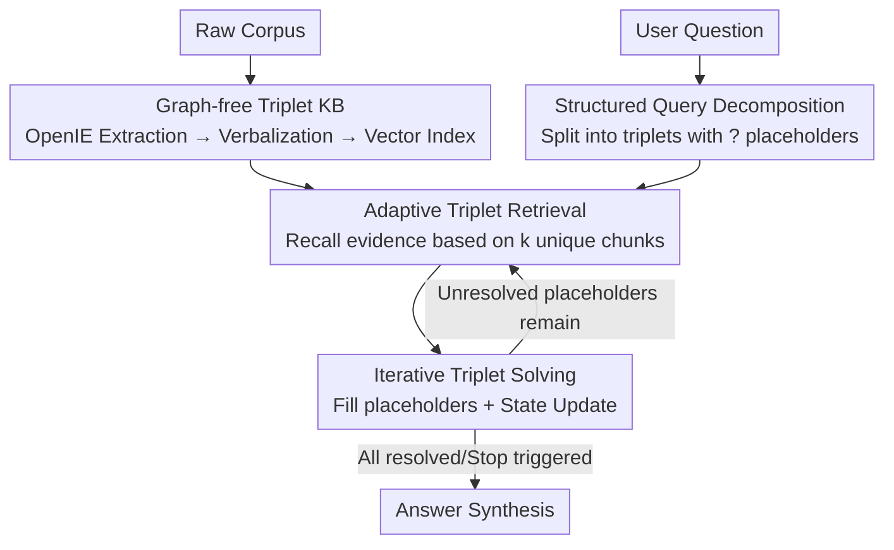

# Beyond Chunks and Graphs: Retrieval-Augmented Generation through Triplet-Driven Thinking

**Conference**: ACL2026  
**arXiv**: [2508.02435](https://arxiv.org/abs/2508.02435)  
**Code**: https://github.com/Emory-Melody/T2RAG  
**Area**: Information Retrieval / RAG  
**Keywords**: Retrieval-Augmented Generation, Atomic Triplets, Multi-hop QA, Iterative Retrieval, Graph-free Knowledge Base

## TL;DR
T2RAG replaces the minimum retrieval unit of RAG from "text chunks/KG nodes" with **atomic triplets**. Off-line, the corpus is extracted into a collection of triplet propositions for indexing. On-line, the LLM decomposes the question into searchable triplets with `?` placeholders, iteratively retrieving evidence from the triplet library to fill in the blanks until all placeholders are resolved to generate the final answer. This achieves an average improvement of up to 11% across six datasets while reducing retrieval costs by up to 45%.

## Background & Motivation
**Background**: RAG is a mainstream paradigm for mitigating LLM hallucinations and injecting external knowledge. Standard RAG retrieves document chunks based on similarity, which suffices for simple questions. For complex multi-hop questions, two advanced routes have emerged: Multi-Round RAG and Graph RAG.

**Limitations of Prior Work**: Both routes have inherent flaws. Multi-round RAG (e.g., IRCoT) relies on LLMs to split complex questions into sub-queries for step-by-step reasoning. While strong in multi-hop capabilities, each round generates a lengthy natural language CoT, requiring 3–6 LLM calls per round and potentially 8 rounds in total, leading to massive token and latency overhead. Furthermore, chunk embeddings suffer from "compression loss" where details are lost during long-text compression. Graph RAG (e.g., GraphRAG, LightRAG, HippoRAG2) structures the corpus into a knowledge graph before retrieval, but offline graph construction is expensive and error-prone—suffering from inaccurate entity ambiguity and retrieval redundancy from high-degree nodes, and LLMs find it difficult to understand graph structures.

**Key Challenge**: There is a mismatch between retrieval "granularity" and "cost." Chunks are too coarse (containing irrelevant information + compression loss), while explicit graphs are too heavy (expensive construction, incorrect links). The root cause is that **multi-hop queries lack the intermediate entities needed to connect different chunks**, and neither chunks nor graphs align "what is missing during reasoning" with "what is stored in the index."

**Goal**: Can triplets be used directly as the basic unit of RAG to avoid entity-level ambiguity and chunk-level compression loss, while retaining multi-hop reasoning capabilities and slashing token overhead?

**Key Insight**: A triplet (subject, predicate, object) is a complete, unambiguous atomic fact—semantically more complete than isolated entities and more focused than chunks. By having the LLM "think in triplets"—expressing missing reasoning links as triplets in the same format—the reasoning products and the retrieval index become naturally semantically aligned, coupling retrieval and reasoning tightly.

**Core Idea**: Use **triplets with placeholders** as a unified unit for indexing, retrieval, and reasoning, replacing "graph construction" and "CoT writing" with iterative "triplet solving."

## Method

### Overall Architecture
T2RAG (Triplet-driven Thinking RAG) consists of two stages. **Offline Indexing**: The raw corpus $\mathcal{C}$ is extracted using OpenIE into a global triplet set $\mathcal{T}_{total}$, and each triplet is "verbalized" into a natural language proposition $p$, which is then encoded using an embedding model into a FAISS vector library—creating a **graph-free triplet proposition index** that maintains mapping from each proposition back to its source chunk. **Online Retrieval**: Given a question, the LLM performs structured decomposition into several query triplets with `?` placeholders. An iterative loop follows: in each round, "searchable triplets" are converted into retrieval queries to recall evidence from the proposition library, the LLM fills placeholders, stays are updated, and the cycle continues until all placeholders are resolved or a stop condition is met. Finally, the answer is synthesized based on the resolved triplets.

The pipeline follows a clear "Offline Library → Decomposition → Retrieval → Solving → State Update (Loop) → Synthesis" flow:

### Key Designs

**1. Graph-free Triplet Knowledge Base: Proposition Indexing instead of Graph Construction**

To address the "expensive and error-prone" nature of Graph RAG, T2RAG avoids graph construction entirely. In the offline phase, each chunk $c_i$ undergoes OpenIE using an information extraction model $LLM_{IE}$ to extract normalized triplets $(subject, predicate, object)$, aggregated as $\mathcal{T}_{total}=\bigcup_{i=1}^{M}\mathcal{T}_i$. The critical step is **verbalization**: the three components of the triplet are concatenated into a single sentence ("subject predicate object") to form a proposition $p$, which is encoded via an embedding model $E(\cdot)$ into a FAISS index $\mathcal{I}$. This serves two purposes: compared to entities, each proposition encodes a **complete and unambiguous fact**; compared to chunks, it **avoids compression loss in long-text embeddings**. The index also maps propositions to source chunks for detail completion. Compared to Graph RAG, it skips offline graph construction—the paper notes that LightRAG and GraphRAG construction costs are approximately $6\times$ and $10\times$ the initial triplet extraction tokens, respectively. T2RAG limits overhead to the "triplet extraction" step, making its indexing cost highly competitive.

**2. Structured Query Decomposition: Placeholders and Searchability Classification**

To solve the "missing intermediate entities" problem, T2RAG avoids natural language sub-queries. Instead, the LLM decomposes the question into a set of query triplets $\mathcal{T}_q$, where unknown entities are explicitly marked with `?` placeholders. Triplets are classified into three types based on placeholder count: **Resolved Triplets** ($\mathcal{T}_{\text{resolved}}$, zero placeholders; known facts requiring no retrieval), **Searchable Triplets** ($\mathcal{T}_{\text{searchable}}$, exactly one placeholder; two known elements make retrieval highly focused), and **Fuzzy Triplets** ($\mathcal{T}_{\text{fuzzy}}$, two or more placeholders; too vague to search directly, pending upgrades to searchable or resolved in subsequent rounds). This explicit classification ensures that each retrieval round is efficient, only targeting triplets that are exactly one piece of information away.

**3. Adaptive Triplet Retrieval: Budget Control via Unique Source Chunks + Global Ranking**

To address the lack of robustness in fixed top-$k$ retrieval for varied query complexities, T2RAG's retrieval is adaptive in two dimensions. Current searchable triplets $\mathcal{T}_{\text{searchable}}^{(l)}$ are concatenated into query propositions (minus placeholders) and encoded by $E(\cdot)$. First, **retrieval volume is constrained by a unique chunk count rather than a fixed proposition count**: recall continues until triplets from $k$ different source chunks are accumulated, allowing hard questions to naturally gather evidence from a broader range of propositions. Second, a **Global Candidate Pool**: candidates for all query propositions are merged into a unified pool and ranked globally by similarity, rather than assigning a fixed budget to each individual proposition. The final recalled proposition set $\mathcal{P}_{\text{retrieved}}^{(l)}$ and their source chunks $\mathcal{C}_{\text{retrieved}}^{(l)}$ are returned—retaining the original text is necessary as triplets often omit details needed for full parsing.

**4. Iterative Triplet Solving and Compact State Transition: Triplets as "Working Memory"**

This is the core efficiency of T2RAG. After obtaining retrieval context, the LLM is prompted to **fill placeholders**: upgrading searchable triplets to resolved (filling the one `?`), or upgrading fuzzy triplets to searchable/resolved (filling one or more `?`). Subsequently, a **State Update** is performed: the resolved set monotonically accumulates verified facts; the next round targets only **newly generated** searchable triplets; solved or upgraded items are pruned from the fuzzy queue; if no searchable triplets are generated, it falls back to dense retrieval using the natural language embedding of the current question. The iteration **only passes compact triplets between rounds, not lengthy CoTs**, which drastically reduces token usage. Furthermore, the LLM-generated "reasoning gaps" share the format of the retrieval index (triplets), resulting in strong semantic alignment. Termination occurs if: (1) both searchable and fuzzy queues are empty; (2) no new searchable triplets are generated and no fuzzy triplets remain (early stop); or (3) the maximum iterations $N$ is reached.

### Mechanism Example
Tracing a query "Who is the child of the performer of Me And Bobby McGee?": In a previous round, `?performer` was resolved to "Roger Miller". The system generates a searchable triplet $(\text{Roger Miller}, \text{child}, \texttt{?child})$. The placeholder is removed to form "Roger Miller child", encoded to search $\mathcal{I}$, recalling chunks containing Roger Miller's family info. The LLM reads context like "...Roger Miller's son, Dean Miller...", upgrades the triplet to resolved $(\text{Roger Miller}, \text{child}, \text{Dean Miller})$. The state updates, queues clear, and the final answer "Dean Miller" is synthesized.

## Key Experimental Results

### Main Results
Six datasets covering three ODQA types: Simple QA (PopQA), Multi-hop QA (2Wiki, MuSiQue, HotpotQA), and Domain QA (Story, Medical, adapted from GraphRAG-Bench). NV-Embed-v2 is used for embeddings, and LLMs include Gemini-2.5-flash or GPT-4o-mini. Multi-round methods used $N=3$ rounds with $k=5$. Metrics are EM/F1. Baselines include No-retrieval (NOR), BM25, Standard RAG, HippoRAG2, RAPTOR, and IRCoT.

| LLM Backend | Method | Avg. EM | Avg. F1 |
|-------------|--------|---------|---------|
| Gemini-2.5-flash | IRCoT (Strong Baseline) | 46.7 | 61.8 |
| Gemini-2.5-flash | RAPTOR | 43.6 | 54.6 |
| Gemini-2.5-flash | HippoRAG2 | 39.8 | 52.7 |
| Gemini-2.5-flash | **T2RAG** | **51.7** | **63.9** |
| GPT-4o-mini | HippoRAG2 (Strong Baseline) | 45.6 | 61.1 |
| GPT-4o-mini | RAPTOR | 43.5 | 57.4 |
| GPT-4o-mini | IRCoT | 42.8 | 58.8 |
| GPT-4o-mini | **T2RAG** | **47.2** | 60.2 |

T2RAG leads in average EM across both backends. The advantage is most pronounced in multi-hop datasets: EM on 2Wiki is >7.7% and >5.4% higher than IRCoT on Gemini and GPT backends, respectively. The paper also observes strong synergy between T2RAG and reasoning LLMs (e.g., Gemini-2.5-pro)—it leverages step-by-step guidance to unlock reasoning power, whereas HippoRAG2 performance sometimes drops when using reasoning LLMs (which are relegated to simple filters).

### Ablation Study
Ablation on PopQA / 2Wiki / MuSiQue (values are EM/F1, parentheses indicate relative drop):

| Configuration | PopQA F1 | 2Wiki F1 | MuSiQue F1 | Description |
|---------------|----------|----------|-----------|-------------|
| T2RAG (Full) | 63.0 | 74.0 | 45.0 | Full model |
| − single round | 60.5 (↓4.0%) | 59.0 (↓20.3%) | 24.0 (↓46.7%) | Retracted to single round |
| − w/o chunk | 44.7 (↓29.0%) | 68.0 (↓8.1%) | 29.9 (↓33.6%) | No source chunk in iteration |

### Key Findings
- **Iteration is vital for multi-hop**: Removing iterations causes MuSiQue F1 to plummet by 46.7%, proving "decomposition + step-by-step triplet solving" is essential for complex problems; simple PopQA only drops 4%.
- **Source chunks are indispensable**: Removing original chunks drops PopQA F1 by 29%, as triplets often lack the auxiliary details needed for full context.
- **Solving state correlates with success**: Questions where all triplets were not resolved saw F1 drops from 76% to 53% on 2Wiki—"resolving all placeholders" is nearly equivalent to a correct answer. Errors are mainly due to missing retrieval; hallucination rates are as low as 2%.
- **Efficiency Trade-off**: Offline indexing tokens are higher because the whole library is extracted as triplets, but this is only the first step for Graph RAG (which spends $6\times\text{-}10\times$ more). Online, T2RAG tokens and latency are far lower than IRCoT and approach single-round methods by avoiding noisy text blocks.

## Highlights & Insights
- **Isomorphism between reasoning products and retrieval index**: This is the most clever design. The "reasoning gaps" generated by the LLM and the knowledge stored in the library are both triplets, ensuring natural semantic alignment and removing the format gap between chunks/graphs and CoT.
- **Placeholder Classification (resolved/searchable/fuzzy)**: A lightweight yet effective state machine. Using placeholder counts to determine "searchability" ensures retrieval cycles focus only on information gaps that are ready to be filled.
- **Adaptive Budget + Global Ranking**: This approach is more robust than fixed top-$k$, allowing difficult queries to pull more evidence automatically.
- **Graph-free Multi-hop**: By using iterative triplet solving to "simulate" graph traversal, the system bypasses the high costs of graph construction and the fragility of entity disambiguation.

## Limitations & Future Work
- Triplet quality depends on off-the-shelf OpenIE extractors; missing or incorrect extractions directly impact retrieval.
- Focus is limited to factoid QA (single entity or yes/no answers); applicability to open-ended or summarization tasks is unverified.
- Dependency on strong backend models; gains correlate with the LLM's reasoning ability.
- Fixed maximum iterations ($N=3$) may limit deeper reasoning chains; adaptive iteration counts are a potential improvement.

## Related Work & Insights
- **vs IRCoT (Multi-round RAG)**: IRCoT alternates between long CoT and retrieval, incurring high token costs. T2RAG compresses the reasoning into triplets, maintaining multi-hop power with online efficiency near single-round levels.
- **vs HippoRAG2 / LightRAG / GraphRAG (Graph RAG)**: These build explicit KGs (entity linking, PageRank, etc.), which are expensive and suffer from disambiguation errors. T2RAG uses a graph-free proposition index + iterative parsing as an alternative to graph traversal.
- **vs GEAR**: GEAR relies on neighbor expansion (retrieving triplets sharing head/tail entities), which is expensive and inaccurate for cross-context entity alignment. T2RAG avoids entity linking by using dense retrieval on triplets with placeholders.

## Rating
- Novelty: ⭐⭐⭐⭐⭐ Uses triplets as a unified unit for index/retrieval/reasoning; highly coherent.
- Experimental Thoroughness: ⭐⭐⭐⭐ Six datasets across two backends; lacks non-factoid tasks.
- Writing Quality: ⭐⭐⭐⭐⭐ Clear motivation, well-explained state machine, effective examples.
- Value: ⭐⭐⭐⭐⭐ Significant gains (up to 11%) and cost reduction (up to 45%); open-sourced.

<!-- RELATED:START -->

## Related Papers

- [\[ICLR 2026\] When to use Graphs in RAG: A Comprehensive Analysis for Graph Retrieval-Augmented Generation](../../ICLR2026/information_retrieval/when_to_use_graphs_in_rag_a_comprehensive_analysis_for_graph_retrieval-augmented.md)
- [\[ACL 2026\] Beyond Black-Box Interventions: Latent Probing for Faithful Retrieval-Augmented Generation](beyond_black-box_interventions_latent_probing_for_faithful_retrieval-augmented_g.md)
- [\[ACL 2025\] Accelerating Adaptive Retrieval Augmented Generation via Instruction-Driven Representation Reduction of Retrieval Overlaps](../../ACL2025/information_retrieval/accelerating_adaptive_retrieval_augmented_generation_via_instruction-driven_repr.md)
- [\[ACL 2026\] S2G-RAG: Structured Sufficiency and Gap Judging for Iterative Retrieval-Augmented QA](s2g-rag_structured_sufficiency_and_gap_judging_for_iterative_retrieval-augmented.md)
- [\[ACL 2025\] Graph of Records: Boosting Retrieval Augmented Generation for Long-context Summarization with Graphs](../../ACL2025/information_retrieval/gor_rag_long_context_summary.md)

<!-- RELATED:END -->
