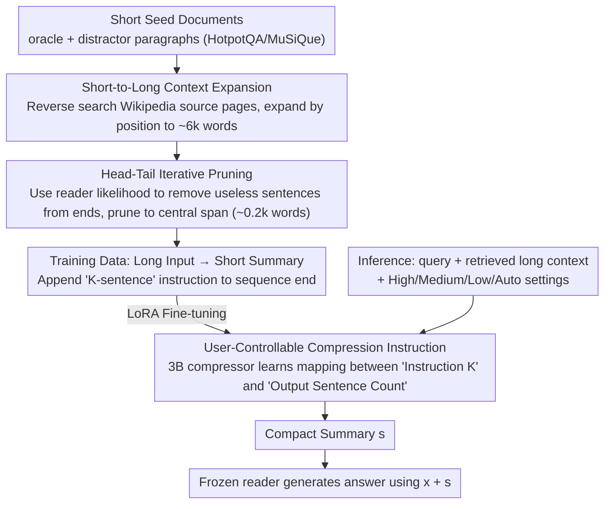

# BRIEF-Pro: Universal Context Compression with Short-to-Long Synthesis for Fast and Accurate Multi-Hop Reasoning

**Conference**: ACL 2026 Findings  
**arXiv**: [2510.13799](https://arxiv.org/abs/2510.13799)  
**Code**: https://github.com/JasonForJoy/BRIEF (Available)  
**Area**: Information Retrieval / RAG / Context Compression  
**Keywords**: Long Context Compression, RAG, Multi-Hop QA, Synthetic Data, User-Controllable

## TL;DR
To address the issues of slow inference and information drowning in RAG under 10k+ word contexts, the authors synthesize multi-hop long-context training data via a "short-context seed data → Wikipedia expansion → head-tail iterative pruning" pipeline. By fine-tuning a 3B Llama-3.2 as an extractive summarizer (BRIEF-Pro), the model outperforms LongLLMLingua's 9× compression with a 32× compression rate across four multi-hop QA datasets. It also enables direct control of summary length through sentence-count instructions.

## Background & Motivation

**Background**: RAG has become the mainstream paradigm for mitigating LLM hallucinations and incorporating new knowledge. However, as the number of retrieved documents increases and the context extends to the 10k-word scale, inference latency and the "cognitive burden" on reader models rise sharply. Multi-hop QA, which requires reasoning across multiple evidence segments, faces even greater challenges as relevant signals are diluted by numerous distractors, leading to a severe "lost in the middle" phenomenon.

**Limitations of Prior Work**: Existing context compression works follow two main paths. The first is soft prompting (GIST / AutoCompressor), which requires binding to a specific reader and lacks transferability. The second is text summarization (RECOMP, BRIEF, CompAct, LongLLMLingua). However, their training data is largely derived from short contexts (<1k words, e.g., original HotpotQA documents), making them prone to losing critical dependencies when generalized to 10k+ word inputs. Furthermore, these models often have fixed compression budgets, preventing users from adjusting summary granularity. While LongLLMLingua supports long inputs, it relies on perplexity for token-level pruning, where a 7B backbone repeatedly encoding chunks results in higher FLOPs than the reader itself.

**Key Challenge**: To train a compressor capable of handling 10k+ word contexts, the most direct method is to collect long-context training data, but such data is scarce and expensive to annotate. Training on short data alone causes models to fail on long inputs, creating a gap between "training data availability" and "target input length."

**Goal**: (1) Synthesize long-context training samples using inexpensive short-context seed data; (2) Provide user-controllable compression granularity (sentence count); (3) Achieve higher QA accuracy, higher compression rates, and lower FLOPs simultaneously in multi-hop QA tasks.

**Key Insight**: The authors noted that oracle paragraphs in HotpotQA / MuSiQue originate from specific Wikipedia pages. These can be artificially expanded into long contexts by extending the original paragraphs "by position." Meanwhile, since oracle paragraphs contain redundancy, they can be tightened using a "pruning without performance drop" criterion. This increases the contrast by simultaneously lengthening the input and shortening the target summary.

**Core Idea**: Generate data using "short-to-long synthesis"—extend short oracle/distractor documents to ~6k words based on Wikipedia positions, generate compact summaries via head-tail iterative pruning, and perform SFT with sentence instructions to train a 3B lightweight compressor with length control.

## Method

### Overall Architecture
The system consists of a 3B compressor $\mathcal{C}$ (Llama-3.2-3B-Instruct) and a frozen reader $\mathcal{M}$ (8B/70B/GPT-4.1-nano). The core objective is to bridge the gap of lacking long-context training data for compression. During online inference, the retriever returns a long context $\mathbf{D}$ for a query $\mathbf{x}$. The compressor outputs a compact summary $\mathbf{s}$ under an optional sentence instruction $\mathbf{i}$ ("Summarize ... in K sentences, K=[P] k [\P]"). The reader then generates the answer using $\mathbf{x}+\mathbf{s}$. The training data $\mathcal{D}_{comp}$ is produced entirely by a "short-to-long synthesis" pipeline, creating strong contrastive samples of "long input vs. short summary." The compressor learns via the standard next-token objective: $\max_{\mathcal{C}} \mathbb{E}\log p_{\mathcal{C}}(\mathbf{s}|\mathbf{x},\mathbf{D},\mathbf{i})$.

### Key Designs

**1. Short-to-Long Context Expansion: Creating 6k-word Inputs from Wikipedia**

Instead of collecting expensive long-context data, the authors synthesize samples from cheap short seeds. Recognizing that oracle and distractor paragraphs in HotpotQA/MuSiQue/LongAlign originate from specific Wikipedia pages, each document is reverse-searched in the Wikipedia corpus (Izacard et al.). The text is then expanded forward and backward from the original paragraph position. Expansion ratios are sampled from a normal distribution ($\mu=20$) to ensure length diversity. Crucially, both oracle and distractor paragraphs are expanded; Tables show that expanding only oracles results in an unnatural "clean" context, causing a performance drop of 2.77–3.77 points. Retaining expanded distractors replicates the RAG environment where signals are diluted by noise, while using Wikipedia avoids semantic fragmentation caused by hard concatenation.

**2. Head-Tail Iterative Pruning: Compressing Target Summaries into Compact Fragments**

To maximize the contrast between "long input" and "short summary," unnecessary sentences in oracle paragraphs are removed. "Helpfulness" is defined by comparing the reader's log-likelihood $\log p(\mathbf{y}|\cdot)$ for the correct answer $\mathbf{y}$ before and after removing a sentence $\mathbf{p}_{ij}$. If the likelihood does not decrease after removal, the sentence is deemed useless. Since evaluating every sentence is costly, the authors assume key information is centered and only perform iterative detection at the head and tail: sentences are checked and removed from the start until a useful one is found, and the same for the end. This prunes the target summary into a continuous span, resulting in an average compression from 6.0k words to 0.2k words (approx. 30×). This likelihood-based pruning is unsupervised and encourages "extraction" over "abstraction-based hallucination."

**3. User-Controllable Compression Instruction: Modeling Length as a Natural Language Condition**

Traditional compressors (RECOMP, BRIEF) have fixed compression rates. This work inserts "Summarize the documents relevant to the question in K sentences, where K = [P] k [\P]" at the end of the input. During training, $k$ is set to the actual number of sentences in the target summary, allowing the model to learn the correspondence. During inference, users provide High/Medium/Low (5/10/20 sentences) or Auto modes. This explicit modeling provides a more user-friendly interface than hyperparameter tuning and allows a single model to support multiple granularities.

### Loss & Training
LoRA fine-tuning of Llama-3.2-3B-Instruct using AdamW, batch size 64, for 3 epochs. Training takes approx. 2 days on 2× A100-80GB. The dataset includes 45.2k samples with inputs averaging 6.0k words and summaries averaging 0.2k words.

## Key Experimental Results

### Main Results
Evaluation conducted on 4 multi-hop QA datasets (MuSiQue / HotpotQA / 2WikiMultiHopQA / LongSeal) with context lengths ranging 4.9k–14.8k words. Performance measured by (EM+F1)/2 and compression rate.

| Reader | Method | Avg. QA (EM+F1)/2 | Rate |
|--------|------|----|----|
| Llama-3.1-8B | Non-compression | 32.09 | 1× |
| Llama-3.1-8B | LongLLMLingua | 32.02 | 9× |
| Llama-3.1-8B | GPT-4.1-nano as Compressor | 36.87 | 110× |
| Llama-3.1-8B | **BRIEF-Pro-Auto** | **38.79** | **32×** |
| Llama-3.1-8B | **BRIEF-Pro-Low** | **40.06** | **25×** |
| Llama-3.1-70B | Non-compression | 44.98 | 1× |
| Llama-3.1-70B | LongLLMLingua | 40.91 | 9× |
| Llama-3.1-70B | **BRIEF-Pro-Auto** | **45.58** | **32×** |
| Llama-3.1-70B | **BRIEF-Pro-Low** | **46.49** | **25×** |
| GPT-4.1-nano | Non-compression | 33.53 | 1× |
| GPT-4.1-nano | LongLLMLingua | 33.03 | 9× |
| GPT-4.1-nano | **BRIEF-Pro-Auto** | **40.80** | **32×** |

On the 70B reader, BRIEF-Pro-Auto outperforms LongLLMLingua by 4.67 points with a 3.5× higher compression rate, while consuming only 23% of its total FLOPs.

### Ablation Study

| Configuration | Avg. Input Length | 8B Avg. QA | 70B Avg. QA | GPT-4.1-nano Avg. QA |
|------|------|------|------|------|
| Oracle++ & Distractor++ (Full) | 6.0k | **38.79** | **45.58** | **40.80** |
| Oracle+ & Distractor+ (Less exp.) | 3.6k | 36.02 | 41.74 | 39.11 |
| Oracle+++ only | 3.6k | 33.76 | 41.68 | 37.03 |

| Mode | Target Sentences | Actual Avg. Sentences |
|------|------|------|
| High | 5 | 6.2 |
| Medium | 10 | 10.4 |
| Low | 20 | 18.0 |

### Key Findings
- **Long Inputs + Distant Noise are Vital**: Models trained only on expanded oracles drop 3–5 points; mixture with expanded distractors is essential for learning robust compression.
- **Compression Outperforms Non-compression**: On 70B and GPT-4.1-nano models, 32× compression performs 0.6–7.3 points better than raw inputs, confirming that long contexts hinder multi-hop integration.
- **High Instruction Controllability**: Sentence count errors in High/Medium modes are only 0.4–1.2 sentences.
- **Significant Compute Efficiency**: For the 70B reader, total TFLOPs are reduced to 8% of non-compression and 24% of LongLLMLingua. End-to-end latency is reduced to 7% of LongLLMLingua.

## Highlights & Insights
- The "short-to-long" synthesis strategy is pragmatic; leveraging existing Wikipedia origins for "position-aware expansion" is nearly zero-cost and more natural than random concatenation.
- Head-tail pruning avoids the high cost of full-document likelihood evaluation, reducing complexity to near-constant time while ensuring summary continuity.
- Treating compression length as a natural language instruction rather than a hyperparameter or special token provides a "textual interface," allowing future readers to dynamically decide summary lengths.
- The fact that 32× compression outperforms raw inputs on 70B models is strong evidence of "lost in the middle," proving that reading long documents does not equate to using them effectively.

## Limitations & Future Work
- Training data is capped at ~10k words; performance on extremely long contexts (e.g., 20k+ words like full papers) remains unproven.
- Evaluation is limited to multi-hop QA; tasks requiring high "integrity" like code completion or few-shot ICL were not tested. Extractive pruning might break code syntax.
- The head-tail assumption (key info is centered) may fail in domains like news leads or technical document conclusions where critical info resides at the extremes.

## Related Work & Insights
- **vs RECOMP / BRIEF**: Those use GPT-3.5 distillation or T5 with chunking, limited by input length (<1k words). BRIEF-Pro uses short-to-long synthesis and a 3B Llama to handle 6k words directly.
- **vs LongLLMLingua**: LongLLMLingua is computationally intensive (7B token-level pruning). BRIEF-Pro's 3B abstractive compressor is significantly faster (23% FLOPs) with 3.5× higher compression.
- **Insight**: The technique of "expanding original data by position using structured corpora" can be transferred to other long-context SFT tasks (Instruction-tuning, RM data) to create more natural long samples than "needle-in-a-haystack" synthesis.

## Rating
- Novelty: ⭐⭐⭐⭐ Short-to-long synthesis + controllable instructions is a simple but effective combination.
- Experimental Thoroughness: ⭐⭐⭐⭐⭐ Comprehensive evaluation across 3 readers, 4 datasets, cross-domain tests, and compute analysis.
- Writing Quality: ⭐⭐⭐⭐ Clear main line, though synthesis details are somewhat scattered.
- Value: ⭐⭐⭐⭐⭐ The combination of a 3B compressor, 32× compression, and performance gains over non-compression is highly practical for industrial RAG.

<!-- RELATED:START -->

## Related Papers

- [\[ICML 2026\] ParisKV: Fast and Drift-Robust KV-Cache Retrieval for Long-Context LLMs](../../ICML2026/information_retrieval/pariskv_fast_and_drift-robust_kv-cache_retrieval_for_long-context_llms.md)
- [\[ACL 2026\] MASS-RAG: Multi-Agent Synthesis Retrieval-Augmented Generation](mass-rag_multi-agent_synthesis_retrieval-augmented_generation.md)
- [\[ICLR 2026\] Q-RAG: Long Context Multi‑Step Retrieval via Value‑Based Embedder Training](../../ICLR2026/information_retrieval/q-rag_long_context_multistep_retrieval_via_valuebased_embedder_training.md)
- [\[AAAI 2026\] OPERA: A Reinforcement Learning--Enhanced Orchestrated Planner-Executor Architecture for Reasoning-Oriented Multi-Hop Retrieval](../../AAAI2026/information_retrieval/opera_a_reinforcement_learning--enhanced_orchestrated_planner-executor_architect.md)
- [\[ICML 2026\] Less Is More: Elevating RAG via Performance-Driven Context Compression](../../ICML2026/information_retrieval/less_is_more_elevating_rag_via_performance-driven_context_compression.md)

<!-- RELATED:END -->
## Related Papers

- [\[ACL 2026\] MASS-RAG: Multi-Agent Synthesis Retrieval-Augmented Generation](mass-rag_multi-agent_synthesis_retrieval-augmented_generation.md)
- [\[ICML 2026\] ParisKV: Fast and Drift-Robust KV-Cache Retrieval for Long-Context LLMs](../../ICML2026/information_retrieval/pariskv_fast_and_drift-robust_kv-cache_retrieval_for_long-context_llms.md)
- [\[ICLR 2026\] Q-RAG: Long Context Multi-Step Retrieval via Value-Based Embedder Training](../../ICLR2026/information_retrieval/q_rag_long_context_multi_step_retrieval.md)
- [\[ICLR 2026\] Q-RAG: Long Context Multi‑Step Retrieval via Value‑Based Embedder Training](../../ICLR2026/information_retrieval/q-rag_long_context_multistep_retrieval_via_valuebased_embedder_training.md)
- [\[AAAI 2026\] OPERA: A Reinforcement Learning--Enhanced Orchestrated Planner-Executor Architecture for Reasoning-Oriented Multi-Hop Retrieval](../../AAAI2026/information_retrieval/opera_a_reinforcement_learning--enhanced_orchestrated_planner-executor_architect.md)

<!-- RELATED:END -->
