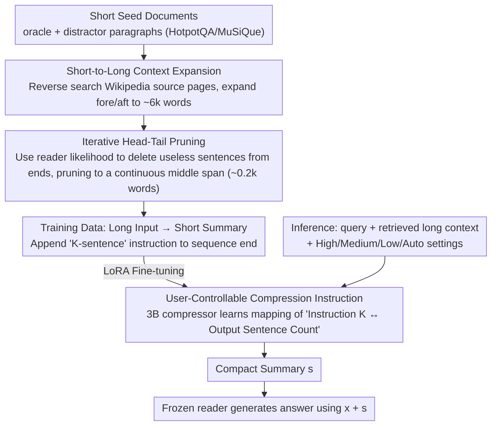

# BRIEF-Pro: Universal Context Compression with Short-to-Long Synthesis for Fast and Accurate Multi-Hop Reasoning

**Conference**: ACL 2026 Findings  
**arXiv**: [2510.13799](https://arxiv.org/abs/2510.13799)  
**Code**: https://github.com/JasonForJoy/BRIEF (Available)  
**Area**: Information Retrieval / RAG / Context Compression  
**Keywords**: Long-context compression, RAG, Multi-hop QA, Synthetic data, User-controllable  

## TL;DR
To address the issues of slow inference and information drowning in RAG with 10k+ word contexts, the authors synthesize multi-hop long-context training data via "short-context seeds → Wikipedia expansion → iterative head-tail pruning." They fine-tune a 3B Llama-3.2 extractive summarizer, BRIEF-Pro, which outperforms LongLLMLingua's 9× compression with a 32× compression rate across four multi-hop QA datasets, while supporting direct control of summary length via sentence-count instructions.

## Background & Motivation

**Background**: RAG has become the mainstream paradigm for mitigating LLM hallucinations and supplementing new knowledge. However, as the number of retrieved documents increases and contexts extend to the 10k-word level, inference latency and the "cognitive burden" on the reader model rise sharply. Multi-hop QA, which requires reasoning across multiple evidence segments, faces even more acute problems—relevant signals are diluted by numerous distractors, leading to a severe "lost in the middle" phenomenon.

**Limitations of Prior Work**: Existing context compression works follow two paths. The first is soft prompting (GIST / AutoCompressor), which requires binding to a specific reader and lacks transferability. The second is summarization-based (RECOMP, BRIEF, CompAct, LongLLMLingua), where training data mostly comes from <1k word short contexts (original HotpotQA documents), making it prone to losing critical dependencies when generalized to 10k+ word inputs. Additionally, compression budgets are often fixed, preventing users from adjusting summary granularity. Although LongLLMLingua supports long inputs, it relies on token-level pruning via perplexity, where a 7B backbone repeatedly encodes chunks, resulting in FLOPs that may exceed those of the reader itself.

**Key Challenge**: To train a compressor capable of handling 10k+ word contexts, the most direct method is to collect 10k+ word training data. However, such data is scarce and expensive to label. Training only on short data leads to model failure on long inputs—creating a gap between "training data availability" and "target input length."

**Goal**: (1) Synthesize long-context training samples from inexpensive short-context seeds; (2) Provide user-controllable compression granularity (number of sentences); (3) Achieve higher QA accuracy, higher compression rates, and lower FLOPs simultaneously in multi-hop QA.

**Key Insight**: The authors noted that oracle paragraphs in HotpotQA / MuSiQue originally originate from specific Wikipedia pages. Long contexts can be artificially constructed by expanding the source paragraphs "by position" fore and aft. Furthermore, since oracle paragraphs contain redundancy, they can be tightened using a "pruning without performance loss" criterion. This increases the contrast by lengthening the input while shortening the target summary.

**Core Idea**: Generate data using "short-to-long synthesis"—expanding short oracle/distractor documents to approximately 6k words based on Wikipedia positions, then generating compact summaries through iterative head-tail pruning. Finally, perform length-controllable SFT using sentence-count instructions to train a lightweight 3B compressor.

## Method

### Overall Architecture
The system consists of a 3B compressor $\mathcal{C}$ (Llama-3.2-3B-Instruct) and a frozen reader $\mathcal{M}$ (8B/70B/GPT-4.1-nano). Each core handles the gap of "wanting to train a long-context compressor without long-context training data." During online inference, the retriever returns a long context $\mathbf{D}$ for a query $\mathbf{x}$. The compressor outputs a compact summary $\mathbf{s}$ under an optional sentence-count instruction $\mathbf{i}$ ("Summarize ... in K sentences, K=[P] k [\P]"), and the reader generates an answer using $\mathbf{x}+\mathbf{s}$. The training data $\mathcal{D}_{comp}$ is entirely produced by a "short-to-long synthesis" pipeline, which expands short seed documents and prunes oracle summaries to create strong contrast samples of "long input vs. short summary." The compressor learns via the standard next-token objective $\max_{\mathcal{C}} \mathbb{E}\log p_{\mathcal{C}}(\mathbf{s}|\mathbf{x},\mathbf{D},\mathbf{i})$.

### Key Designs

**1. Short-to-Long Context Expansion: Synthesizing 6k-word Inputs via Wikipedia**

Since collecting 10k+ word training data is scarce and expensive, the authors synthesize it from inexpensive short seeds. Noting that oracle and distractor paragraphs in HotpotQA/MuSiQue/LongAlign come from specific Wikipedia pages, they reverse-query each document's source page in the Wikipedia corpus (Izacard et al.). They then expand fore and aft around the original paragraph anchor point, sampling expansion ratios from a normal distribution ($\mu=20$) to ensure length diversity. Crucially, both oracle and distractor documents are expanded. Expanding only oracles results in unnaturally "clean" long contexts; Table 4 shows such training drops average QA scores by 2.77~3.77 points. Retaining expanded distractors replicates the retrieval scene where "signals are diluted by noise," while leveraging existing Wikipedia avoids semantic fragmentation caused by hard concatenation.

**2. Iterative Head-Tail Pruning: Compressing Targets into Continuous Compact Spans**

To achieve high contrast between "long input → short summary," unnecessary sentences for answering are removed from oracle paragraphs. The authors define "helpfulness" by comparing the reader's log-likelihood $\log p(\mathbf{y}|\cdot)$ for the correct answer $\mathbf{y}$ before and after removing sentence $\mathbf{p}_{ij}$. If likelihood does not decrease (or even increases) after deletion, the sentence is deemed useless. Since evaluating every sentence in a paragraph is costly, the authors assume critical information is usually centralized and iteratively detect only from the head and tail. Sentences are checked one by one from the start until a useful one is found; the same is done for the tail. This results in target summaries that are continuous spans from the document's middle, yielding an average compression of 6.0k words down to 0.2k words (~30× rate). Compared to direct LLM "summarization" which is prone to abstractive hallucinations, this LM likelihood-based pruning is unsupervised, avoids human annotation, and encourages the model to "extract" rather than "invent."

**3. User-Controllable Compression Instruction: Modeling Length as a Natural Language Condition**

Legacy compressors like RECOMP, CompAct, and BRIEF have hardcoded compression rates, preventing adjustment based on latency budgets. Ours inserts "Summarize the documents relevant to the question in K sentences, where K = [P] k [\P]" at the end of the input. During training, $k$ is set to the actual sentence count of the target summary, allowing the model to learn the correspondence. At inference, users can specify High/Medium/Low (5/10/20 sentences) or Auto (model-determined). A variant, Auto$_{L7C}$, is initialized with Llama2-7B-Chat for a fair backbone comparison with LongLLMLingua. Modeling length control as a natural language condition is more user-friendly than tuning hyperparameters and allows a single model to cover multiple granularities.

### Loss & Training
LoRA fine-tuning of Llama-3.2-3B-Instruct with AdamW, batch 64, 3 epochs, running for approximately 2 days on 2× A100-80GB. The training set contains 45.2k samples, with an average context of 6.0k words ($\sigma=3.5k$) and average summary of 0.2k words.

## Key Experimental Results

### Main Results
Evaluation on 4 multi-hop QA datasets (MuSiQue / HotpotQA / 2WikiMultiHopQA / LongSeal, context lengths 4.9k–14.8k words) using 3 readers (Llama-3.1-8B/70B, GPT-4.1-nano). Metrics are EM/F1 and compression Rate.

| Reader | Method | Avg QA (EM+F1)/2 | Rate |
|--------|------|----|----|
| Llama-3.1-8B | Non-compression | 32.09 | 1× |
| Llama-3.1-8B | LongLLMLingua | 32.02 | 9× |
| Llama-3.1-8B | GPT-4.1-nano as compressor | 36.87 | 110× |
| Llama-3.1-8B | **BRIEF-Pro-Auto** | **38.79** | **32×** |
| Llama-3.1-8B | **BRIEF-Pro-Low** | **40.06** | **25×** |
| Llama-3.1-70B | Non-compression | 44.98 | 1× |
| Llama-3.1-70B | LongLLMLingua | 40.91 | 9× |
| Llama-3.1-70B | **BRIEF-Pro-Auto** | **45.58** | **32×** |
| Llama-3.1-70B | **BRIEF-Pro-Low** | **46.49** | **25×** |
| GPT-4.1-nano | Non-compression | 33.53 | 1× |
| GPT-4.1-nano | LongLLMLingua | 33.03 | 9× |
| GPT-4.1-nano | **BRIEF-Pro-Auto** | **40.80** | **32×** |

On the 70B reader, BRIEF-Pro-Auto is 4.67 points higher than LongLLMLingua with 3.5× higher compression, and total FLOPs are only 23% of the latter.

### Ablation Study

| Configuration | Avg Input Length | 8B Avg QA | 70B Avg QA | GPT-4.1-nano Avg QA |
|------|------|------|------|------|
| Oracle++ & Distractor++ (Full) | 6.0k | **38.79** | **45.58** | **40.80** |
| Oracle+ & Distractor+ (Less expansion) | 3.6k | 36.02 | 41.74 | 39.11 |
| Oracle+++ only | 3.6k | 33.76 | 41.68 | 37.03 |

| Compression Mode | Target Sentences | Actual Avg Sentences |
|------|------|------|
| High | 5 | 6.2 |
| Medium | 10 | 10.4 |
| Low | 20 | 18.0 |

### Key Findings
- **Long Input + Long-Distance Noise is Key**: Compressors trained only on expanded oracles drop 3~5 points on average. The mix of signal and noise provided by distractors is essential for learning robust compression.
- **Compression Outperforms Non-compression**: On 70B and GPT-4.1-nano, 32× compression scores 0.6~7.3 points higher than feeding the original text, proving that long contexts genuinely hinder the reader's multi-hop integration.
- **Controllability is Better than Expected**: Error in High/Medium modes is only 0.4~1.2 sentences. Low mode (20 sentences) generates slightly shorter output (18), yet remains very close to the instruction.
- **Significant Computational Gains**: For the 70B reader, total TFLOPs drop to 8% of non-compression and 24% of LongLLMLingua; end-to-end latency drops to 7% of LongLLMLingua.

## Highlights & Insights
- The "synthesize long data from short data" approach is pragmatic—HotpotQA/MuSiQue oracles have Wikipedia sources. Using structured corpora for "position-controllable context expansion" is near zero-cost and more natural than hard-concatenating documents.
- Iterative head-tail pruning bypasses the high cost of calculating whole-segment likelihood contributions. Each segment requires only O(head+tail) likelihood evaluations, reducing complexity from O(Length) to nearly constant. It guarantees extracts are continuous spans, reducing hallucination.
- Treating "compression length" as a natural language instruction rather than a hyperparameter or special token provides a "textual interface." This allows readers to dynamically decide summary length based on context, offering better transferability than fixed-budget schemes.
- Outperforming non-compression on a 70B reader is strong evidence for "lost in the middle"—proving that an LLM's ability to "read" a document does not equate to its ability to "utilize" it effectively.

## Limitations & Future Work
- Training data is capped at ~10k words; performance on extremely long contexts (20k+ words, e.g., full papers, multi-document dialogues) remains to be verified.
- Evaluation is limited to multi-hop QA; tasks like few-shot ICL, code completion, or long-dialogue memory—which require high "completeness"—were not tested. Code scenarios, in particular, may suffer from broken syntax/dependencies due to extractive summarization.
- Head-tail pruning assumes "critical information is centralized." It might miss key sentences in domains where answers appear at the extreme start/end (e.g., news leads or technical conclusions).
- Future directions: (1) Binary/hierarchical compression for 20k+ inputs; (2) Learning a "length selector" for adaptive sentence counts in Auto mode; (3) Adding code-aware supervision.

## Related Work & Insights
- **vs RECOMP / BRIEF**: Both are summarization-based. RECOMP distills GPT-3.5 summaries, while BRIEF uses T5 + chunking. Both have limited input lengths (<1k or chunked). Ours uses short-to-long synthesis + 3B Llama to handle 6k words directly.
- **vs LongLLMLingua**: LongLLMLingua calculates perplexity with a 7B causal LM for token-level pruning, which is computationally expensive. BRIEF-Pro's 3B abstractive/extractive compressor outputs a summary in one forward pass, using only 23% of the FLOPs with 3.5× higher compression.
- **vs CoLoR (Seo et al. 2025)**: Also uses synthetic data for compressors, but differs in pipeline, supervision, and target length. Ours emphasizes the "short-to-long + user-controllable" dimensions.
- **Insight**: The trick of "expanding original data by position using structured external corpora" can be transferred to other long-context SFT data synthesis (e.g., long-context instruction tuning or RM data)—it is more natural than needle-in-haystack synthesis.

## Rating
- Novelty: ⭐⭐⭐⭐ Short-to-long synthesis + controllable instructions is a simple but effective combo; head-tail pruning is an intelligent engineering shortcut.
- Experimental Thoroughness: ⭐⭐⭐⭐⭐ 3 readers × 4 multi-hop datasets + non-Wikipedia cross-domain tests + FLOPs/latency + instruction precision + expansion ablation.
- Writing Quality: ⭐⭐⭐⭐ Main points are clear, though synthesis pipeline details are spread across three sub-sections, requiring cross-referencing.
- Value: ⭐⭐⭐⭐⭐ The combination of a 3B compressor + 32× compression rate + outperforming non-compression is highly practical for industrial RAG.

<!-- RELATED:START -->

## Related Papers

- [\[ICML 2026\] ParisKV: Fast and Drift-Robust KV-Cache Retrieval for Long-Context LLMs](../../ICML2026/information_retrieval/pariskv_fast_and_drift-robust_kv-cache_retrieval_for_long-context_llms.md)
- [\[ACL 2026\] MASS-RAG: Multi-Agent Synthesis Retrieval-Augmented Generation](mass-rag_multi-agent_synthesis_retrieval-augmented_generation.md)
- [\[ICLR 2026\] Q-RAG: Long Context Multi-Step Retrieval via Value-Based Embedder Training](../../ICLR2026/information_retrieval/q_rag_long_context_multi_step_retrieval.md)
- [\[AAAI 2026\] OPERA: A Reinforcement Learning--Enhanced Orchestrated Planner-Executor Architecture for Reasoning-Oriented Multi-Hop Retrieval](../../AAAI2026/information_retrieval/opera_a_reinforcement_learning--enhanced_orchestrated_planner-executor_architect.md)
- [\[ICML 2026\] Less Is More: Elevating RAG via Performance-Driven Context Compression](../../ICML2026/information_retrieval/less_is_more_elevating_rag_via_performance-driven_context_compression.md)

<!-- RELATED:END -->
