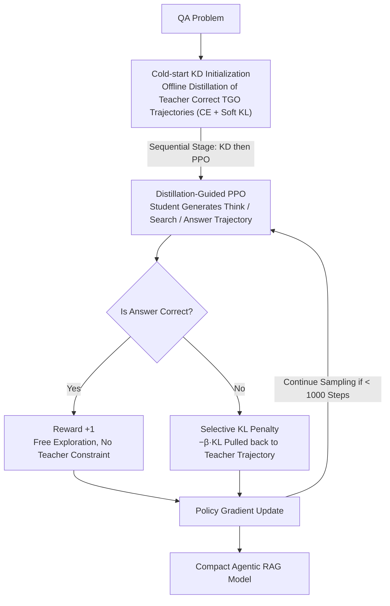

# Can Compact Language Models Search Like Agents? Distillation-Guided Policy Optimization for Preserving Agentic RAG Capabilities

**Conference**: ACL 2026  
**arXiv**: [2508.20324](https://arxiv.org/abs/2508.20324)  
**Code**: https://github.com/omron-sinicx/dgpo  
**Area**: Information Retrieval / LLM Agent  
**Keywords**: Agentic RAG, Knowledge Distillation, Reinforcement Learning, Compact Models, PPO

## TL;DR
This paper proposes DGPO: using teacher demonstrations for cold-start KD initialization, followed by applying KL distillation penalties to "error samples" during the PPO stage. This allows 0.5B compact models to acquire Agentic RAG capabilities, increasing the average EM across 7 QA benchmarks from 0.006 to 0.329, with some datasets even surpassing the 3B teacher.

## Background & Motivation

**Background**: Agentic RAG (e.g., Search-R1, ReAct) has become the mainstream paradigm for LLMs to invoke external retrieval. Models need to interleave `<think>`, `<search>`, and `<answer>` actions to complete multi-hop QA. Such systems demand high reasoning capabilities from the LLM, so existing work almost exclusively relies on models with several billion parameters or more.

**Limitations of Prior Work**: The authors attempted to directly apply the Search-R1 PPO training pipeline to 0.5–1B compact models and found that both mainstream paths failed. First, the RL path—the initial EM of compact models is nearly 0 (Qwen2.5-0.5B averaged only 0.006 across 7 datasets), causing PPO/GRPO to fail to receive positive rewards for a long time, leading to either extremely slow convergence or early collapse. Second, the KD path—pure TGO distillation suffers from exposure bias, while pure SGO on-policy distillation is misled by noisy samples. Dynamic scheduling methods like DistiLLM/TAID are also sensitive to the student-teacher capacity gap.

**Key Challenge**: The SGO quality of compact models is too poor to support either RL exploration (lack of reward signals) or on-policy distillation (noisy targets), while offline TGO distillation cannot address the training-inference distribution mismatch. **The fundamental contradiction is the inability to simultaneously achieve "cold-start quality" and "exploration capability."**

**Goal**: To train 0.5–1B compact models to perform multi-turn search like agents while ensuring training stability, and to provide a set of fine-grained evaluation metrics to locate specific shortcomings in agentic capabilities.

**Key Insight**: The authors rethink the role of the reference model in PPO—traditional PPO treats it as a KL regularization anchor (to prevent policy drift), whereas this paper transforms the teacher model into an "active instructor": allowing the student to explore freely when it answers correctly, but "pulling it back" to the teacher's trajectory using KL distillation when it answers incorrectly.

**Core Idea**: Integrate distillation into PPO via "KD Cold-start + Selective KL Distillation Penalty," transforming the reference model from a passive regularizer into an active teacher, thereby achieving stable agentic RAG capabilities on compact models that surpass the teacher.

## Method

### Overall Architecture
The input to DGPO is a QA problem, and the output is an agentic trajectory interleaving `<think>/<search>/<answer>`. The challenge is that the 0.5B student starts with near-zero performance. The training is split into two sequential stages: first, offline distillation using TGO trajectories where the teacher answered correctly to push the student to a starting point where it can produce a reasonable behavioral skeleton; then, using this student as the initial policy for PPO, but redesigning the rewards—assigning a $+1$ scalar for correct answers and replacing the reward with a KL distillation penalty $-\beta D_{\text{KL}}[\pi_\theta(y\mid x;\mathcal{R})\|\pi_g(y\mid x;\mathcal{R})]$ for incorrect samples, allowing them to receive dense signals by imitating the teacher. The transition is triggered by a performance threshold, avoiding manual scheduling of $\alpha$ interpolation coefficients as in TAID/DistiLLM.

### Key Designs

**1. Cold-start KD Initialization: Pushing the Student Over the Zero-Performance Threshold**

The most fatal issue for compact models is an initial EM of nearly 0, leading to a lack of positive rewards in PPO. DGPO uses offline distillation on teacher-correct TGO trajectories with a loss that is a mix of hard labels and soft distributions: $\mathcal{L}_{\text{distill}} = \mathcal{L}_{\text{CE}}(\pi_g,\pi_\theta) + \lambda D_{\text{KL}}[\pi_g(\cdot\mid x)\|\pi_\theta(\cdot\mid x)]$. Only correct trajectories are kept to avoid passing incorrect retrieval decisions to the student. This step alone reaches an EM of 0.298, already surpassing SFT warm-start (0.289).

**2. Selective KL Penalty: Turning the Teacher from a Regularization Anchor to an Error Corrector**

Standard PPO rewards are $r_{\text{answer}}=\mathbb{1}[y=y^*]$, where incorrect samples always receive 0 reward. DGPO modifies this: correct answers receive 1, while incorrect answers receive $-\beta D_{\text{KL}}[\pi_\theta(y\mid x;\mathcal{R})\|\pi_g(y\mid x;\mathcal{R})]$. This applies distillation penalties only to error samples. Correct samples retain space for free exploration, while incorrect samples are pulled back to the teacher's trajectory, essentially using dense distillation rewards to fill the gap of sparse binary rewards.

**3. KD→PPO Sequential Order: Establish Reasonable Behavior Before Policy Gradient**

The order of the two stages cannot be reversed. If PPO starts on an unformed weak policy, rewards will remain 0, leading to rapid strategy degradation that subsequent KD cannot rescue. Inverting the pipeline (PPO→KD) results in an average EM of only 0.286, which is 4.3 points lower than full DGPO.

### Loss & Training
In the KD stage, $\lambda=1.0$ is used to balance CE and KL. In the PPO stage, $\beta=0.001$ controls the distillation intensity for error samples. A maximum of 4 dialogue turns is allowed, with top-3 document retrieval per turn (using E5 retriever and 2018 Wiki dump). Token masking is applied so gradients only propagate through LLM-generated tokens. Training takes approximately 1 day on NVIDIA 8×H200.

## Key Experimental Results

### Main Results
EM comparison of Qwen 2.5 (3B Teacher → 0.5B Student) across 7 QA benchmarks:

| Method | NQ | TriviaQA | HotpotQA | MuSiQue | Bamboogle | Avg | Note |
|------|------|----------|----------|---------|-----------|------|------|
| Student-0.5B | 0.004 | 0.006 | 0.007 | 0.000 | 0.000 | 0.006 | Untrained |
| Teacher-3B | 0.365 | 0.569 | 0.340 | 0.135 | 0.298 | 0.353 | Upper bound ref |
| PPO (Search-R1) | 0.306 | 0.444 | 0.205 | 0.041 | 0.073 | 0.238 | RL baseline |
| SFT→PPO | 0.338 | 0.415 | 0.296 | 0.088 | 0.250 | 0.289 | Warm start |
| KD (Hinton) | 0.331 | 0.431 | 0.286 | 0.091 | 0.290 | 0.298 | Offline KD |
| DistiLLM | 0.333 | 0.442 | 0.288 | 0.095 | 0.209 | 0.287 | Adaptive KD |
| TAID | 0.325 | 0.427 | 0.290 | 0.079 | 0.218 | 0.282 | Scheduled KD |
| **DGPO** | **0.378** | **0.481** | **0.342** | 0.120 | 0.274 | **0.329** | Surpasses 3B teacher on NQ/HotpotQA |

Cross-model generalization: Qwen 7B→0.5B improved avg EM from 0.238 (PPO) to 0.323; Llama-3 8B→1B improved from 0.250 to 0.389 (only 4.9 points behind the 8B teacher).

### Ablation Study

| Configuration | Avg EM | Description |
|------|--------|------|
| DGPO Full | 0.329 | KD Cold-start + KD→PPO + Selective KL |
| w/o Cold-start Initialization | 0.320 | Training collapses after step 800; highest pre-collapse score taken |
| w/o Selective KL (Uniform) | 0.314 | Distillation applied to correct samples; constraint too strong |
| w/o Teacher Guidance (Std PPO) | 0.306 | No signal for error samples |
| Invert Pipeline (PPO→KD) | 0.286 | Order reversed; PPO stage already collapsed |

### Key Findings
- **Cold-start KD is key to stability**: Without it, training collapses at step 800, proving compact models cannot run PPO from scratch. Stability comes from KD initialization.
- **Selective KL > Uniform KL**: Applying distillation only to error samples is 1.5 points better than applying it to all, proving the combination of "free exploration + error correction" is superior to pure imitation.
- **Fine-grained ARCap Breakdown**: On NQ (single-hop), the Query Rewriting Hit ratio of standard PPO is actually the highest (0.711 > Teacher 0.682). On MuSiQue (multi-hop), DGPO's Hit ratio (0.583) and search steps (2.64) are highest, indicating compact models achieve multi-hop reasoning by "compensating weak single-shot reasoning with multiple searches."
- **GRPO is unsuitable for compact models**: GRPO converges fast but collapses early; it remains unstable even with KD initialization and teacher guidance.

## Highlights & Insights
- **Redefining the Reference Model**: Shifting from a KL anchor (passive) to a teacher (active). This shift is applicable to any PPO-style tuning where a stronger reference exists.
- **"Categorical Reward" is a simple yet powerful trick**: Using dense distillation rewards to fill the gaps in sparse binary rewards.
- **ARCap Evaluation Framework is reusable**: Decomposing agentic behavior into thinking / query rewriting / source referencing allows for modular assessment of agent sub-capabilities.
- **0.5B + CPU Feasibility**: Bringing agentic RAG to laptops/mobile devices, achieving nearly 3B teacher performance with 55× parameter efficiency.

## Limitations & Future Work
- Validated only on Qwen2.5 and Llama-3 families; not extended to Mistral/Phi.
- Teacher scale capped at 8B; whether the capacity gap can be bridged with 70B+ teachers is unknown due to compute constraints.
- Distillation introduces ~9.5% extra training time due to teacher inference.
- Agentic behavior validated only on QA; transferability to code, math, or tool use is left for future work.
- Selective KL boundary depends on EM, which is unsuitable for free-form generation (summarization, dialogue).

## Related Work & Insights
- **vs Search-R1**: Search-R1 works on 7B+ via PPO, but 0.5B rewards are too sparse; DGPO provides dense rewards for error samples.
- **vs DistiLLM / TAID**: These use $\alpha$-interpolation for dynamic scheduling, which is hyperparameter-sensitive; DGPO uses a two-stage approach + selective KL.
- **vs GKD**: GKD uses pure on-policy SGO distillation, which is noisy for compact models (avg 0.240); DGPO decouples exploration and KD.
- **vs DeepSeek-R1 Cold-start**: R1 uses SFT; this paper proves that for small models, soft targets (full KD) are more valuable than hard targets.

## Rating
- Novelty: ⭐⭐⭐⭐ The "reference model as teacher" perspective is refreshing, though individual components are not entirely new.
- Experimental Thoroughness: ⭐⭐⭐⭐⭐ 7 datasets, 3 model configurations, and 5 ablation dimensions, plus the ARCap evaluation.
- Writing Quality: ⭐⭐⭐⭐ Clear diagrams, honest limitations, though some formulas are slightly cramped.
- Value: ⭐⭐⭐⭐⭐ Strong practical significance for edge-device agentic RAG; highly transferable methodology.

<!-- RELATED:START -->

## Related Papers

- [\[ACL 2026\] Enhancing LLM-based Search Agents via Contribution Weighted Group Relative Policy Optimization](enhancing_llm-based_search_agents_via_contribution_weighted_group_relative_polic.md)
- [\[ACL 2026\] Is Agentic RAG Worth It? An Experimental Comparison of RAG Approaches](is_agentic_rag_worth_it_an_experimental_comparison_of_rag_approaches.md)
- [\[ACL 2026\] Agentic Conversational Search with Contextualized Reasoning via Reinforcement Learning](agentic_conversational_search_with_contextualized_reasoning_via_reinforcement_le.md)
- [\[ACL 2026\] End-to-End Optimization of LLM-Driven Multi-Agent Search Systems via Heterogeneous-Group-Based Reinforcement Learning](end-to-end_optimization_of_llm-driven_multi-agent_search_systems_via_heterogeneo.md)
- [\[ACL 2026\] GIFT: Guided Fine-Tuning and Transfer for Enhancing Instruction-Tuned Language Models](gift_guided_fine-tuning_and_transfer_for_enhancing_instruction-tuned_language_mo.md)

<!-- RELATED:END -->
