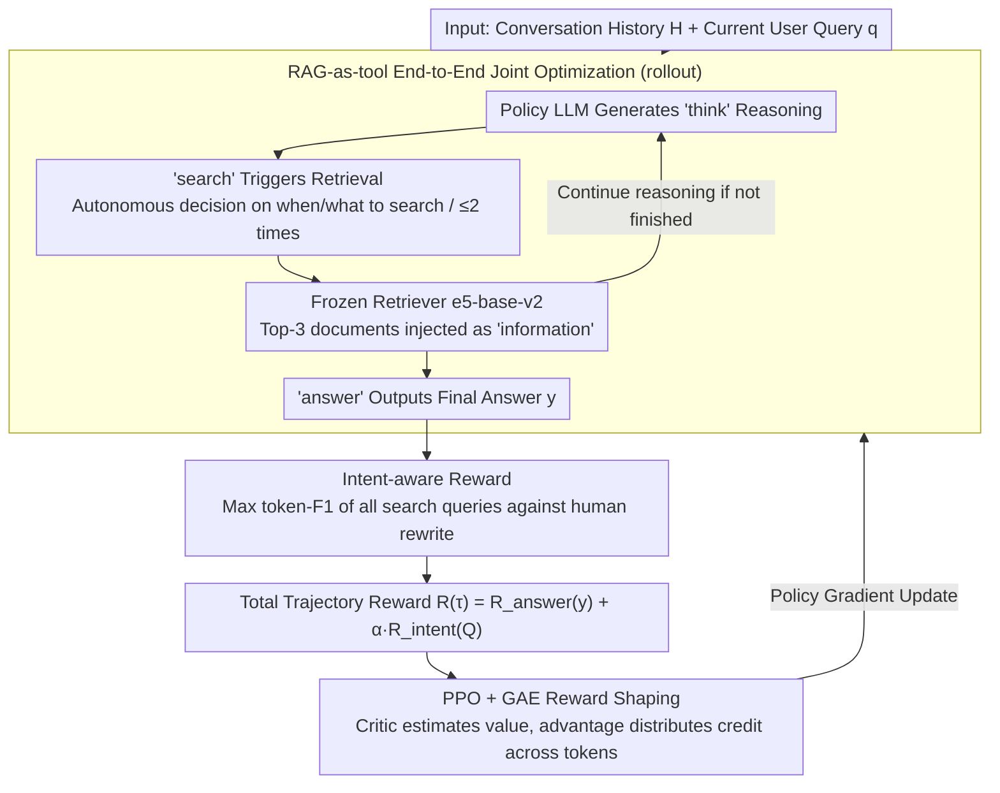

# ChatR1: Reinforcement Learning for Conversational Reasoning and Retrieval Augmented Question Answering

**Conference**: ACL 2026  
**arXiv**: [2510.13312](https://arxiv.org/abs/2510.13312)  
**Code**: https://github.com/SimonLupart/ChatR1  
**Area**: Reinforcement Learning / Conversational RAG  
**Keywords**: Conversational Question Answering, Retrieval-Augmented Generation, Intent Reward, PPO, Multi-turn Reasoning

## TL;DR
The authors extend "Search + Reasoning" RL frameworks (e.g., Search-R1 / R1-Searcher) from single-turn QA to **multi-turn conversational QA**. They propose ChatR1: a framework that jointly optimizes reasoning, searching, and answering end-to-end via PPO. It introduces an "intent-aware reward" using token-F1 between model-generated search queries and human-authored rewrites as a turn-level dense reward. ChatR1 outperforms ChatGPT/Claude using a 3B backbone across five CQA datasets and demonstrates significantly improved out-of-domain transfer capabilities.

## Background & Motivation

**Background**: (1) RL reasoning agents (Search-R1, R1-Searcher, ReSearch, DeepResearcher) have achieved breakthroughs in **single-turn knowledge-intensive QA** by training LLMs with GRPO/PPO to learn dynamic behaviors: when to search, what to search, and how to integrate evidence. (2) Conversational QA (CQA) primarily relies on the SFT paradigm (UniConv, ChatRetriever, ChatQA), utilizing static "query rewrite → retrieve → SFT generate" pipelines. (3) Commercial products (Perplexity, ChatGPT search, Gemini Grounding) are moving toward multi-turn conversational search, but their underlying mechanisms remain black-box.

**Limitations of Prior Work**: (1) Single-turn RL frameworks assume questions are "self-contained," failing to resolve context-dependent ellipses and coreferences (e.g., "one" referring to European countries, "wind" referring to wind energy). (2) Conversational skills learned via SFT only mimic demonstration data, leading to poor generalization across domains (topic shift / mixed-initiative / multi-doc / faithfulness); for instance, models trained on TopiOCQA often suffer significant performance drops on INSCIT. (3) The primary obstacle for RL in multi-turn scenarios is reward sparsity: a conversation involves reasoning, multiple search steps, and integration followed by answering, making credit assignment for final F1 rewards extremely difficult.

**Key Challenge**: Utilizing the generalization advantages of RL requires solving reward sparsity, yet traditional process rewards rely on expensive step-level labels or discrete retrieved-passage relevance. CQA provides a unique "free lunch": **CQA datasets provide human-authored query rewrites for each user turn** to resolve context. These serve as strong proxies for "user intent," yet previous CQA works only used them as SFT inputs.

**Goal**: (1) Construct the first CQA framework trained via RL where the model autonomously schedules reasoning, searching, and answering. (2) Design a dense, retrieval-agnostic, and computationally cheap "turn-level intent reward" to mitigate reward sparsity for PPO. (3) Verify if RL generalizes better than SFT across multiple CQA datasets (evaluated via in-domain, out-of-domain, and LLM-judge metrics).

**Key Insight**: Directly reuse human query rewrites $q^{rw}$ from CQA datasets as intent ground truths. Calculate the maximum token-F1 score between all model-generated search queries $q^k$ in a trajectory and $q^{rw}$ to serve as an intermediate RL reward. This signal is dense, inexpensive (already exists in data), and decoupled from the retriever.

**Core Idea**: Explicitly quantify "user intent" by measuring how closely model-generated search queries resemble golden rewrites, providing PPO with clear intermediate feedback at each turn.

## Method

### Overall Architecture
ChatR1 is a policy LLM $\pi_\theta$ (Qwen2.5-3B/7B-Instruct) trained via PPO. For each turn, given dialogue history $\mathcal{H}$ and current user query $q$, it autonomously generates a trajectory interleaving reasoning, searching, and answering. It generates `<think>` followed by `<search>q^k</search>` to trigger a retriever (e5-base-v2, 300M, zero-shot, top-3, max 2 calls). Retrieval results are injected via `<information>d^k</information>` for further reasoning until producing `<answer>y</answer>`. The total reward is decomposed into an answer reward and an intent reward: $R(\tau) = R_{\text{answer}}(y) + \alpha R_{\text{intent}}(Q)$, with credit distributed across tokens using PPO+GAE. Training covers five datasets (TopiOCQA, QReCC, INSCIT, MultiDoc2Dial, FaithDial) addressing topic shift, large corpora, mixed-initiative, multi-doc grounding, and faithfulness.

### Key Designs

**1. RAG-as-tool End-to-End Joint Optimization: Making retrieval behavior optimizable**

ChatR1 treats the searcher as an external tool triggered by the `<search>` token. The model autonomously decides when, what, and how often to search (up to 2 times), while the retriever remains frozen (e5-base-v2, 300M). Retrieval quality improvements stem from the actor learning better query formulation. Table 5 shows ChatR1-7B's retrieval R@10 reaching 46.9 on TopiOCQA and 61.1 on QReCC, surpassing strong baselines like ConvDR and QuReTeC that require contrastive fine-tuning of the retriever.

**2. Intent-aware Reward: Human rewrites as dense supervision signals**

To solve reward sparsity, ChatR1 leverages the "free lunch" of human rewrites $q^{rw}$. It computes the token-F1 between all model-generated queries $Q=\{q^1,...,q^K\}$ and $q^{rw}$, taking the maximum: $R_{\text{intent}}(Q) = \max_{q^k \in Q} \mathrm{F1}(q^k, q^{rw})$. Using the maximum allows exploration of "coarse search + refinement." This reward is dense, cheap, and decoupled from the retriever. Unlike StepSearch which uses retrieval hit@k, F1 is continuous and not contaminated by retriever errors or missing passage labels.

**3. PPO + GAE Trajectory-level Reward Shaping**

To propagate $R(\tau)$ back to intermediate tokens, ChatR1 uses independent actor and critic networks. The critic $V_\psi$ learns value baselines for each token position to calculate the advantage $\hat{A}_i$. When $\gamma=\lambda=1$, this simplifies to $\hat{A}_i = R(\tau) - V_\psi(\tau_i)$. Documents are excluded from the policy loss via masking (similar to Search-R1). PPO was chosen over GRPO as the latter frequently collapsed within 100–200 steps in multi-turn settings, whereas PPO with a critic baseline proved more stable for long-horizon trajectories.

## Key Experimental Results

### Main Results: Answer quality across 5 CQA datasets

| Method | RAG | LLM | TopiOCQA F1 | QReCC F1 | INSCIT F1 | MD2Dial F1 | FaithDial F1 |
|------|-----|-----|-------------|----------|-----------|-----------|--------------|
| GPT-3.5 (DI) | No | GPT-3.5 | 25.5 | 22.6 | 22.8 | 21.6 | 12.9 |
| Claude (DI) | No | Claude | 27.2 | 25.0 | 27.0 | – | – |
| Qwen-Instr. (RAG) | RAG | Qwen-3B | 8.8 | 15.5 | 13.0 | 18.8 | 12.3 |
| UniConv | RAG | Mistral-7B | 29.6 | 26.2 | 33.2 | – | 11.6 |
| ChatRetriever+Mistral | RAG | Mistral-7B | 28.3 | 26.3 | 30.3 | – | – |
| SFT | No | Qwen-3B | 18.0 | 23.3 | 16.9 | 25.4 | 18.6 |
| QR Search R1 | RAG | Qwen-3B | 20.1 | 20.4 | 27.5 | 23.1 | 14.4 |
| ChatR1 w/o $R_{\text{int.}}$ | RAG | Qwen-3B | 24.4 | 27.0 | 31.3 | 26.4 | 15.5 |
| **ChatR1-3B** | RAG | Qwen-3B | **29.4** | **28.0** | **33.2** | **26.0** | **19.2** |
| **ChatR1-7B** | RAG | Qwen-7B | **30.6** | **31.0** | 32.8 | **31.2** | 18.1 |

ChatR1-3B beats GPT-3.5 / Claude DI baselines using a small 300M retriever.

### Ablation Study

| Configuration | Key Metric | Description |
|------|---------|------|
| ChatR1-3B (Full) | 29.4 F1 (TopiOCQA) | Complete method |
| w/o $R_{\text{intent}}$ | 24.4 F1 (TopiOCQA) | **-5.0**, intent reward is the largest single contributor |
| Hit@3 instead of F1 | Significantly lower | Proves query-level is denser and more robust than passage-level |
| $\alpha=0.2$ | Optimal value | Balances reward shaping and answer reward |
| Rewrite source: T5 / GPT-4.1 | 24.7 vs 29.4 F1 | Better rewrites lead to better downstream performance |
| PPO vs GRPO | PPO is stable | GRPO often collapses in multi-turn CQA settings |
| OOD: QReCC → Other 4 | MD2Dial only -0.2 F1 | Strong cross-domain generalization |

### Key Findings
- **Intent reward provides gains beyond the RL framework itself**: Removing intent reward drops TopiOCQA F1 by -5.0, proving dense intermediate signals are the critical bottleneck.
- **Query-level F1 reward > Passage-level hit@k reward**: F1 is denser, decoupled from retriever noise, and bypasses sparse passage labeling gaps.
- **3B Qwen beats GPT-3.5/Claude DI**: Conversational QA allows small models with tools and RL to bridge the parameter gap.
- **Strong OOD Generalization**: ChatR1-3B trained on QReCC maintains performance on MD2Dial and outperforms ChatGPT on 3 out of 4 OOD sets.
- **Robustness across retrievers**: Training with dense retrieval and testing with BM25 results in only a 7.8 F1 drop (7B); adding a reranker further improves performance by +1.5 F1.

## Highlights & Insights
- **First extension of RL reasoning agents to multi-turn CQA**: Extends Search-R1 to conversational settings while solving the new challenge of reward sparsity.
- **Intent-aware reward as an elegant "free lunch"**: Repurposing existing query rewrite annotations as RL supervision instead of just input data. This concept of using intermediate signals as rewards is transferable to tasks like code generation or tool use.
- **3B + Small Retriever beats 7B baselines**: Demonstrates that conversational RAG bottlenecks lie in joint optimization rather than parameter count or retriever capacity.
- **PPO stability in multi-turn**: Reinforces evidence that PPO is superior for long-horizon conversational RL compared to GRPO.

## Limitations & Future Work
- Training efficiency: Only PPO/GRPO were tested; curriculum or off-policy learning could improve sample efficiency.
- Context length: Only validated on 10–20 turn conversations; longer dialogues require stronger memory modeling.
- Proactivity: Did not explore mixed-initiative dialogues or model-initiated clarifications.
- Rewrite dependence: Performance degrades when using lower-quality silver rewrites (e.g., T5 vs GPT-4.1).

## Related Work & Insights
- **vs Search-R1 / ReSearch**: These focus on single-turn QA; ChatR1 solves multi-turn sparse rewards.
- **vs StepSearch / SearchR1++**: These use passage hit@k as intermediate rewards; ChatR1's query-F1 is denser and retriever-agnostic.
- **vs UniConv / ChatQA**: These use two-stage SFT; ChatR1 achieves better results with a 300M retriever via end-to-end RL.
- Insight: Jointly optimizing reasoning + retrieval + answering with dense rewards derived from "golden intermediate products" is a highly cost-effective deployment strategy.

## Rating
- Novelty: ⭐⭐⭐⭐ 
- Experimental Thoroughness: ⭐⭐⭐⭐⭐ 
- Writing Quality: ⭐⭐⭐⭐ 
- Value: ⭐⭐⭐⭐⭐ 

<!-- RELATED:START -->

## Related Papers

- [\[ACL 2026\] Agentic Conversational Search with Contextualized Reasoning via Reinforcement Learning](agentic_conversational_search_with_contextualized_reasoning_via_reinforcement_le.md)
- [\[ACL 2026\] Learning to Extract Rational Evidence via Reinforcement Learning for Retrieval-Augmented Generation](learning_to_extract_rational_evidence_via_reinforcement_learning_for_retrieval-a.md)
- [\[ACL 2026\] DQA: Diagnostic Question Answering for IT Support](dqa_diagnostic_question_answering_for_it_support.md)
- [\[ACL 2026\] Language-Coupled Reinforcement Learning for Multilingual Retrieval-Augmented Generation](language-coupled_reinforcement_learning_for_multilingual_retrieval-augmented_gen.md)
- [\[ACL 2026\] FinRAG-12B: A Production-Validated Recipe for Grounded Question Answering in Banking](finrag-12b_a_production-validated_recipe_for_grounded_question_answering_in_bank.md)

<!-- RELATED:END -->
