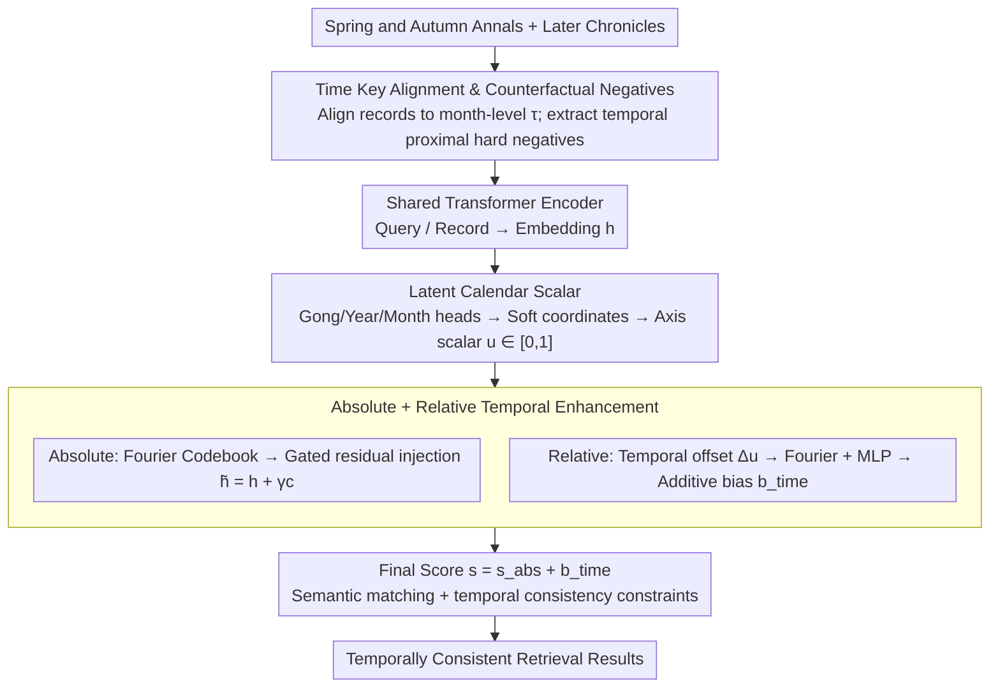

# ChunQiuTR: Time-Keyed Temporal Retrieval in Classical Chinese Annals

**Conference**: ACL 2026 Findings  
**arXiv**: [2604.06997](https://arxiv.org/abs/2604.06997)  
**Code**: [https://github.com/xbdxwyh/ChunQiuTR](https://github.com/xbdxwyh/ChunQiuTR)  
**Area**: Information Retrieval / Temporal Retrieval  
**Keywords**: Temporal Retrieval, Classical Chinese, Calendar Encoding, Bi-Encoder, RAG

## TL;DR
This paper proposes ChunQiuTR, the first time-keyed retrieval benchmark based on non-Gregorian calendars, constructed from the *Spring and Autumn Annals* and its commentary tradition. It introduces the Calendar-Temporal Dual-Encoder (CTD), which achieves time-aware retrieval through Fourier absolute calendar contexts and relative offset biases, significantly outperforming pure semantic baselines.

## Background & Motivation

**Background**: In RAG systems, retrieval serves as the critical interface for LLMs to access and locate knowledge. In historical research, retrieval targets are not just any relevant passages, but precise records of specific years and months—making temporal consistency as vital as thematic relevance.

**Limitations of Prior Work**: Classical Chinese chronicles use concise, implicit non-Gregorian era names (e.g., "Spring of the First Year," "Summer, Fifth Month"), omitting absolute years which must be inferred from context. Semantically similar passages may be temporally incorrect—for example, a query for "December, Second Year of Duke Zhuang" might retrieve commentary on the same date phrase (repeating the date without answering the event) or highly similar events from adjacent months.

**Key Challenge**: Semantic similarity does not equate to temporal consistency. Existing neural retrieval methods model relevance as semantic similarity, failing to distinguish "temporal proximal confounders"—records with highly similar wording that occurred in different months.

**Goal**: To achieve temporally consistent retrieval under non-Gregorian, dynastic calendar systems as a crucial prerequisite for downstream historical RAG.

**Key Insight**: Leveraging the multi-layered structure of the *Spring and Autumn Annals* and its Three Commentaries (*Zuo Zhuan*, *Gongyang Zhuan*, *Guliang Zhuan*)—where all layers share the same chronological timeline but describe events in different wording—naturally creates "near-duplicate" hard negative examples.

**Core Idea**: Introducing calendar-position awareness on top of semantic matching—learning a continuous calendar axis to inject absolute calendar context and add relative temporal biases.

## Method

### Overall Architecture
ChunQiuTR consists of a benchmark and a method. It addresses retrieval failures where records are semantically similar but temporally inconsistent: given a query with a time key $\tau=(gong, year, month)$, the output should be the exact record from that specific month rather than a confounder with similar wording from a neighboring month. On the benchmark side, records are aligned to month-level time keys, with three query types (point, gap, and window) and counterfactual hard negatives extracted from later historical texts. On the method side, CTD learns a continuous calendar axis over a standard bi-encoder, injecting absolute calendar context into embeddings and biasing the final score with relative temporal offsets to overlay temporal consistency constraints onto semantic matching.

### Key Designs

**1. Time Key Alignment and Counterfactual Negatives: Including real temporal proximity traps**

The most common failure in historical retrieval is temporal proximal confusion—records with highly similar wording from different months being misretrieved. Standard corpora do not expose this. The benchmark aligns all chronicle records to month-level time keys, resulting in 20,172 records and 16,226 queries. It further extracts rewrites of the same events from later historical texts (e.g., Gu Donggao's *Da Shi Biao*) as counterfactual hard negatives: these share the same time keys and wording with the target but are not the correct retrieval targets. Since these hard negatives constitute authentic failure modes, the benchmark must include them to force the retriever to learn temporal distinctions.

**2. Latent Calendar Scalars: Mapping discrete dynastic dates to continuous measurable positions**

Dynastic dates (Gong/Year/Month) are discrete identifiers that lack positional metrics and cannot express cross-dynasty distances, making temporal relationships unquantifiable. CTD adds three lightweight prediction heads to the Transformer encoder embeddings to predict Gong, Year, and Month. By taking the expectation of the output probability distributions, it obtains soft coordinates $g_x, y_x, m_x$, which are linearized into a scalar on a unified temporal axis:
$$u_x = \frac{g_x \cdot (Y \cdot M) + y_x \cdot M + m_x}{G \cdot Y \cdot M - 1} \in [0,1]$$
With this continuous axis, the temporal proximity between any two text segments becomes a computable and comparable distance.

**3. Absolute + Relative Temporal Enhancement: Position-aware embeddings and score-based penalties**

Continuous coordinates alone are insufficient; they must actively influence retrieval scoring. Absolute and relative signals complement each other. The absolute component uses a Fourier codebook to map soft predictions into temporal context vectors, injected via gated residuals: $\tilde{h}_x = h_x + \gamma c_x$, allowing the embedding to "know" its calendar position. The relative component calculates the query-record temporal offset $\Delta u_{ij}$, generating an additive bias $b_{ij}^{time}$ through Fourier features and an MLP. The final score $s_{ij}^{CTD} = s_{ij}^{abs} + b_{ij}^{time}$ directly penalizes matches with large temporal distances, even if their semantic similarity is high.

### Loss & Training
The primary loss utilizes interval-overlap multi-positive InfoNCE: treating temporal interval overlaps as weak supervision for in-batch positives to mitigate poor temporal generalization under strict single-positive constraints. An auxiliary loss trains the three temporal prediction heads (cross-entropy for Gong/Year/Month with label smoothing) to ensure the reliability of the soft coordinates.

## Key Experimental Results

### Main Results

| Method | P-Time R@1 | G-Time R@1 | W-Time R@1 | Avg |
|------|-----------|-----------|-----------|------|
| BM25 | Baseline | Baseline | Baseline | - |
| DPR | Semantic Baseline | Semantic Baseline | Semantic Baseline | - |
| CTD (Ours) | **Best** | **Best** | **Best** | Significant Gain |

### Ablation Study

| Configuration | Effect | Description |
|------|------|------|
| Semantic only | Baseline | No temporal awareness |
| + Absolute context | Gain | Embeddings carry calendar position information |
| + Relative bias | Further Gain | Penalizes matches with large temporal distances |
| + Multi-positive | **Best** | Interval overlap supervision enhances temporal generalization |

### Key Findings
- Temporal proximal confusion is the primary failure mode for pure semantic retrieval—records from adjacent months with highly similar wording are frequently misretrieved.
- CTD shows the most significant improvements in scenarios involving temporal proximity and adjacent-month confounders.
- Absolute and relative temporal signals are complementary—using either individually provides gains, but the combination is most effective.

## Highlights & Insights
- **Precise Problem Definition**: Separating "temporal consistency" from "semantic relevance" reveals the core failure mode of RAG systems in historical texts.
- **Fourier Calendar Encoding**: The design can be generalized to any non-standard temporal system (e.g., Lunar, Islamic, Japanese Era names), not limited to the *Spring and Autumn Annals*.
- **Benchmark Methodology**: The combination of LLM-assisted proposals and manual verification offers strong generalizability for cultural heritage digitization.

## Limitations & Future Work
- Validated only on the *Spring and Autumn Annals* corpus; generalizability to other chronicles (e.g., *Zizhi Tongjian*) is unknown.
- The month level is the finest granularity; day-level information in the *Annals* is too sparse for systematic alignment.
- Retrieval quality was evaluated, but improvements in the faithfulness of downstream RAG generation remain to be verified.

## Related Work & Insights
- **vs. Standard TIR**: Standard Temporal Information Retrieval assumes modern timestamps and open retrieval; this work processes fine-grained non-Gregorian chronicles, presenting entirely different challenges.
- **vs. BM25/DPR**: Pure semantic methods systematically fail in the presence of temporal proximal confounders.

## Rating
- Novelty: ⭐⭐⭐⭐⭐ First non-Gregorian time-keyed retrieval benchmark with highly distinctive problem modeling.
- Experimental Thoroughness: ⭐⭐⭐⭐ Rigorous benchmark construction and comprehensive ablations.
- Writing Quality: ⭐⭐⭐⭐⭐ Excellent integration of historical background with technical methodology.
- Value: ⭐⭐⭐⭐ Unique value for digital humanities and historical RAG.

<!-- RELATED:START -->

## Related Papers

- [\[ACL 2026\] Benchmarking and Enabling Efficient Chinese Medical Retrieval via Asymmetric Encoders](benchmarking_and_enabling_efficient_chinese_medical_retrieval_via_asymmetric_enc.md)
- [\[ICML 2026\] Temporal Preference Optimization for Unsupervised Retrieval](../../ICML2026/information_retrieval/temporal_preference_optimization_for_unsupervised_retrieval.md)
- [\[ACL 2026\] Test-Time Training for Zero-Resource Dense Retrieval Reranking](test-time_training_for_zero-resource_dense_retrieval_reranking.md)
- [\[ACL 2026\] CounterRefine: Answer-Conditioned Counterevidence Retrieval for Inference-Time Knowledge Repair in Factual Question Answering](counterrefine_answer-conditioned_counterevidence_retrieval_for_inference-time_kn.md)
- [\[ICLR 2026\] MetaEmbed: Scaling Multimodal Retrieval at Test-Time with Flexible Late Interaction](../../ICLR2026/information_retrieval/metaembed_scaling_multimodal_retrieval_at_test-time_with_flexible_late_interacti.md)

<!-- RELATED:END -->
