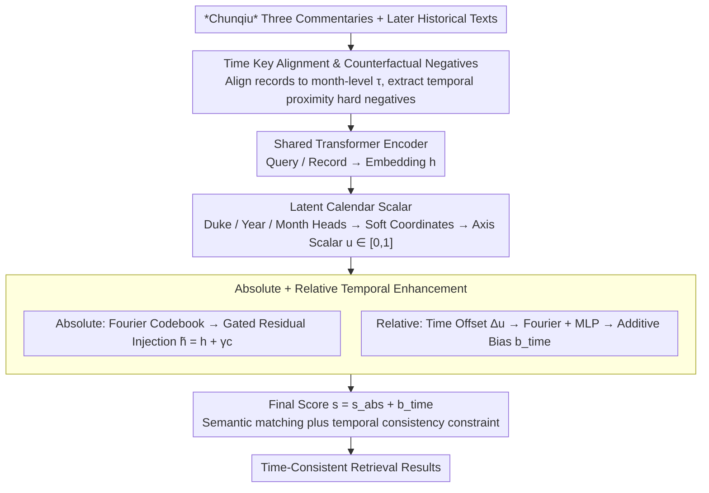

# ChunQiuTR: Time-Keyed Temporal Retrieval in Classical Chinese Annals

**Conference**: ACL 2026 Findings  
**arXiv**: [2604.06997](https://arxiv.org/abs/2604.06997)  
**Code**: [https://github.com/xbdxwyh/ChunQiuTR](https://github.com/xbdxwyh/ChunQiuTR)  
**Area**: Information Retrieval / Temporal Retrieval  
**Keywords**: Temporal Retrieval, Classical Chinese, Calendar Encoding, Bi-encoder, RAG

## TL;DR
Ours proposes ChunQiuTR, the first time-keyed retrieval benchmark based on non-Gregorian calendars, constructed from the *Chunqiu* (Spring and Autumn Annals) and its commentary tradition. It designs CTD (Calendar-Temporal Dual-encoder), which achieves time-aware retrieval through Fourier absolute calendar context and relative offset bias, significantly outperforming pure semantic baselines.

## Background & Motivation

**Background**: In RAG systems, retrieval is the key interface for Large Language Models (LLMs) to acquire and locate knowledge. In historical research, the retrieval target is not an arbitrary relevant passage but a precise record of a specific regnal year and month—temporal consistency is as vital as thematic relevance.

**Limitations of Prior Work**: Classical Chinese chronicles use concise and implicit non-Gregorian regnal year expressions (e.g., "First Year, Spring", "Summer, Fifth Month"). Time information often omits the absolute year and must be inferred from the context. Semantically similar passages may be temporally incorrect—for example, a query for "Duke Zhuang, 2nd Year, 12th Month" might retrieve commentary on the same date phrase (repeated date but no answer to the event) or highly similar events from adjacent months.

**Key Challenge**: Semantic similarity does not equal temporal consistency. Existing neural retrieval methods model relevance as semantic similarity and fail to distinguish "temporal proximity confounders"—records with highly similar phrasing but occurring in different months.

**Goal**: Achieve time-consistent retrieval under non-Gregorian, regnal calendar systems as a crucial prerequisite for downstream historical RAG.

**Key Insight**: Leverage the multi-layered structure of the *Chunqiu* and its three commentaries (*Zuo Zhuan*, *Gongyang Zhuan*, and *Guliang Zhuan*). All layers share the same chronological timeline but describe events with different wording, naturally producing "near-duplicate" hard negatives.

**Core Idea**: Introduce calendar position awareness atop semantic matching—learning a continuous calendar axis, injecting absolute calendar context, and adding relative temporal biases.

## Method

### Overall Architecture
ChunQiuTR consists of a benchmark and a method. It addresses retrieval failures where semantics are similar but time is inconsistent: given a query with a time key $\tau=(gong, year, month)$, the output should be the exact record of the same regnal month, rather than a confounder with similar phrasing from a neighboring month. On the benchmark side, *Chunqiu* records are aligned to month-level time keys, with point, gap, and window queries designed alongside counterfactual hard negatives extracted from later historical texts. On the method side, CTD learns a continuous calendar axis over a standard bi-encoder, injecting absolute calendar context into embeddings and biasing the final score with relative temporal offsets to impose temporal consistency constraints on semantic matching.

### Key Designs

**1. Temporal Key Alignment and Counterfactual Negatives: Including realistic temporal proximity traps**

The most common failure in historical retrieval is temporal proximity confusion—records with highly similar phrasing but occurring in different months are often misretrieved. Standard corpora cannot expose this. The benchmark aligns all chronological records to month-level time keys, resulting in 20,172 records and 16,226 queries. It further extracts rewritings of the same events from later historical texts (e.g., Gu Donggao's *Da Shi Biao*) to serve as counterfactual hard negatives. These share time keys and phrases with target records but are not the correct retrieval targets. Since these hard negatives constitute real failure modes, the benchmark explicitly incorporates them to force the retriever to distinguish time rather than relying solely on semantics.

**2. Latent Calendar Scalar: Mapping discrete regnal years to continuous measurable positions**

Regnal years (Duke/Year/Month) are discrete identifiers that lack position metrics and cannot express cross-reign distances, making temporal relations unquantifiable. CTD adds three lightweight prediction heads to the shared Transformer encoder embeddings to predict the Duke, Year, and Month. By taking the expectation of the output probability distributions, it obtains soft coordinates $g_x, y_x, m_x$, which are linearized into a scalar on a unified time axis: $u_x = \frac{g_x \cdot (Y \cdot M) + y_x \cdot M + m_x}{G \cdot Y \cdot M - 1} \in [0,1]$. With this continuous axis, the temporal distance between any two text segments becomes a calculable and comparable distance, providing a basis for injection and penalties.

**3. Absolute + Relative Temporal Enhancement: Position-aware embeddings and misaligned score penalties**

Continuous coordinates alone are insufficient; they must actively affect retrieval scoring. Absolute and relative signals accomplish this complementarily. The absolute component uses a Fourier codebook to map soft predictions to temporal context vectors, injected via a gated residual into the embedding $\tilde{h}_x = h_x + \gamma c_x$, allowing the embedding to "know" its calendar position. The relative component calculates the query-record temporal offset $\Delta u_{ij}$, generating an additive bias $b_{ij}^{time}$ through Fourier features and an MLP. The final score is $s_{ij}^{CTD} = s_{ij}^{abs} + b_{ij}^{time}$, which directly penalizes matches with large temporal distances—even if their semantics are highly similar. Ablations show that either signal alone provides gains, but the combination is most significant.

### Loss & Training
The main loss employs interval-overlap multi-positive InfoNCE, using temporal interval overlap as weak supervision to label in-batch positives, mitigating insufficient temporal generalization under strict single-positive settings. An auxiliary loss trains the three temporal prediction heads (classification cross-entropy for Duke/Year/Month + label smoothing) to ensure the reliability of the soft coordinates.

## Key Experimental Results

### Main Results

| Method | P-Time R@1 | G-Time R@1 | W-Time R@1 | Average |
|------|-----------|-----------|-----------|------|
| BM25 | Baseline | Baseline | Baseline | - |
| DPR | Semantic Baseline | Semantic Baseline | Semantic Baseline | - |
| CTD (Ours) | **Best** | **Best** | **Best** | Significant Gain |

### Ablation Study

| Configuration | Effect | Description |
|------|------|------|
| Semantic only | Baseline | No temporal awareness |
| + Absolute context | Gain | Embeddings carry calendar position information |
| + Relative bias | Further Gain | Penalizes matches with large temporal distances |
| + Multi-positive | **Best** | Interval overlap supervision enhances temporal generalization |

### Key Findings
- Temporal proximity confusion is the primary failure mode of pure semantic retrieval—records from adjacent months with highly similar phrasing are frequently misretrieved.
- CTD shows the most significant improvement in scenarios involving temporal proximity and adjacent-month confounders.
- Absolute and relative temporal signals are complementary—using either alone provides improvements, while the combination yields the best results.

## Highlights & Insights
- **Precise Problem Definition**: By decoupling "temporal consistency" from "semantic relevance," Ours reveals a core failure mode of RAG systems in historical texts.
- **Fourier Calendar Encoding**: The design can be generalized to any non-standard temporal system (e.g., Lunar, Islamic, or Japanese era names) beyond the *Chunqiu*.
- **Benchmark Methodology**: The methodology (LLM-assisted proposals + human verification) has high transferability in the field of cultural heritage digitization.

## Limitations & Future Work
- The methodology was validated only on the *Chunqiu* corpus; generalizability to other chronicles (e.g., *Zizhi Tongjian*) remains unknown.
- The month level is the finest granularity; day-level information is too sparse in the *Chunqiu* to be systematized.
- Retrieval quality was evaluated, but improvements in downstream RAG generation faithfulness were not further verified.

## Related Work & Insights
- **vs. Standard TIR**: Standard temporal retrieval assumes modern timestamps and open-domain retrieval; this work handles non-Gregorian fine-grained chronicles, presenting entirely different challenges.
- **vs. BM25/DPR**: Pure semantic methods fail systematically when faced with temporal proximity confounders.

## Rating
- Novelty: ⭐⭐⭐⭐⭐ First time-keyed retrieval benchmark for non-Gregorian calendars; highly distinctive problem.
- Experimental Thoroughness: ⭐⭐⭐⭐ Rigorous benchmark construction and comprehensive ablation.
- Writing Quality: ⭐⭐⭐⭐⭐ Excellent integration of historical background and technical methodology.
- Value: ⭐⭐⭐⭐ Unique value for digital humanities and historical RAG.

<!-- RELATED:START -->

## Related Papers

- [\[ACL 2026\] Benchmarking and Enabling Efficient Chinese Medical Retrieval via Asymmetric Encoders](benchmarking_and_enabling_efficient_chinese_medical_retrieval_via_asymmetric_enc.md)
- [\[ACL 2026\] Test-Time Training for Zero-Resource Dense Retrieval Reranking](test-time_training_for_zero-resource_dense_retrieval_reranking.md)
- [\[ACL 2026\] CounterRefine: Answer-Conditioned Counterevidence Retrieval for Inference-Time Knowledge Repair in Factual Question Answering](counterrefine_answer-conditioned_counterevidence_retrieval_for_inference-time_kn.md)
- [\[AAAI 2026\] Towards Inference-Time Scaling for Continuous Space Reasoning](../../AAAI2026/information_retrieval/towards_inference-time_scaling_for_continuous_space_reasoning.md)
- [\[NeurIPS 2025\] Retrieval is Not Enough: Enhancing RAG Reasoning through Test-Time Critique and Optimization](../../NeurIPS2025/information_retrieval/retrieval_is_not_enough_enhancing_rag_reasoning_through_test-time_critique_and_o.md)

<!-- RELATED:END -->
