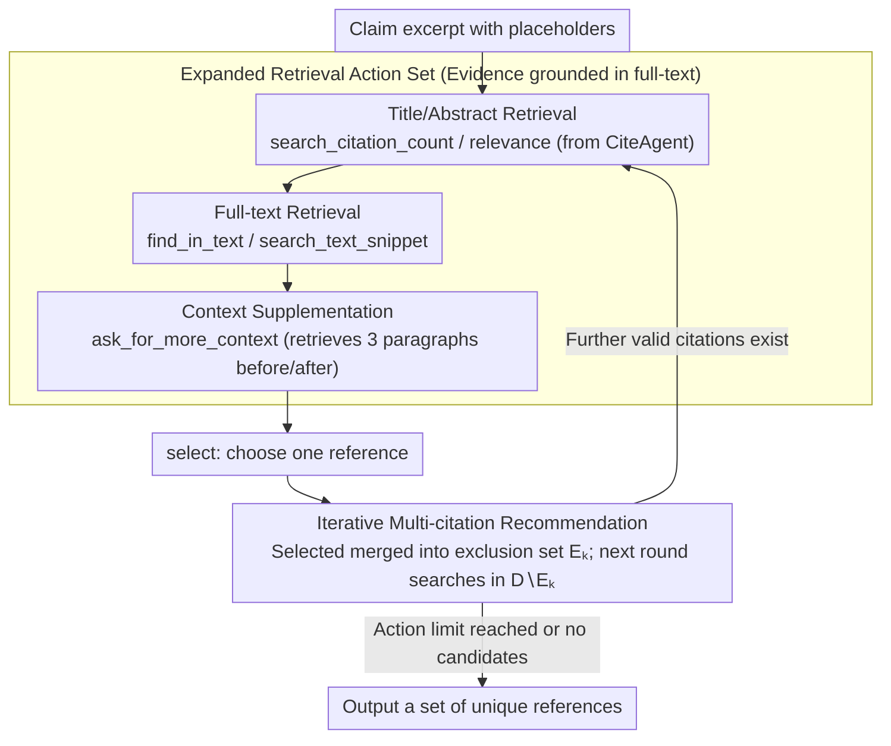

# CiteGuard: Faithful Citation Attribution for LLMs via Retrieval-Augmented Validation

**Conference**: ACL 2026  
**arXiv**: [2510.17853](https://arxiv.org/abs/2510.17853)  
**Code**: [https://github.com/KathCYM/CiteGuard](https://github.com/KathCYM/CiteGuard)  
**Area**: Scientific Citation Validation  
**Keywords**: Citation Attribution, Retrieval-Augmented Validation, Scientific Writing, Hallucination Mitigation, Agent

## TL;DR

CiteGuard proposes a retrieval-augmented agent framework that provides a more faithful foundation for scientific citation attribution via expanded retrieval actions (including full-text search and contextual retrieval), achieving 68.1% accuracy on the CiteME benchmark—a 10 percentage point improvement over baselines and close to human performance (69.2%).

## Background & Motivation

**Background**: LLMs are increasingly utilized as scientific writing assistants, but citation hallucination remains a severe issue (LLMs can generate up to 78-90% fabricated citations). Over 50 citation hallucinations were identified among 300 papers submitted to ICLR 2026.

**Limitations of Prior Work**: (1) LLM-as-a-Judge exhibits extremely low recall in citation validation (only 16-17%) as LLMs are overly sensitive to minor terminology variations; (2) existing methods like CiteAgent still perform significantly below human levels; (3) current approaches lack the ability to search within the full-text content of papers.

**Key Challenge**: Retrieval based solely on titles and abstracts is insufficient for confirming citation relationships, often requiring deep cross-validation within the full text of papers.

**Goal**: Design a more faithful and generalizable Agent for citation attribution.

**Key Insight**: Expand the retrieval action set, particularly by adding full-text search and contextual retrieval capabilities.

**Core Idea**: Citation validation must move beyond title/abstract-level information, establishing a stronger evidence base through full-text search and contextual retrieval.

## Method

### Overall Architecture

CiteGuard models the task of "determining which paper a specific academic claim should cite" as a retrieval-augmented Agent task: given an excerpt of claim text with placeholders, the Agent iteratively executes retrieval actions over Semantic Scholar, reads evidence from candidate papers, and finally outputs one (or more) references. It adopts the cyclic framework of CiteAgent (search → read → decide) but extends the retrieval action set from "title/abstract only" to "full-text and context," shifting the evidence base from shallow metadata to the body text level, thereby replacing the low-recall LLM-as-a-Judge with auditable iterative validation.

### Key Designs

**1. Expanded Retrieval Action Set: Grounding Evidence from Abstract to Full-text Level**

Citation relationships are often hidden within the experiments, methods, or discussion sections of a paper. Relying solely on titles and abstracts leads to frequent misjudgments—the root cause of limited accuracy in CiteAgent. CiteGuard introduces three new full-text retrieval actions: `find_in_text` searches for query snippets within a specific paper's full text; `ask_for_more_context` retrieves the three paragraphs preceding and following a hit to provide context; and `search_text_snippet` performs cross-paper full-text snippet retrieval across the entire database. Together, these allow the Agent to cross-verify the body text like a human reviewer rather than guessing based on metadata.

**2. Iterative Retrieval for Multi-citation Recommendation: Handling Multiple Valid Sources**

Many academic claims have multiple equivalent citable references, and forcing a single answer artificially lowers accuracy. CiteGuard implements an iterative recommendation process: each round outputs one reference $P^{(k)}$, which is then added to an exclusion set $E_k = E_{k-1} \cup \{P^{(k)}\}$. Subsequent search actions are executed only on $D \setminus E_k$ to progressively complete a set of non-redundant references. The Agent proactively stops and refuses to answer when the action limit is reached or no relevant candidates remain, rather than guessing a single optimal solution.

### Loss & Training

CiteGuard does not involve model training; it is implemented entirely through prompt-driven Agent reasoning. The base model can be swapped (e.g., GPT-4o or DeepSeek-R1), with performance differences stemming from the retrieval action design and the underlying reasoning capabilities of the backbone.

## Key Experimental Results

### Main Results

**CiteME Benchmark Results**

| Method | Accuracy (All Difficulties) |
|------|------------|
| CiteAgent + GPT-4o | 35.4% |
| CiteGuard + GPT-4o | 45.4% (+10pp) |
| CiteGuard + DeepSeek-R1 | **68.1%** |
| Human Performance | 69.2% |

### Ablation Study

- CiteGuard identifies alternative valid citations not covered in the original benchmark.
- The new retrieval actions (especially `find_in_text`) contribute most significantly to performance gains.
- Cross-domain experiments demonstrate the generalization potential of the method.

### Key Findings

- Full-text search capability is critical for citation validation.
- Accuracy of 68.1%, approaching human performance, proves the effectiveness of the method.
- LLM-as-a-Judge is unreliable for citation validation and requires retrieval augmentation.

## Highlights & Insights

- Addresses a real pain point in scientific writing with high practical value.
- Achieving near-human performance represents a significant milestone.
- The expanded CiteMulti benchmark fills a gap in cross-domain evaluation.

## Limitations & Future Work

- Dependency on the Semantic Scholar API may not cover all specialized domains.
- Full-text search requires paper accessibility; some papers may be unavailable.
- Iterative retrieval increases inference costs.
- Future work could explore integrating the method directly into academic writing workflows.

## Related Work & Insights

- The extension of CiteAgent highlights the critical value of full-text searching.
- Provides a practical tool for quality control in scientific citations.

## Rating

- Novelty: ⭐⭐⭐⭐ Full-text search and iterative multi-citation recommendation are practical innovations.
- Experimental Thoroughness: ⭐⭐⭐⭐ Includes cross-domain evaluation, human annotation, and multi-model comparisons.
- Writing Quality: ⭐⭐⭐⭐ Clear problem definition and sound experimental design.

<!-- RELATED:START -->

## Related Papers

- [\[ACL 2026\] Beyond Black-Box Interventions: Latent Probing for Faithful Retrieval-Augmented Generation](beyond_black-box_interventions_latent_probing_for_faithful_retrieval-augmented_g.md)
- [\[ICLR 2026\] Automated Formalization via Conceptual Retrieval-Augmented LLMs](../../ICLR2026/information_retrieval/automated_formalization_via_conceptual_retrieval-augmented_llms.md)
- [\[ACL 2025\] VISA: Retrieval Augmented Generation with Visual Source Attribution](../../ACL2025/information_retrieval/visa_retrieval_augmented_generation_with_visual_source_attribution.md)
- [\[ICLR 2026\] Attribution-Guided Decoding](../../ICLR2026/information_retrieval/attribution-guided_decoding.md)
- [\[ACL 2026\] Context Attribution with Multi-Armed Bandit Optimization](context_attribution_with_multi-armed_bandit_optimization.md)

<!-- RELATED:END -->
