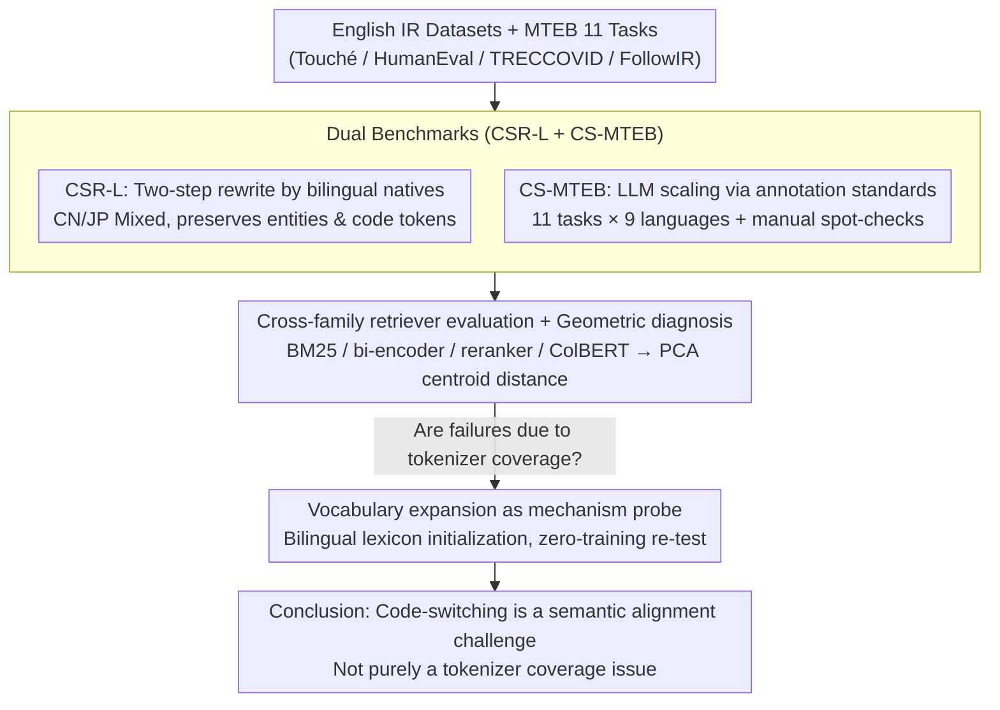

# Code-Switching Information Retrieval: Benchmarks, Analysis, and the Limits of Current Retrievers

**Conference**: ACL 2026  
**arXiv**: [2604.17632](https://arxiv.org/abs/2604.17632)  
**Code**: GitHub + HuggingFace Dataset (Available)  
**Area**: Information Retrieval / Multilingual  
**Keywords**: Code-switching, Multilingual Retrieval, MTEB Benchmark, Vocabulary Expansion, Embedding Space

## TL;DR
This paper presents the first systematic evaluation of the impact of "code-switched queries" on modern IR systems. The authors propose the manually annotated CSR-L benchmark and an LLM-generated 11-task CS-MTEB suite. They find that even strong 8B multilingual models suffer a drop of 4–13 points in nDCG@10 under query-side code-switching, with rerankers plummeting from 60 to 25. Lexicon-based vocabulary expansion is shown to mitigate the issue but fails to close the gap to monolingual baselines.

## Background & Motivation

**Background**: Modern IR has evolved from BM25 to dense bi-encoders (e5, bge-m3, Arctic-Embed, Qwen3-Embedding), cross-encoder rerankers, and late-interaction architectures like ColBERT v2. Benchmarks such as MTEB, BEIR, and MMTEB have expanded evaluation to hundreds of languages and tasks.

**Limitations of Prior Work**: All existing benchmarks assume monolingual queries. However, approximately 70% of the global population is bilingual. Bing logs show that code-mixed queries account for about 27% in the entertainment domain (Gupta 2014). In practical online search, code-switched queries—such as "English technical terms + Chinese framing"—are extremely common, yet their impact on IR effectiveness has never been systematically tested.

**Key Challenge**: Embedding models use contrastive learning to map semantically similar sentences into the same vector space. Code-switching simultaneously introduces two token distributions into a single query, which may "split" the query representation, causing it to fall into unrelated subspaces. Additionally, uneven vocabulary coverage in tokenizers means mixed queries are often segmented into numerous low-frequency subwords, increasing representational noise.

**Goal**: (1) Construct an IR benchmark that reflects natural code-switching habits (manually annotated); (2) Expand evaluation to larger scales and more task types to determine if the impact is limited to retrieval; (3) Investigate if low-cost "vocabulary expansion" interventions can bridge the performance gap.

**Key Insight**: Instead of constructing adversarial queries, the authors recruited bilingual native speakers to rewrite queries based on real search behavior while preserving information needs. At the mechanistic level, they use PCA to visualize query representations in the embedding space to analyze why models fail, rather than merely reporting performance degradation.

**Core Idea**: Code-switching is treated as a long-neglected query distribution shift. The phenomenon is quantified using two complementary benchmarks (manual annotation + large-scale LLM generation), followed by mechanism probing via vocabulary expansion to pinpoint the robustness bottleneck of IR on code-switching.

## Method

### Overall Architecture

The "method" in this paper is not a new model architecture but a three-stage "Evaluate—Diagnose—Intervene" pipeline designed to quantify and explain the impact of code-switching on IR systems. First, the human-annotated CSR-L re-writes queries from 4 English IR datasets into Chinese/Japanese mixed versions to ensure linguistic naturalness. Second, this annotation standard is scaled via LLMs to create CS-MTEB, covering 11 tasks and 9 languages. Finally, a zero-training vocabulary expansion intervention is applied to English-centric models to determine if code-switching failures stem from tokenizer coverage or deeper semantic alignment issues.

### Key Designs

**1. Dual Benchmarks (CSR-L + CS-MTEB): Balancing Naturalness and Scale**

Since there are no reliable automatic metrics for "naturalness" in code-switching, and sociolinguistic definitions are qualitative, human annotation is essential for small scales while LLMs are used for large scales. CSR-L was created by three multilingual authors using a two-step process (rewrite and verify) for queries from Touché 2020, HumanEval, TRECCOVID, and FollowIR. They strictly controlled length variations ($\pm 20\%$), preserved entities and code tokens, and required both languages to contribute content. CS-MTEB then formalized these standards into prompts, using MiMo-V2-Flash to rewrite 11 MTEB tasks (covering 7 categories: instruction reranking, retrieval, clustering, classification, STS, reranking, and pair classification) into mixed versions for 9 languages, supplemented by 50 manual spot-checks for quality control.

**2. Cross-family Retriever Evaluation + Geometric Diagnosis: Identifying Commonality and Mechanism of Failure**

To go beyond reporting drops in performance, the authors evaluated four IR paradigms: Statistical (BM25), Bi-encoder (e5, mE5, bge-m3, Arctic-Embed, Qwen3-Embedding), Cross-encoder reranker (jina-reranker-v3, bge-reranker-v2-m3, Qwen3-Reranker), and Late-interaction (ColBERT v2). They confirmed code-switching is a common weakness across all paradigms. Furthermore, they used PCA to project "original vs. mixed" query embeddings from e5-large-v2 and Qwen3-Embedding-0.6B into 3D space on Touché 2020 and TRECCOVID. Quantifying centroid distances revealed that English-centric models cause query types to split into two distinct clusters (distance $\approx 0.25$), while multilingual models show more overlap ($\approx 0.20$), directly correlating geometric shifts with performance gaps.

**3. Vocabulary Expansion as a Mechanism Probe: Distinguishing Coverage from Alignment**

If a low-cost intervention targeting only the tokenizer could bridge the performance gap, the problem would be coverage-based; otherwise, it is deeper. Using bilingual lexicons (Conneau 2018), the target language word $w_t$ embeddings were initialized using the average of source language subword embeddings. Specifically, the mean subword embedding for a source word $w_s$ is calculated as $v_{w_s}=\frac{1}{|T(w_s)|}\sum_{k\in T(w_s)} e_k$, and words mapped to $w_t$ are aggregated as $e_{w_t}=\frac{1}{|N(w_t)|}\sum_{w_s\in N(w_t)} v_{w_s}$. Tokens without mappings were initialized with $\mathcal{N}(0,\sigma^2)$. The base model remained frozen, replacing only the tokenizer and embedding layer. Zero-training testing on CSR-L showed only partial mitigation (e.g., e5-large-v2 increased from 35.32 to 43.50 on CSR-L-Chinese but remained $\approx 4$ points below the monolingual baseline), proving that code-switching is a semantic alignment challenge that surface-level patches cannot fully resolve.

## Key Experimental Results

### Main Results (CSR-L EN-CN, nDCG@10, p-MRR)

| Family | Model | Touché Orig | Touché CSR-L | TRECCOVID Orig | TRECCOVID CSR-L | Avg Drop |
|---|---|---|---|---|---|---|
| Statistical | BM25 | 60.32 | 37.68 | 55.62 | 46.43 | **−6.56** |
| Bi-encoder (EN) | e5-large-v2 | 42.52 | 22.88 | 66.64 | 50.42 | **−11.90** |
| Bi-encoder (EN) | all-MiniLM-L12-v2 | 49.22 | 23.85 | 51.17 | 39.51 | **−12.36** |
| Bi-encoder (Multi)| mE5-large | 49.32 | 42.75 | 71.56 | 56.54 | −6.90 |
| Bi-encoder (Multi)| Arctic-Embed-l-v2.0 | 64.05 | 54.91 | 83.63 | 76.99 | −4.54 |
| Bi-encoder (Multi)| Qwen3-Embedding-8B | 75.77 | 68.55 | 94.68 | 89.72 | **−3.68** |
| Cross-encoder | Qwen3-Reranker-8B | 40.91 | 32.01 | 84.58 | 69.88 | −6.67 |
| Late-interaction | ColBERT v2 | 61.62 | 29.30 | 69.30 | 53.74 | **−11.31** |

On CS-MTEB (e5-large-v2), cross-lingual drops were high: CN −15.21, JP −12.70, DE −12.27, ES −10.91. Reranking tasks were particularly fragile, with e5-large-v2 plummeting from 60.17 to 25.75 on Japanese code-switching.

### Vocabulary Expansion Experiment (CSR-L-Chinese Avg)

| Model | Original model + CSR-L-CN | Adapted model + CSR-L-CN | Gain | Gap to Monolingual |
|---|---|---|---|---|
| all-MiniLM-L12-v2 | 30.09 | 37.73 | +7.64 | vs 42.45 (Orig) |
| e5-large-v2 | 35.32 | 43.50 | +8.18 | vs 47.22 (Orig) |

### Key Findings
- **English-centric vs. Multilingual Models**: e5-large-v2 dropped by 11.90 on average, while Qwen3-Embedding-8B dropped by only 3.68. Multilingual pre-training helps but is insufficient.
- **Model Scale Help is Limited**: Qwen3-Embedding improved slowly from 0.6B (-4.74) to 8B (-3.68), suggesting scale alone cannot resolve code-switching issues.
- **Task Sensitivity**: Reranking is most vulnerable (e5-large-v2 JP: 60→25), while pair classification is more robust (>54). Reranking requires precise alignment, which is easily disrupted by embedding manifold shifts.
- **Embedding Geometry correlates with Performance**: English-centric models show distinct splits between original and mixed queries in PCA space; multilingual models show more overlap.
- **Vocabulary Expansion is Partially Effective**: It recovers about half the gap, indicating that code-switching is not solely a tokenizer coverage issue.

## Highlights & Insights
- **Integrating Code-Switching into IR Robustness**: The paper moves code-switching from a sociolinguistic niche into the IR mainstream by quantifying it through dual benchmarks.
- **Combination of Geometric Diagnosis and Vocabulary Expansion**: The synergy between identifying "why it fails" and "whether surface fixes help" provides a higher level of methodological rigor.
- **Task-dependent Robustness Hypothesis**: The finding that fine-grained sorting tasks fail under CS while coarse semantic tasks remain stable can guide the design of future CS-aware rerankers.
- **CS-MTEB as a Ready-made Asset**: Covering 11 tasks across 9 languages, it provides a low-barrier stress test for evaluating multilingual robustness.

## Limitations & Future Work
- **Scope**: Code-switching includes romanization, transliteration, and mixed documents, whereas this study focuses on query-level phrase mixing.
- **Dataset Scale**: CSR-L is relatively small (e.g., 50 queries for TRECCOVID), and evaluations were centered on CN/JP and 9 specific languages, excluding low-resource language pairs.
- **Future Directions**: Implementing CS-aware contrastive learning, explicit token-level alignment during training, or training rerankers to perform switch-point detection as an auxiliary task.

## Related Work & Insights
- **vs. MMTEB / MTEB**: Traditional benchmarks assume monolingual queries; CS-MTEB adds a code-switching dimension to standard tasks.
- **vs. MINERS / Litschko 2023**: While prior work focused on bitext mining, this paper covers 4 IR paradigms and 7 task categories.
- **vs. ContrastiveMix**: ContrastiveMix uses CS data for training; this work establishes CS evaluation as an independent dimension.
- **vs. Zuo 2025**: Zuo found LLM rerankers fail on multilingual bi-encoder outputs; this paper extends the vulnerability to intra-query language mixing.

## Rating
- Novelty: ⭐⭐⭐⭐ Opens the practically important yet neglected "Code-Switching IR" track.
- Experimental Thoroughness: ⭐⭐⭐⭐⭐ Comprehensive evaluation across 16 models, 4 IR datasets, and 11 MTEB tasks, plus geometric and mechanistic analysis.
- Writing Quality: ⭐⭐⭐⭐ Clear structure with candid limitations and transparent methodology in appendices.
- Value: ⭐⭐⭐⭐ Identifies a significant gap in RAG/search systems and provides a publicly available, low-barrier benchmark.

<!-- RELATED:START -->

## Related Papers

- [\[ACL 2025\] CoIR: A Comprehensive Benchmark for Code Information Retrieval Models](../../ACL2025/information_retrieval/coir_a_comprehensive_benchmark_for_code_information_retrieval_models.md)
- [\[ACL 2026\] MTR-Suite: A Framework for Evaluating and Synthesizing Conversational Retrieval Benchmarks](mtr-suite_a_framework_for_evaluating_and_synthesizing_conversational_retrieval_b.md)
- [\[ACL 2026\] CodePromptZip: Code-specific Prompt Compression for Retrieval-Augmented Generation in Coding Tasks with LMs](codepromptzip_code-specific_prompt_compression_for_retrieval-augmented_generatio.md)
- [\[ICLR 2026\] Frustratingly Simple Retrieval Improves Challenging, Reasoning-Intensive Benchmarks](../../ICLR2026/information_retrieval/frustratingly_simple_retrieval_improves_challenging_reasoning-intensive_benchmar.md)
- [\[ACL 2026\] UnIte: Uncertainty-based Iterative Document Sampling for Domain Adaptation in Information Retrieval](unite_uncertainty-based_iterative_document_sampling_for_domain_adaptation_in_inf.md)

<!-- RELATED:END -->
