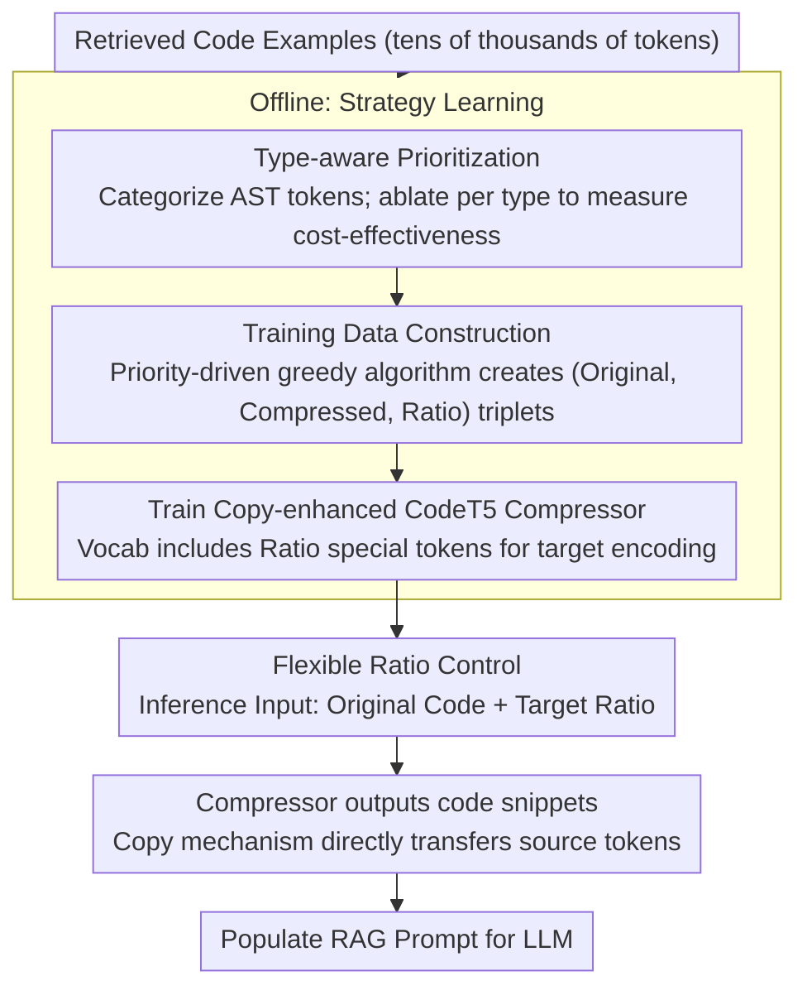

# CodePromptZip: Code-specific Prompt Compression for Retrieval-Augmented Generation in Coding Tasks with LMs

**Conference**: ACL 2026 Findings  
**arXiv**: [2502.14925](https://arxiv.org/abs/2502.14925)  
**Code**: None  
**Area**: Information Retrieval  
**Keywords**: Code prompt compression, RAG, Type-aware prioritization, copy mechanism, coding tasks

## TL;DR

CodePromptZip is proposed as the first code-oriented prompt compression framework. It constructs training data through type-aware prioritization and trains a small model compressor with a copy mechanism. It achieves performance improvements of 23.4%, 28.7%, and 8.7% over the best baselines across three coding tasks.

## Background & Motivation

**Background**: RAG enhances LLM performance in coding tasks by retrieving relevant code examples. However, retrieved code often spans tens of thousands of tokens, limited by LLM context windows and API invocation costs.

**Limitations of Prior Work**: Existing prompt compression techniques (e.g., LLMLingua, RECOMP) are designed for natural language, ignoring the unique characteristics of code—where different token types (such as Identifier, Symbol, Invocation) have vastly different impacts on generation quality.

**Key Challenge**: Natural language compression methods use heuristic information entropy or knowledge distillation to judge token importance. These metrics do not account for the type-structural information of code, leading to sub-optimal compression.

**Goal**: Design the first code-specific prompt compression framework capable of maximizing the retention of code information useful for downstream tasks under a specified compression ratio.

**Key Insight**: Utilize program analysis to categorize code tokens by type. Establish type-level removal priorities through ablation analysis, and use these to guide training data construction and compression model learning.

**Core Idea**: Different types of code tokens impact tasks differently. Tokens are removed in order of priority from least to most impactful. A CodeT5 model with a copy mechanism is trained to learn this compression strategy.

## Method

### Overall Architecture

CodePromptZip addresses the issue where retrieved code examples in RAG coding tasks often exceed context limits and inflate costs. It aims to preserve essential information under a target compression ratio. The approach involves offline learning of removal priorities (which token types to delete first), followed by generating training data to train a small compressor with a copy mechanism. During inference, the compressor receives both the original code and the target compression ratio, outputting compressed code snippets for the RAG prompt. This shifts the logic of "what to delete" from natural language heuristics to a controllable, learning-based compression based on code type structure.

### Key Designs

**1. Type-aware Prioritization: Determining removal sequence by code token type**

Natural language compression relies on information entropy or distillation for importance, ignoring the significant variance in impact between different code token types. CodePromptZip utilizes JavaParser for AST analysis to classify tokens into five categories: Symbol, Signature, Invocation, Identifier, and Structure. Ablation studies measure the cost-effectiveness of each category: $\text{Priority}(T) = \text{Compression Ratio} / \text{Performance Degradation Rate}$. A higher priority indicates that removing that type provides high compression gains with relatively low performance loss. A key observation is that this priority hierarchy is consistent across models but task-specific (e.g., Invocation has the highest priority in Assertion Generation but the lowest in Code Suggestion), suggesting that code token importance is task-driven rather than model-driven.

**2. Copy-enhanced CodeT5 Compressor: Aligning compression with extractive logic**

Code compression is essentially an extractive task—every token in the compressed result should originate from the original code rather than being hallucinated. CodePromptZip adds a copy module to the CodeT5 encoder-decoder. For each step, it calculates a generation probability $p_{gen}$ to decide whether to generate from the vocabulary or copy from the source sequence. The final output distribution is $P(y) = p_{gen}\cdot P_{vocab} + (1-p_{gen})\cdot P_{copy}$. This bias toward copying source tokens fits extractive compression and allows the model to handle incomplete code snippets that might fail AST parsing—where parser-dependent Oracle methods would break.

**3. Flexible Compression Ratio Control: User-specified target ratios**

Different scenarios require varying levels of compression; a fixed ratio cannot adapt to diverse cost/quality trade-offs. CodePromptZip extends the vocabulary with special tokens like `<Ratio>` to explicitly encode the target compression ratio into the input. This allows a single model to adaptively learn how much to truncate at different compression levels. Combined with the copy mechanism, the actual compression ratio aligns closely with the specified target; without the copy mechanism, such controllability degrades significantly.

### Loss & Training

The compressor is trained using cross-entropy loss with the AdamW optimizer (batch=16, lr=5e-5, 1000 warmup steps) over 10 epochs. Training samples are automatically constructed using a priority-driven greedy algorithm (Algorithm 1) across various target ratios. This involves iteratively removing tokens from the lowest to highest type priority to generate supervised (Original, Compressed, Ratio) triplets.

## Key Experimental Results

### Main Results

| Method | Assertion (EM%) | Bugs2Fix (CB%) | Code Suggestion (CB%) |
|------|-----------------|----------------|----------------------|
| w/o retrieval | 23.9 | 41.7 | 14.2 |
| LLMLingua | 33.8 | 41.9 | 21.8 |
| LongLLMLingua | 34.1 | 42.1 | 21.2 |
| LLMLingua-2 | 21.2 | 48.1 | 21.7 |
| RECOMP | 23.4 | 45.3 | 21.0 |
| CodePromptZip (w/o Copy) | 40.9 | 56.7 | 20.5 |
| **CodePromptZip** | **42.1** | **61.9** | **23.7** |
| Oracle (AST) | 46.2 | 66.8 | 23.8 |
| w/o compression | 50.5 | 81.4 | 24.7 |

*$\tau_{code}=0.3$, 1-shot, using GPT-3.5-turbo*

### Ablation Study

| Component | Assertion (EM%) | Bugs2Fix (CB%) | Code Suggestion (CB%) |
|------|-----------------|----------------|----------------------|
| CodePromptZip w/o Copy | 40.9 | 56.7 | 20.5 |
| CodePromptZip (full) | 42.1 (+1.2) | 61.9 (+5.2) | 23.7 (+3.2) |

**Compression Ratio Control**: The actual compression ratio of CodePromptZip aligns tightly with the target ratio, whereas the version without the copy mechanism shows significantly worse controllability.

### Key Findings

- Performance improved by 23.4% (42.1 vs 34.1), 28.7% (61.9 vs 48.1), and 8.7% (23.7 vs 21.8) over the best baselines across three tasks.
- The copy mechanism is crucial for compression ratio control and yields performance gains across all tasks.
- Trade-off analysis shows that under a fixed token budget, using fewer examples with lower compression ratios is superior to more examples with higher compression ratios.
- Cross-model generalization: Ours outperforms all baselines on CodeLlama-13B and Gemini-1.0-Pro.
- Unparsable code: Removing trailing 1-3% of tokens only slightly reduced performance (42.1% → 42.0%/41.7%), demonstrating the robustness of the learning-based approach.

## Highlights & Insights

- The first to propose the problem and solution for code-specific prompt compression, filling the gap between NL and code compression.
- The discovery of type-aware prioritization is insightful: removal priorities are consistent across models but vary by task, suggesting code token importance is task-driven.
- The learning-based approach elegantly overcomes the limitation of Oracle methods (which require AST parsing) in handling incomplete code.
- The controllable compression ratio design allows the framework to adapt to different cost vs. quality requirements.

## Limitations & Future Work

- Currently only supports Java (relies on JavaParser for training data); generalization to other languages has not been verified.
- The compressor is based on CodeT5-775M; model size and inference latency need consideration.
- Priority ranking in ablation analysis must be redone for each new task; automated/adaptive priority discovery is a future direction.
- Scenarios involving multi-language code mixing have not been considered.

## Related Work & Insights

- Direct improvement over the LLMLingua series: Information entropy metrics are unsuitable for code; structural type information is required.
- Compared to RECOMP, which uses expensive GPT-3.5 distillation with uncontrollable ratios, the priority-driven method in CodePromptZip is more efficient and controllable.
- Implications for RAG optimization: Different modalities of retrieved content should employ specialized compression strategies.

## Rating

- Novelty: ⭐⭐⭐⭐ First code-specific prompt compression framework with an innovative type-aware prioritization approach.
- Experimental Thoroughness: ⭐⭐⭐⭐ Three tasks, multiple baselines, cross-model generalization, and tests on unparsable code.
- Writing Quality: ⭐⭐⭐⭐ Clear problem definition, comprehensive methodology, and explicit experimental conclusions.

<!-- RELATED:START -->

## Related Papers

- [\[ACL 2026\] Feedback Adaptation for Retrieval-Augmented Generation](feedback_adaptation_for_retrieval-augmented_generation.md)
- [\[ACL 2026\] Domain-Specific Data Generation Framework for RAG Adaptation](domain-specific_data_generation_framework_for_rag_adaptation.md)
- [\[ACL 2025\] EXIT: Context-Aware Extractive Compression for Enhancing Retrieval-Augmented Generation](../../ACL2025/information_retrieval/exit_context-aware_extractive_compression_for_enhancing_retrieval-augmented_gene.md)
- [\[ACL 2026\] BRIEF-Pro: Universal Context Compression with Short-to-Long Synthesis for Fast and Accurate Multi-Hop Reasoning](brief-pro_universal_context_compression_with_short-to-long_synthesis_for_fast_an.md)
- [\[ACL 2025\] Multilingual Retrieval Augmented Generation for Culturally-Sensitive Tasks: A Benchmark for Cross-lingual Robustness](../../ACL2025/information_retrieval/multilingual_retrieval_augmented_generation_for_culturally-sensitive_tasks_a_ben.md)

<!-- RELATED:END -->
