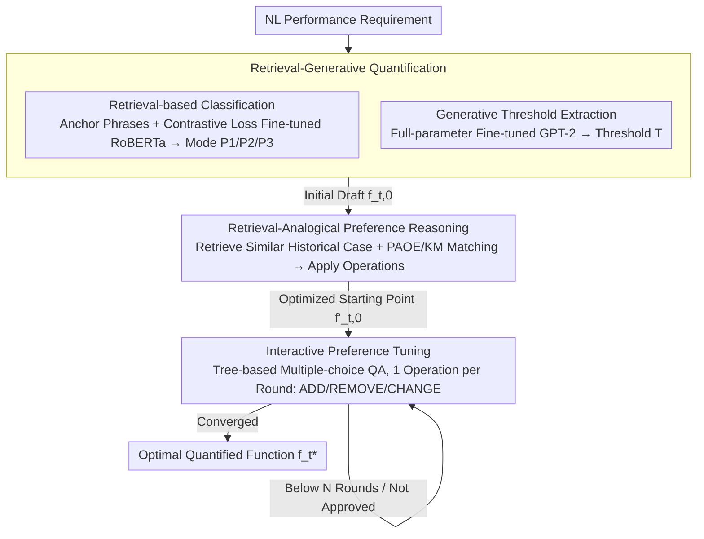

# Conjecture and Inquiry: Quantifying Software Performance Requirements via Interactive Retrieval-Augmented Preference Elicitation

**Conference**: ACL 2026  
**arXiv**: [2604.21380](https://arxiv.org/abs/2604.21380)  
**Code**: To be confirmed  
**Area**: Information Retrieval  
**Keywords**: Requirement Quantification, Preference Elicitation, Retrieval-Augmented Generation, Interactive Systems, Software Performance Requirements

## TL;DR

This paper proposes IRAP, a method that quantifies natural language software performance requirements into mathematical functions through Interactive Retrieval-Augmented Preference Elicitation. It achieves up to 40x performance improvement over 10 SOTA methods on four real-world datasets with only five interaction rounds.

## Background & Motivation

**Background**: Software performance requirements (e.g., response time, throughput, availability) are typically documented in natural language. However, performance analysis, testing, and optimization in software engineering require these to be converted into computable mathematical forms (e.g., utility functions, constraints).

**Limitations of Prior Work**: Natural language descriptions of performance requirements are often vague (e.g., "system should respond quickly", "latency should be within acceptable limits"). Combined with human cognitive uncertainty, the same requirement text can be interpreted as vastly different mathematical forms by different stakeholders. This high degree of ambiguity makes automated quantification an unresolved challenge.

**Key Challenge**: There is a conflict between the need to convert fuzzy natural language into precise mathematical functions and the highly personalized, context-dependent nature of stakeholder preferences. Traditional NLP methods cannot directly infer precise quantitative parameters from text alone.

**Goal**: To formalize the problem of performance requirement quantification and propose a method that reasons about preferences by retrieving domain-specific knowledge while guiding stakeholders through progressive interactions, achieving high-precision quantification while reducing cognitive load.

**Key Insight**: The problem is modeled as "Conjecture and Inquiry"—the system first forms a quantification conjecture based on retrieved domain knowledge and then verifies and corrects it through targeted interactions with stakeholders.

**Core Idea**: Instead of attempting to infer mathematical functions from text in a single step, the method utilizes retrieval-augmented generation to obtain problem-specific domain knowledge for draft initialization, followed by a small number of interaction rounds to refine preference parameters progressively.

## Method

### Overall Architecture

IRAP models the transition from "natural language performance requirements → mathematical functions" as a **finite state transition** process. The authors observe that satisfaction with performance requirements follows three piecewise linear patterns: P1 (larger is better, with tolerance below a threshold, e.g., "throughput must be $> 100$ req/s"), P2 (smaller is better, e.g., "response time $< 5$s"), and P3 (exactly a certain value is best); each pattern is characterized by a threshold $T$ and a tolerance $\Delta$. The goal of quantification is to start from an initial function $f_{t,0}$ and reach the stakeholder-approved function $f_t^*$ using operations such as ADD/REMOVE pattern points (controlling precision) or CHANGE threshold/tolerance/satisfaction (controlling difficulty) within minimal rounds.

To achieve this, IRAP integrates three sequential stages: first, **retrieval-generative quantification** converts fuzzy requirement text into an initial draft function $f_{t,0}$; second, **retrieval-analogical preference reasoning** leverages the user's historical cases to move the draft to a starting point $f'_{t,0}$ closer to their actual preference; finally, **interactive preference tuning** uses tree-based QA to fine-tune the function round-by-round until it converges to the computable piecewise function $f_t^*$.

### Key Designs

**1. Retrieval-Generative Quantification: Converting Requirement Text into Initial Drafts**

Having an LLM generate a complete mathematical function from "the system should respond quickly" in one step is prone to hallucinations because not every number in the text is a threshold. IRAP decomposes the first stage into two sub-tasks: (1) **Retrieval-based Classification**—extracting 10 anchor phrases for each mode from known requirements (e.g., "at least" for P1, "at most" for P2, "exactly" for P3), and fine-tuning RoBERTa with a contrastive loss derived from InfoNCE to embed requirements and anchors in the same space. The mode is determined by the highest cosine similarity. (2) **Generative Threshold Extraction**—fine-tuning a lightweight GPT-2 (774M) to identify the actual threshold $T$. These the combined into $f_{t,0}$ (with $\Delta$ defaulting to $10\% \times T$). Contrastive loss is used because similar contexts for "at least" and "at most" require strong constraints to differentiate matching and non-matching patterns.

**2. Retrieval-Analogical Preference Reasoning: Moving the Starting Point Closer to Preferences**

Starting interaction directly from $f_{t,0}$ might increase cognitive burden if the draft is far from the user's actual preference. Since a single user often provides multiple requirements, IRAP retrieves historical cases $s_k=\{f_{k,0}, f_k^*\}$ from the same user that are semantically similar. It then adapts the historical transformation (from $f_{k,0}$ to $f_k^*$) to $f_{t,0}$ to obtain $f'_{t,0}$. To handle non-unique transformation paths, IRAP uses **Path-Aware Operation Extraction** (PAOE): it constructs a bipartite graph of function points with negative Euclidean distance as weights and applies the Kuhn-Munkres (KM) algorithm for maximum weight matching. Points without matches correspond to ADD/REMOVE, while points with different values correspond to CHANGE. This transfers the user's subjective preference from history to the current task.

**3. Interactive Preference Tuning: Tree-based QA for Round-by-Round Convergence**

The bottleneck in eliciting true preferences is the human; open-ended questions impose a heavy cognitive load. IRAP uses $f'_{t,0}$ as a starting point for **tree-based multiple-choice QA**. The question tree consists of 5 levels and 7 candidate questions. Each round moves from the root to a leaf, where the leaf represents an operation in the finite state transition: ADD/REMOVE (adjusting precision) or CHANGE (adjusting difficulty by slightly changing $T$, $\Delta$, or satisfaction). The maximum number of rounds $N$ is limited (5 rounds are sufficient in experiments), allowing the system to approximate the stakeholder's preferred $f_t^*$ with a very low cognitive barrier.

## Key Experimental Results

### Main Results

| Dataset | Metric | IRAP | Best Baseline | Gain |
|--------|------|------|-------------|---------|
| Dataset 1 | Quantization Accuracy | Best | Runner-up | Up to 40x |
| Dataset 2 | Quantization Accuracy | Best | Runner-up | Significant |
| Dataset 3 | Quantization Accuracy | Best | Runner-up | Significant |
| Dataset 4 | Quantization Accuracy | Best | Runner-up | Significant |

(Note: Across 4 real-world datasets compared against 10 SOTA methods, IRAP achieved the best results in all cases, with a maximum improvement of 40x using only 5 rounds of interaction.)

### Ablation Study

| Config | Key Metric | Remarks |
|------|---------|------|
| W/O Retrieval-Augmentation | Accuracy Decrease | Lack of domain knowledge leads to conjecture bias |
| W/O Interaction | Accuracy Significant Decrease | Pure automation cannot handle preference ambiguity |
| Reduced Interaction Rounds | Accuracy increases with rounds | 5 rounds is the sweet spot for accuracy-efficiency |
| Different Retrieval Strategies | Varied Accuracy | Retrieval quality affects initial conjecture accuracy |

### Key Findings

- IRAP outperformed 10 SOTA methods across 4 real-world datasets, validating the effectiveness of the retrieval-augmented interactive preference elicitation paradigm.
- Achieving a 40x precision improvement with only 5 rounds of interaction indicates that the progressive interaction design balances efficiency and accuracy well.
- Domain priors provided by the retrieval module are critical for the quality of the initial conjecture, directly impacting subsequent interaction efficiency.
- Compared to purely automated methods (e.g., direct LLM generation), the interactive approach has a fundamental advantage in resolving preference ambiguity.

## Highlights & Insights

- **Value of Problem Definition**: This work formalizes "performance requirement quantification," a practical but overlooked problem, providing a new direction for cross-disciplinary research in software engineering and NLP.
- **"Conjecture and Inquiry" Paradigm**: Unlike "one-shot generation," IRAP's progressive interaction design aligns better with the incremental cognitive patterns of human decision-making.
- **Minimizing Cognitive Load**: The interaction design avoids open-ended questions and uses closed-ended queries to guide stakeholders, significantly lowering the barrier to participation.
- **Significance of 40x Gain**: In precision-sensitive tasks like requirement quantification, a 40x improvement represents a qualitative leap from "unusable" to "usable."

## Limitations & Future Work

- The abstract does not specify the specific domains or scale of the 4 datasets used.
- Although 5 rounds are minimal, human involvement is still required, limiting applicability in fully automated scenarios.
- The cost and coverage of domain knowledge base construction may affect the cold-start performance in new domains.
- The paper does not discuss how to handle internal contradictions within stakeholder preferences.
- Future work could extend IRAP to other types of requirement quantification, such as security or reliability requirements.

## Related Work & Insights

- **vs. Traditional Requirement Engineering**: Traditional methods rely on manual modeling by domain experts. IRAP achieves semi-automation through retrieval and interaction, significantly reducing dependence on experts.
- **vs. RAG Methods**: IRAP uses retrieval not only to enhance text generation but also to reason about preferences and design interactions, representing a novel application of the RAG paradigm in requirement engineering.
- **vs. Preference Learning**: Unlike learning preferences from massive comparison data, IRAP efficiently elicits preferences through a few targeted interactions, making it more suitable for low-data scenarios.

## Rating

- Novelty: ⭐⭐⭐⭐ First to formalize and solve the performance requirement quantification problem with a novel retrieval-augmented progressive interaction paradigm.
- Experimental Thoroughness: ⭐⭐⭐⭐ Comparisons against 10 SOTA methods across 4 real-world datasets provide convincing results.
- Writing Quality: ⭐⭐⭐ Based on the summary, the title is literary, though the niche subject at the intersection of SE and NLP might be specialized.
- Value: ⭐⭐⭐⭐ Addresses a genuine engineering pain point; the 40x improvement has significant practical utility.

<!-- RELATED:START -->

## Related Papers

- [\[ACL 2026\] Quantifying and Improving the Robustness of Retrieval-Augmented Language Models Against Spurious Features in Grounding Data](quantifying_and_improving_the_robustness_of_retrieval-augmented_language_models_.md)
- [\[ACL 2026\] Why Mean Pooling Works: Quantifying Second-Order Collapse in Text Embeddings](why_mean_pooling_works_quantifying_second-order_collapse_in_text_embeddings.md)
- [\[ICLR 2026\] AMemGym: Interactive Memory Benchmarking for Assistants in Long-Horizon Conversations](../../ICLR2026/information_retrieval/amemgym_interactive_memory_benchmarking_for_assistants_in_long-horizon_conversat.md)
- [\[ACL 2025\] GainRAG: Preference Alignment in Retrieval-Augmented Generation through Gain Signal Synthesis](../../ACL2025/information_retrieval/gainrag_preference_alignment.md)
- [\[ACL 2026\] ChatR1: Reinforcement Learning for Conversational Reasoning and Retrieval Augmented Question Answering](chatr1_reinforcement_learning_for_conversational_reasoning_and_retrieval_augment.md)

<!-- RELATED:END -->
