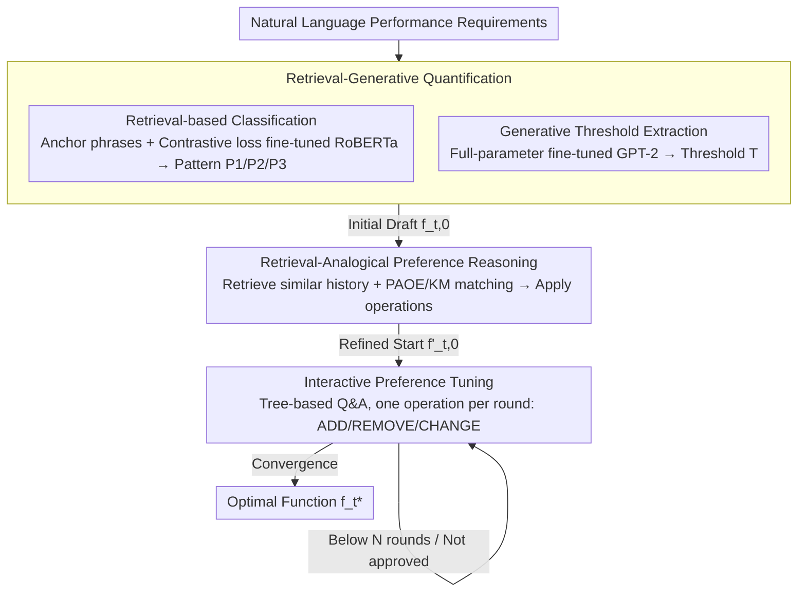

# Conjecture and Inquiry: Quantifying Software Performance Requirements via Interactive Retrieval-Augmented Preference Elicitation

**Conference**: ACL 2026  
**arXiv**: [2604.21380](https://arxiv.org/abs/2604.21380)  
**Code**: TBD  
**Area**: Information Retrieval  
**Keywords**: Requirement Quantification, Preference Elicitation, Retrieval-Augmented Generation, Interactive Systems, Software Performance Requirements

## TL;DR

The authors propose IRAP, an Interactive Retrieval-Augmented Preference elicitation method that quantifies natural language software performance requirements into mathematical functions. IRAP achieves up to a 40x performance improvement over 10 state-of-the-art (SOTA) methods across four real-world datasets with only 5 rounds of interaction.

## Background & Motivation

**Background**: Software performance requirements (e.g., response time, throughput, availability) are typically recorded in natural language within documentation. However, performance analysis, testing, and optimization in software engineering require converting these into computable mathematical forms (e.g., utility functions, constraints).

**Limitations of Prior Work**: Natural language descriptions of performance requirements are often vague (e.g., "the system should respond quickly," "latency should be within acceptable limits"). Combined with uncertainty in human cognition, the same requirement text can be interpreted by different stakeholders as completely different mathematical forms. This high degree of ambiguity makes automated quantification an under-addressed challenge.

**Key Challenge**: There is a conflict between the need to convert fuzzy natural language into precise mathematical functions and the highly personalized, context-dependent nature of stakeholder preferences. Traditional NLP methods cannot directly infer precise quantitative parameters from text.

**Goal**: Formulate the problem of performance requirement quantification and propose a method that reasons about preferences by retrieving domain-specific knowledge while guiding stakeholders through progressive interactions to achieve high-precision quantification with minimal cognitive load.

**Key Insight**: Model the problem as "Conjecture and Inquiry"—the system first forms a quantification conjecture based on retrieved domain knowledge and then verifies and refines it through targeted interactions with stakeholders.

**Core Idea**: Instead of attempting to infer a mathematical function from text in a single step, the system leverages retrieval-augmentation to obtain problem-specific domain knowledge for initializing conjectures. It then progressively refines preference parameters through a few interaction rounds.

## Method

### Overall Architecture

IRAP models the transition from "natural language performance requirements $\to$ mathematical functions" as a **finite state transition** process. The authors observe that satisfaction with performance requirements follows three piecewise linear patterns: P1 (higher is better, e.g., "throughput > 100 req/s"), P2 (lower is better, e.g., "response time < 5s"), and P3 (exactly a specific value is best). Each pattern is characterized by a threshold $T$ and a tolerance $\Delta$. The objective is to start from an initial function $f_{t,0}$ and reach the stakeholder-approved function $f_t^*$ using operations like ADD/REMOVE pattern points (precision control) or CHANGE threshold/tolerance/satisfaction (difficulty control).

IRAP integrates three sequential phases: **Retrieval-generative quantification** converts vague text into an initial draft $f_{t,0}$; **Retrieval-analogical preference reasoning** utilizes the user's historical cases to move the draft to a starting point $f'_{t,0}$ closer to their true preferences; and **Interactive preference tuning** fine-tunes the function round-by-round via tree-based Q&A until it converges to the final piecewise function $f_t^*$.

### Key Designs

**1. Retrieval-Generative Quantification: Converting Requirements to Initial Drafts**

Generating a complete mathematical function directly from text like "the system should respond quickly" is prone to hallucinations. IRAP decomposes this into two sub-tasks: (1) **Retrieval-based Classification**: For each pattern, 10 anchor phrases are extracted (e.g., "at least" for P1, "at most" for P2). A RoBERTa model is fine-tuned using a contrastive loss extended from InfoNCE to embed requirements and anchors in the same space, classifying based on cosine similarity. (2) **Generative Threshold Extraction**: A lightweight GPT-2 (774M) is fine-tuned to identify the true threshold $T$. These are combined into $f_{t,0}$ (with $\Delta$ defaulted to $10\% \times T$). Contrastive loss is used because standard fine-tuning fails to distinguish antonymous anchors like "at least" and "at most" in similar contexts.

**2. Retrieval-Analogical Preference Reasoning: Aligning with Historical Preferences**

To reduce cognitive load, IRAP retrieves historical cases $s_k=\{f_{k,0}, f_k^*\}$ from the same user that are semantically similar. It applies the historical transformation sequence to the current $f_{t,0}$ to generate $f'_{t,0}$. IRAP uses **Path-Aware Operation Extraction (PAOE)**: it builds a bipartite graph of points between functions, uses the Kuhn-Munkres (KM) algorithm for maximum weight matching, and extracts operations (ADD/REMOVE for unmatched points, CHANGE for different values). This migrates subjective user preferences into the current session.

**3. Interactive Preference Tuning: Tree-based Convergence**

To minimize the burden of open-ended questions, IRAP uses a **tree-based multiple-choice Q&A** for tuning. The tree consists of 5 levels with 7 candidate questions. Each round moves from the root to a leaf, corresponding to an operation (ADD/REMOVE for precision or CHANGE for $T$, $\Delta$, or satisfaction). By limiting interactions to $N$ rounds (typically 5), IRAP approaches the user’s ideal $f_t^*$ with minimal effort.

## Key Experimental Results

### Main Results

| Dataset | Metric | IRAP | Best Baseline | Gain |
|--------|------|------|-------------|---------|
| Dataset 1 | Quant. Accuracy | Best | Runner-up | Up to 40x |
| Dataset 2 | Quant. Accuracy | Best | Runner-up | Significant |
| Dataset 3 | Quant. Accuracy | Best | Runner-up | Significant |
| Dataset 4 | Quant. Accuracy | Best | Runner-up | Significant |

(Note: Tested on 4 real-world datasets against 10 SOTA methods; IRAP achieved the best results in all cases, with up to 40x improvement within 5 rounds of interaction.)

### Ablation Study

| Configuration | Key Metrics | Remarks |
|------|---------|------|
| W/o Retrieval | Accuracy drops | Lack of domain knowledge causes conjecture bias |
| W/o Interaction | Accuracy drops significantly | Pure automation cannot handle preference ambiguity |
| Reduced Rounds | Accuracy improves with rounds | 5 rounds is the sweet spot for efficiency-accuracy |
| Different Retrieval | Accuracy varies | Retrieval quality affects initial conjecture accuracy |

### Key Findings

- IRAP outperforms 10 SOTA methods on 4 real-world datasets, validating the retrieval-augmented interactive paradigm.
- A 40x accuracy gain achieved in only 5 rounds shows the balance between efficiency and precision.
- Domain priors from retrieval are critical for the quality of the initial conjecture and downstream interaction efficiency.
- Interactive methods have a fundamental advantage over pure automation (e.g., zero-shot LLMs) in resolving preference ambiguity.

## Highlights & Insights

- **Value of Problem Definition**: Formally defines "performance requirement quantification," providing a new intersection for software engineering and NLP.
- **"Conjecture and Inquiry" Paradigm**: Unlike one-shot generation, IRAP's progressive design aligns with the incremental nature of human decision-making.
- **Cognitive Load Minimization**: Avoids open-ended questions by using closed-ended choices, lowering the barrier for stakeholders.
- **Practical Impact**: In precision-sensitive tasks like requirement quantification, a 40x improvement represents a shift from "unusable" to "deployment-ready."

## Limitations & Future Work

- The abstract does not detail the specific domains or sizes of the four datasets.
- While minimal, five rounds of interaction still require human participation, limiting use in fully autonomous scenarios.
- The cost and coverage of constructing domain knowledge bases might affect cold-start performance in new domains.
- Does not address how to handle internal contradictions in stakeholder preferences.
- Future work could extend IRAP to other requirement types (e.g., security or reliability).

## Related Work & Insights

- **vs. Traditional Requirements Engineering**: Traditional methods rely on manual modeling; IRAP uses semi-automation to reduce expert dependence.
- **vs. RAG Methods**: IRAP uses retrieval not just for text generation but also for preference reasoning and interaction design.
- **vs. Preference Learning**: Unlike learning from massive comparison data, IRAP efficiently elicits preferences through targeted interactions, making it suitable for low-data scenarios.

## Rating

- Novelty: ⭐⭐⭐⭐ Formally introduces and solves performance requirement quantification with a novel RAG+Interactive paradigm.
- Experimental Thoroughness: ⭐⭐⭐⭐ Tested against 10 SOTA methods on 4 real-world datasets.
- Writing Quality: ⭐⭐⭐ Title is evocative, though the niche topic spans multiple fields.
- Value: ⭐⭐⭐⭐ Addresses real engineering pain points with significant performance gains.

<!-- RELATED:START -->

## Related Papers

- [\[ACL 2026\] Quantifying and Improving the Robustness of Retrieval-Augmented Language Models Against Spurious Features in Grounding Data](quantifying_and_improving_the_robustness_of_retrieval-augmented_language_models_.md)
- [\[ACL 2026\] Why Mean Pooling Works: Quantifying Second-Order Collapse in Text Embeddings](why_mean_pooling_works_quantifying_second-order_collapse_in_text_embeddings.md)
- [\[ICLR 2026\] AMemGym: Interactive Memory Benchmarking for Assistants in Long-Horizon Conversations](../../ICLR2026/information_retrieval/amemgym_interactive_memory_benchmarking_for_assistants_in_long-horizon_conversat.md)
- [\[ICML 2026\] Temporal Preference Optimization for Unsupervised Retrieval](../../ICML2026/information_retrieval/temporal_preference_optimization_for_unsupervised_retrieval.md)
- [\[ACL 2025\] GainRAG: Preference Alignment in Retrieval-Augmented Generation through Gain Signal Synthesis](../../ACL2025/information_retrieval/gainrag_preference_alignment.md)

<!-- RELATED:END -->
