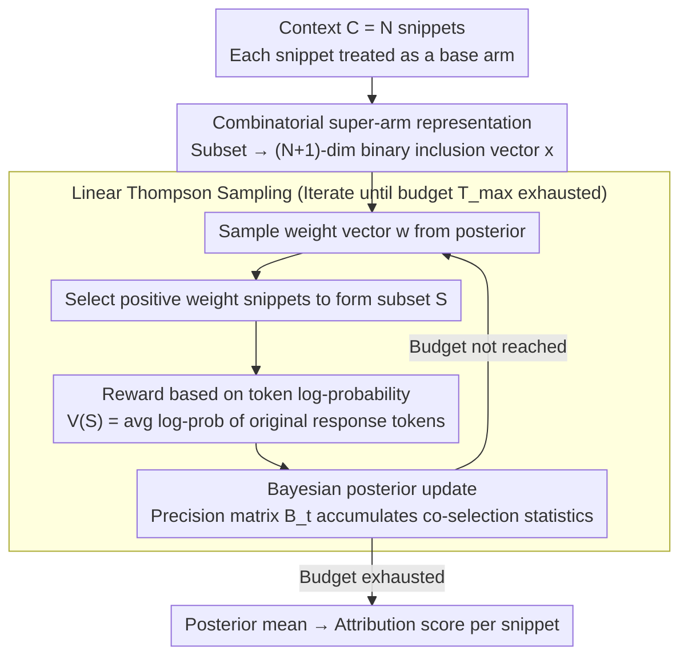

# Context Attribution with Multi-Armed Bandit Optimization

**Conference**: ACL 2026 (Findings)  
**arXiv**: [2506.19977](https://arxiv.org/abs/2506.19977)  
**Code**: [https://github.com/pd90506/camab](https://github.com/pd90506/camab)  
**Area**: Information Retrieval / Explainability  
**Keywords**: Context Attribution, Multi-Armed Bandit, Thompson Sampling, Retrieval-Augmented Generation, Query Efficiency

## TL;DR

This paper proposes CAMAB, which models context attribution in RAG (identifying which context snippets contribute to generated answers) as a Combinatorial Multi-Armed Bandit (CMAB) problem. By using Linear Thompson Sampling to adaptively explore the context subset space, CAMAB reduces the number of model queries by up to 30% compared to SHAP and ContextCite on HotpotQA, CNN/DM, and TyDi QA while matching or exceeding attribution quality.

## Background & Motivation

**Background**: RAG enhances the factual accuracy of LLMs, but verifying that generated answers are indeed based on the retrieved context remains difficult. LLMs often hallucinate or blend in unsubstantiated information, necessitating precise attribution to identify which context snippets contribute to an answer.

**Limitations of Prior Work**: (1) Methods training models to explicitly cite context cannot guarantee that citations reflect actual reasoning; (2) Post-hoc perturbation methods like SHAP and ContextCite require a large number of model queries (via uniform sampling or full feature selection), making computational costs prohibitive in long-context scenarios; (3) Performance drops sharply when query budgets are strictly limited.

**Key Challenge**: Precise attribution requires testing numerous combinations of context subsets, but LLM inference is expensive and query budgets are limited. Uniform sampling is wasteful as many tested subsets provide low information.

**Goal**: Achieve high-quality snippet-level context attribution within a restricted query budget.

**Key Insight**: Transform the attribution problem into a CMAB—where each context snippet is an "arm" and selecting a subset is an "action"—and use Thompson Sampling to adaptively prioritize the exploration of informative subsets.

**Core Idea**: Efficiently explore the exponential space of context subsets using Linear Thompson Sampling. By leveraging Bayesian posterior estimation to adaptively balance exploration and exploitation, the method converges to high-quality attributions faster than uniform random perturbations.

## Method

### Overall Architecture

CAMAB treats the $N$ snippets of context $C = \{s_1, ..., s_N\}$ as the base arms of a bandit. In each iteration: (1) A weight vector is sampled from the posterior distribution; (2) Snippets with positive weights are selected to form a subset; (3) The LLM is queried with this subset to obtain a reward (average log-probability of the target response); (4) The posterior is updated using Bayesian rules. This cycle continues until the query budget is exhausted, and the posterior mean is finally used as the attribution score for each snippet.

### Key Designs

**1. Reward Function based on token log-probability: Directly measuring subset support via internal signals**

The core of attribution is determining "how well a context subset supports the original response." External metrics like text matching fail to capture this causal support. Given a subset $S$, CAMAB defines the reward as $V(S) = \frac{1}{T}\sum_{t=1}^{T}\log P_M(r_t|Q, S, r_1,...,r_{t-1})$, which is the average log-probability of the original response tokens conditioned on that subset. This serves as a direct internal measure of support—the more a subset supports the response, the higher the token probability and reward. Since it only requires a log-probability interface, this reward is applicable to both open-source models and black-box APIs.

**2. Linear Thompson Sampling (LinTS): Spending exploration on informative subsets via Bayesian posterior**

Uniform sampling in SHAP wastes budget on low-information subsets, leading to performance collapse under tight budgets. CAMAB assumes the reward follows a linear structure $V(S) = \mathbf{w}^\top \mathbf{x} + \epsilon$ (where $\mathbf{x}$ is the binary inclusion vector of snippets) and maintains a Gaussian posterior $\mathcal{N}(\hat{\boldsymbol{\mu}}_t, \mathbf{B}_t^{-1})$ for the weights. In each round, it samples weights from the posterior, selects snippets with positive weights to form a subset, queries the LLM for a reward, and performs a Bayesian update. This adaptive sampling allows the algorithm to lock onto important snippets faster within the exponential subset space. It is one of the most efficient bandit strategies for exploration, showing significant advantages over SHAP's uniform sampling and ContextCite's Lasso regression under low budgets.

**3. Combinatorial Super-arm Representation: Compressing exponential subset space into a tractable linear form**

Directly searching through $2^N$ subsets is infeasible; a compact encoding is required. CAMAB represents each subset as an $(N+1)$-dimensional binary vector (including a bias term). The linear assumption decomposes the combinatorial problem into estimating the marginal contributions of individual snippets. The key lies in the precision matrix $\mathbf{B}_t$, which accumulates co-selection statistics of snippets during iterations. The off-diagonal elements implicitly capture substitutability and complementarity between snippets. While the linear assumption simplifies high-order interactions, the correlation structure of the precision matrix partially compensates for this, allowing the method to reflect snippet interactions while significantly reducing dimensionality.

### Loss & Training

CAMAB is an inference-time method and does not involve model training. The algorithm runs iteratively within a given query budget $T_{max}$. The prior is set as $\mathbf{w} \sim \mathcal{N}(\hat{\boldsymbol{\mu}}_0, \sigma_p^2 \mathbf{I})$, and the noise variance $\sigma^2$ is a hyperparameter. The $O(N^3)$ cost of posterior updates is negligible compared to LLM inference overhead.

## Key Experimental Results

### Main Results

**Attribution Performance on LLaMA-3.1-8B (Query Budget 40)**

| Dataset | Metric | CAMAB | SHAP | ContextCite | Random |
|--------|------|-------|------|-------------|--------|
| HotpotQA | Log-P Drop@5 ↑ | **0.717** | 0.648 | 0.632 | 0.103 |
| HotpotQA | BERTScore@5 ↓ | **0.407** | 0.453 | 0.496 | 0.703 |
| CNN/DM | Log-P Drop@5 ↑ | **1.129** | 1.041 | 1.025 | 0.389 |
| TyDi QA | Log-P Drop@5 ↑ | **0.893** | 0.872 | 0.631 | 0.373 |

### Ablation Study

| Query Budget | CAMAB BERTScore@1 | SHAP | ContextCite |
|---------|-------------------|------|-------------|
| 20 | **0.525** | 0.668 | 0.605 |
| 40 | **0.509** | 0.562 | 0.601 |
| 60 | **0.511** | 0.527 | 0.598 |

**Alignment with Human Annotations (HotpotQA, 200 samples)**

| Method | P@1 | AUROC | AP |
|------|-----|-------|-----|
| **CAMAB** | **0.780** | **0.855** | **0.688** |
| SHAP | 0.680 | 0.806 | 0.598 |
| Random | 0.055 | 0.516 | 0.162 |

### Key Findings

- CAMAB at a budget of 40 outperforms SHAP at a budget of 60, representing an approximate 30% improvement in sampling efficiency.
- The advantage is most pronounced at extremely low budgets (20)—where SHAP performance drops sharply, CAMAB maintains high fidelity.
- The gap is smaller on CNN/DM (~1%) because head bias in news summarization allows all methods to converge quickly.
- Highly aligned with human-annotated gold support facts (P@1=0.780, AUROC=0.855).
- The correlation structure of the precision matrix effectively captures snippet interactions—clustering of snippets with the same topic indicates substitutability.

## Highlights & Insights

- Elegant problem formalization—translating attribution into CMAB is a natural and effective framework migration.
- Adaptive exploration via LinTS is key—efficiency gains come not from "more exploration" but from "smarter exploration."
- Requires only a log-probability interface, making it highly practical for black-box APIs.

## Limitations & Future Work

- The linear assumption may miss strong interaction effects (e.g., cases where two snippets are only meaningful when combined).
- Requires a token-level log-probability interface, which is not provided by all APIs.
- May converge to sub-optimal solutions in high-noise or highly ambiguous scenarios.
- Future work could explore non-linear bandits or attention-guided initialization strategies.

## Related Work & Insights

- **vs ContextCite**: ContextCite uses Lasso regression for feature selection, which requires more samples in high-dimensional spaces; CAMAB's Bayesian approach is more robust with small samples.
- **vs SHAP**: SHAP's uniform random sampling does not utilize historical information; CAMAB adaptively learns to guide subsequent sampling.
- **vs LIME**: LIME requires local linear approximations, whereas CAMAB's global linear assumption is more suitable for the attribution context.

## Rating

- Novelty: ⭐⭐⭐⭐ CMAB formalization is a clever problem reconstruction, though Linear Thompson Sampling itself is an existing algorithm.
- Experimental Thoroughness: ⭐⭐⭐⭐ Comparison across three datasets, two models, and multiple budgets, validated with human annotations.
- Writing Quality: ⭐⭐⭐⭐⭐ Clear problem definition and concise algorithm description.
- Value: ⭐⭐⭐⭐ Provides an efficient and practical solution for RAG attribution.

<!-- RELATED:START -->

## Related Papers

- [\[ACL 2026\] MAB-DQA: Addressing Query Aspect Importance in Document Question Answering with Multi-Armed Bandits](mab-dqa_addressing_query_aspect_importance_in_document_question_answering_with_m.md)
- [\[ICLR 2026\] Attributing Response to Context: A Jensen-Shannon Divergence Driven Mechanistic Study of Context Attribution in Retrieval-Augmented Generation](../../ICLR2026/information_retrieval/attributing_response_to_context_a_jensen-shannon_divergence_driven_mechanistic_s.md)
- [\[ACL 2026\] IF-GEO: Conflict-Aware Instruction Fusion for Multi-Query Generative Engine Optimization](if-geo_conflict-aware_instruction_fusion_for_multi-query_generative_engine_optim.md)
- [\[ACL 2026\] End-to-End Optimization of LLM-Driven Multi-Agent Search Systems via Heterogeneous-Group-Based Reinforcement Learning](end-to-end_optimization_of_llm-driven_multi-agent_search_systems_via_heterogeneo.md)
- [\[ICLR 2026\] Attribution-Guided Decoding](../../ICLR2026/information_retrieval/attribution-guided_decoding.md)

<!-- RELATED:END -->
