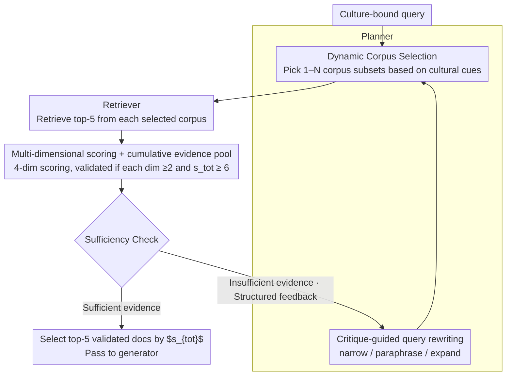

# CORAL: Adaptive Retrieval Loop for Culturally-Aligned Multilingual RAG

**Conference**: ACL 2026 Findings  
**arXiv**: [2604.25676](https://arxiv.org/abs/2604.25676)  
**Code**: Not explicitly open-sourced (Experimental details provided in appendix)  
**Area**: Information Retrieval / Multilingual RAG / Agentic RAG  
**Keywords**: Multicultural RAG, planner-critic loop, dynamic corpus selection, query rewriting, low-resource languages

## TL;DR
CORAL reframes multilingual RAG failures as "retrieval condition misalignment"—not just query reformulation, but the need to dynamically switch the retrieval corpus. Through a closed loop consisting of a planner and a critic agent performing "corpus selection → retrieval → scoring/filtering → sufficiency check → corpus/query adjustment," the method achieves a 3.58pp improvement over the strongest baseline for low-resource languages on two cultural benchmarks and a 3.91pp gain on CLIcK Korean cultural QA.

## Background & Motivation

**Background**: Multilingual RAG (mRAG) typically utilizes query translation or multilingual embeddings to create a shared retrieval space, assuming that "linguistic alignment is sufficient."

**Limitations of Prior Work**: (1) Culture-bound queries (e.g., Korean festivals, Indonesian customs) often retrieve evidence that is "semantically related but culturally misaligned"—for example, queries about traditional Korean festivals might retrieve generic "Korean tourism" information from English Wikipedia; (2) Existing agentic mRAG systems (Self-RAG, ReAct, IRCoT) focus only on "how to search"—query reformulation and multi-hop reasoning—while the **retrieval space remains fixed**. Even the most intelligent query rewriting cannot compensate for "searching in the wrong corpus"; (3) Simply aggregating more languages into the corpus pool (multiRAG) instead introduces more noise.

**Key Challenge**: Current mRAG treats multilinguality as a representation problem (mapping all languages to the same space), whereas cultural QA lacks **locale-specific knowledge**. Mixing such knowledge with globally aggregated content causes the retrieval phase to be overshadowed by mainstream cultures.

**Goal**: (1) Treat the "retrieval condition" (corpus scope + query phrasing) as a first-class decision that can be modified at test time; (2) Use a feedback loop to drive retrieval condition updates based on evidence quality; (3) Demonstrate that this "adaptive retrieval condition" is more effective than "adaptive queries" for low-resource languages.

**Key Insight**: Instead of allowing the planner only to rephrase queries within a fixed corpus, the planner should simultaneously decide "which corpora to search + how to search." A critic then judges if the evidence is sufficient and provides feedback to the planner for corpus reselection if necessary.

**Core Idea**: Dynamic corpus selection + critique-guided query rewriting + explicit sufficiency check, iterating within a planner-critic loop.

## Method

### Overall Architecture

CORAL reframes multilingual RAG failures as "retrieval condition misalignment"—it is neither just poor query phrasing nor insufficient model strength, but "searching in the wrong corpus." Consequently, it elevates the "retrieval condition" (corpus scope + query phrasing) to a first-class, test-time modifiable decision. The system requires no model training, relying solely on two LLM agents (planner and critic) collaborating with an external retriever (Qwen3-Embedding-8B + FAISS) to run a feedback loop. The planner selects a subset of corpora and rewrites the query based on cultural cues; the retriever searches within the selected corpora; the critic filters documents using multi-dimensional scores and assesses evidence sufficiency. If insufficient, structured feedback is returned to the planner to reselect corpora and rewrite the query. Input is a culture-bound question, which undergoes approximately 1–2 iterations to accumulate validated evidence, and the output consists of the top 5 highest-scoring documents provided to the generator.

### Key Designs

**1. Query-conditioned dynamic corpus selection: Changing "where to search" based on cultural cues rather than a fixed pool**

The core argument is that the bottleneck of mRAG lies in the retrieval space rather than query phrasing. Mixing locale-specific knowledge with globally aggregated content leads to the former being submerged by mainstream culture during retrieval. CORAL allows the planner to dynamically pick 1–N target corpora (subsets of 13 Wikipedia languages). By default, it selects the corpus corresponding to the query's language; if cultural cues (local institutions, customs, regional entities) are detected, it expands to culturally proximal corpora. For instance, a query from BLEnD-su (Indonesian Sundanese culture) might trigger both Sundanese and Indonesian corpora. After critic feedback, it can add regional high-resource neighbors or remove irrelevant sources. Figure 3 shows the planner's selected language distribution far exceeds the query language itself (English queries triggering su/id/fa/ar), proving it performs "cultural routing" rather than simple language matching.

**2. Multi-dimensional scoring + cumulative evidence pool + explicit sufficiency check: Quantifying "semantically relevant but contextually wrong"**

Single relevance ranking is a weakness in cultural QA; a document about Korean tourism might be "semantically related but contextually misaligned" for a query about traditional festivals. CORAL tasks the critic with scoring each document across 4 dimensions (0–5 scale): relevance $s_\text{rel}$, usefulness $s_\text{use}$, specificity $s_\text{spec}$, and compatibility $s_\text{comp}$. Scores are aggregated via $s_{tot} = s_{rel} + 0.5(s_{use} + s_{spec} + s_{comp})$. Documents are considered validated and accumulated across iterations only if each dimension $\geq 2$ and $s_{tot} \geq 6$. The compatibility dimension specifically captures whether language, culture, and domain align, translating previously implicit "soft biases" into computable reranking signals. Each round includes a binary sufficiency decision, turning dimensional scores into structured feedback for precise refinement by the planner.

**3. Critique-guided query rewriting: Driving rewriting by failure signals rather than just language switching**

Pure translation-based rewriting (tRAG / crossRAG) fails in cultural tasks because it only changes the language without altering the "information needs structure." CORAL's planner performs three types of rewriting based on the critic's failure analysis: narrow (adding constraints/disambiguation), paraphrase, and expand. Human labeling of 158 rewrites from 100 CLIcK samples showed that 53.8% were narrow, 32.9% were paraphrase, and the rest were expand. Narrowing typically occurs when retrieved results are topic-relevant but information-poor; the planner incorporates missing context cues identified by the critic into the query to focus the next retrieval round. Essentially, this translates the "information gap" into specific retrieval constraints.

### A Full Example

Consider an English query from BLEnD-su regarding a traditional Sundanese custom: The planner first identifies cultural cues and actively includes Sundanese and Indonesian corpora alongside English. The retriever pulls the top 5 from each. The critic scores the results, finding that while English Wikipedia hits have high relevance, they are filtered out due to a compatibility score of 1 (cultural misalignment). Sundanese hits are deemed too thin, leading to an "insufficient evidence" judgment. The critic provides feedback regarding the "lack of specific ritual steps" to the planner, which then performs a "narrow" rewrite adding the missing constraints while retaining the Sundanese/Indonesian corpora for re-retrieval. In the second round, documents meeting compatibility standards pass the sufficiency test, and the top 5 cumulative validated documents by $s_{tot}$ are sent to the generator.

### Loss & Training

The process is entirely inference-time with no training. Planner/Critic: Temperature 0.6 + high reasoning effort. Generator: Temperature 0 + low reasoning effort. The critic manages 4-dimensional scoring and sufficiency decisions; the planner manages corpus selection and query rewrite decisions. Iterations are capped, stopping once sufficiency is met (average 1.34 rounds for BLEnD, 1.52 for CLIcK).

## Key Experimental Results

### Main Results (cultural QA accuracy, generator = LLaMA-3.2-3B-Instruct)

| Method | BLEnD-low | BLEnD-mid | BLEnD-high | BLEnD-avg | CLIcK |
| :--- | :--- | :--- | :--- | :--- | :--- |
| Non-RAG | 58.04 | 55.65 | 62.09 | 62.13 | 48.10 |
| monoRAG | 57.69 | 56.80 | 65.03 | 63.93 | 53.53 |
| tRAG (translate-then-retrieve) | – | – | – | – | 56.06 |
| multiRAG (all corpus pool) | 61.89 | 56.48 | 67.97 | 63.49 | 50.78 |
| crossRAG (multi + translated docs) | 62.59 | 57.83 | 67.32 | 64.27 | 53.75 |
| **CORAL (GPT-OSS-120B)** | **68.18** | 60.47 | 70.92 | 67.14 | 58.66 |
| **CORAL (Qwen3-235B)** | 66.78 | **61.83** | **72.22** | **67.84** | **58.88** |

Maximum improvement: +3.58pp on BLEnD-low (+5.59pp for Sundanese specifically) and +3.91pp on CLIcK. Compared to Self-RAG, the gain reaches +12.14pp.

### Ablation Study

**(a) Fixed corpus scope vs. CORAL (Is adding English as a fallback sufficient?):**

| Method | BLEnD-low | BLEnD-mid | BLEnD-high | CLIcK |
| :--- | :--- | :--- | :--- | :--- |
| Non-RAG | 55.65 | 63.06 | 69.29 | 48.10 |
| RAG-$C_\text{own}$ (Oracle mono-corpus) | 51.89 | 60.77 | 67.43 | 53.53 |
| RAG-$C_\text{all}$ (Full pool) | 56.55 | 65.92 | 69.84 | 50.78 |
| RAG-$C_\text{own} \cup C_\text{en}$ | 56.06 | 65.94 | 71.22 | 54.20 |
| **CORAL** | **61.83** | **70.41** | **72.78** | **58.88** |

**(b) Component ablation (Adding CORAL components to multiRAG baseline, GPT-OSS-120B planner):**

| Configuration | BLEnD-low | BLEnD-mid | BLEnD-high | CLIcK |
| :--- | :--- | :--- | :--- | :--- |
| multiRAG (fixed pool + original query) | 56.55 | 65.92 | 69.84 | 50.78 |
| + Dynamic Corpus Selection | 58.11 | 70.06 | 72.76 | 57.25 |
| **+ Query Rewriting (full CORAL)** | **60.47** | 69.10 | **73.51** | **58.66** |

### Key Findings
- Adding a simple English fallback ($C_\text{own} \cup C_\text{en}$) is far inferior to dynamic selection—proving CORAL's gain isn't just from "English support" but rather query-conditioned cultural routing.
- The oracle fixed corpus $C_\text{own}$ (retrieving only from the language indicated by the cultural label) performed worse than Non-RAG on BLEnD, illustrating that cultural QA cannot rely on a single source and often requires proxy evidence.
- Dynamic Corpus Selection was the most significant contributor (multiRAG → +5.78pp on BLEnD-mid, +6.47pp on CLIcK), proving "where to search" is more critical than "how to search."
- Query rewriting adds another +1–3pp on top of corpus selection, with 53.8% being "narrow" types—meaning the primary function is replenishing context missing from the critic's findings rather than translation.
- Gains were consistent across three generators (Llama-3.2-3B, Ministral-3-8B, Qwen3-1.7B), suggesting improvements stem from the retrieval condition rather than generator capacity.

## Highlights & Insights
- "Retrieval condition misalignment" is a clear and actionable failure mode. It refines the vague "hallucination" problem in mRAG into "searching for semantically correct but culturally wrong content in the wrong corpus," providing a clear fix.
- The critic's "compatibility" dimension specifically captures cultural alignment, making previously implicit reranking signals explicit.
- The planner's corpus distribution (Fig 3) showing English queries triggering Sundanese/Indonesian corpora is strong evidence of emergent "cultural inference" behavior rather than simple language matching.
- The framework is entirely training-free and relies on LLM agent loops, making it immediately deployable for any LLM and a practical solution for low-resource language scenarios.

## Limitations & Future Work
- The reliance on Wikipedia subsets restricts corpus diversity; procedural, experiential, or local policy knowledge often resides outside Wikipedia.
- Evaluation is limited to MCQ, excluding open-ended generation, multi-turn dialogues, or partially correct failure modes.
- The planner and critic were the same model; the impact of decoupling them was not ablated (e.g., a strong planner with a lightweight critic).
- Performance in high-conflict scenarios (e.g., NQ-Swap style) is unknown, and CORAL might require suppression mechanisms.
- Iterative inference overhead: CLIcK averaged 21,548 tokens per sample, posing a cost factor for large-scale deployment that requires optimization via caching or early stopping.

## Related Work & Insights
- **vs. Self-RAG / IRCoT / Self-Ask**: These perform iterative query rewriting but keep the corpus fixed. CORAL treats the "retrieval space" as an adaptive variable, outperforming Self-RAG by 12.14pp on BLEnD.
- **vs. multiRAG / crossRAG (Ranaldi et al. 2026)**: These merge or translate multiple corpora. CORAL uses selective retrieval and critique filtering to avoid noise from indiscriminate corpus expansion.
- **vs. MAFeRw / RQ-RAG (Query rewriting specialists)**: These optimize only the query. CORAL optimizes both corpus and query, feeding information gaps back into the rewriting process.
- **vs. MIRAGE-bench / BLEnD**: Rather than just evaluating, this work provides a retrieval-side solution, proving that findings from benchmarks should lead to improvements in retrieval rather than just generation.

## Rating
- Novelty: ⭐⭐⭐⭐⭐ The reframing of "retrieval condition as a first-class decision" and the empirical evidence for cultural routing are novel contributions.
- Experimental Thoroughness: ⭐⭐⭐⭐⭐ 6 generators × 2 benchmarks × 13 languages + 3 types of ablation + human labeling of rewrite types.
- Writing Quality: ⭐⭐⭐⭐ Clear storytelling and thorough ablation, though some prompt details and algorithmic steps are relegated to the appendix.
- Value: ⭐⭐⭐⭐⭐ Immediately applicable for low-resource RAG deployment without training; highly valuable for internationalization teams.

<!-- RELATED:START -->

## Related Papers

- [\[ACL 2026\] Enhancing Multilingual RAG Systems with Debiased Language Preference-Guided Query Fusion](enhancing_multilingual_rag_systems_with_debiased_language_preference-guided_quer.md)
- [\[ACL 2025\] Multilingual Retrieval Augmented Generation for Culturally-Sensitive Tasks: A Benchmark for Cross-lingual Robustness](../../ACL2025/information_retrieval/multilingual_retrieval_augmented_generation_for_culturally-sensitive_tasks_a_ben.md)
- [\[ACL 2026\] Language-Coupled Reinforcement Learning for Multilingual Retrieval-Augmented Generation](language-coupled_reinforcement_learning_for_multilingual_retrieval-augmented_gen.md)
- [\[ACL 2026\] All Languages Matter: Understanding and Mitigating Language Bias in Multilingual RAG](all_languages_matter_understanding_and_mitigating_language_bias_in_multilingual_.md)
- [\[ICML 2026\] Retriever Portfolios: A Principled Approach to Adaptive RAG](../../ICML2026/information_retrieval/retriever_portfolios_a_principled_approach_to_adaptive_rag.md)

<!-- RELATED:END -->
