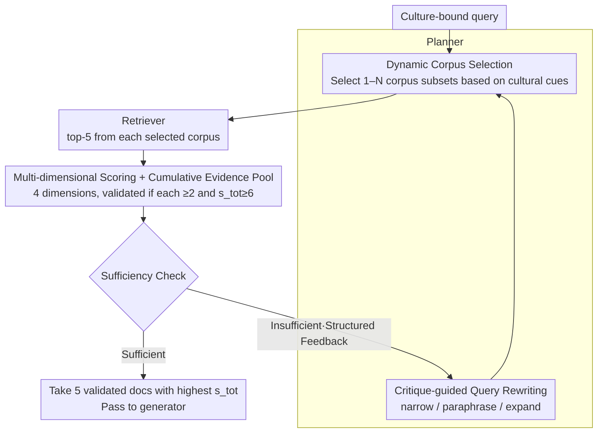

# CORAL: Adaptive Retrieval Loop for Culturally-Aligned Multilingual RAG

**Conference**: ACL 2026 Findings  
**arXiv**: [2604.25676](https://arxiv.org/abs/2604.25676)  
**Code**: The paper does not explicitly provide an open-source link (experimental details provided in appendix)  
**Area**: Information Retrieval / Multilingual RAG / Agentic RAG  
**Keywords**: Multicultural RAG, planner-critic loop, dynamic corpus selection, query rewriting, low-resource languages

## TL;DR
CORAL reframes multilingual RAG failures as "retrieval condition misalignment"—requiring not only query rewriting but also dynamic corpus switching. Through a closed loop of planner and critic agents ("Select corpus → Retrieve → Score/Filter → Sufficiency check → Update corpus/query"), it achieves a 3.58pp gain over the strongest baseline for low-resource languages on two cultural benchmarks and a 3.91pp gain on CLIcK Korean cultural QA.

## Background & Motivation

**Background**: Multilingual RAG (mRAG) typically uses query translation or multilingual embeddings for a shared retrieval space, assuming that "language alignment is sufficient."

**Limitations of Prior Work**: (1) Culture-bound queries (e.g., Korean festivals, Indonesian customs) often retrieve evidence that is "semantically relevant but culturally misaligned"—for instance, a question about traditional Korean festivals might retrieve generic "Korean tourism" info from English Wikipedia; (2) Existing agentic mRAG (Self-RAG, ReAct, IRCoT) focused only on "how to search"—query reformulation and multi-hop reasoning—but the **retrieval space remains fixed**; no amount of clever rewriting can compensate for "searching in the wrong corpus"; (3) Simply dumping more languages into the corpus pool (multiRAG) introduces more noise.

**Key Challenge**: Existing mRAG treats multilinguality as a representation problem (mapping all languages to the same space), whereas cultural QA lacks **locale-specific knowledge**—mixing this with globally aggregated content causes the retrieval stage to be overwhelmed by mainstream cultures.

**Goal**: (1) Treat "retrieval condition" (corpus scope + query formulation) as a first-class decision that can be modified at test time; (2) Use a feedback loop to drive retrieval condition updates based on evidence quality; (3) Demonstrate that this "adaptive retrieval condition" is more effective than "adaptive query" for low-resource languages.

**Key Insight**: Rather than having the planner rewrite wording within a fixed corpus, let it simultaneously decide "which corpora to search + how to search," with the critic judging evidence sufficiency and providing feedback to re-select the corpus if needed.

**Core Idea**: Iteratively perform dynamic corpus selection + critique-guided query rewriting + explicit sufficiency checks within a planner-critic loop.

## Method

### Overall Architecture

CORAL reframes multilingual RAG failures as "retrieval condition misalignment"—it is neither poorly written queries nor weak models, but "searching in the wrong corpus." It establishes "retrieval conditions" (corpus scope + query formulation) as first-class, test-time decisions. The system requires no training; it relies on two LLM agents (planner and critic) collaborating with an external retriever (Qwen3-Embedding-8B + FAISS) to execute a feedback loop. The planner selects a subset of corpora and rewrites the query based on cultural cues. The retriever searches the selected corpora, and the critic filters documents using multi-dimensional scoring and judges sufficiency. If insufficient, structured feedback is sent to the planner to re-select corpora and rewrite the query. Input is a culture-bound question; after 1–2 iterations of accumulating validated evidence, the top 5 highest-scoring documents are passed to the generator.

### Key Designs

**1. Query-conditioned Dynamic Corpus Selection: Adapting "where to search" based on cultural cues rather than a fixed pool**

The core argument is that the bottleneck of mRAG lies in the retrieval space rather than the query formulation. Mixing locale-specific knowledge with globally aggregated content leads to the retrieval phase being dominated by mainstream cultures. CORAL allows the planner to dynamically select 1–N target corpora (subsets of Wikipedia in 13 languages). It defaults to the corpus corresponding to the query's language but expands to culturally proximal corpora upon detecting cultural cues (local institutions, customs, region entities). For example, a query from BLEnD-su (Sundanese culture) might select both Sundanese and Indonesian corpora. After critic feedback, it can add regional high-resource neighbors or remove irrelevant sources. Figure 3 shows the distribution of selected languages far exceeds the query language itself (English queries triggering su/id/fa/ar), proving it performs "cultural routing" rather than simple language matching.

**2. Multi-dimensional Scoring + Cumulative Evidence Pool + Explicit Sufficiency Check: Quantifying "Semantically Relevant but Culturally Incongruent"**

Simple relevance ranking fails cultural QA—a document about Korean tourism might be "semantically relevant but culturally misaligned" for a query about traditional festivals. CORAL has the critic rate each document on 4 dimensions from 0–5 (relevance $s_\text{rel}$, usefulness $s_\text{use}$, specificity $s_\text{spec}$, compatibility $s_\text{comp}$), aggregated as $s_{tot} = s_{rel} + 0.5(s_{use} + s_{spec} + s_{comp})$. Documents are validated and accumulated across iterations only if each dimension $\geq 2$ and $s_{tot} \geq 6$. The newly added compatibility dimension specifically captures alignment in language, culture, and domain, translating previously implicit "soft biases" into computable reranking signals. Each round includes a binary sufficiency decision, turning multi-dimensional scores into structured feedback for precise improvements rather than a generic "search again."

**3. Critique-guided Query Rewriting: Driving query modification by failure signals rather than language switching**

Pure translation-based rewriting (tRAG / crossRAG) fails cultural tasks because it only changes the language, not the "information demand structure." CORAL's planner performs three types of rewriting based on failure reasons identified by the critic: narrow (adding constraints/disambiguation), paraphrase, and expand. Manual annotation of 158 rewrites from 100 CLIcK samples showed 53.8% were narrow, 32.9% were paraphrase, and the rest were expand. Narrowing often occurs when "topic-relevant but information-insufficient" results are retrieved, with the planner adding missing context cues identified by the critic to focus the next search. This essentially translates "information gaps" into specific retrieval constraints.

### Main Results (cultural QA accuracy, generator = LLaMA-3.2-3B-Instruct)

| Method | BLEnD-low | BLEnD-mid | BLEnD-high | BLEnD-avg | CLIcK |
|------|-----------|-----------|------------|-----------|-------|
| Non-RAG | 58.04 | 55.65 | 62.09 | 62.13 | 48.10 |
| monoRAG | 57.69 | 56.80 | 65.03 | 63.93 | 53.53 |
| tRAG (translate-then-retrieve) | – | – | – | – | 56.06 |
| multiRAG (all corpus pool) | 61.89 | 56.48 | 67.97 | 63.49 | 50.78 |
| crossRAG (multi + translated doc) | 62.59 | 57.83 | 67.32 | 64.27 | 53.75 |
| **Ours (GPT-OSS-120B)** | **68.18** | 60.47 | 70.92 | 67.14 | 58.66 |
| **Ours (Qwen3-235B)** | 66.78 | **61.83** | **72.22** | **67.84** | **58.88** |

Largest improvement: +3.58pp on BLEnD-low (up to +5.59pp for Sundanese), and +3.91pp on CLIcK; +12.14pp gain compared to Self-RAG.

### Ablation Study

**(a) Fixed corpus scope vs Ours (Is simply adding English as a fallback sufficient?):**

| Method | BLEnD-low | BLEnD-mid | BLEnD-high | CLIcK |
|------|-----------|-----------|------------|-------|
| Non-RAG | 55.65 | 63.06 | 69.29 | 48.10 |
| RAG-$C_\text{own}$ (Oracle monolingual) | 51.89 | 60.77 | 67.43 | 53.53 |
| RAG-$C_\text{all}$ (Full pool) | 56.55 | 65.92 | 69.84 | 50.78 |
| RAG-$C_\text{own} \cup C_\text{en}$ | 56.06 | 65.94 | 71.22 | 54.20 |
| **Ours** | **61.83** | **70.41** | **72.78** | **58.88** |

**(b) Component ablation (gradually adding CORAL components to multiRAG baseline, GPT-OSS-120B planner):**

| Configuration | BLEnD-low | BLEnD-mid | BLEnD-high | CLIcK |
|------|-----------|-----------|------------|-------|
| multiRAG (fixed pool + original query) | 56.55 | 65.92 | 69.84 | 50.78 |
| + Dynamic Corpus Selection | 58.11 | 70.06 | 72.76 | 57.25 |
| **+ Query Rewriting (full ours)** | **60.47** | 69.10 | **73.51** | **58.66** |

### Key Findings
- Simple English fallbacks ($C_\text{own} \cup C_\text{en}$) are significantly inferior to dynamic selection—proving that CORAL's improvement isn't just "relying on English" but performing query-conditioned cultural routing.
- Oracle fixed corpus $C_\text{own}$ (using the true cultural label to search only the corresponding language) was even lower than Non-RAG on BLEnD, suggesting cultural QA cannot rely on a single language source—many answers require proxy evidence.
- Dynamic Corpus Selection alone provided the largest contribution (multiRAG → +5.78pp on BLEnD-mid, +6.47pp on CLIcK), proving "where to search" is more critical than "how to search."
- Query rewriting added another +1–3pp after corpus selection, with 53.8% being "narrowing"—its primary function is filling in missing context identified by the critic rather than translation.
- Consistent benefits across 3 generators (Llama-3.2-3B, Ministral-3-8B, Qwen3-1.7B) indicate improvement stems from retrieval conditions rather than generator capacity.

## Highlights & Insights
- "Retrieval condition misalignment" is a clear and actionable naming of a failure mode—it specifies "why mRAG fails" as searching for semantically correct but culturally wrong content, providing a clear path for remediation.
- The critic's "compatibility" dimension specifically captures cultural matching, making the weakness of relevance-based ranking explicit—translating "soft bias" into computed reranking signals.
- Planner language distribution (Fig 3) shows English queries triggering Sundanese/Indonesian corpora, providing strong evidence of emergent "cultural inference" rather than simple language matching.
- The framework necessitates no training and relies on a closed loop of agents, making it immediately deployable for low-resource language scenarios.

## Limitations & Future Work
- Wikipedia subsets limit corpus diversity—procedural, experiential, and local policy knowledge often exist outside Wikipedia.
- Current evaluation is limited to MCQ, not covering open-ended generation or multi-turn failures.
- Planner and critic roles were filled by the same model; the impact of decoupling them was not ablated (a strong planner + lightweight critic might be more efficient).
- High-conflict scenarios (e.g., NQ-Swap) were not tested; it is unknown if CORAL requires suppression mechanisms.
- Iterative inference overhead: CLIcK averages 21,548 tokens/sample, which is a cost factor for large-scale deployment, necessitating caching or early-exit optimizations.

## Related Work & Insights
- **vs Self-RAG / IRCoT / Self-Ask**: These methods perform iterative query rewriting but keep the corpus fixed; CORAL turns the "retrieval space" into an adaptive variable, outperforming Self-RAG by 12.14pp on BLEnD.
- **vs multiRAG / crossRAG (Ranaldi et al. 2026)**: These methods merge or translate multiple corpora; CORAL uses selective retrieval + critique filtering to avoid noise from "indiscriminate corpus expansion."
- **vs MAFeRw / RQ-RAG**: These focus solely on queries; CORAL optimizes both corpus and query, feeding "information gaps" back into rewriting.
- **vs MIRAGE-bench / BLEnD**: This paper moves beyond evaluation, providing a retrieval-side solution and proving that "findings from evaluation should drive solutions in retrieval, not just generation."

## Rating
- Novelty: ⭐⭐⭐⭐⭐ The reframing of "retrieval condition as a first-class decision" + empirical cultural routing is a novel contribution.
- Experimental Thoroughness: ⭐⭐⭐⭐⭐ 6 generators × 2 benchmarks × 13 languages + 3-tier ablation + manual rewrite analysis is robust.
- Writing Quality: ⭐⭐⭐⭐ Clear narrative and thorough ablation, though some prompt details are relegated to the appendix.
- Value: ⭐⭐⭐⭐⭐ Immediately useful for low-resource RAG deployment without training; high value for internationalization teams.

<!-- RELATED:START -->

## Related Papers

- [\[ACL 2026\] Enhancing Multilingual RAG Systems with Debiased Language Preference-Guided Query Fusion](enhancing_multilingual_rag_systems_with_debiased_language_preference-guided_quer.md)
- [\[ACL 2025\] Multilingual Retrieval Augmented Generation for Culturally-Sensitive Tasks: A Benchmark for Cross-lingual Robustness](../../ACL2025/information_retrieval/multilingual_retrieval_augmented_generation_for_culturally-sensitive_tasks_a_ben.md)
- [\[ACL 2026\] Language-Coupled Reinforcement Learning for Multilingual Retrieval-Augmented Generation](language-coupled_reinforcement_learning_for_multilingual_retrieval-augmented_gen.md)
- [\[ACL 2026\] All Languages Matter: Understanding and Mitigating Language Bias in Multilingual RAG](all_languages_matter_understanding_and_mitigating_language_bias_in_multilingual_.md)
- [\[CVPR 2026\] M4-RAG: A Massive-Scale Multilingual Multi-Cultural Multimodal RAG](../../CVPR2026/information_retrieval/m4-rag_a_massive-scale_multilingual_multi-cultural_multimodal_rag.md)

<!-- RELATED:END -->
