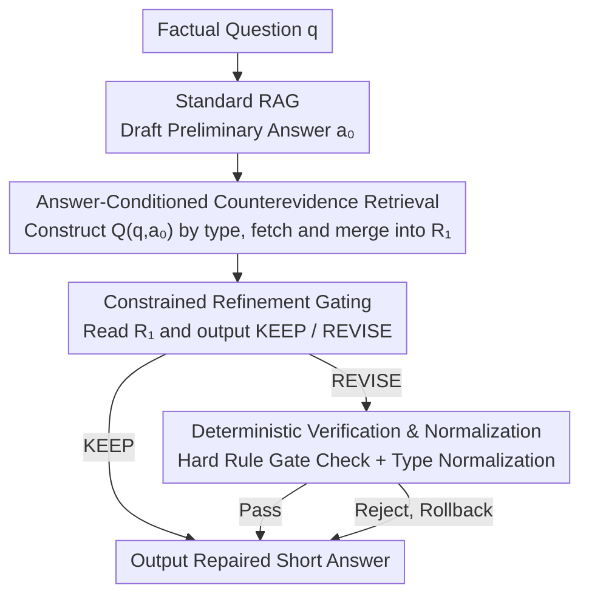

# CounterRefine: Answer-Conditioned Counterevidence Retrieval for Inference-Time Knowledge Repair in Factual Question Answering

**Conference**: ACL 2026  
**arXiv**: [2603.16091](https://arxiv.org/abs/2603.16091)  
**Code**: None  
**Area**: Information Retrieval / Question Answering  
**Keywords**: Inference-time repair, counterevidence retrieval, answer conditioning, factual QA, RAG enhancement

## TL;DR
This paper proposes CounterRefine, a lightweight inference-time repair layer: first, a standard RAG generates a preliminary answer; then, answer-conditioned counterevidence retrieval gathers supporting/refuting evidence; finally, a constrained KEEP/REVISE decision and deterministic verification repair incorrect answers. It improves the accuracy of GPT-5 on SimpleQA from 67.3% to 73.1%.

## Background & Motivation

**Background**: Retrieval-Augmented Generation (RAG) has become the standard method for knowledge-intensive NLP by grounding language model generation in external evidence. Variants such as multi-round retrieval and query rewriting further improve retrieval quality.

**Limitations of Prior Work**: Many factual errors are not "access failures" but "commitment failures"—the system retrieves relevant evidence but remains locked onto an incorrect answer. In short-answer factual QA, these errors are inexcusable: wrong years, similar entities, or nearly correct titles are considered entirely wrong. First-round retrievers are optimized for topical relevance rather than the discriminability of candidate answers.

**Key Challenge**: Once a preliminary answer is produced, the most useful next query is often not the original question, but a question conditioned on that candidate answer. If the preliminary year is wrong, including that year in the query can locate evidence snippets that directly negate it.

**Goal**: Design a simple inference-time repair layer that can be stacked onto existing retrieval pipelines to correct factual errors via answer-conditioned counterevidence retrieval.

**Key Insight**: Shift the role of retrieval from "collecting more context" to "testing a tentative answer." Instead of undirected search expansion, targeted secondary retrieval is guided by the preliminary answer.

**Core Idea**: First generate a preliminary answer, then perform counterevidence retrieval conditioned on that answer, and finally decide whether to modify the answer through a constrained KEEP/REVISE gate and deterministic verification.

## Method

### Overall Architecture

CounterRefine redefines the role of retrieval from "collecting more context" to "testing tentative answers," implemented as a thin repair layer that can be stacked on any RAG system. Given a factual question, the system first drafts a preliminary answer using standard RAG. It then performs a second round of answer-conditioned counterevidence retrieval to gather evidence supporting or refuting it. Finally, a constrained KEEP/REVISE gate combined with deterministic verification decides whether to rewrite, outputting the repaired short answer. The entire pipeline introduces only one additional retrieval, one model call, and one rule-based validation, without modifying model parameters or the original retriever.

### Key Designs

**1. Answer-Conditioned Counterevidence Retrieval: From "Asking Topics" to "Verifying Answers"**

First-round retrievers are optimized for topical relevance, but factual errors are often "commitment failures"—evidence is nearby, yet the system stays locked on a similar but wrong entity or year. The key intuition of CounterRefine is that once a preliminary answer $a_0$ is generated, the most useful next query is one conditioned on $a_0$. It constructs a query set $Q(q, a_0) = \{q,\ q \| a_0\} \cup \mathbb{I}[t(q) \in \mathcal{T}]\{a_0\}$ based on the question type $t(q)$, where $\mathcal{T} = \{\text{who, where, when, year, number}\}$. For each query, $k_r=5$ evidence pieces are retrieved and merged with baseline evidence to form the expanded evidence set $R_1$.

This step no longer optimizes for "which documents are related to the question" but for "what evidence most directly supports or refutes this candidate answer." When $a_0$ is a slightly off year or a synonymous entity, explicitly including it in the query often precisely pulls out snippets that negate it, turning retrieval into targeted falsification of the hypothesis.

**2. Constrained Refinement Gating: Binary KEEP/REVISE Only**

Allowing the model to freely rewrite answers with new evidence can easily introduce new errors. CounterRefine strictly bounds the output space of the refiner: it receives the question, baseline answer, and merged evidence set $R_1$, and must output three fields—DECISION (KEEP or REVISE), ANSWER (short answer), and EVIDENCE (supporting snippet or NONE). The prompt explicitly requires that REVISE is only allowed when additional evidence strongly supports a different answer.

By narrowing the repair scope to a binary "KEEP or REVISE" decision rather than open-ended re-answering, the model's room for error is restricted to the minimum necessary, significantly reducing the risk of "correcting one but breaking three."

**3. Deterministic Verification & Normalization: Hard Rules as a Safety Net**

The model's REVISE decisions are not accepted blindly. Every proposed modification must pass a deterministic gate; if any of the following conditions are met, it is rejected: the answer is empty or identical to $a_0$, a yes/no question is answered incorrectly, an entity-type answer is too long or contains descriptive phrases, a time/numeric answer lacks clear markers, no supporting snippet is found, or the lexical overlap between the rewritten answer and the evidence snippet is too weak. Validated modifications undergo question-type-specific normalization (e.g., extracting 4-digit years, compressing numeric ranges). KEEP decisions directly retain the original answer and are not affected by this gate.

This layer of manual rules restricts modifications to high-confidence scenarios with "sufficient evidence," ultimately achieving a beneficial-to-harmful ratio of 22.5:1 while modifying only 5.6% of samples—a precision nearly impossible to achieve through model self-judgment alone.

### Loss & Training

No training required. CounterRefine is a pure inference-time pipeline, utilizing off-the-shelf LLMs (Claude Sonnet 4.6 or GPT-5) and Web Search APIs.

## Key Experimental Results

### Main Results

| Benchmark | Metric | Claude Base-RAG | Claude +CounterRefine | GPT-5 Base-RAG | GPT-5 +CounterRefine |
|-----------|--------|-----------------|-----------------------|----------------|----------------------|
| SimpleQA (4326) | Correct↑ | 63.7 | 67.7 (+4.0) | 67.3 | **73.1 (+5.8)** |
| SimpleQA (4326) | F1↑ | 64.1 | 68.1 (+4.0) | 58.6 | **72.1 (+13.5)** |
| HotpotQA (300) | EM↑ | 70.0 | 74.0 (+4.0) | 68.0 | 71.0 (+3.0) |

### Intervention Analysis (Claude SimpleQA Full Set)

| Metric | Value |
|--------|-------|
| Modification Rate | 5.6% |
| Beneficial Modifications | 180 |
| Harmful Modifications | 8 |
| Beneficial/Harmful Ratio | 22.5:1 |

### Key Findings
- CounterRefine consistently improves Exact Match metrics across all settings, regardless of backbone model, dataset, or evaluation scale.
- Interventions are highly precise: with a 22.5:1 beneficial/harmful ratio while modifying only 5.6% of samples, deterministic verification effectively filters out erroneous modifications.
- F1 improvement on GPT-5 reached 13.5 points, far exceeding the 5.8-point accuracy gain, indicating significant improvements in the lexical precision of repaired answers.
- Success patterns: Entity confusion, date errors, numeric imprecision. Failure patterns: Relation confusion and event mismatch.

## Highlights & Insights
- **From "Collecting Evidence" to "Testing Hypotheses"**: The role of retrieval is transformed from passive context collection to active hypothesis testing. This conceptual shift is more crucial than technical details—once a candidate answer exists, the most valuable retrieval is directed at that answer.
- **Deterministic Verification as an Indispensable Safety Net**: The 22.5:1 beneficial/harmful ratio proves the value of hard-rule verification. Pure model-based refinement is likely to introduce more errors; deterministic verification restricts modifications to high-confidence cases.
- **Minimalist Design Philosophy**: The entire method adds only one extra retrieval + one model call + rule verification, neither modifying model parameters nor changing the retrieval pipeline. This "thin repair layer" design allows it to be stacked on any RAG system.

## Limitations & Future Work
- Only applicable to short-answer factual QA; repairs for long-form generation require different mechanisms.
- Failure modes (relation confusion, event mismatch) are difficult to resolve via simple answer-conditioned retrieval.
- Deterministic verification rules are manually designed and may not cover new question types.
- Multi-round iterative refinement was not explored (currently single-round), potentially missing errors that require multi-step reasoning to discover.

## Related Work & Insights
- **vs Chain-of-Verification**: CoVe generates verification questions then answers them, but is computationally expensive. CounterRefine uses only one extra retrieval and model call.
- **vs CRITIC**: CRITIC uses interactive tool usage for verification, making it more general but more complex. CounterRefine focuses on short-answer repair, offering greater simplicity and efficiency.
- **vs ROME/MEMIT**: Model editing modifies factual associations in parameters. CounterRefine is a complementary inference-time repair that does not change model parameters.

## Rating
- Novelty: ⭐⭐⭐ The answer-conditioned retrieval idea is intuitive yet effective; deterministic verification is key.
- Experimental Thoroughness: ⭐⭐⭐⭐ Full SimpleQA official evaluation + cross-model/cross-dataset experiments + intervention analysis.
- Writing Quality: ⭐⭐⭐⭐⭐ Extremely clear writing with a complete logical chain from motivation to method to analysis.
- Value: ⭐⭐⭐⭐ Highly practical and directly stackable onto existing RAG systems.

<!-- RELATED:START -->

## Related Papers

- [\[ACL 2026\] DQA: Diagnostic Question Answering for IT Support](dqa_diagnostic_question_answering_for_it_support.md)
- [\[ACL 2026\] ChatR1: Reinforcement Learning for Conversational Reasoning and Retrieval Augmented Question Answering](chatr1_reinforcement_learning_for_conversational_reasoning_and_retrieval_augment.md)
- [\[ACL 2026\] FinRAG-12B: A Production-Validated Recipe for Grounded Question Answering in Banking](finrag-12b_a_production-validated_recipe_for_grounded_question_answering_in_bank.md)
- [\[ICML 2026\] REAL: Resolving Knowledge Conflicts in Knowledge-Intensive Visual Question Answering via Reasoning-Pivot Alignment](../../ICML2026/information_retrieval/real_resolving_knowledge_conflicts_in_knowledge-intensive_visual_question_answer.md)
- [\[AAAI 2026\] Towards Inference-Time Scaling for Continuous Space Reasoning](../../AAAI2026/information_retrieval/towards_inference-time_scaling_for_continuous_space_reasoning.md)

<!-- RELATED:END -->
