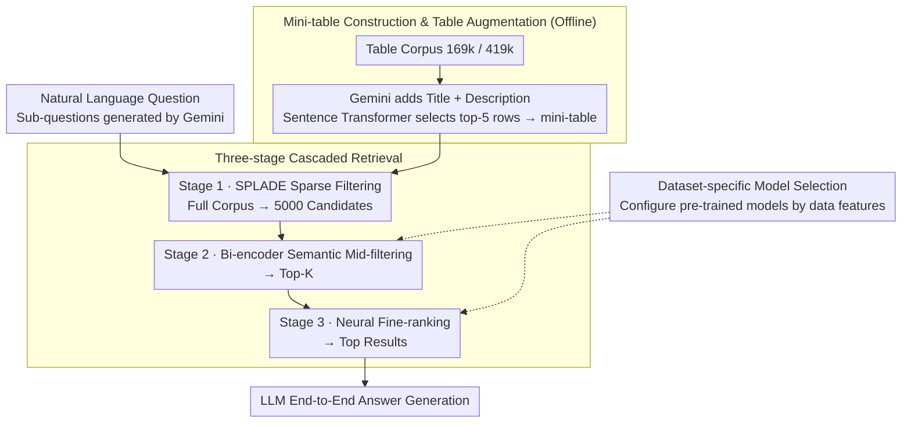

# CRAFT: Training-Free Cascaded Retrieval for Tabular QA

**Conference**: ACL 2026  
**arXiv**: [2505.14984](https://arxiv.org/abs/2505.14984)  
**Code**: [Project Page](https://coral-lab-asu.github.io/CRAFT/)  
**Area**: Information Retrieval / Table Question Answering  
**Keywords**: Table Retrieval, Cascaded Retrieval, Zero-shot, Table QA, Training-free

## TL;DR

This paper proposes CRAFT, a three-stage cascaded table retrieval framework that requires no dataset-specific training (SPLADE sparse filtering → semantic mini-table ranking → neural re-ranking). By enhancing table representations with Gemini-generated titles and descriptions, it achieves SOTA on NQ-Tables (R@1 49.84), demonstrates strong zero-shot generalization on OTT-QA, and exhibits significant robustness to query rewrites.

## Background & Motivation

**Background**: Open-domain Table Question Answering (TQA) requires retrieving relevant tables from a large-scale corpus before reasoning over them to derive answers. Existing methods include sparse retrieval (BM25), dense retrieval (DPR, DTR), and hybrid retrieval (THYME).

**Limitations of Prior Work**: (1) Dense retrieval models (DTR, DPR) are computationally expensive and require retraining or fine-tuning on new datasets, limiting adaptability; (2) Simple linearization of tables into text loses structural information; (3) Complex architectures (e.g., syntax-aware retrievers in SSDR) require meticulous modeling and high training costs.

**Key Challenge**: Performance in state-of-the-art (SOTA) table retrieval relies on expensive domain-specific fine-tuning, which makes systems inflexible for new domains or datasets. Is it possible to reach competitive performance using pre-trained models through a carefully designed retrieval pipeline?

**Goal**: To construct a modular, scalable multi-stage retrieval framework that utilizes off-the-shelf pre-trained models to achieve competitive table retrieval and end-to-end QA performance in a zero-shot setting.

**Key Insight**: A three-stage cascaded design—gradually transitioning from high-recall sparse retrieval to high-precision semantic re-ranking, with each stage using stronger but slower models. Concurrently, use Gemini to generate table titles and descriptions to compensate for the semantic insufficiency of raw table representations.

**Core Idea**: Apply the "progressive refinement" concept of cascaded retrieval to table retrieval: efficient filtering with sparse models → reduced token overhead via mini-table construction → precise re-ranking with neural models, achieving SOTA without any training.

## Method

### Overall Architecture

The core proposition of CRAFT is that a carefully orchestrated cascaded pipeline using off-the-shelf pre-trained models can match or exceed fine-tuned SOTA without dataset-specific fine-tuning. Given a natural language question, the system first performs offline preprocessing (Gemini-1.5-Flash generates query sub-questions and provides a title/description for each table; row selection is performed using Sentence Transformers). Then, it follows a "Sparse Coarse-filtering → Semantic Mid-filtering → Neural Fine-ranking" funnel, narrowing down candidates from 169k/419k tables to final Top results for end-to-end LLM answer generation. No weights are updated throughout the entire pipeline.

### Key Designs

**1. Three-Stage Cascaded Retrieval: "Stronger yet Fewer" further down the line**

Running semantic models on the entire table corpus is cost-prohibitive. CRAFT splits accuracy and efficiency across three levels. Stage 1 uses SPLADE for sparse lexical expansion, processing titles, headers, cell values, and generated descriptions to efficiently scan the corpus and filter down to 5000 candidates. Stage 2 compresses each table into a "mini-table" for bi-encoder semantic matching, narrowing it to Top-K. Stage 3 employs the strongest embedding models (text-embedding-3-large or gemini-embedding-001) for final re-ranking. Each level is stronger but slower; however, because previous stages drastically reduce the candidate pool, expensive models only run on small sets.

**2. Mini-table Construction and Table Augmentation: Pruning before Semantic Enrichment**

Linearizing an entire table for embedding models is expensive and dilutes key signals. CRAFT keeps only the headers and the top 5 most relevant rows (selected by Sentence Transformers based on semantic relevance to the query) to form a mini-table. Simultaneously, Gemini-1.5-Flash generates a descriptive title and a detailed summary for each table to overcome the semantic limitations of raw tables. This combination results in 33× fewer online embedding calls and 70% shorter contexts without sacrificing retrieval accuracy.

**3. Dataset-specific Model Selection: Selecting vs. Tuning**

While CRAFT does not train on new datasets, it acknowledges that different data has different textual features. Adaptation occurs at the "model selection" layer: NQ-Tables (single-hop fact queries) uses all-mpnet-base-v2 + text-embedding-3-large, while OTT-QA (multi-hop reasoning, hybrid text-table) uses Jina Embeddings v3 + gemini-embedding-001. This preserves the "zero-training" core while providing a calibration knob for different domains.

### Loss & Training

This paper involves no training. All models use pre-trained weights or APIs. The end-to-end QA phase uses Llama3-8B, Qwen2.5-7B, or Mistral-7B to generate answers in zero-shot or few-shot settings.

## Key Experimental Results

### Main Results

**NQ-Tables Retrieval Performance**

| Model | Training Needs | R@1 | R@10 | R@50 |
|------|---------|-----|------|------|
| THYME (SOTA Hybrid) | Fine-tuning | 48.55 | 86.38 | 96.08 |
| DTR+HN | Fine-tuning | 47.33 | 80.96 | 91.51 |
| BIBERT+SPLADE | Fine-tuning | 45.62 | 86.72 | 95.62 |
| **CRAFT (Zero-shot)** | **None** | **49.84** | **86.83** | **97.17** |

**OTT-QA Zero-shot Retrieval Performance**

| Model | R@1 | R@10 | R@50 |
|------|-----|------|------|
| THYME (Fine-tuned) | 66.67 | 91.10 | 96.16 |
| **CRAFT (Zero-shot)** | 55.56 | 89.88 | 96.07 |

### Ablation Study

**Query Robustness (Performance Change Δ under Query Rewriting)**

| Model | Original R@10 | Rewritten Δ(avg) |
|------|----------|--------------|
| DTR (M) | 75.73 | -8.38 |
| DTR (S) | 73.88 | -11.82 |
| DTR (M)+HN | 80.96 | -5.80 |
| **CRAFT** | 87.16 | **-0.04** |

### Key Findings

- CRAFT surpasses all fine-tuning methods on NQ-Tables in a zero-shot setting (R@1 49.84 vs. THYME 48.55), proving that engineering a cascaded pipeline can replace expensive fine-tuning.
- On OTT-QA, CRAFT’s zero-shot R@50 (96.07) is nearly identical to the fine-tuned SOTA (96.16).
- CRAFT is virtually immune to query rewriting (Δ=-0.04), whereas fine-tuned models like DTR drop by 8-12 points, indicating significantly stronger generalization.
- Mini-table design reduces embedding calls by 33× without loss of precision.

## Highlights & Insights

- Employs "engineering wisdom" (cascaded retrieval + table augmentation) to beat fine-tuning methods, suggesting that the general capability of pre-trained models is undervalued.
- Extreme robustness to query rewriting (Δ=-0.04) is a highly practical feature, as fine-tuned models are often fragile in this regard.
- Mini-table construction is a simple yet effective efficiency optimization, providing 70% shorter contexts which are crucial for real-world deployment.

## Limitations & Future Work

- Reliance on commercial APIs (Gemini, OpenAI embeddings) limits cost efficiency and reproducibility.
- Model selection (different models for NQ-Tables vs. OTT-QA) introduces dataset-specific engineering choices.
- Performance on non-English tables or tables with complex formatting (merged cells) has not been evaluated.
- Preprocessing (generating titles/descriptions) requires additional offline LLM calls.

## Related Work & Insights

- **vs. THYME**: THYME requires fine-tuning on target datasets and field-aware matching; CRAFT matches performance without training via its cascaded pipeline.
- **vs. DTR**: DTR is a classic dense retriever but is sensitive to query variations; CRAFT's design is inherently more robust.
- **vs. T-RAG**: While T-RAG integrates retrieval and generation end-to-end, CRAFT remains modular, allowing for easy component replacement.

## Rating

- Novelty: ⭐⭐⭐ The combination of cascaded retrieval and table augmentation is effective but not entirely new.
- Experimental Thoroughness: ⭐⭐⭐⭐⭐ Comprehensive evaluation across two datasets, robustness tests, stage ablations, and end-to-end QA.
- Writing Quality: ⭐⭐⭐⭐ Clear methodological descriptions and detailed experimental analysis.
- Value: ⭐⭐⭐⭐ Demonstrates that training-free retrieval can achieve SOTA, providing direct value for practical deployments.

<!-- RELATED:START -->

## Related Papers

- [\[ICML 2025\] Don't Lag, RAG: Training-Free Adversarial Detection Using RAG](../../ICML2025/information_retrieval/dont_lag_rag_training-free_adversarial_detection_using_rag.md)
- [\[ACL 2026\] Test-Time Training for Zero-Resource Dense Retrieval Reranking](test-time_training_for_zero-resource_dense_retrieval_reranking.md)
- [\[ACL 2026\] S2G-RAG: Structured Sufficiency and Gap Judging for Iterative Retrieval-Augmented QA](s2g-rag_structured_sufficiency_and_gap_judging_for_iterative_retrieval-augmented.md)
- [\[ACL 2026\] Navigating Large-Scale Document Collections: MuDABench for Multi-Document Analytical QA](navigating_large-scale_document_collections_mudabench_for_multi-document_analyti.md)
- [\[ICLR 2026\] Q-RAG: Long Context Multi-Step Retrieval via Value-Based Embedder Training](../../ICLR2026/information_retrieval/q_rag_long_context_multi_step_retrieval.md)

<!-- RELATED:END -->
