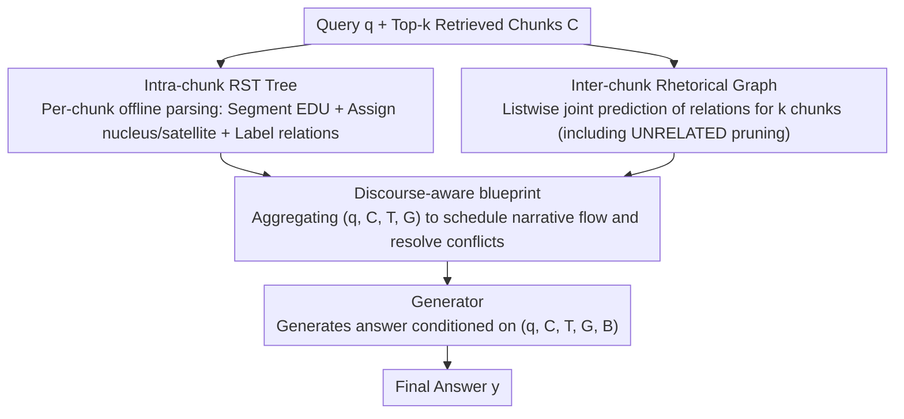

# Disco-RAG: Discourse-Aware Retrieval-Augmented Generation

**Conference**: ACL 2026  
**arXiv**: [2601.04377](https://arxiv.org/abs/2601.04377)  
**Code**: https://dongqi.me/projects/Disco-RAG (Available)  
**Area**: Information Retrieval / RAG / Discourse Structure  
**Keywords**: RAG, RST, Discourse Structure, Rhetorical Graph, Long Document Reasoning

## TL;DR
The authors propose Disco-RAG, which explicitly injects Rhetorical Structure Theory (RST) into the RAG pipeline. By parsing intra-chunk RST trees (local hierarchy), constructing inter-chunk rhetorical graphs (global coherence), and generating discourse-aware blueprints to guide responses, it achieves training-free SOTA performance on three long-document benchmarks: Loong, ASQA, and SciNews (Loong overall +12.74 LLM Score).

## Background & Motivation

**Background**: Retrieval-Augmented Generation (RAG) is a mainstream solution for integrating external knowledge into LLMs. The standard process involves slicing documents into chunks $\rightarrow$ vectorization $\rightarrow$ retrieving Top-$k$ chunks $\rightarrow$ concatenating them into a prompt for LLM generation. Structural variants like GraphRAG, RQ-RAG, and StructRAG have emerged to add structural signals to retrieval via knowledge graphs, subgraphs, or hierarchical trees.

**Limitations of Prior Work**: Existing RAG methods (including GraphRAG and other structural variants) overlook two discourse-level defects: (1) **intra-chunk structural blindness**, where the rhetorical hierarchy within a chunk (which sentence is the core, which is supplementary, and what are the causal/contrastive relationships) is not modeled; (2) **inter-chunk coherence gaps**, where rhetorical connections between different chunks (e.g., a contrast between the conclusion of chunk A and a counterexample in chunk B) cannot be identified.

**Key Challenge**: Consider a counterexample: Chunk A states "a study found a 12% lower incidence," and Chunk B states "the overall effect was not significant." Standard RAG, failing to recognize that A is a conditional finding (e.g., only applicable to adults deficient in Vitamin D during winter), might crudely summarize that "Vitamin D reduces influenza risk." The fundamental issue is that **RAG retrieves chunk-level evidence, but generation requires discourse-level reasoning**—there is a gap between "isolated evidence" and a "coherent argument chain."

**Goal**: To enable the LLM at inference-time (without fine-tuning) to perceive both chunks and the rhetorical structures within/between chunks, and then generate based on a strategic plan.

**Key Insight**: Rhetorical Structure Theory (RST, Mann & Thompson 1987/1988) naturally provides nucleus/satellite roles and relationship labels like Elaboration, Contrast, and Cause. Previously used mainly for summarization and neural generation models, this work systematically migrates RST to RAG for the first time.

**Core Idea**: An LLM is used simultaneously as an RST parser (parsing intra-chunk EDUs + relations), a rhetorical graph constructor (predicting inter-chunk relations), a planner (generating a structure-based blueprint), and a generator. These four roles are chained into a pipeline without requiring any additional training.

## Method

### Overall Architecture

Disco-RAG is an inference-time strategy that leaves the parameters of the retriever and generator unchanged. Instead, it inserts "discourse modeling + planning" stages between the standard RAG "retrieval $\rightarrow$ generation" steps. The standard RAG is formalized as $y = \arg\max_{y'} P(y' \mid q, \mathcal{C})$, where $\mathcal{C} = \{c_1, \dots, c_k\}$ represents the Top-$k$ retrieved chunks. Disco-RAG successively produces an intra-chunk RST tree $\mathcal{T}$ for each chunk, an inter-chunk rhetorical graph $\mathcal{G}$ between chunks, and a discourse-aware blueprint $\mathcal{B}$. Finally, the five components $(q, \mathcal{C}, \mathcal{T}, \mathcal{G}, \mathcal{B})$ are used as generation conditions: $y = \arg\max_{y'} P(y' \mid q, \mathcal{C}, \mathcal{T}, \mathcal{G}, \mathcal{B})$. The same base model takes turns playing the four roles (parser, graph constructor, planner, and generator) via prompting, maintaining a zero-training pipeline.

### Key Designs

**1. Intra-chunk RST tree: Restoring chunks from bag-of-tokens to prioritized rhetorical trees**

Standard RAG treats entire chunks as bags-of-tokens for the generator, mixing core conclusions with secondary evidence. Disco-RAG uses an LLM parser $\mathcal{A}$ to perform three tasks on each chunk $c_i$: segmenting Elementary Discourse Units (EDUs), assigning nucleus/satellite roles, and labeling relationships like Elaboration/Contrast/Cause. This results in an RST tree $t_i=(V_i,E_i)$. This process is formalized as $P(t_i \mid c_i; \theta_\mathcal{A}) = \prod_j P(e_{i_j} \mid c_i; \theta_\mathcal{A}) \cdot \prod_{(u,v)} P(r_{u,v} \mid e_{i_u}, e_{i_v}; \theta_\mathcal{A})$. Since this step is query-independent, intra-chunk trees are parsed **offline** to amortize inference costs.

**2. Inter-chunk rhetorical graph: Using listwise inference to extract argumentative relations between chunks**

When evidence is scattered across multiple chunks, the difficulty lies in judging argumentative relations such as "A is a counterexample of B." Disco-RAG feeds all $k$ retrieved chunks listwise to $\mathcal{A}$ to jointly predict rhetorical relations for each ordered pair, forming a directed graph $\mathcal{G}=(\mathcal{C},\mathcal{F})$: $P(\mathcal{G} \mid \mathcal{C}) = \prod_{i=1}^k \prod_{j \ne i} P(r_{i,j} \mid \mathcal{C})$. An UNRELATED label allows the model to prune irrelevant connections. Listwise reasoning allows the parser to maintain global context, making it easier to identify relations that require tripartite comparison.

**3. Discourse-aware planning blueprint: Organizing narrative flow by rhetorical structure before writing**

Direct generation often conflates high-level decisions (which evidence to select, in what order, how to handle conflicts) with low-level decisions (wording). Disco-RAG uses $\mathcal{A}$ to produce a dynamic blueprint $\mathcal{B}$ from $(q, \mathcal{C}, \mathcal{T}, \mathcal{G})$ before generation. This blueprint specifies the narrative order, supporting evidence, and methods for reconciling conflicting evidence. This plan is neither purely extractive nor free-form but consists of "discourse-aware reasoning steps." Ablations show that generic planning without structural awareness only improves performance by 1.3–2.0 points, whereas discourse-aware planning yields gains of over 12 points.

### Loss & Training

The system is entirely **training-free**. The four roles (parser, graph constructor, planner, and generator) share the same base model (Llama-3.1-8B, Llama-3.3-70B, or Qwen2.5-72B). The retriever uses Qwen3-Embedding-8B with a chunk size of 256 tokens, Top-10 retrieval, and a beam search width of 3.

## Key Experimental Results

### Main Results: 3 Long-Document Benchmarks (Excerpts)

**Loong** (4 length categories, 10K $\rightarrow$ 250K tokens; 4 task types) Overall Performance:

| Length Set | Method | Backbone | LLM Score↑ | EM↑ |
|--------|------|----------|------------|------|
| Set 1 (10K-50K) | Standard RAG | Llama-3.3-70B | 62.78 | 0.34 |
| Set 1 | StructRAG (Prev. SOTA) | – | 69.43 | 0.35 |
| Set 1 | **Ours** | Llama-3.3-70B | **71.00** | **0.38** |
| Set 2 (50K-100K) | Standard RAG | Llama-3.3-70B | 53.77 | 0.18 |
| Set 2 | **Ours** | Llama-3.3-70B | **63.61** | **0.28** |
| Set 4 (200K-250K) | Standard RAG | Llama-3.3-70B | 35.61 | 0.07 |
| Set 4 | StructRAG | – | 51.42 | 0.10 |
| Set 4 | **Ours** | Llama-3.3-70B | **54.62** | **0.11** |

### Ablation Study (Loong benchmark, Llama-3.3-70B)

| Method | Overall LLM Score | Overall EM | Description |
|------|-------------------|------------|------|
| **Ours (full)** | **62.07** | **0.24** | All modules included |
| w/o RST tree | 56.22 | 0.20 | Removing intra-chunk tree $\rightarrow$ -5.85 |
| w/o rhetorical graph | 57.10 | 0.21 | Removing inter-chunk graph $\rightarrow$ -4.97 |
| w/o planning | 59.75 | 0.22 | Removing planner $\rightarrow$ -2.32 |
| Standard RAG | 49.33 | 0.17 | Baseline |
| w/ retrieve-and-plan | 50.64 | 0.18 | Standard RAG + free-form plan (no structure) |

### Key Findings
- **Contribution of Structural Modules > Planner**: RST trees and rhetorical graphs contribute ~5 points each, while the planner contributes only ~2 points. Structure is the foundation; the plan is the amplifier.
- **Greater Gains with Longer Documents**: In Set 1 (short), Ours outperforms Standard RAG by 8.22 points; in Set 4 (200K+ tokens), the gain is 19 points. This proves discourse-awareness is critical when evidence is dispersed.
- **Robustness to Retrieval Noise**: When 20–40% of Top-10 chunks are replaced with irrelevant ones, Standard RAG drops from 49.33 to 45.23, while Ours maintains 56.17, indicating the framework identifies UNRELATED segments.
- **Mixed Model Deployment**: An 8B parser + 70B generator achieves 60.52, close to the all-70B score of 62.07 and far exceeding the standard 70B RAG (49.33), suggesting structural modules can be offloaded to smaller models.
- **Orthogonality to SFT**: Fine-tuning the generator on SciNews and then adding discourse input further increases RL from 22.8 to 23.3 and SummaC from 72.3 to 74.0, showing discourse signals complement parameter learning.

## Highlights & Insights
- **Discourse as the Missing Piece**: While variants like GraphRAG focus on entity-level KGs, this work zooms out to argument-level discourse, capturing "argumentative relations" like Cause/Contrast, which are where LLMs fail most in multi-document synthesis.
- **Listwise Inter-chunk Prediction**: Allowing the LLM to see all chunks before deciding relations avoids the limitations of pairwise comparisons and leverages global context.
- **Training-Free Modularity**: Shared base models with prompt-driven roles provide engineering simplicity and flexible deployment.
- **Robustness of the Structural Prior**: Even with perturbed structural signals, the system outperforms standard RAG, suggesting the benefit comes from forcing the generator to attend to structure.

## Limitations & Future Work
- **Increased Latency/Cost**: RST parsing, graph construction, and planning require extra LLM calls, making the system 3-4x slower than standard RAG.
- **Backbone Dependency**: The quality of the parser relies on the backbone's discourse understanding; performance drops significantly on smaller, non-instruction-tuned models.
- **Narrow Dataset Scope**: Benchmarks are primarily in English and academic/encyclopedic styles; applicability to other languages or domains like code/math remains unknown.
- **Fixed Rhetorical Labels**: The use of a small set of classic RST relations may need extension for specialized domains like law or medicine.

## Related Work & Insights
- **vs GraphRAG / KG-RAG**: GraphRAG organizes evidence via entity co-occurrence; Disco-RAG organizes it via rhetorical relations. Entity-level answers "what was mentioned," while discourse-level answers "what is being argued." The 30+ point gain over GraphRAG on Loong suggests discourse is a more urgent bottleneck.
- **vs StructRAG**: StructRAG is a state-of-the-art training-time method; Disco-RAG is training-free and slightly outperforms it, proving the "type" of structural signal (discourse vs generic) is more impactful than the "form."
- **vs Tree of Clarifications / RQ-RAG**: These focus on query refinement or filtering; Disco-RAG complements them by focusing on the structure of retrieved evidence.

## Rating
- Novelty: ⭐⭐⭐⭐
- Experimental Thoroughness: ⭐⭐⭐⭐⭐
- Writing Quality: ⭐⭐⭐⭐
- Value: ⭐⭐⭐⭐⭐

<!-- RELATED:START -->

## Related Papers

- [\[ACL 2025\] Typed-RAG: Type-Aware Decomposition of Non-Factoid Questions for Retrieval-Augmented Generation](../../ACL2025/information_retrieval/typed-rag_type-aware_decomposition_of_non-factoid_questions_for_retrieval-augmen.md)
- [\[ACL 2026\] MASS-RAG: Multi-Agent Synthesis Retrieval-Augmented Generation](mass-rag_multi-agent_synthesis_retrieval-augmented_generation.md)
- [\[ACL 2026\] Feedback Adaptation for Retrieval-Augmented Generation](feedback_adaptation_for_retrieval-augmented_generation.md)
- [\[ACL 2025\] EXIT: Context-Aware Extractive Compression for Enhancing Retrieval-Augmented Generation](../../ACL2025/information_retrieval/exit_context-aware_extractive_compression_for_enhancing_retrieval-augmented_gene.md)
- [\[ACL 2026\] VideoStir: Understanding Long Videos via Spatio-Temporally Structured and Intent-Aware RAG](videostir_understanding_long_videos_via_spatio-temporally_structured_and_intent-.md)

<!-- RELATED:END -->
